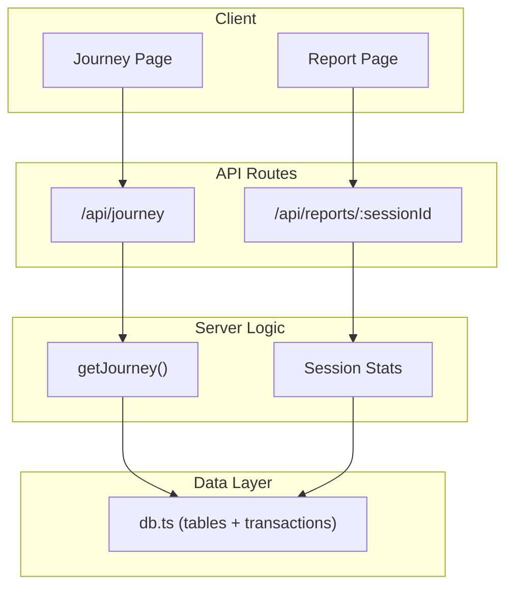
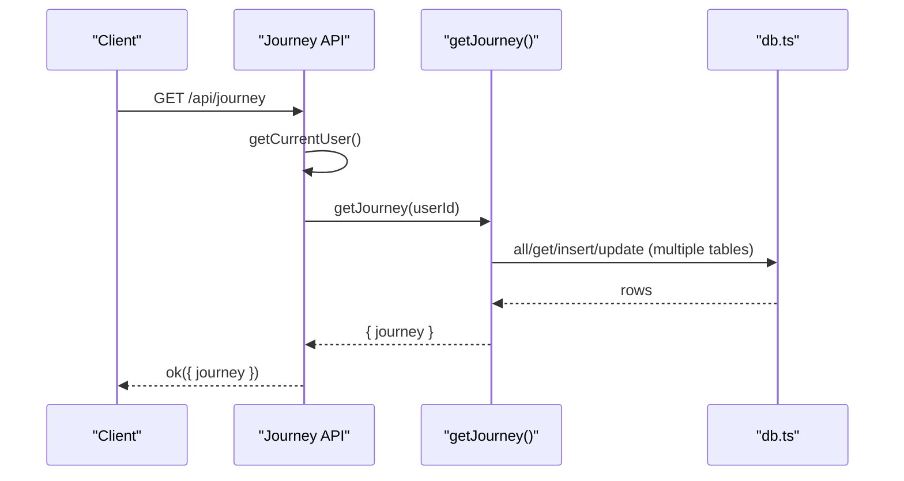
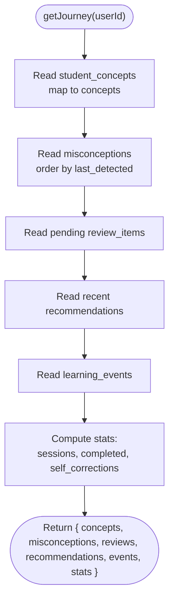
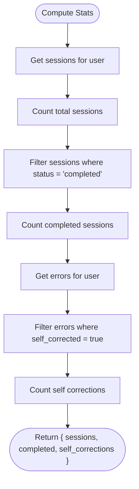
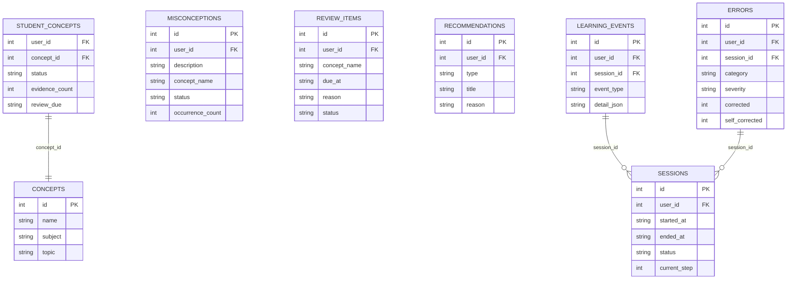
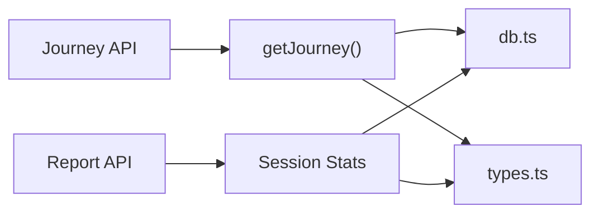

# Learning Analytics Dashboard

<cite>
**Referenced Files in This Document**
- [journey.ts](file://stepwise ai/app/lib/journey.ts)
- [route.ts (Journey API)](file://stepwise ai/app/app/api/journey/route.ts)
- [db.ts](file://stepwise ai/app/lib/db.ts)
- [sessionsRepo.ts](file://stepwise ai/app/lib/sessionsRepo.ts)
- [types.ts](file://stepwise ai/app/lib/types.ts)
- [page.tsx (Journey UI)](file://stepwise ai/app/app/journey/page.tsx)
- [route.ts (Report API)](file://stepwise ai/app/app/api/reports/[sessionId]/route.ts)
- [page.tsx (Report UI)](file://stepwise ai/app/app/report/[sessionId]/page.tsx)
</cite>

## Table of Contents
1. Introduction
2. Project Structure
3. Core Components
4. Architecture Overview
5. Detailed Component Analysis
6. Dependency Analysis
7. Performance Considerations
8. Troubleshooting Guide
9. Conclusion
10. Appendices

## Introduction
This document explains the learning analytics system that provides a unified view of student progress and learning effectiveness. It focuses on:
- The getJourney function that aggregates concepts, misconceptions, pending reviews, recent recommendations, and events into a single response.
- Statistics calculation across sessions, completed sessions, and self-correction metrics.
- How data is queried and combined from multiple tables to produce a coherent learning map.
- Data visualization patterns used in the dashboard and report pages.
- Examples for generating progress reports, building custom analytics queries, and integrating analytics into dashboards.
- Performance considerations and caching strategies for large datasets.

## Project Structure
The analytics feature spans server-side logic, an API route, a client page, and a shared database abstraction:
- Server logic: journey aggregation and session statistics live in lib modules.
- API routes: expose /api/journey and per-session report endpoints.
- Client pages: render the learning journey and final report views.
- Database layer: a small relational-style store with transaction support and table definitions.

**Diagram sources**
- [route.ts (Journey API):1-17](file://stepwise ai/app/app/api/journey/route.ts#L1-L17)
- [journey.ts:274-356](file://stepwise ai/app/lib/journey.ts#L274-L356)
- [db.ts:123-199](file://stepwise ai/app/lib/db.ts#L123-L199)
- [route.ts (Report API):1-21](file://stepwise ai/app/app/api/reports/[sessionId]/route.ts#L1-L21)
- [sessionsRepo.ts:378-398](file://stepwise ai/app/lib/sessionsRepo.ts#L378-L398)

**Section sources**
- [route.ts (Journey API):1-17](file://stepwise ai/app/app/api/journey/route.ts#L1-L17)
- [journey.ts:274-356](file://stepwise ai/app/lib/journey.ts#L274-L356)
- [db.ts:23-44](file://stepwise ai/app/lib/db.ts#L23-L44)
- [sessionsRepo.ts:378-398](file://stepwise ai/app/lib/sessionsRepo.ts#L378-L398)

## Core Components
- Journey aggregation: getJourney reads and combines data from student_concepts, misconceptions, review_items, recommendations, learning_events, sessions, and errors to build a comprehensive snapshot of a user’s learning state.
- Session statistics: getSessionStats computes time-based metrics, hints usage, error details, and step completion counts for a specific session.
- Report retrieval: the report API returns a FinalReport object stored per session, including understanding progression, mistakes, and next learning steps.

Key responsibilities:
- Concept mastery tracking via evidence accumulation and spaced review scheduling.
- Misconception lifecycle management with occurrence counting and status transitions.
- Recommendation generation based on completion ratio, conceptual errors, and hint usage.
- Event logging for auditability and timeline visualization.

**Section sources**
- [journey.ts:59-262](file://stepwise ai/app/lib/journey.ts#L59-L262)
- [journey.ts:274-356](file://stepwise ai/app/lib/journey.ts#L274-L356)
- [sessionsRepo.ts:378-398](file://stepwise ai/app/lib/sessionsRepo.ts#L378-L398)
- [route.ts (Report API):1-21](file://stepwise ai/app/app/api/reports/[sessionId]/route.ts#L1-L21)

## Architecture Overview
The system follows a layered architecture:
- Client pages call API routes.
- API routes authenticate and delegate to server logic.
- Server logic uses the db module to read/write structured tables.
- The db module persists to a JSON file with atomic transactions.

**Diagram sources**
- [route.ts (Journey API):1-17](file://stepwise ai/app/app/api/journey/route.ts#L1-L17)
- [journey.ts:274-356](file://stepwise ai/app/lib/journey.ts#L274-L356)
- [db.ts:123-199](file://stepwise ai/app/lib/db.ts#L123-L199)

## Detailed Component Analysis

### getJourney Function
Purpose:
- Aggregates a unified view of student progress by combining:
  - Concepts with current status and evidence count
  - Misconceptions with occurrence tracking and status
  - Pending reviews due for spaced repetition
  - Recent recommendations generated after sessions
  - Learning events timeline
  - Summary statistics: total sessions, completed sessions, self-corrections

Processing flow:
- Reads student_concepts ordered by updated_at, maps to concept names and metadata from concepts table.
- Reads misconceptions ordered by last_detected, limits results.
- Reads pending review_items filtered by user and status, limited.
- Reads recent recommendations ordered by id, limited.
- Reads learning_events ordered by id, limited.
- Computes stats by counting sessions and filtering completed ones; counts self-corrected errors.

**Diagram sources**
- [journey.ts:274-356](file://stepwise ai/app/lib/journey.ts#L274-L356)

**Section sources**
- [journey.ts:274-356](file://stepwise ai/app/lib/journey.ts#L274-L356)

### Statistics Calculation
Metrics:
- Total sessions: length of sessions for the user.
- Completed sessions: count where status equals "completed".
- Self-corrections: count of errors where self_corrected flag is set.

Implementation notes:
- Sessions are retrieved via db.all("sessions", { user_id }).
- Errors are retrieved via db.all("errors", { user_id }) and filtered by self_corrected.

**Diagram sources**
- [journey.ts:338-355](file://stepwise ai/app/lib/journey.ts#L338-L355)

**Section sources**
- [journey.ts:338-355](file://stepwise ai/app/lib/journey.ts#L338-L355)

### Data Model and Relationships
Tables involved:
- concepts: canonical concept definitions (name, subject, topic).
- student_concepts: per-user concept mastery state (status, evidence_count, review_due).
- misconceptions: tracked misconceptions per user (description, status, occurrence_count).
- review_items: scheduled reviews for spaced repetition (concept_name, due_at, reason, status).
- recommendations: explainable suggestions (type, title, reason).
- learning_events: timeline of learning activities (event_type, detail_json, created_at).
- sessions: learning sessions (started_at, ended_at, status, current_step).
- errors: recorded errors during sessions (category, severity, corrected, self_corrected).

**Diagram sources**
- [db.ts:23-44](file://stepwise ai/app/lib/db.ts#L23-L44)
- [journey.ts:274-356](file://stepwise ai/app/lib/journey.ts#L274-L356)
- [sessionsRepo.ts:378-398](file://stepwise ai/app/lib/sessionsRepo.ts#L378-L398)

**Section sources**
- [db.ts:23-44](file://stepwise ai/app/lib/db.ts#L23-L44)

### Visualization Patterns
- Journey page displays:
  - Summary cards: sessions, completed, self-corrections.
  - Recommendations grid with type badges and reasons.
  - Concept list with status badges and evidence counts.
  - Misconceptions section with occurrence counts and statuses.
  - Reviews section with due dates and reasons.
- Report page displays:
  - Time metrics (active time), mistakes found, independent corrections, hints used.
  - Understanding progression timeline (start/during/end).
  - Error cards showing correction status, categories, and severities.
  - Key takeaways and remaining gaps.
  - Next learning recommendations.

These visualizations translate raw analytics into actionable insights for students and educators.

**Section sources**
- [page.tsx (Journey UI):61-235](file://stepwise ai/app/app/journey/page.tsx#L61-L235)
- [page.tsx (Report UI):19-216](file://stepwise ai/app/app/report/[sessionId]/page.tsx#L19-L216)

## Dependency Analysis
Coupling and cohesion:
- getJourney depends on db module for all reads/writes and types for domain models.
- Journey API depends on authentication helpers and getJourney.
- Report API depends on db and FinalReport type.
- Session stats depend on sessionsRepo and db.

External dependencies:
- Filesystem persistence via db.ts (JSON store).
- Next.js runtime configuration for API routes.

Potential circular dependencies:
- None observed; modules import in a clear direction (routes -> logic -> db).

Integration points:
- Authentication middleware ensures user context.
- Types unify domain modeling across modules.

**Diagram sources**
- [route.ts (Journey API):1-17](file://stepwise ai/app/app/api/journey/route.ts#L1-L17)
- [journey.ts:274-356](file://stepwise ai/app/lib/journey.ts#L274-L356)
- [sessionsRepo.ts:378-398](file://stepwise ai/app/lib/sessionsRepo.ts#L378-L398)
- [db.ts:123-199](file://stepwise ai/app/lib/db.ts#L123-L199)
- [types.ts:149-193](file://stepwise ai/app/lib/types.ts#L149-L193)

**Section sources**
- [route.ts (Journey API):1-17](file://stepwise ai/app/app/api/journey/route.ts#L1-L17)
- [journey.ts:274-356](file://stepwise ai/app/lib/journey.ts#L274-L356)
- [sessionsRepo.ts:378-398](file://stepwise ai/app/lib/sessionsRepo.ts#L378-L398)
- [db.ts:123-199](file://stepwise ai/app/lib/db.ts#L123-L199)
- [types.ts:149-193](file://stepwise ai/app/lib/types.ts#L149-L193)

## Performance Considerations
- Query limits: getJourney slices results (e.g., top 100 concepts, top 30 misconceptions/reviews/events) to avoid heavy payloads.
- Transactional writes: updateLearningJourney batches inserts/updates within a single transaction to reduce disk I/O and ensure consistency.
- Sorting and ordering: db.all supports key-based sorting; use appropriate keys to minimize in-memory sorting overhead.
- Storage backend: db.ts uses synchronous file operations; for production, consider swapping to PostgreSQL as noted in comments to handle larger datasets efficiently.
- Caching strategy:
  - Client-side cache: memoize API responses using React state or a lightweight cache to avoid repeated calls during navigation.
  - Server-side cache: introduce an in-memory cache keyed by userId with TTL for frequently accessed analytics (e.g., journey snapshot).
  - ETag/conditional requests: return versioned snapshots and support If-None-Match to reduce bandwidth.
- Indexing: when migrating to SQL, add indexes on user_id, status, and timestamps for faster filtering and sorting.

[No sources needed since this section provides general guidance]

## Troubleshooting Guide
Common issues and resolutions:
- Unauthorized access: Ensure getCurrentUser returns a valid user before calling getJourney or accessing reports.
- Missing data: Verify that sessions exist and have correct status; check that errors and misconceptions are being recorded during interactions.
- Large payloads: Reduce limits in getJourney if necessary; implement pagination for events and misconceptions.
- Persistence failures: Check filesystem permissions and DATABASE_FILE path; ensure atomic writes succeed.

Operational checks:
- Validate table existence and schema in db.ts TABLES.
- Confirm that learning_events are logged for journey updates and session milestones.
- Inspect recommendation generation logic to ensure it aligns with completion ratios and conceptual errors.

**Section sources**
- [route.ts (Journey API):1-17](file://stepwise ai/app/app/api/journey/route.ts#L1-L17)
- [route.ts (Report API):1-21](file://stepwise ai/app/app/api/reports/[sessionId]/route.ts#L1-L21)
- [db.ts:23-44](file://stepwise ai/app/lib/db.ts#L23-L44)
- [journey.ts:59-262](file://stepwise ai/app/lib/journey.ts#L59-L262)

## Conclusion
The learning analytics system provides a robust, evidence-based view of student progress through aggregated concept states, misconception tracking, spaced review scheduling, and actionable recommendations. The getJourney function centralizes these signals into a unified response, while session statistics and report endpoints offer detailed insights per learning session. With careful query limits, transactional writes, and potential caching strategies, the system can scale to larger datasets and deliver timely analytics for educational dashboards.

[No sources needed since this section summarizes without analyzing specific files]

## Appendices

### Example: Generating Progress Reports
- Use the report API to retrieve a FinalReport for a given sessionId, which includes understanding progression, mistakes, and next learning steps.
- Render the report page to visualize metrics such as active time, mistakes found, independent corrections, and hints used.

**Section sources**
- [route.ts (Report API):1-21](file://stepwise ai/app/app/api/reports/[sessionId]/route.ts#L1-L21)
- [page.tsx (Report UI):19-216](file://stepwise ai/app/app/report/[sessionId]/page.tsx#L19-L216)

### Example: Creating Custom Analytics Queries
- Extend getJourney to include additional aggregations (e.g., average evidence per concept, trend of misconception occurrences over time).
- Add new tables or fields as needed and update the db module’s TABLES definition accordingly.

**Section sources**
- [journey.ts:274-356](file://stepwise ai/app/lib/journey.ts#L274-L356)
- [db.ts:23-44](file://stepwise ai/app/lib/db.ts#L23-L44)

### Example: Integrating Analytics into Dashboards
- Fetch /api/journey periodically and display concept mastery timelines, misconception trends, and review completion rates.
- Use the report endpoint to embed session-level analytics into broader dashboards for educators.

**Section sources**
- [route.ts (Journey API):1-17](file://stepwise ai/app/app/api/journey/route.ts#L1-L17)
- [page.tsx (Journey UI):61-235](file://stepwise ai/app/app/journey/page.tsx#L61-L235)
- [route.ts (Report API):1-21](file://stepwise ai/app/app/api/reports/[sessionId]/route.ts#L1-L21)