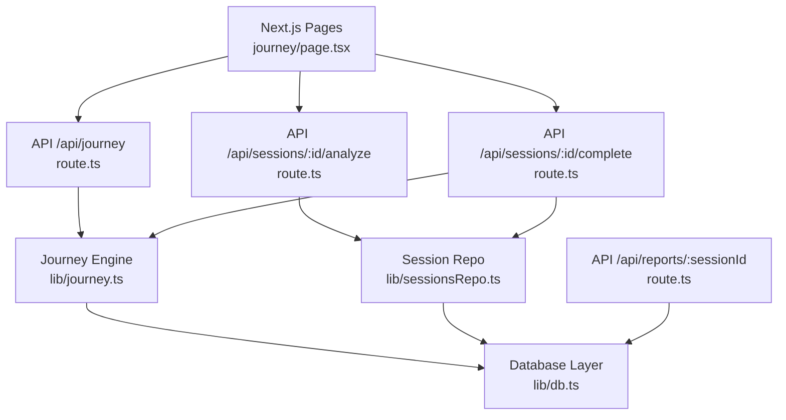
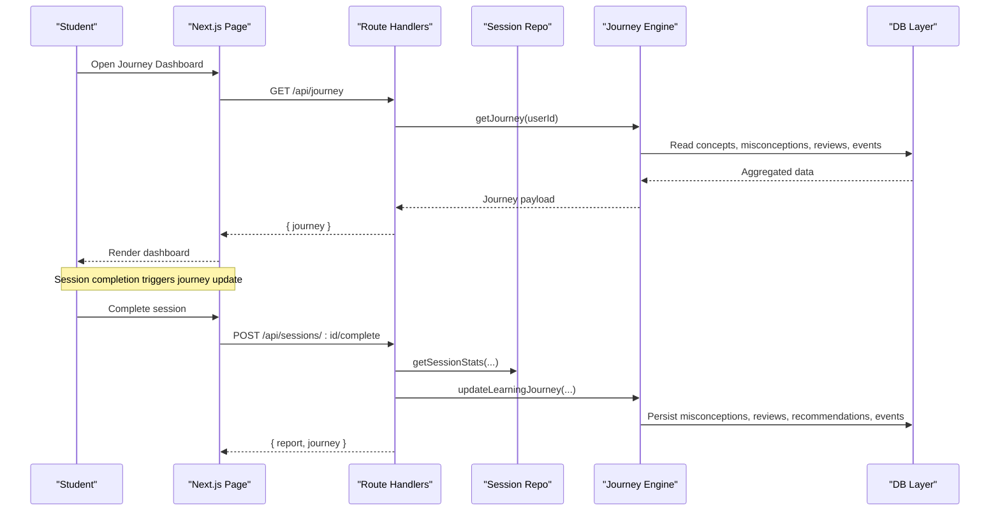
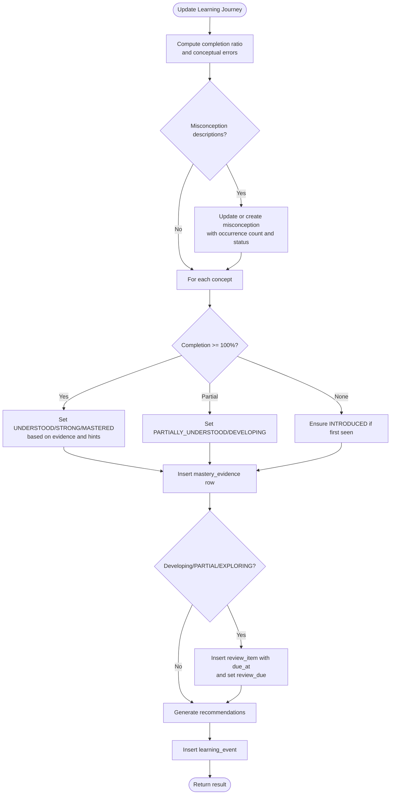
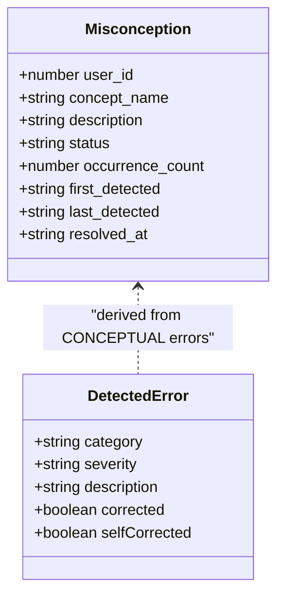
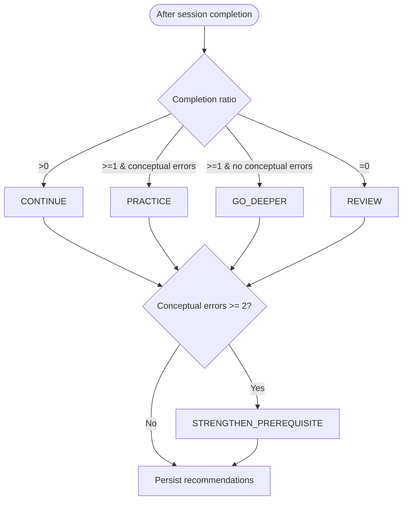
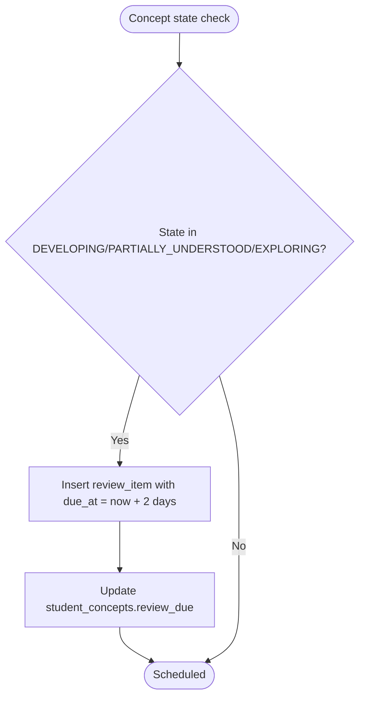
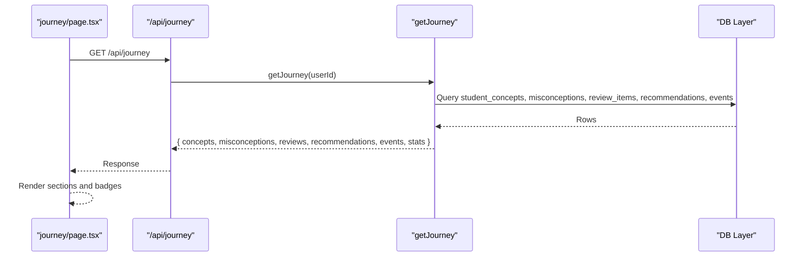
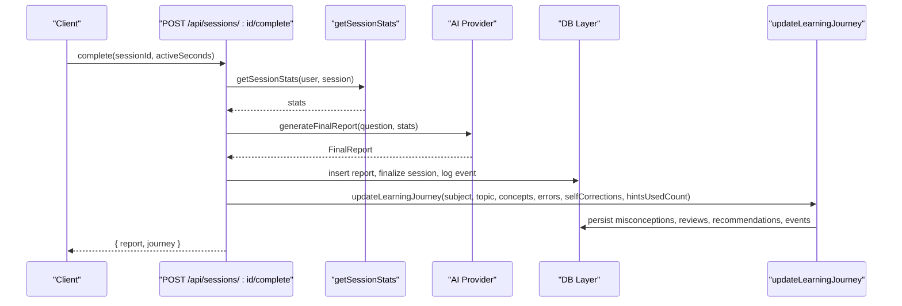
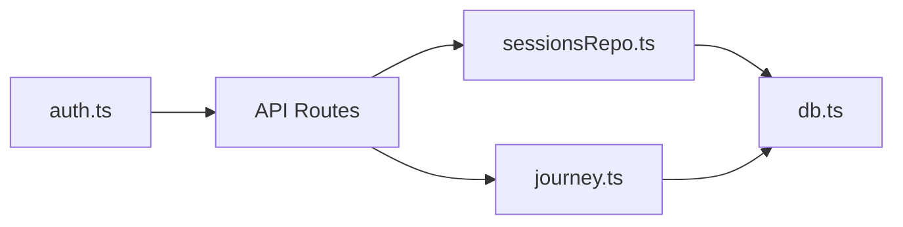

# Learning Journey System

<cite>
**Referenced Files in This Document**
- [journey.ts](file://app/lib/journey.ts)
- [sessionsRepo.ts](file://app/lib/sessionsRepo.ts)
- [route.ts (journey)](file://app/app/api/journey/route.ts)
- [route.ts (complete)](file://app/app/api/sessions/[id]/complete/route.ts)
- [route.ts (analyze)](file://app/app/api/sessions/[id]/analyze/route.ts)
- [page.tsx (journey dashboard)](file://app/app/journey/page.tsx)
- [types.ts](file://app/lib/types.ts)
- [db.ts](file://app/lib/db.ts)
- [teaching.ts](file://app/lib/teaching.ts)
- [auth.ts](file://app/lib/auth.ts)
- [route.ts (reports)](file://app/app/api/reports/[sessionId]/route.ts)
</cite>

## Table of Contents
1. Introduction
2. Project Structure
3. Core Components
4. Architecture Overview
5. Detailed Component Analysis
6. Dependency Analysis
7. Performance Considerations
8. Troubleshooting Guide
9. Conclusion
10. Appendices

## Introduction
This document explains StepWise AI’s Learning Journey system: how it tracks long-term student progress, detects misconceptions, personalizes recommendations, schedules spaced reviews, and visualizes learning analytics. It focuses on the evidence-based concept model, misconception lifecycle, recommendation engine, spaced repetition scheduling, and the learning analytics dashboard. It also includes examples for querying data, generating recommendations, integrating with external systems, and addresses privacy and compliance considerations grounded in the codebase.

## Project Structure
The Learning Journey spans server-side API routes, a domain library for journey logic, session management, and a Next.js page that renders the dashboard. Data is persisted via an embedded JSON store designed to be swappable for PostgreSQL later.

**Diagram sources**
- [page.tsx (journey dashboard):64-68](file://app/app/journey/page.tsx#L64-L68)
- [route.ts (journey):8-15](file://app/app/api/journey/route.ts#L8-L15)
- [route.ts (analyze):22-179](file://app/app/api/sessions/[id]/analyze/route.ts#L22-L179)
- [route.ts (complete):15-123](file://app/app/api/sessions/[id]/complete/route.ts#L15-L123)
- [journey.ts:59-261](file://app/lib/journey.ts#L59-L261)
- [sessionsRepo.ts:26-116](file://app/lib/sessionsRepo.ts#L26-L116)
- [db.ts:123-199](file://app/lib/db.ts#L123-L199)
- [route.ts (reports):8-20](file://app/app/api/reports/[sessionId]/route.ts#L8-L20)

**Section sources**
- [journey.ts:59-261](file://app/lib/journey.ts#L59-L261)
- [sessionsRepo.ts:26-116](file://app/lib/sessionsRepo.ts#L26-L116)
- [route.ts (journey):8-15](file://app/app/api/journey/route.ts#L8-L15)
- [route.ts (complete):15-123](file://app/app/api/sessions/[id]/complete/route.ts#L15-L123)
- [route.ts (analyze):22-179](file://app/app/api/sessions/[id]/analyze/route.ts#L22-L179)
- [db.ts:123-199](file://app/lib/db.ts#L123-L199)
- [page.tsx (journey dashboard):64-68](file://app/app/journey/page.tsx#L64-L68)
- [route.ts (reports):8-20](file://app/app/api/reports/[sessionId]/route.ts#L8-L20)

## Core Components
- Journey Engine: Updates concept states, tracks misconceptions, schedules reviews, and generates explainable recommendations based on session evidence.
- Session Repository: Creates sessions, persists board snapshots, records hints/errors, and computes session stats used by the journey.
- API Routes: Secure endpoints for fetching the journey, analyzing steps, completing sessions, and retrieving reports.
- Dashboard Page: Renders concepts, misconceptions, upcoming reviews, and recommendations.
- Database Layer: Transactional JSON store with table definitions and safe read/write operations.
- Types and Teaching Helpers: Shared domain types and intervention/hint policies.

Key responsibilities:
- Evidence-driven mastery: status transitions require meaningful completion and varied evidence; mastery never granted from reading alone.
- Misconception lifecycle: tracked across sessions with occurrence counts and statuses.
- Spaced review: scheduled for developing concepts with due dates.
- Explainable recommendations: generated per session outcome and stored with reasons.

**Section sources**
- [journey.ts:59-261](file://app/lib/journey.ts#L59-L261)
- [sessionsRepo.ts:26-116](file://app/lib/sessionsRepo.ts#L26-L116)
- [route.ts (complete):15-123](file://app/app/api/sessions/[id]/complete/route.ts#L15-L123)
- [page.tsx (journey dashboard):64-68](file://app/app/journey/page.tsx#L64-L68)
- [db.ts:123-199](file://app/lib/db.ts#L123-L199)
- [types.ts:149-193](file://app/lib/types.ts#L149-L193)
- [teaching.ts:41-76](file://app/lib/teaching.ts#L41-L76)

## Architecture Overview
The system follows a layered architecture:
- Presentation: Next.js pages render the Learning Journey dashboard.
- API layer: Route handlers enforce authentication, validate inputs, and orchestrate use cases.
- Domain: Journey engine and session repository implement core learning logic.
- Persistence: A transactional JSON store abstracts tables like concepts, student_concepts, misconceptions, review_items, recommendations, and learning_events.

**Diagram sources**
- [route.ts (journey):8-15](file://app/app/api/journey/route.ts#L8-L15)
- [journey.ts:274-356](file://app/lib/journey.ts#L274-L356)
- [route.ts (complete):15-123](file://app/app/api/sessions/[id]/complete/route.ts#L15-L123)
- [sessionsRepo.ts:378-399](file://app/lib/sessionsRepo.ts#L378-L399)
- [db.ts:123-199](file://app/lib/db.ts#L123-L199)

## Detailed Component Analysis

### Progress Tracking Mechanism
Concept mastery is updated using evidence from completed steps, self-corrections, hint usage, and conceptual errors. Status transitions follow a defined order and thresholds. Mastery requires multiple pieces of evidence and low hint dependency.

**Diagram sources**
- [journey.ts:59-261](file://app/lib/journey.ts#L59-L261)

**Section sources**
- [journey.ts:10-24](file://app/lib/journey.ts#L10-L24)
- [journey.ts:100-197](file://app/lib/journey.ts#L100-L197)
- [types.ts:150-161](file://app/lib/types.ts#L150-L161)

### Misconception Detection System
Misconceptions are detected from conceptual errors during evaluation and recorded with lifecycle states. Recurring patterns increase priority and influence future recommendations.

**Diagram sources**
- [journey.ts:68-98](file://app/lib/journey.ts#L68-L98)
- [types.ts:80-103](file://app/lib/types.ts#L80-L103)

**Section sources**
- [journey.ts:68-98](file://app/lib/journey.ts#L68-L98)
- [route.ts (analyze):90-112](file://app/app/api/sessions/[id]/analyze/route.ts#L90-L112)
- [types.ts:80-103](file://app/lib/types.ts#L80-L103)

### Recommendation Engine
Recommendations are generated after each meaningful session and stored with explicit reasons. They include continue, review, practice, go deeper, strengthen prerequisite, apply, explore, or rest.

**Diagram sources**
- [journey.ts:199-242](file://app/lib/journey.ts#L199-L242)

**Section sources**
- [journey.ts:199-242](file://app/lib/journey.ts#L199-L242)
- [types.ts:179-193](file://app/lib/types.ts#L179-L193)

### Spaced Repetition System
Concepts in developing states are scheduled for review at fixed intervals. The system inserts review items and marks concepts as due for review.

**Diagram sources**
- [journey.ts:179-196](file://app/lib/journey.ts#L179-L196)

**Section sources**
- [journey.ts:179-196](file://app/lib/journey.ts#L179-L196)

### Learning Analytics Dashboard
The dashboard displays:
- Concept list with status and evidence counts
- Misconceptions being addressed
- Upcoming reviews with due dates
- Recommendations with reasons
- Summary stats: sessions, completed, self-corrections

**Diagram sources**
- [page.tsx (journey dashboard):64-68](file://app/app/journey/page.tsx#L64-L68)
- [journey.ts:274-356](file://app/lib/journey.ts#L274-L356)
- [route.ts (journey):8-15](file://app/app/api/journey/route.ts#L8-L15)

**Section sources**
- [page.tsx (journey dashboard):64-68](file://app/app/journey/page.tsx#L64-L68)
- [page.tsx (journey dashboard):80-230](file://app/app/journey/page.tsx#L80-L230)
- [journey.ts:274-356](file://app/lib/journey.ts#L274-L356)

### Session-to-Journey Integration
When a session completes, the system:
- Generates a final report via the AI provider
- Persists the report atomically with session finalization
- Computes session stats (hints, errors, steps)
- Updates the Learning Journey with concepts, errors, self-corrections, and hints used

**Diagram sources**
- [route.ts (complete):15-123](file://app/app/api/sessions/[id]/complete/route.ts#L15-L123)
- [sessionsRepo.ts:378-399](file://app/lib/sessionsRepo.ts#L378-L399)
- [journey.ts:59-261](file://app/lib/journey.ts#L59-L261)

**Section sources**
- [route.ts (complete):15-123](file://app/app/api/sessions/[id]/complete/route.ts#L15-L123)
- [sessionsRepo.ts:378-399](file://app/lib/sessionsRepo.ts#L378-L399)
- [journey.ts:59-261](file://app/lib/journey.ts#L59-L261)

## Dependency Analysis
- Authentication: All routes verify current user before processing requests.
- Session Repo: Provides ownership-verified access to sessions, boards, hints, and errors.
- Journey Engine: Depends on session stats and error records to update concepts and schedule reviews.
- Database Layer: Centralized persistence with transactions and table metadata.

**Diagram sources**
- [auth.ts:78-102](file://app/lib/auth.ts#L78-L102)
- [route.ts (journey):8-15](file://app/app/api/journey/route.ts#L8-L15)
- [route.ts (complete):15-123](file://app/app/api/sessions/[id]/complete/route.ts#L15-L123)
- [route.ts (analyze):22-179](file://app/app/api/sessions/[id]/analyze/route.ts#L22-L179)
- [sessionsRepo.ts:26-116](file://app/lib/sessionsRepo.ts#L26-L116)
- [journey.ts:59-261](file://app/lib/journey.ts#L59-L261)
- [db.ts:123-199](file://app/lib/db.ts#L123-L199)

**Section sources**
- [auth.ts:78-102](file://app/lib/auth.ts#L78-L102)
- [route.ts (journey):8-15](file://app/app/api/journey/route.ts#L8-L15)
- [route.ts (complete):15-123](file://app/app/api/sessions/[id]/complete/route.ts#L15-L123)
- [route.ts (analyze):22-179](file://app/app/api/sessions/[id]/analyze/route.ts#L22-L179)
- [sessionsRepo.ts:26-116](file://app/lib/sessionsRepo.ts#L26-L116)
- [journey.ts:59-261](file://app/lib/journey.ts#L59-L261)
- [db.ts:123-199](file://app/lib/db.ts#L123-L199)

## Performance Considerations
- Transactions: Journey updates and session completions use atomic transactions to avoid partial state and ensure consistency.
- Bounded writes: Board objects and messages are capped to prevent excessive storage growth.
- Local JSON store: Designed for simplicity; production target is PostgreSQL for scalability.
- Minimal queries: Dashboard reads slice results to limit payload size.

[No sources needed since this section provides general guidance]

## Troubleshooting Guide
Common issues and resolutions:
- Unauthorized access: Ensure session cookie is present and valid; route handlers return unauthorized when missing.
- Not found: Verify session/board ownership checks pass; repositories re-verify IDs against authenticated user.
- Completed session: Completion endpoint rejects duplicate reports; idempotency prevents re-generation.
- Invalid step: Analyze endpoint validates step index against question steps.

**Section sources**
- [route.ts (journey):8-15](file://app/app/api/journey/route.ts#L8-L15)
- [route.ts (complete):15-27](file://app/app/api/sessions/[id]/complete/route.ts#L15-L27)
- [route.ts (analyze):22-41](file://app/app/api/sessions/[id]/analyze/route.ts#L22-L41)
- [sessionsRepo.ts:118-146](file://app/lib/sessionsRepo.ts#L118-L146)

## Conclusion
StepWise’s Learning Journey system builds a living map of student understanding through evidence-based concept states, a robust misconception lifecycle, explainable recommendations, and adaptive spaced reviews. The dashboard surfaces actionable insights while preserving privacy and minimizing data collection. The modular design separates concerns across routes, domain logic, and persistence, enabling future scaling and integration.

[No sources needed since this section summarizes without analyzing specific files]

## Appendices

### Examples: Querying Learning Data
- Fetch journey: Call GET /api/journey to retrieve concepts, misconceptions, reviews, recommendations, events, and stats.
- Retrieve report: Call GET /api/reports/:sessionId to fetch a finalized report for a session.

**Section sources**
- [route.ts (journey):8-15](file://app/app/api/journey/route.ts#L8-L15)
- [route.ts (reports):8-20](file://app/app/api/reports/[sessionId]/route.ts#L8-L20)

### Examples: Generating Personalized Recommendations
- After completing a session, call POST /api/sessions/:id/complete. The system computes session stats, generates a final report, and updates the journey, returning both the report and recommended next steps.

**Section sources**
- [route.ts (complete):15-123](file://app/app/api/sessions/[id]/complete/route.ts#L15-L123)
- [journey.ts:199-242](file://app/lib/journey.ts#L199-L242)

### Integrating with External Learning Management Systems
- Use the database abstraction to export structured records such as sessions, questions, boards, student_concepts, misconceptions, review_items, recommendations, and learning_events.
- Map these entities to your LMS schema and synchronize via batch jobs or webhooks.
- Maintain ownership boundaries by exporting only necessary fields and respecting user permissions.

**Section sources**
- [db.ts:23-44](file://app/lib/db.ts#L23-L44)
- [db.ts:201-223](file://app/lib/db.ts#L201-L223)

### Data Privacy and Compliance
- Authentication: Uses signed session cookies and hashed passwords; tokens verified securely.
- Ownership verification: Repositories re-check resource ownership on every access.
- Data minimization: Store only necessary information for continuity; caps on content sizes.
- No shame-based analytics: Language and metrics focus on growth and support.
- Explainability: Recommendations include reasons to make progression understandable.

**Section sources**
- [auth.ts:24-40](file://app/lib/auth.ts#L24-L40)
- [auth.ts:78-102](file://app/lib/auth.ts#L78-L102)
- [sessionsRepo.ts:118-146](file://app/lib/sessionsRepo.ts#L118-L146)
- [journey.ts:199-242](file://app/lib/journey.ts#L199-L242)