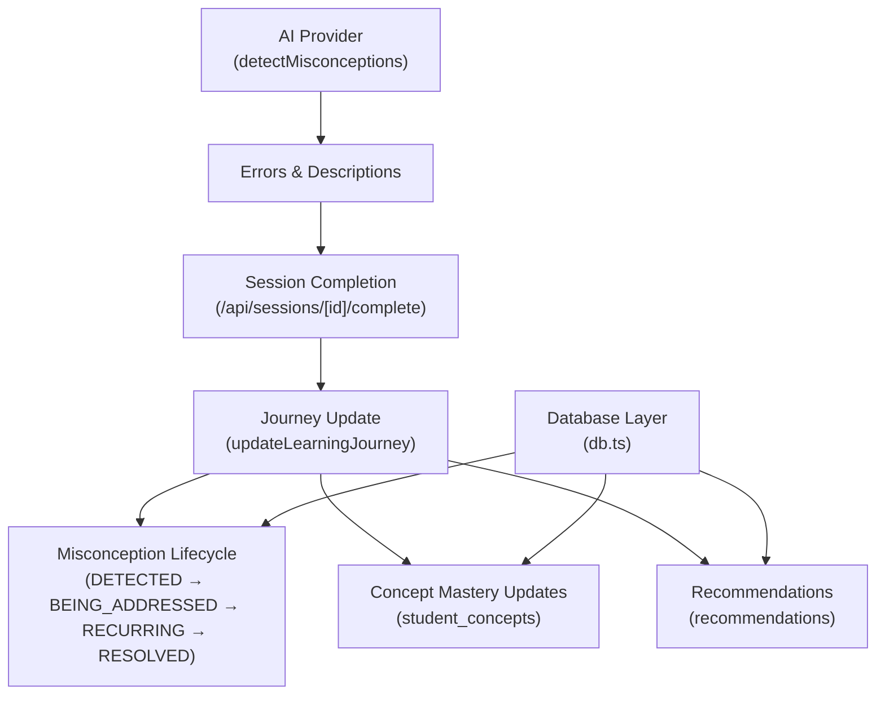
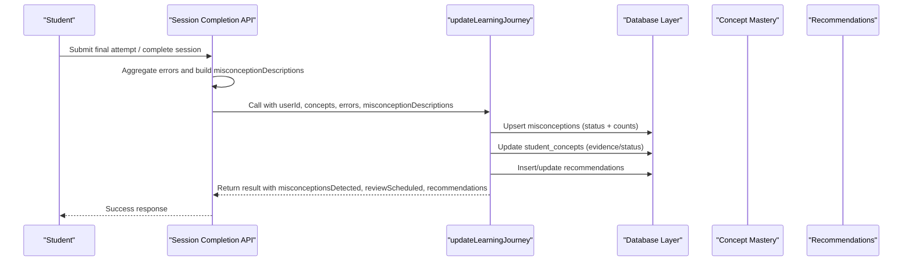
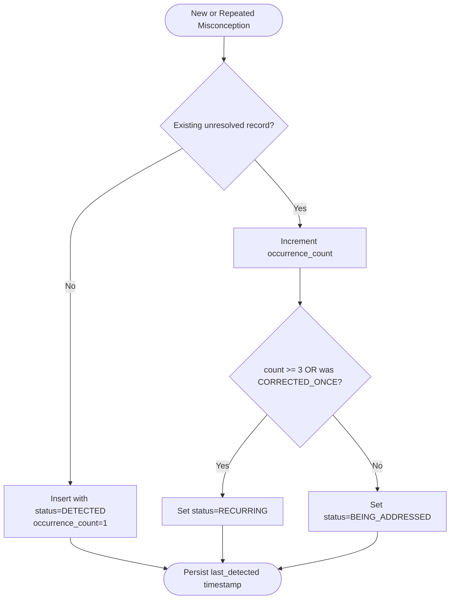
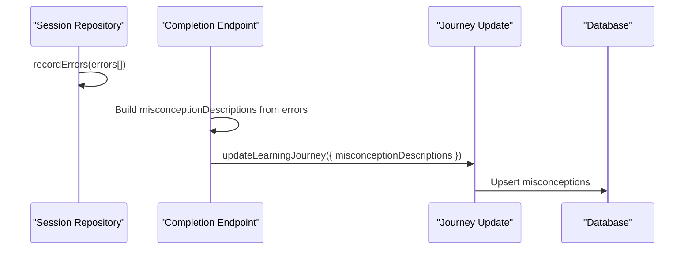
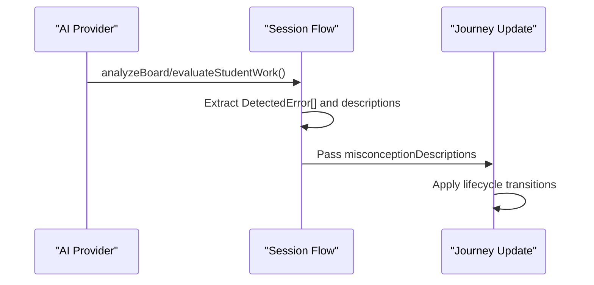
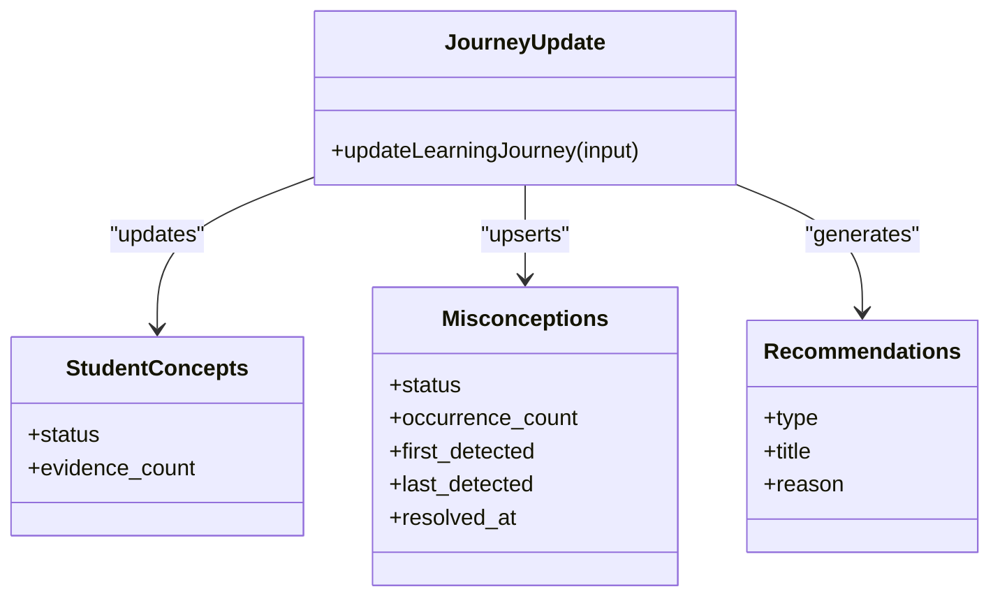
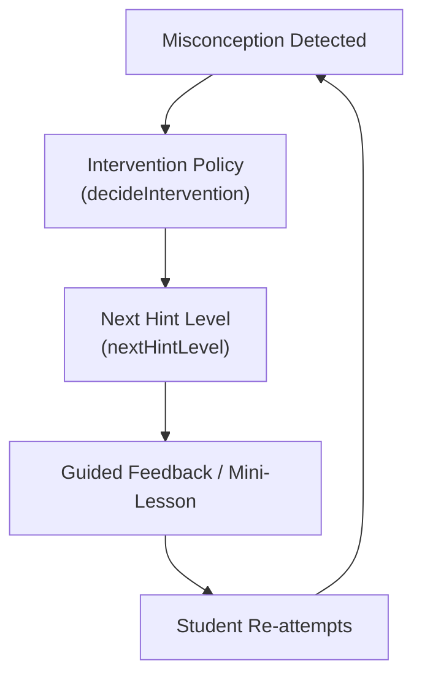
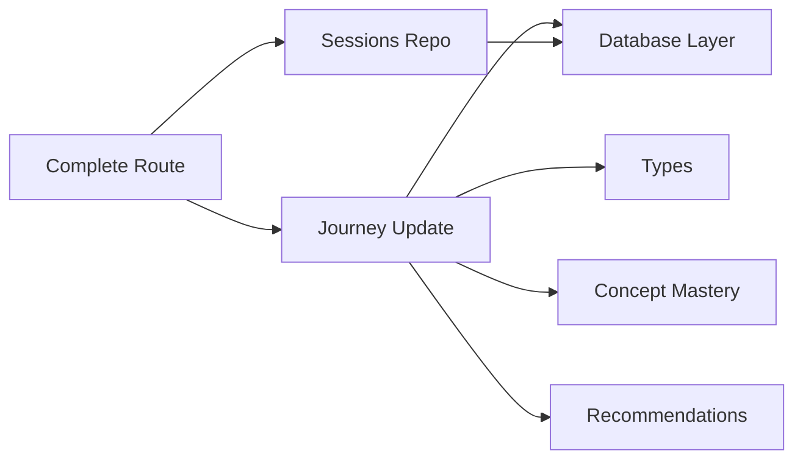

# Misconception Detection System

<cite>
**Referenced Files in This Document**
- [journey.ts](file://stepwise ai/app/lib/journey.ts)
- [db.ts](file://stepwise ai/app/lib/db.ts)
- [types.ts](file://stepwise ai/app/lib/types.ts)
- [sessionsRepo.ts](file://stepwise ai/app/lib/sessionsRepo.ts)
- [complete route.ts](file://stepwise ai/app/app/api/sessions/[id]/complete/route.ts)
- [demoProvider.ts](file://stepwise ai/app/lib/ai/demoProvider.ts)
- [teaching.ts](file://stepwise ai/app/lib/teaching.ts)
</cite>

## Table of Contents
1. [Introduction](#introduction)
2. [Project Structure](#project-structure)
3. [Core Components](#core-components)
4. [Architecture Overview](#architecture-overview)
5. [Detailed Component Analysis](#detailed-component-analysis)
6. [Dependency Analysis](#dependency-analysis)
7. [Performance Considerations](#performance-considerations)
8. [Troubleshooting Guide](#troubleshooting-guide)
9. [Conclusion](#conclusion)
10. [Appendices](#appendices)

## Introduction
This document explains the misconception detection system that identifies and tracks recurring student errors across learning sessions. It covers the full lifecycle from initial detection through recurrence escalation to resolution, how descriptions are captured during session analysis, where data is stored, and how it integrates with concept mastery and recommendation generation. It also provides practical queries for active misconceptions, tracking resolution progress, and using this data to inform teaching strategies, along with privacy considerations and anonymization guidance.

## Project Structure
The misconception system spans several modules:
- Session error capture and reporting
- AI-driven misconception detection
- Journey update logic that persists and evolves misconception records
- Database schema definitions and transactional writes
- Types defining statuses and models
- Teaching engine integration for intervention and hints

**Diagram sources**
- [complete route.ts](file://stepwise ai/app/app/api/sessions/[id]/complete/route.ts)
- [journey.ts](file://stepwise ai/app/lib/journey.ts)
- [db.ts](file://stepwise ai/app/lib/db.ts)
- [demoProvider.ts](file://stepwise ai/app/lib/ai/demoProvider.ts)

**Section sources**
- [journey.ts:60-98](file://stepwise ai/app/lib/journey.ts#L60-L98)
- [db.ts:23-44](file://stepwise ai/app/lib/db.ts#L23-L44)
- [complete route.ts:51-115](file://stepwise ai/app/app/api/sessions/[id]/complete/route.ts#L51-L115)

## Core Components
- Misconception lifecycle management: transitions based on occurrence count and prior correction history.
- Error capture pipeline: collects categorized errors with descriptions during sessions and at completion.
- Concept mastery integration: updates student concept status based on evidence and misconceptions.
- Recommendation generation: uses updated journey state to suggest next steps (review, practice, deeper exploration).
- Privacy and storage: all persistence via a controlled database layer; user-scoped access enforced.

Key responsibilities by file:
- Journey update orchestrates lifecycle transitions and stores results.
- Database layer defines tables and atomic transactions.
- Types define allowed statuses and data shapes.
- Session repository captures per-session errors and stats.
- API completion endpoint aggregates errors into misconception descriptions for journey updates.
- AI provider detects conceptual errors and produces descriptions used by the system.
- Teaching engine supplies hint levels and intervention policies that influence when misconceptions are surfaced or addressed.

**Section sources**
- [journey.ts:60-98](file://stepwise ai/app/lib/journey.ts#L60-L98)
- [db.ts:23-44](file://stepwise ai/app/lib/db.ts#L23-L44)
- [types.ts:171-177](file://stepwise ai/app/lib/types.ts#L171-L177)
- [sessionsRepo.ts:332-349](file://stepwise ai/app/lib/sessionsRepo.ts#L332-L349)
- [complete route.ts:51-115](file://stepwise ai/app/app/api/sessions/[id]/complete/route.ts#L51-L115)
- [demoProvider.ts:232-257](file://stepwise ai/app/lib/ai/demoProvider.ts#L232-L257)
- [teaching.ts:28-76](file://stepwise ai/app/lib/teaching.ts#L28-L76)

## Architecture Overview
End-to-end flow from student attempt to long-term misconception tracking:

**Diagram sources**
- [complete route.ts:51-115](file://stepwise ai/app/app/api/sessions/[id]/complete/route.ts#L51-L115)
- [journey.ts:60-98](file://stepwise ai/app/lib/journey.ts#L60-L98)
- [db.ts:147-194](file://stepwise ai/app/lib/db.ts#L147-L194)

## Detailed Component Analysis

### Misconception Lifecycle and Status Transitions
- Initial detection creates a new record with status DETECTED and occurrence_count set to 1.
- On subsequent detections of the same description for the same user:
  - occurrence_count increments.
  - If occurrence_count reaches 3 or more, status becomes RECURRING.
  - If previously marked CORRECTED_ONCE and reappears, status escalates to RECURRING.
  - Otherwise, status moves to BEING_ADDRESSED.
- Resolution occurs when a misconception is considered resolved; future reappearances will be treated as new detections unless explicitly linked by implementation.

**Diagram sources**
- [journey.ts:69-98](file://stepwise ai/app/lib/journey.ts#L69-L98)

**Section sources**
- [journey.ts:69-98](file://stepwise ai/app/lib/journey.ts#L69-L98)
- [types.ts:171-177](file://stepwise ai/app/lib/types.ts#L171-L177)

### Error Capture During Sessions
- Errors are recorded per session with category, severity, and description.
- At session completion, errors are transformed into misconception descriptions grouped by concept to feed the journey update.
- The system caps the number of persisted errors per call to avoid excessive payloads.

**Diagram sources**
- [sessionsRepo.ts:332-349](file://stepwise ai/app/lib/sessionsRepo.ts#L332-L349)
- [complete route.ts:51-115](file://stepwise ai/app/app/api/sessions/[id]/complete/route.ts#L51-L115)
- [journey.ts:60-98](file://stepwise ai/app/lib/journey.ts#L60-L98)

**Section sources**
- [sessionsRepo.ts:332-349](file://stepwise ai/app/lib/sessionsRepo.ts#L332-L349)
- [complete route.ts:51-115](file://stepwise ai/app/app/api/sessions/[id]/complete/route.ts#L51-L115)

### AI-Driven Misconception Detection
- The AI provider analyzes student attempts and returns detected misconceptions with descriptions tied to concepts.
- These descriptions are used to seed or escalate existing misconception records.

**Diagram sources**
- [demoProvider.ts:232-257](file://stepwise ai/app/lib/ai/demoProvider.ts#L232-L257)
- [journey.ts:60-98](file://stepwise ai/app/lib/journey.ts#L60-L98)

**Section sources**
- [demoProvider.ts:232-257](file://stepwise ai/app/lib/ai/demoProvider.ts#L232-L257)

### Integration with Concept Mastery and Recommendations
- Concept mastery states evolve based on evidence such as completed steps, corrections, and self-corrections.
- Misconception activity influences review scheduling and recommendation types (e.g., REVIEW, STRENGTHEN_PREREQUISITE, PRACTICE).
- The journey update function coordinates these updates atomically.

**Diagram sources**
- [journey.ts:60-98](file://stepwise ai/app/lib/journey.ts#L60-L98)
- [db.ts:23-44](file://stepwise ai/app/lib/db.ts#L23-L44)

**Section sources**
- [journey.ts:60-98](file://stepwise ai/app/lib/journey.ts#L60-L98)
- [types.ts:149-188](file://stepwise ai/app/lib/types.ts#L149-L188)

### Teaching Engine Influence
- Hint escalation and intervention levels determine how aggressively the system addresses misconceptions.
- When misconceptions are detected, the teaching engine can trigger targeted hints or mini-lessons aligned with the current intervention policy.

**Diagram sources**
- [teaching.ts:28-76](file://stepwise ai/app/lib/teaching.ts#L28-L76)

**Section sources**
- [teaching.ts:28-76](file://stepwise ai/app/lib/teaching.ts#L28-L76)

## Dependency Analysis
- Journey update depends on:
  - Database layer for atomic transactions and table operations.
  - Types for valid status values and structures.
  - Session completion endpoint to supply aggregated misconception descriptions.
  - AI provider indirectly via upstream error extraction.
- Database layer centralizes persistence and cascade deletions, ensuring referential integrity across related tables.

**Diagram sources**
- [complete route.ts:51-115](file://stepwise ai/app/app/api/sessions/[id]/complete/route.ts#L51-L115)
- [journey.ts:60-98](file://stepwise ai/app/lib/journey.ts#L60-L98)
- [db.ts:147-194](file://stepwise ai/app/lib/db.ts#L147-L194)
- [sessionsRepo.ts:332-349](file://stepwise ai/app/lib/sessionsRepo.ts#L332-L349)

**Section sources**
- [db.ts:147-194](file://stepwise ai/app/lib/db.ts#L147-L194)
- [journey.ts:60-98](file://stepwise ai/app/lib/journey.ts#L60-L98)

## Performance Considerations
- Batch processing: Misconception updates occur within a single transaction to minimize disk writes and ensure consistency.
- Payload limits: Error arrays are capped to prevent large payloads during persistence.
- Efficient lookups: Existing misconceptions are identified by user_id and description to reduce unnecessary inserts.
- Avoid over-analysis: AI calls are triggered only at meaningful points (e.g., session completion), not per keystroke.

[No sources needed since this section provides general guidance]

## Troubleshooting Guide
Common issues and resolutions:
- Misconception not escalating to RECURRING:
  - Verify occurrence_count increments correctly and thresholds are applied.
  - Ensure previous status was not already RESOLVED before re-detection.
- Missing misconception descriptions:
  - Confirm errors were recorded during the session and passed to the completion endpoint.
  - Validate that AI provider returns structured misconceptions with descriptions.
- Concept mastery not updating:
  - Check that stepsCompleted/stepsTotal ratios and evidence flags are accurate.
  - Ensure journey update receives correct concept lists and error data.

Operational checks:
- Inspect database tables for misconceptions, student_concepts, and recommendations after session completion.
- Review session stats to confirm errors and hints were captured.

**Section sources**
- [journey.ts:69-98](file://stepwise ai/app/lib/journey.ts#L69-L98)
- [sessionsRepo.ts:378-398](file://stepwise ai/app/lib/sessionsRepo.ts#L378-L398)

## Conclusion
The misconception detection system provides a robust mechanism to identify, track, and act upon recurring student errors. By capturing detailed descriptions during sessions, applying clear lifecycle rules, and integrating with concept mastery and recommendations, the system supports adaptive teaching strategies. Proper privacy controls and anonymization practices ensure responsible handling of sensitive student error patterns.

[No sources needed since this section summarizes without analyzing specific files]

## Appendices

### Querying Active Misconceptions
- Retrieve unresolved misconceptions for a user:
  - Filter by user_id and exclude status RESOLVED.
  - Order by last_detected to prioritize recent issues.
- Use case:
  - Generate dashboards showing students’ active misconceptions for instructors.
  - Trigger targeted interventions or review items.

**Section sources**
- [db.ts:124-139](file://stepwise ai/app/lib/db.ts#L124-L139)
- [journey.ts:69-98](file://stepwise ai/app/lib/journey.ts#L69-L98)

### Tracking Resolution Progress
- Monitor status transitions:
  - DETECTED → BEING_ADDRESSED → RECURRING → RESOLVED.
  - Track occurrence_count and timestamps (first_detected, last_detected, resolved_at).
- Use case:
  - Measure effectiveness of interventions over time.
  - Identify persistent misconceptions requiring deeper remediation.

**Section sources**
- [journey.ts:69-98](file://stepwise ai/app/lib/journey.ts#L69-L98)
- [types.ts:171-177](file://stepwise ai/app/lib/types.ts#L171-L177)

### Using Misconception Data to Inform Teaching Strategies
- Align hint levels and interventions with detected misconceptions.
- Schedule focused reviews or prerequisite strengthening based on RECURRING status.
- Adjust explanation depth and examples to address specific conceptual gaps.

**Section sources**
- [teaching.ts:28-76](file://stepwise ai/app/lib/teaching.ts#L28-L76)
- [journey.ts:60-98](file://stepwise ai/app/lib/journey.ts#L60-L98)

### Privacy Considerations and Anonymization
- User-scoped access:
  - All reads/writes enforce ownership checks to ensure users only access their own data.
- Data minimization:
  - Store only necessary fields (user_id, concept_name, description, timestamps, counts).
  - Cap content lengths to limit storage and exposure.
- Anonymization for analytics:
  - Strip or hash user identifiers when exporting analytics datasets.
  - Aggregate misconception trends at cohort or topic level rather than individual level.
- Secure storage:
  - Persist via controlled database layer with atomic transactions.
  - Avoid logging raw student content in analytics pipelines.

**Section sources**
- [db.ts:201-223](file://stepwise ai/app/lib/db.ts#L201-L223)
- [sessionsRepo.ts:332-349](file://stepwise ai/app/lib/sessionsRepo.ts#L332-L349)