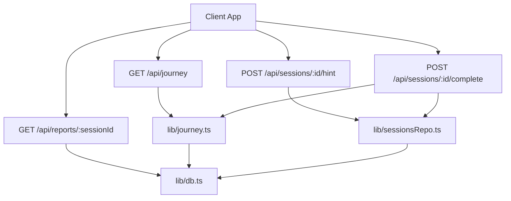
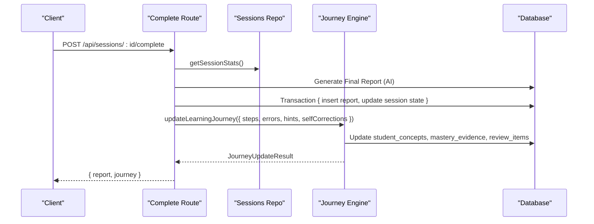
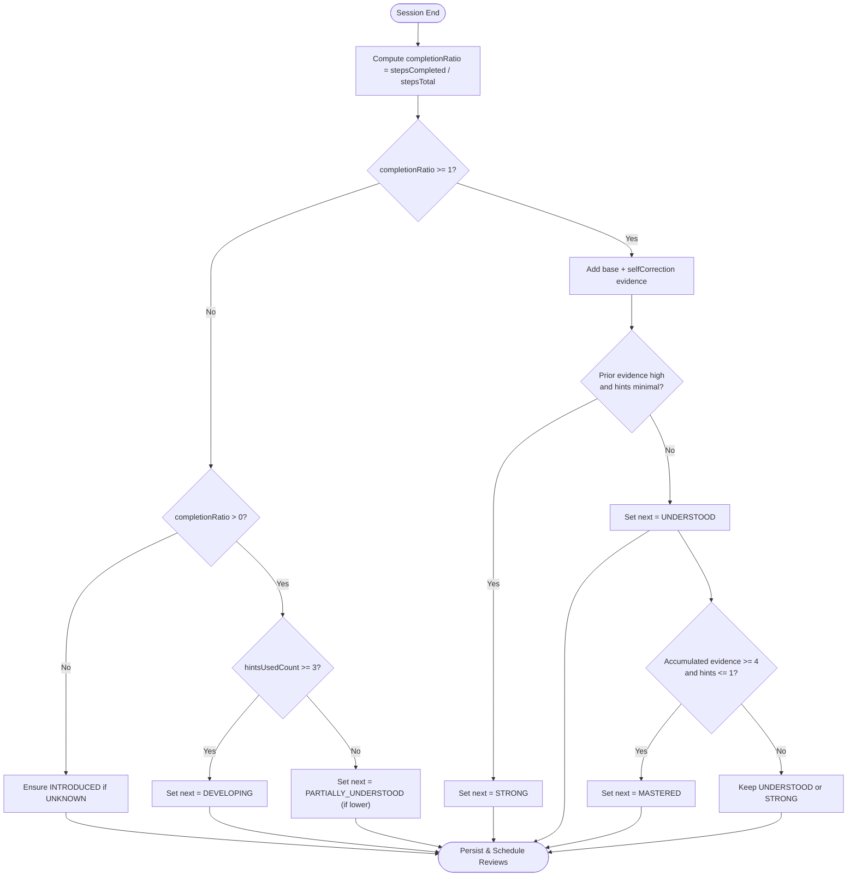
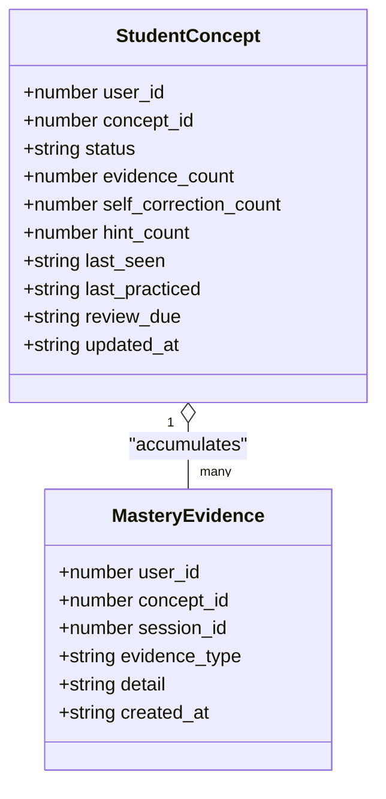
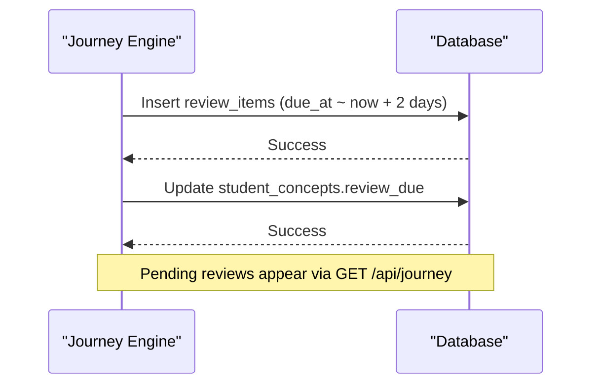
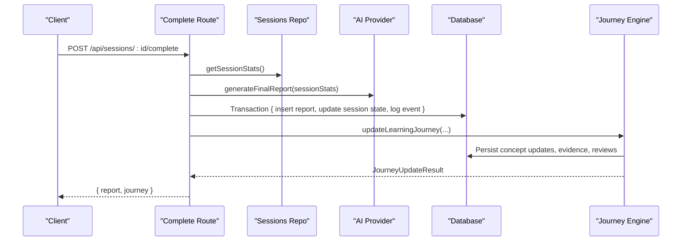
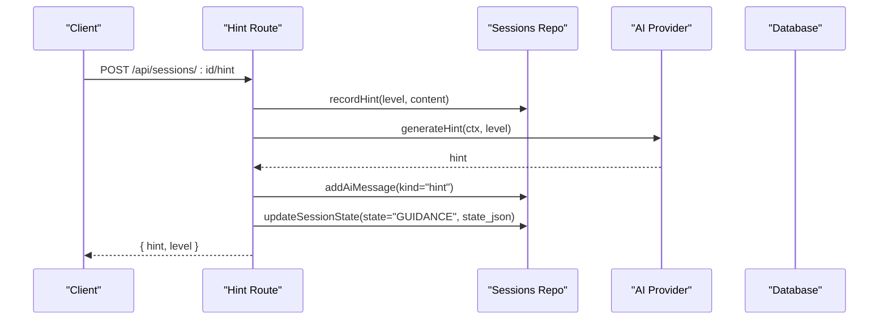
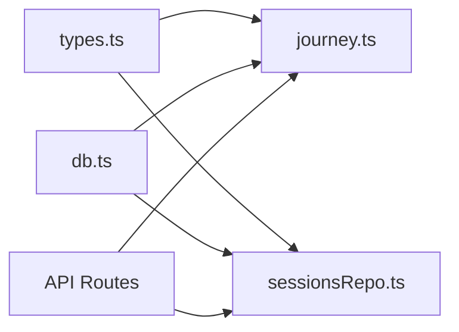

# Progress Tracking System

<cite>
**Referenced Files in This Document**
- [journey.ts](file://stepwise ai/app/lib/journey.ts)
- [sessionsRepo.ts](file://stepwise ai/app/lib/sessionsRepo.ts)
- [types.ts](file://stepwise ai/app/lib/types.ts)
- [db.ts](file://stepwise ai/app/lib/db.ts)
- [route.ts (journey)](file://stepwise ai/app/app/api/journey/route.ts)
- [route.ts (complete)](file://stepwise ai/app/app/api/sessions/[id]/complete/route.ts)
- [route.ts (hint)](file://stepwise ai/app/app/api/sessions/[id]/hint/route.ts)
- [route.ts (reports)](file://stepwise ai/app/app/api/reports/[sessionId]/route.ts)
</cite>

## Table of Contents
1. [Introduction](#introduction)
2. [Project Structure](#project-structure)
3. [Core Components](#core-components)
4. [Architecture Overview](#architecture-overview)
5. [Detailed Component Analysis](#detailed-component-analysis)
6. [Dependency Analysis](#dependency-analysis)
7. [Performance Considerations](#performance-considerations)
8. [Troubleshooting Guide](#troubleshooting-guide)
9. [Conclusion](#conclusion)
10. [Appendices](#appendices)

## Introduction
This document explains StepWise AI’s progress tracking system that monitors student learning over time. It focuses on the concept mastery lifecycle, evidence-based progression from UNKNOWN to MASTERED, and how completion ratios, self-corrections, hint usage, and conceptual errors influence status updates. It also documents the evidence counting mechanism, review scheduling for spaced repetition, example workflows for querying progress and updating statuses, and transactional integrity across sessions.

## Project Structure
The progress tracking system spans a small set of focused modules:
- Journey engine: computes concept mastery transitions and schedules reviews.
- Session repository: records session events, hints, errors, and statistics.
- Types: defines domain models including ConceptStatus, error categories, and report shapes.
- Database layer: provides an atomic transaction API and persistent JSON-backed store.
- API routes: expose endpoints to fetch journey data, complete sessions, request hints, and retrieve reports.

**Diagram sources**
- [route.ts (journey):1-17](file://stepwise ai/app/app/api/journey/route.ts#L1-L17)
- [route.ts (hint):1-93](file://stepwise ai/app/app/api/sessions/[id]/hint/route.ts#L1-L93)
- [route.ts (complete):1-124](file://stepwise ai/app/app/api/sessions/[id]/complete/route.ts#L1-L124)
- [route.ts (reports):1-21](file://stepwise ai/app/app/api/reports/[sessionId]/route.ts#L1-L21)
- [journey.ts:1-357](file://stepwise ai/app/lib/journey.ts#L1-L357)
- [sessionsRepo.ts:1-399](file://stepwise ai/app/lib/sessionsRepo.ts#L1-L399)
- [db.ts:1-224](file://stepwise ai/app/lib/db.ts#L1-L224)

**Section sources**
- [journey.ts:1-357](file://stepwise ai/app/lib/journey.ts#L1-L357)
- [sessionsRepo.ts:1-399](file://stepwise ai/app/lib/sessionsRepo.ts#L1-L399)
- [types.ts:1-302](file://stepwise ai/app/lib/types.ts#L1-L302)
- [db.ts:1-224](file://stepwise ai/app/lib/db.ts#L1-L224)
- [route.ts (journey):1-17](file://stepwise ai/app/app/api/journey/route.ts#L1-L17)
- [route.ts (complete):1-124](file://stepwise ai/app/app/api/sessions/[id]/complete/route.ts#L1-L124)
- [route.ts (hint):1-93](file://stepwise ai/app/app/api/sessions/[id]/hint/route.ts#L1-L93)
- [route.ts (reports):1-21](file://stepwise ai/app/app/api/reports/[sessionId]/route.ts#L1-L21)

## Core Components
- Concept mastery lifecycle: A defined order of states from UNKNOWN through MASTERED, with transitions driven by evidence rather than time alone.
- Evidence accumulation: Each concept tracks cumulative evidence_count, self_correction_count, and hint_count, plus timestamps for last_seen and last_practiced.
- Misconception tracking: Persistent lifecycle for misconceptions with occurrence counts and statuses.
- Spaced repetition scheduling: Automatic creation of review_items for concepts still developing or partially understood.
- Session integration: Completion of a session triggers finalization, report generation, and journey updates in a single transactional flow.

Key behaviors:
- Full step completion increases evidence; partial completion yields smaller increments.
- Self-corrections boost confidence and can elevate UNDERSTOOD toward STRONG when combined with low hint usage.
- Conceptual errors during incomplete sessions push status to DEVELOPING.
- Hints used are counted and influence whether mastery is granted conservatively.

**Section sources**
- [journey.ts:10-19](file://stepwise ai/app/lib/journey.ts#L10-L19)
- [journey.ts:59-261](file://stepwise ai/app/lib/journey.ts#L59-L261)
- [sessionsRepo.ts:314-361](file://stepwise ai/app/lib/sessionsRepo.ts#L314-L361)
- [types.ts:150-177](file://stepwise ai/app/lib/types.ts#L150-L177)

## Architecture Overview
The system composes three layers:
- API layer: Validates ownership, orchestrates flows, and returns structured responses.
- Domain layer: Journey engine computes mastery transitions and schedules reviews; session repo records events and stats.
- Persistence layer: Atomic transactions ensure consistent updates across multiple tables.

**Diagram sources**
- [route.ts (complete):12-118](file://stepwise ai/app/app/api/sessions/[id]/complete/route.ts#L12-L118)
- [sessionsRepo.ts:378-399](file://stepwise ai/app/lib/sessionsRepo.ts#L378-L399)
- [journey.ts:59-261](file://stepwise ai/app/lib/journey.ts#L59-L261)
- [db.ts:183-194](file://stepwise ai/app/lib/db.ts#L183-L194)

## Detailed Component Analysis

### Concept Mastery Lifecycle and Transitions
Concepts progress through a strict order:
UNKNOWN → INTRODUCED → EXPLORING → DEVELOPING → PARTIALLY_UNDERSTOOD → UNDERSTOOD → STRONG → MASTERED

Transitions are evidence-driven:
- Full completion (stepsCompleted == stepsTotal):
  - Adds base evidence; if self-corrections exist, adds extra evidence.
  - If prior evidence is high and hints were minimal, may advance to STRONG.
  - With sufficient accumulated evidence and limited hints, advances to MASTERED.
- Partial completion:
  - Adds one unit of evidence; if hints were frequent, may set to DEVELOPING.
  - Otherwise moves to at least PARTIALLY_UNDERSTOOD if below that.
- No completion:
  - Ensures INTRODUCED if previously unknown.
- Conceptual errors during incomplete sessions:
  - Forces DEVELOPING to reflect need for reinforcement.

**Diagram sources**
- [journey.ts:59-196](file://stepwise ai/app/lib/journey.ts#L59-L196)

**Section sources**
- [journey.ts:10-24](file://stepwise ai/app/lib/journey.ts#L10-L24)
- [journey.ts:100-196](file://stepwise ai/app/lib/journey.ts#L100-L196)

### Evidence Counting Mechanism
Per concept, the system maintains:
- evidence_count: Cumulative count of positive signals (e.g., step completions).
- self_correction_count: Accumulates number of times students corrected themselves without external help.
- hint_count: Tracks total hints requested across sessions.

These counters are updated atomically within a transaction alongside status changes and timestamps.

**Diagram sources**
- [journey.ts:138-177](file://stepwise ai/app/lib/journey.ts#L138-L177)
- [journey.ts:168-177](file://stepwise ai/app/lib/journey.ts#L168-L177)

**Section sources**
- [journey.ts:138-177](file://stepwise ai/app/lib/journey.ts#L138-L177)

### Review Scheduling System (Spaced Repetition)
For concepts still developing or partially understood, the system automatically schedules reviews:
- Creates review_items with due dates and reasons.
- Updates student_concepts.review_due to surface upcoming reviews in the UI.
- The journey endpoint exposes pending reviews for display.

**Diagram sources**
- [journey.ts:179-196](file://stepwise ai/app/lib/journey.ts#L179-L196)
- [route.ts (journey):7-16](file://stepwise ai/app/app/api/journey/route.ts#L7-L16)

**Section sources**
- [journey.ts:179-196](file://stepwise ai/app/lib/journey.ts#L179-L196)
- [route.ts (journey):7-16](file://stepwise ai/app/app/api/journey/route.ts#L7-L16)

### Session Completion and Journey Update Flow
When a session completes:
- The route gathers session stats, errors, and self-corrections.
- Generates a Final Report using the AI provider.
- Persists the report and marks the session completed in a single transaction.
- Calls the journey engine to update concept statuses and schedule reviews.

**Diagram sources**
- [route.ts (complete):12-118](file://stepwise ai/app/app/api/sessions/[id]/complete/route.ts#L12-L118)
- [sessionsRepo.ts:378-399](file://stepwise ai/app/lib/sessionsRepo.ts#L378-L399)
- [journey.ts:59-261](file://stepwise ai/app/lib/journey.ts#L59-L261)

**Section sources**
- [route.ts (complete):12-118](file://stepwise ai/app/app/api/sessions/[id]/complete/route.ts#L12-L118)

### Hint Usage and Its Influence
Hints are recorded per session with escalating levels. Their usage influences:
- Status transitions: Frequent hints can cap advancement to DEVELOPING.
- Mastery eligibility: High hint usage reduces likelihood of granting STRONG or MASTERED.
- State tracking: Session state tracks hints since last error to contextualize subsequent corrections.

**Diagram sources**
- [route.ts (hint):18-88](file://stepwise ai/app/app/api/sessions/[id]/hint/route.ts#L18-L88)
- [sessionsRepo.ts:314-330](file://stepwise ai/app/lib/sessionsRepo.ts#L314-L330)

**Section sources**
- [route.ts (hint):18-88](file://stepwise ai/app/app/api/sessions/[id]/hint/route.ts#L18-L88)
- [sessionsRepo.ts:314-330](file://stepwise ai/app/lib/sessionsRepo.ts#L314-L330)

### Querying Student Progress
To view long-term progress:
- Call GET /api/journey to receive concepts, misconceptions, reviews, recommendations, events, and summary stats.
- Use this data to visualize mastery levels, upcoming reviews, and areas needing attention.

Example workflow:
- Fetch journey data client-side.
- Render concept cards showing current status and evidence_count.
- List pending reviews with due dates and reasons.

**Section sources**
- [route.ts (journey):7-16](file://stepwise ai/app/app/api/journey/route.ts#L7-L16)
- [journey.ts:274-356](file://stepwise ai/app/lib/journey.ts#L274-L356)

### Updating Concept Statuses Based on Session Outcomes
After completing a session:
- The complete route aggregates session outcomes and calls updateLearningJourney.
- The journey engine evaluates completion ratio, conceptual errors, self-corrections, and hint usage to compute new statuses.
- Results include updated concepts, scheduled reviews, and explainable recommendations.

**Section sources**
- [route.ts (complete):100-118](file://stepwise ai/app/app/api/sessions/[id]/complete/route.ts#L100-L118)
- [journey.ts:59-261](file://stepwise ai/app/lib/journey.ts#L59-L261)

### Generating Progress Reports
Reports are generated per session and stored securely:
- The complete route generates a FinalReport via the AI provider and persists it in a transaction.
- Reports are accessible via GET /api/reports/:sessionId with ownership verification.

**Section sources**
- [route.ts (complete):55-98](file://stepwise ai/app/app/api/sessions/[id]/complete/route.ts#L55-L98)
- [route.ts (reports):8-20](file://stepwise ai/app/app/api/reports/[sessionId]/route.ts#L8-L20)

## Dependency Analysis
The progress tracking system exhibits clear separation of concerns:
- API routes depend on domain libraries for business logic.
- Journey engine depends on database abstractions and types.
- Session repository centralizes persistence operations and event recording.
- Database layer encapsulates storage details and transaction semantics.

**Diagram sources**
- [types.ts:1-302](file://stepwise ai/app/lib/types.ts#L1-L302)
- [journey.ts:1-357](file://stepwise ai/app/lib/journey.ts#L1-L357)
- [sessionsRepo.ts:1-399](file://stepwise ai/app/lib/sessionsRepo.ts#L1-L399)
- [db.ts:1-224](file://stepwise ai/app/lib/db.ts#L1-L224)

**Section sources**
- [types.ts:1-302](file://stepwise ai/app/lib/types.ts#L1-L302)
- [journey.ts:1-357](file://stepwise ai/app/lib/journey.ts#L1-L357)
- [sessionsRepo.ts:1-399](file://stepwise ai/app/lib/sessionsRepo.ts#L1-L399)
- [db.ts:1-224](file://stepwise ai/app/lib/db.ts#L1-L224)

## Performance Considerations
- Transactions batch multiple writes into a single commit, reducing I/O overhead and ensuring consistency.
- Queries limit result sets (e.g., recent concepts, reviews, events) to keep UI rendering efficient.
- Board snapshots and messages are capped in size to prevent excessive storage growth.
- Evidence and counters are simple numeric fields enabling fast aggregation and comparisons.

[No sources needed since this section provides general guidance]

## Troubleshooting Guide
Common issues and resolutions:
- Missing session or board: Ownership checks return not found; verify user context and IDs.
- Duplicate report generation: The complete route is idempotent; existing reports are returned safely.
- Stale session state: Ensure state_json is valid JSON; fallback parsing prevents crashes.
- Inconsistent mastery: Verify that updateLearningJourney is called after session completion and that inputs reflect actual session outcomes.

Operational tips:
- Inspect learning_events for audit trails around journey updates and session completion.
- Check misconceptions table for recurring patterns and adjust teaching strategies accordingly.
- Validate hint levels and counts to ensure they align with observed student behavior.

**Section sources**
- [route.ts (complete):23-27](file://stepwise ai/app/app/api/sessions/[id]/complete/route.ts#L23-L27)
- [route.ts (complete):35-40](file://stepwise ai/app/app/api/sessions/[id]/complete/route.ts#L35-L40)
- [journey.ts:244-253](file://stepwise ai/app/lib/journey.ts#L244-L253)

## Conclusion
StepWise AI’s progress tracking system uses evidence-based transitions to model concept mastery accurately. By combining session outcomes, self-corrections, hint usage, and conceptual errors, it updates student concepts and schedules spaced repetition reviews. The design emphasizes transactional integrity, ownership verification, and explainable recommendations, providing a robust foundation for long-term learning analytics and adaptive instruction.

[No sources needed since this section summarizes without analyzing specific files]

## Appendices

### Data Model Summary
- Concepts and student concepts track status, evidence, and review timing.
- Errors and hints capture granular interaction data per session.
- Mastery evidence logs provide traceability for each status change.
- Recommendations and learning events support transparency and auditing.

**Section sources**
- [journey.ts:138-177](file://stepwise ai/app/lib/journey.ts#L138-L177)
- [sessionsRepo.ts:332-361](file://stepwise ai/app/lib/sessionsRepo.ts#L332-L361)
- [types.ts:150-230](file://stepwise ai/app/lib/types.ts#L150-L230)