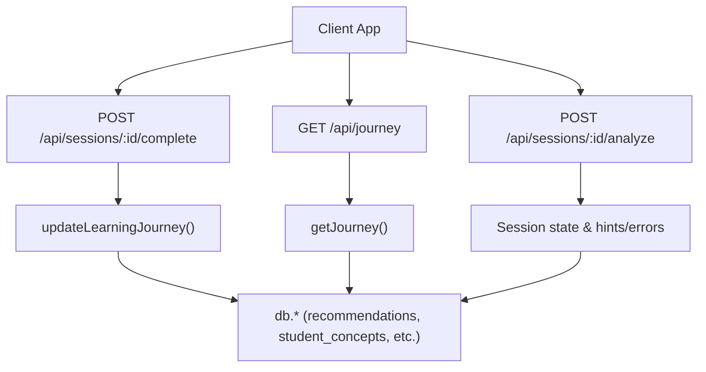
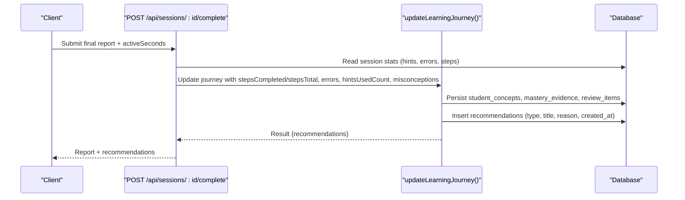
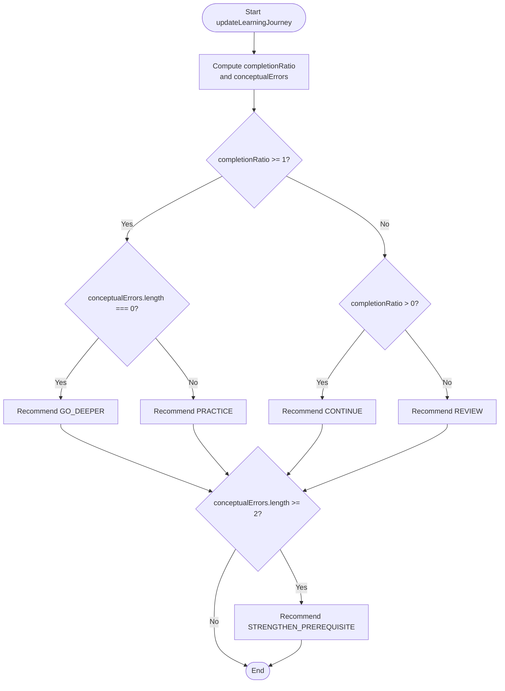
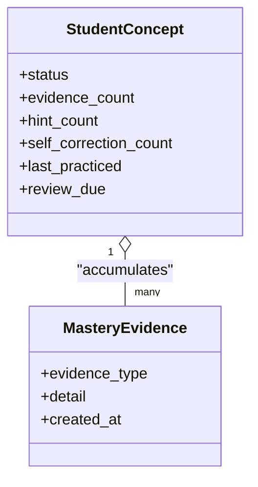
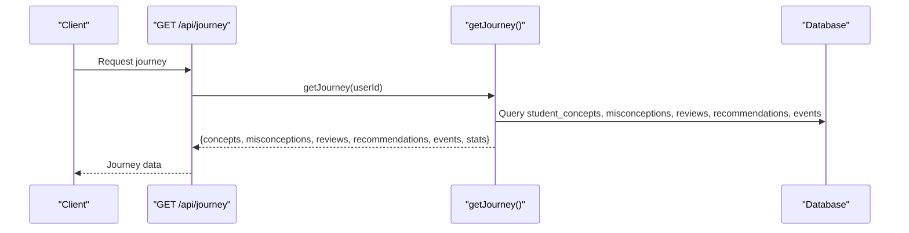
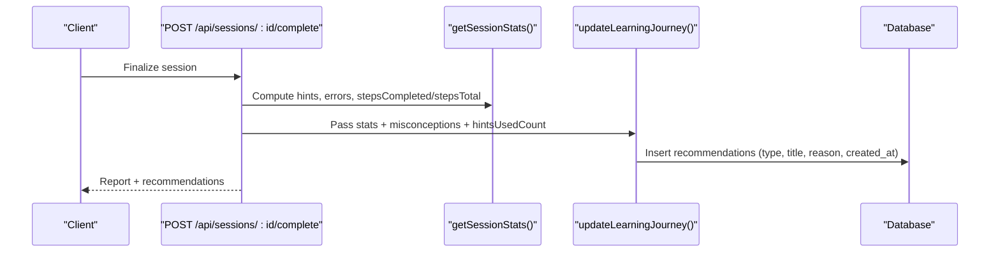
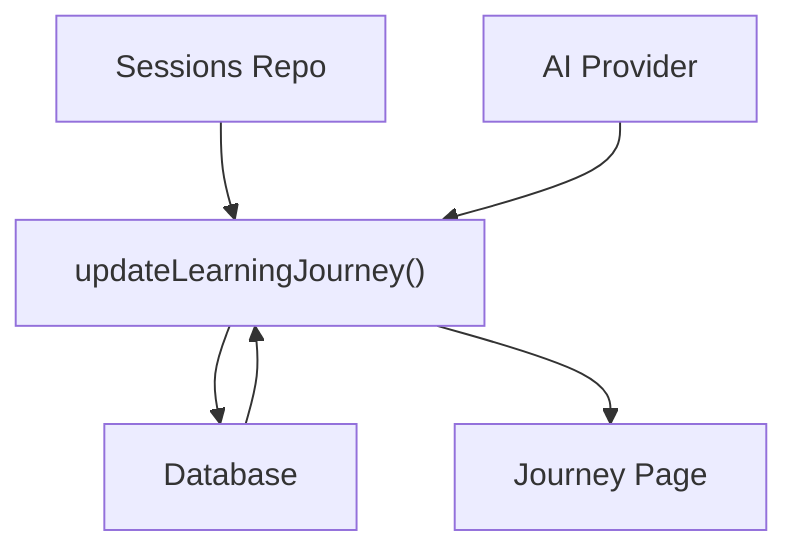

# Recommendation Engine

<cite>
**Referenced Files in This Document**
- [journey.ts](file://stepwise ai/app/lib/journey.ts)
- [types.ts](file://stepwise ai/app/lib/types.ts)
- [db.ts](file://stepwise ai/app/lib/db.ts)
- [route.ts (sessions complete)](file://stepwise ai/app/app/api/sessions/[id]/complete/route.ts)
- [route.ts (sessions analyze)](file://stepwise ai/app/app/api/sessions/[id]/analyze/route.ts)
- [route.ts (journey GET)](file://stepwise ai/app/app/api/journey/route.ts)
- [page.tsx (Journey UI)](file://stepwise ai/app/app/journey/page.tsx)
</cite>

## Table of Contents
1. [Introduction](#introduction)
2. [Project Structure](#project-structure)
3. [Core Components](#core-components)
4. [Architecture Overview](#architecture-overview)
5. [Detailed Component Analysis](#detailed-component-analysis)
6. [Dependency Analysis](#dependency-analysis)
7. [Performance Considerations](#performance-considerations)
8. [Troubleshooting Guide](#troubleshooting-guide)
9. [Conclusion](#conclusion)
10. [Appendices](#appendices)

## Introduction
This document explains the recommendation engine that generates personalized learning suggestions based on student performance and learning patterns. It covers:
- The four primary recommendation types: GO_DEEPER, PRACTICE, CONTINUE, and REVIEW
- The decision logic using completion ratios, conceptual error counts, hint usage, and concept mastery levels
- How recommendations are stored with type, title, reason, and timestamp for later retrieval
- The explainable nature of recommendations with human-readable reasons
- Examples for generating recommendations after session completion, retrieving current recommendations, and customizing algorithms
- Tracking and measuring recommendation effectiveness over time

## Project Structure
The recommendation engine is implemented as part of the Learning Journey system. Key files:
- Journey logic and recommendation generation: journey.ts
- Data model definitions: types.ts
- Database layer and tables: db.ts
- API endpoints to trigger updates and retrieve data: sessions complete/analyze routes and journey route
- UI that displays recommendations: Journey page

**Diagram sources**
- [route.ts (journey GET):1-17](file://stepwise ai/app/app/api/journey/route.ts#L1-L17)
- [route.ts (sessions complete):1-64](file://stepwise ai/app/app/api/sessions/[id]/complete/route.ts#L1-L64)
- [route.ts (sessions analyze):1-180](file://stepwise ai/app/app/api/sessions/[id]/analyze/route.ts#L1-L180)
- [journey.ts:59-262](file://stepwise ai/app/lib/journey.ts#L59-L262)
- [db.ts:23-44](file://stepwise ai/app/lib/db.ts#L23-L44)

**Section sources**
- [journey.ts:1-58](file://stepwise ai/app/lib/journey.ts#L1-L58)
- [db.ts:23-44](file://stepwise ai/app/lib/db.ts#L23-L44)
- [route.ts (journey GET):1-17](file://stepwise ai/app/app/api/journey/route.ts#L1-L17)

## Core Components
- updateLearningJourney(input): Computes concept status transitions and generates explainable recommendations based on session outcomes. Persists recommendations and related evidence.
- getJourney(userId): Reads the learner’s long-term map including concepts, misconceptions, reviews, and recent recommendations.
- Recommendations storage: Inserted into the recommendations table with user_id, type, title, reason, created_at.
- Types: RecommendationType includes CONTINUE, REVIEW, STRENGTHEN_PREREQUISITE, PRACTICE, GO_DEEPER, APPLY, EXPLORE, REST.

Key inputs to updateLearningJourney include stepsCompleted, stepsTotal, errors, selfCorrections, hintsUsedCount, and misconception descriptions. These drive both concept mastery and recommendation decisions.

**Section sources**
- [journey.ts:38-57](file://stepwise ai/app/lib/journey.ts#L38-L57)
- [journey.ts:59-262](file://stepwise ai/app/lib/journey.ts#L59-L262)
- [types.ts:179-193](file://stepwise ai/app/lib/types.ts#L179-L193)
- [db.ts:147-159](file://stepwise ai/app/lib/db.ts#L147-L159)

## Architecture Overview
The recommendation engine integrates with session lifecycle events:
- During a session, analyze tracks evaluations, errors, hints, and step progress.
- On session completion, the system computes stats and calls updateLearningJourney to persist concept states and generate recommendations.
- Clients can retrieve the latest recommendations via GET /api/journey.

**Diagram sources**
- [route.ts (sessions complete):1-64](file://stepwise ai/app/app/api/sessions/[id]/complete/route.ts#L1-L64)
- [journey.ts:59-262](file://stepwise ai/app/lib/journey.ts#L59-L262)
- [db.ts:147-159](file://stepwise ai/app/lib/db.ts#L147-L159)

## Detailed Component Analysis

### Recommendation Decision Logic
The engine determines one or more recommendations per session outcome:
- GO_DEEPER: When the student completed all steps and had no conceptual errors.
- PRACTICE: When the student completed all steps but used hints or had conceptual issues during the session.
- CONTINUE: When the student made partial progress (completionRatio > 0).
- REVIEW: When the student did not complete any steps (completionRatio == 0).
- STRENGTHEN_PREREQUISITE: Additional recommendation when there are two or more conceptual errors, indicating foundational gaps.

Inputs influencing decisions:
- completionRatio = stepsCompleted / stepsTotal
- conceptualErrors = errors filtered by category "CONCEPTUAL"
- hintsUsedCount influences mastery transitions and confidence
- selfCorrections influence mastery evidence and status progression

**Diagram sources**
- [journey.ts:59-262](file://stepwise ai/app/lib/journey.ts#L59-L262)

**Section sources**
- [journey.ts:59-262](file://stepwise ai/app/lib/journey.ts#L59-L262)

### Concept Mastery and Evidence
Concept mastery evolves through evidence accumulation:
- Full completion adds evidence; self-correction increases evidence delta.
- High mastery requires repeated varied evidence and limited hint use.
- Partial completion moves students to DEVELOPING or PARTIALLY_UNDERSTOOD depending on hints and prior status.
- Conceptual errors while incomplete push status to DEVELOPING.

**Diagram sources**
- [journey.ts:100-177](file://stepwise ai/app/lib/journey.ts#L100-L177)
- [db.ts:23-44](file://stepwise ai/app/lib/db.ts#L23-L44)

**Section sources**
- [journey.ts:100-177](file://stepwise ai/app/lib/journey.ts#L100-L177)

### Storage of Recommendations
Each generated recommendation is inserted into the recommendations table with:
- user_id
- type (from RecommendationType)
- title (human-friendly, truncated to safe length)
- reason (explainable rationale, truncated to safe length)
- created_at (timestamp)

Retrieval returns the most recent recommendations for a user, typically limited to a small number for display.

**Section sources**
- [journey.ts:234-242](file://stepwise ai/app/lib/journey.ts#L234-L242)
- [journey.ts:320-327](file://stepwise ai/app/lib/journey.ts#L320-L327)
- [db.ts:147-159](file://stepwise ai/app/lib/db.ts#L147-L159)

### Retrieving Current Recommendations
Clients call GET /api/journey to fetch the learner’s journey, which includes:
- Concepts and their statuses
- Misconceptions
- Pending reviews
- Recent recommendations
- Events and summary stats

**Diagram sources**
- [route.ts (journey GET):1-17](file://stepwise ai/app/app/api/journey/route.ts#L1-L17)
- [journey.ts:274-356](file://stepwise ai/app/lib/journey.ts#L274-L356)

**Section sources**
- [route.ts (journey GET):1-17](file://stepwise ai/app/app/api/journey/route.ts#L1-L17)
- [journey.ts:274-356](file://stepwise ai/app/lib/journey.ts#L274-L356)

### Example Workflows

#### Generate Recommendations After Session Completion
- POST /api/sessions/:id/complete collects session stats (hints, errors, steps), constructs a final report payload, and calls updateLearningJourney.
- updateLearningJourney computes completionRatio and conceptualErrors, then inserts recommendations into the database.

**Diagram sources**
- [route.ts (sessions complete):1-64](file://stepwise ai/app/app/api/sessions/[id]/complete/route.ts#L1-L64)
- [journey.ts:59-262](file://stepwise ai/app/lib/journey.ts#L59-L262)

**Section sources**
- [route.ts (sessions complete):1-64](file://stepwise ai/app/app/api/sessions/[id]/complete/route.ts#L1-L64)
- [journey.ts:59-262](file://stepwise ai/app/lib/journey.ts#L59-L262)

#### Retrieve Current Recommendations for a Student
- GET /api/journey returns the latest recommendations along with other journey data.

**Section sources**
- [route.ts (journey GET):1-17](file://stepwise ai/app/app/api/journey/route.ts#L1-L17)
- [journey.ts:274-356](file://stepwise ai/app/lib/journey.ts#L274-L356)

#### Customize Recommendation Algorithms
To customize how recommendations are generated:
- Adjust thresholds in updateLearningJourney for completionRatio, hintsUsedCount, and conceptualErrors.
- Add new recommendation types in types.ts and extend the decision logic in journey.ts.
- Ensure titles and reasons remain human-readable and aligned with pedagogical goals.

Example customization points:
- Modify the condition branches that select GO_DEEPER, PRACTICE, CONTINUE, REVIEW, and STRENGTHEN_PREREQUISITE.
- Introduce additional signals (e.g., time-on-task, difficulty level) to refine decisions.

**Section sources**
- [journey.ts:59-262](file://stepwise ai/app/lib/journey.ts#L59-L262)
- [types.ts:179-193](file://stepwise ai/app/lib/types.ts#L179-L193)

## Dependency Analysis
The recommendation engine depends on:
- Session analytics (hints, errors, steps) from the sessions repository
- AI evaluation results (errors, misconceptions) from the AI provider
- Database layer for persistence and retrieval
- Types for consistent modeling of recommendations and concept statuses

**Diagram sources**
- [route.ts (sessions analyze):1-180](file://stepwise ai/app/app/api/sessions/[id]/analyze/route.ts#L1-L180)
- [route.ts (sessions complete):1-64](file://stepwise ai/app/app/api/sessions/[id]/complete/route.ts#L1-L64)
- [journey.ts:59-262](file://stepwise ai/app/lib/journey.ts#L59-L262)
- [page.tsx (Journey UI):118-129](file://stepwise ai/app/app/journey/page.tsx#L118-L129)

**Section sources**
- [journey.ts:59-262](file://stepwise ai/app/lib/journey.ts#L59-L262)
- [db.ts:23-44](file://stepwise ai/app/lib/db.ts#L23-L44)

## Performance Considerations
- Recommendations are computed once per session completion, minimizing redundant calculations.
- Database writes are batched within transactions where applicable, ensuring consistency.
- Retrieval limits (e.g., slicing to recent items) keep UI responses fast.
- Truncation of title/reason fields prevents oversized records.

[No sources needed since this section provides general guidance]

## Troubleshooting Guide
Common issues and resolutions:
- No recommendations appearing: Verify that updateLearningJourney was called during session completion and that the recommendations table has entries for the user.
- Incorrect recommendation type: Check completionRatio calculation and whether conceptualErrors were correctly identified.
- Stale recommendations: Ensure the client retrieves fresh data via GET /api/journey after session completion.

Validation checks:
- Confirm that user_id matches the current authenticated user.
- Ensure timestamps are present for created_at.
- Validate that titles and reasons are non-empty and within size limits.

**Section sources**
- [journey.ts:234-242](file://stepwise ai/app/lib/journey.ts#L234-L242)
- [journey.ts:320-327](file://stepwise ai/app/lib/journey.ts#L320-L327)
- [route.ts (journey GET):1-17](file://stepwise ai/app/app/api/journey/route.ts#L1-L17)

## Conclusion
The recommendation engine provides personalized, explainable learning suggestions grounded in observable student behavior:
- GO_DEEPER rewards full completion without conceptual errors
- PRACTICE reinforces areas needing consolidation
- CONTINUE encourages continuation from the last progress point
- REVIEW supports starting fresh when stuck
- STRENGTHEN_PREREQUISITE addresses foundational gaps indicated by multiple conceptual errors

Recommendations are persisted with clear reasons and timestamps, enabling transparency and longitudinal tracking. The system integrates seamlessly with session analytics and the learning journey to support adaptive, evidence-based instruction.

[No sources needed since this section summarizes without analyzing specific files]

## Appendices

### A. Recommendation Types Reference
- CONTINUE: Encourages continuing from the last step reached
- REVIEW: Suggests revisiting material with smaller steps
- STRENGTHEN_PREREQUISITE: Indicates need to revisit earlier ideas due to conceptual errors
- PRACTICE: Recommends practice to consolidate understanding
- GO_DEEPER: Promotes deeper exploration after successful completion
- APPLY, EXPLORE, REST: Additional types defined for broader strategies

**Section sources**
- [types.ts:179-193](file://stepwise ai/app/lib/types.ts#L179-L193)

### B. Data Model Summary
- recommendations: Stores user-specific recommendations with type, title, reason, created_at
- student_concepts: Tracks concept mastery status, evidence count, hints, and review scheduling
- mastery_evidence: Records evidence supporting mastery transitions
- misconceptions: Tracks recurring misconceptions and their lifecycle

**Section sources**
- [db.ts:23-44](file://stepwise ai/app/lib/db.ts#L23-L44)
- [journey.ts:100-177](file://stepwise ai/app/lib/journey.ts#L100-L177)

### C. Effectiveness Tracking and Measurement
Effectiveness can be measured by correlating recommendations with subsequent learning outcomes:
- Track acceptance rates of recommended activities
- Monitor changes in concept status over time after receiving recommendations
- Analyze reduction in conceptual errors and hint usage following targeted recommendations
- Use learning_events and session completion metrics to assess impact

Implementation pointers:
- Leverage learning_events to record interactions with recommendations
- Periodically query student_concepts and errors to measure improvement
- Compare cohorts with and without specific recommendation strategies

**Section sources**
- [journey.ts:244-253](file://stepwise ai/app/lib/journey.ts#L244-L253)
- [journey.ts:329-356](file://stepwise ai/app/lib/journey.ts#L329-L356)