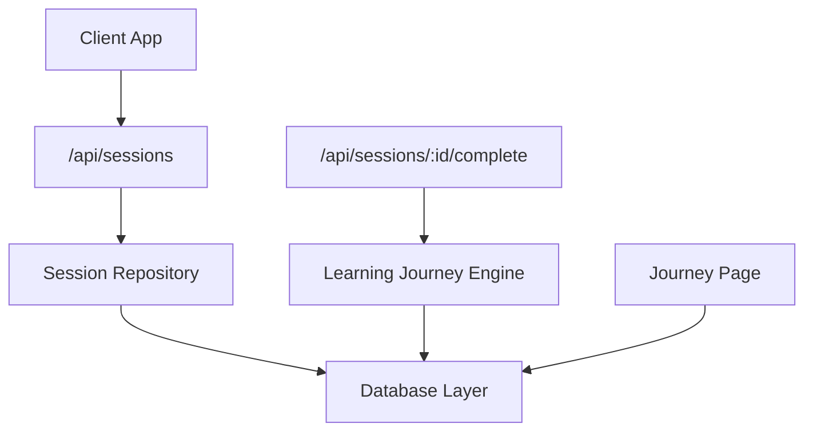
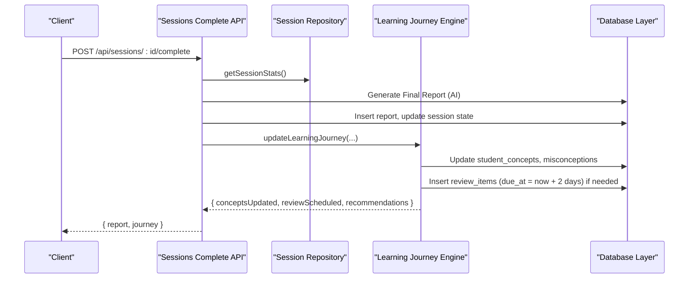
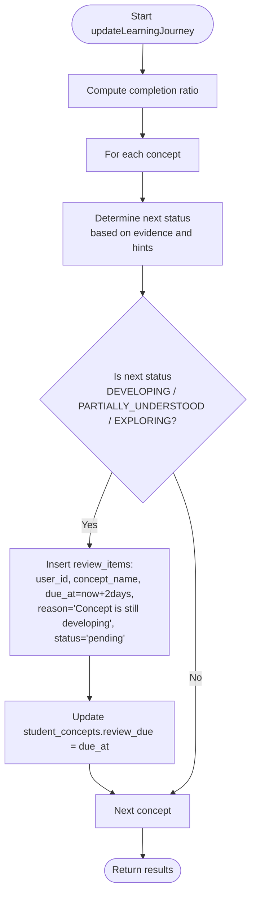
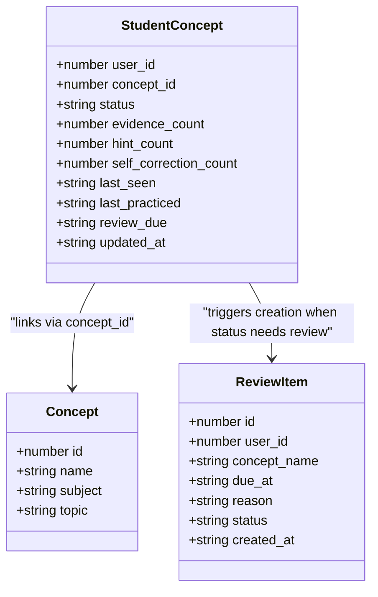
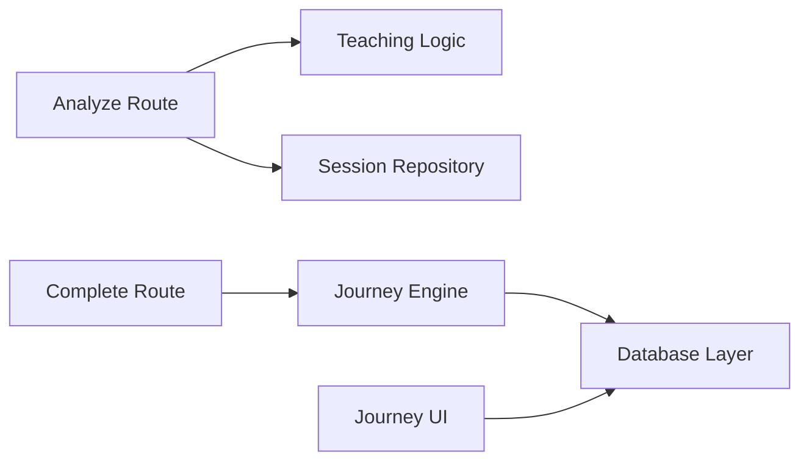

# Spaced Repetition System

<cite>
**Referenced Files in This Document**
- [journey.ts](file://stepwise ai/app/lib/journey.ts)
- [db.ts](file://stepwise ai/app/lib/db.ts)
- [types.ts](file://stepwise ai/app/lib/types.ts)
- [route.ts (sessions)](file://stepwise ai/app/app/api/sessions/route.ts)
- [route.ts (complete)](file://stepwise ai/app/app/api/sessions/[id]/complete/route.ts)
- [route.ts (analyze)](file://stepwise ai/app/app/api/sessions/[id]/analyze/route.ts)
- [page.tsx (journey UI)](file://stepwise ai/app/app/journey/page.tsx)
</cite>

## Table of Contents
1. [Introduction](#introduction)
2. [Project Structure](#project-structure)
3. [Core Components](#core-components)
4. [Architecture Overview](#architecture-overview)
5. [Detailed Component Analysis](#detailed-component-analysis)
6. [Dependency Analysis](#dependency-analysis)
7. [Performance Considerations](#performance-considerations)
8. [Troubleshooting Guide](#troubleshooting-guide)
9. [Conclusion](#conclusion)
10. [Appendices](#appendices)

## Introduction
This document explains the spaced repetition system that schedules review items to reinforce learning for concepts that are still developing, partially understood, or being explored. The system automatically creates due dates set to 2 days from the current session and integrates with concept mastery levels to ensure timely reinforcement. It also covers how reviews are tracked, completed, and rescheduled based on student performance, along with examples for querying upcoming reviews and analyzing effectiveness.

## Project Structure
The spaced repetition logic is implemented as part of the Learning Journey Engine and persists data through a lightweight database layer. Key areas:
- API routes orchestrate sessions and finalize them into reports and journey updates.
- The journey engine computes concept mastery states and schedules reviews.
- The database layer defines tables and provides transactional operations.
- The UI displays upcoming reviews for the user.

**Diagram sources**
- [route.ts (sessions):11-40](file://stepwise ai/app/app/api/sessions/route.ts#L11-L40)
- [route.ts (complete):15-118](file://stepwise ai/app/app/api/sessions/[id]/complete/route.ts#L15-L118)
- [journey.ts:59-261](file://stepwise ai/app/lib/journey.ts#L59-L261)
- [db.ts:23-44](file://stepwise ai/app/lib/db.ts#L23-L44)
- [page.tsx (journey UI):205-234](file://stepwise ai/app/app/journey/page.tsx#L205-L234)

**Section sources**
- [route.ts (sessions):11-40](file://stepwise ai/app/app/api/sessions/route.ts#L11-L40)
- [route.ts (complete):15-118](file://stepwise ai/app/app/api/sessions/[id]/complete/route.ts#L15-L118)
- [journey.ts:59-261](file://stepwise ai/app/lib/journey.ts#L59-L261)
- [db.ts:23-44](file://stepwise ai/app/lib/db.ts#L23-L44)
- [page.tsx (journey UI):205-234](file://stepwise ai/app/app/journey/page.tsx#L205-L234)

## Core Components
- Database layer: Declares all tables including review_items and provides atomic transactions and CRUD operations.
- Session lifecycle: Creates sessions, evaluates steps, and finalizes sessions with reports.
- Learning Journey Engine: Updates concept mastery, detects misconceptions, generates recommendations, and schedules spaced reviews.
- UI: Displays upcoming reviews and related context.

Key responsibilities:
- Scheduling: When a concept transitions to DEVELOPING, PARTIALLY_UNDERSTOOD, or EXPLORING, schedule a review item due in 2 days.
- Tracking: Persist review items with reason and status; update student_concepts with review_due timestamps.
- Reading: Query pending reviews ordered by due date for display.

**Section sources**
- [db.ts:23-44](file://stepwise ai/app/lib/db.ts#L23-L44)
- [journey.ts:100-196](file://stepwise ai/app/lib/journey.ts#L100-L196)
- [journey.ts:274-318](file://stepwise ai/app/lib/journey.ts#L274-L318)
- [page.tsx (journey UI):205-234](file://stepwise ai/app/app/journey/page.tsx#L205-L234)

## Architecture Overview
The spaced repetition flow begins when a session completes. The system finalizes the report, updates the learning journey, and schedules reviews for concepts that need reinforcement.

**Diagram sources**
- [route.ts (complete):15-118](file://stepwise ai/app/app/api/sessions/[id]/complete/route.ts#L15-L118)
- [journey.ts:59-261](file://stepwise ai/app/lib/journey.ts#L59-L261)
- [db.ts:183-194](file://stepwise ai/app/lib/db.ts#L183-L194)

## Detailed Component Analysis

### Spaced Review Scheduling Algorithm
The algorithm determines whether to schedule a review based on the next concept status after evaluating session performance. If the concept is still developing, partially understood, or exploring, it schedules a review item with a due date set to 2 days from now.

**Diagram sources**
- [journey.ts:100-196](file://stepwise ai/app/lib/journey.ts#L100-L196)

**Section sources**
- [journey.ts:100-196](file://stepwise ai/app/lib/journey.ts#L100-L196)

### Concept Mastery Integration
Concept mastery levels influence review scheduling. The system tracks concept status progression and uses evidence counts, hint usage, and self-corrections to determine mastery. Concepts in lower mastery states trigger automatic review scheduling.

**Diagram sources**
- [journey.ts:138-166](file://stepwise ai/app/lib/journey.ts#L138-L166)
- [journey.ts:179-196](file://stepwise ai/app/lib/journey.ts#L179-L196)
- [db.ts:23-44](file://stepwise ai/app/lib/db.ts#L23-L44)

**Section sources**
- [journey.ts:100-196](file://stepwise ai/app/lib/journey.ts#L100-L196)
- [types.ts:150-161](file://stepwise ai/app/lib/types.ts#L150-L161)

### Review Completion and Status Updates
While the codebase schedules and displays reviews, explicit completion endpoints for review_items are not present in the analyzed files. Reviews are currently read as pending items and displayed to users. Future enhancements can add completion endpoints to mark reviews as completed and adjust future intervals based on performance.

Current behavior:
- Reviews are inserted with status "pending".
- Pending reviews are queried and shown in the journey UI.
- No explicit completion endpoint was found in the analyzed routes.

**Section sources**
- [journey.ts:179-196](file://stepwise ai/app/lib/journey.ts#L179-L196)
- [journey.ts:310-318](file://stepwise ai/app/lib/journey.ts#L310-L318)
- [page.tsx (journey UI):205-234](file://stepwise ai/app/app/journey/page.tsx#L205-L234)

### Examples: Querying Upcoming Reviews
To retrieve upcoming reviews for a user, query pending review_items ordered by due date. The journey function demonstrates this pattern.

Example query pattern:
- Filter by user_id and status = "pending"
- Order by due_at ascending
- Limit to a reasonable number (e.g., 30)

This returns a list of concept_name, due_at, reason, and status for display.

**Section sources**
- [journey.ts:310-318](file://stepwise ai/app/lib/journey.ts#L310-L318)

### Analyzing Review Effectiveness
Effectiveness can be analyzed by correlating:
- Concept status changes over time
- Evidence counts and self-correction counts
- Hint usage patterns
- Misconception occurrences and resolution

The journey engine records mastery evidence and misconception lifecycles, which can be used to assess whether scheduled reviews improved understanding.

**Section sources**
- [journey.ts:168-177](file://stepwise ai/app/lib/journey.ts#L168-L177)
- [journey.ts:68-98](file://stepwise ai/app/lib/journey.ts#L68-L98)

## Dependency Analysis
The spaced repetition system depends on several modules:
- API routes depend on session repository and AI provider to evaluate and finalize sessions.
- Journey engine depends on database layer to persist concept states, misconceptions, and review items.
- UI depends on journey data to display upcoming reviews.

**Diagram sources**
- [route.ts (analyze):22-175](file://stepwise ai/app/app/api/sessions/[id]/analyze/route.ts#L22-L175)
- [route.ts (complete):15-118](file://stepwise ai/app/app/api/sessions/[id]/complete/route.ts#L15-L118)
- [journey.ts:59-261](file://stepwise ai/app/lib/journey.ts#L59-L261)
- [db.ts:23-44](file://stepwise ai/app/lib/db.ts#L23-L44)

**Section sources**
- [route.ts (analyze):22-175](file://stepwise ai/app/app/api/sessions/[id]/analyze/route.ts#L22-L175)
- [route.ts (complete):15-118](file://stepwise ai/app/app/api/sessions/[id]/complete/route.ts#L15-L118)
- [journey.ts:59-261](file://stepwise ai/app/lib/journey.ts#L59-L261)
- [db.ts:23-44](file://stepwise ai/app/lib/db.ts#L23-L44)

## Performance Considerations
- Transactions: All journey updates and review scheduling occur within a single transaction to ensure consistency and avoid partial state.
- Data limits: Queries slice results to limit memory usage (e.g., up to 30 reviews).
- Storage: The database layer writes atomically using temp file rename to prevent corruption during hot reloads.

[No sources needed since this section provides general guidance]

## Troubleshooting Guide
Common issues and resolutions:
- Missing reviews: Ensure concept status transitions include DEVELOPING, PARTIALLY_UNDERSTOOD, or EXPLORING to trigger review scheduling.
- Duplicate reports: The complete endpoint checks for existing reports to maintain idempotency.
- Session state errors: Validate step indices and session status before analysis.

**Section sources**
- [route.ts (complete):23-27](file://stepwise ai/app/app/api/sessions/[id]/complete/route.ts#L23-L27)
- [route.ts (analyze):38-41](file://stepwise ai/app/app/api/sessions/[id]/analyze/route.ts#L38-L41)

## Conclusion
The spaced repetition system integrates concept mastery tracking with automated review scheduling to reinforce learning for concepts that are still developing or partially understood. Reviews are scheduled 2 days after the triggering session and displayed to users. While explicit completion endpoints for reviews are not present in the analyzed code, the foundation supports future enhancements to track completion and adapt intervals based on individual performance patterns.

[No sources needed since this section summarizes without analyzing specific files]

## Appendices

### review_items Table Structure
Based on the codebase, the review_items table includes:
- id: auto-increment primary key
- user_id: links to the user
- concept_name: the concept needing review
- due_at: timestamp for when the review is due (set to 2 days from now)
- reason: explanation for why the review was scheduled
- status: tracking state (e.g., "pending")
- created_at: timestamp when the review item was created

**Section sources**
- [db.ts:23-44](file://stepwise ai/app/lib/db.ts#L23-L44)
- [journey.ts:179-196](file://stepwise ai/app/lib/journey.ts#L179-L196)

### Adaptive Scheduling Algorithm
The current implementation uses a fixed 2-day interval for reviews. An adaptive algorithm could adjust intervals based on:
- Individual retention rates
- Performance during reviews
- Historical concept mastery progression
- Hint usage and self-correction patterns

Future enhancements could implement variable intervals (e.g., increasing intervals for mastered concepts, shorter intervals for struggling concepts) while maintaining the core scheduling logic.

[No sources needed since this section discusses conceptual enhancements]