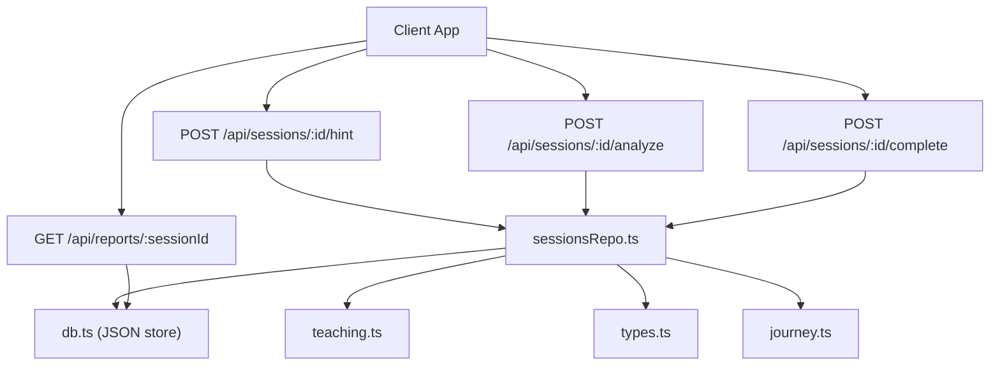
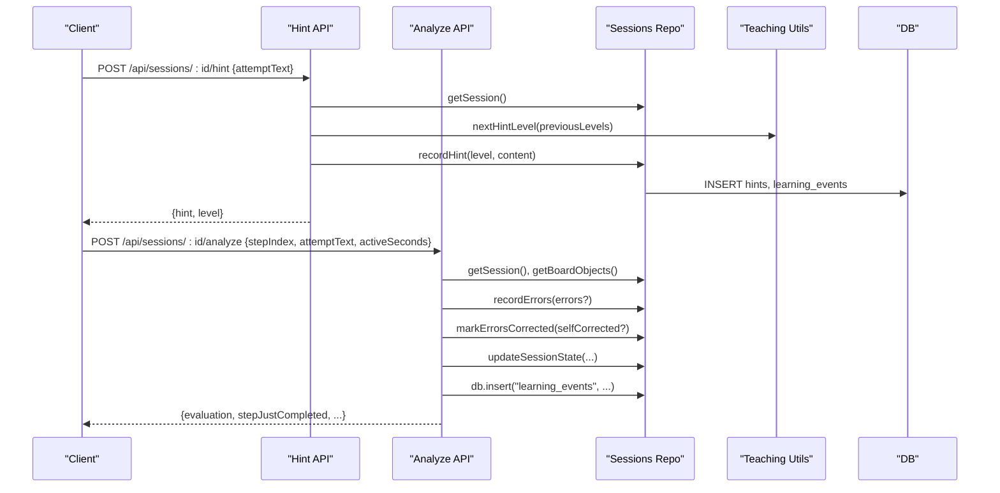
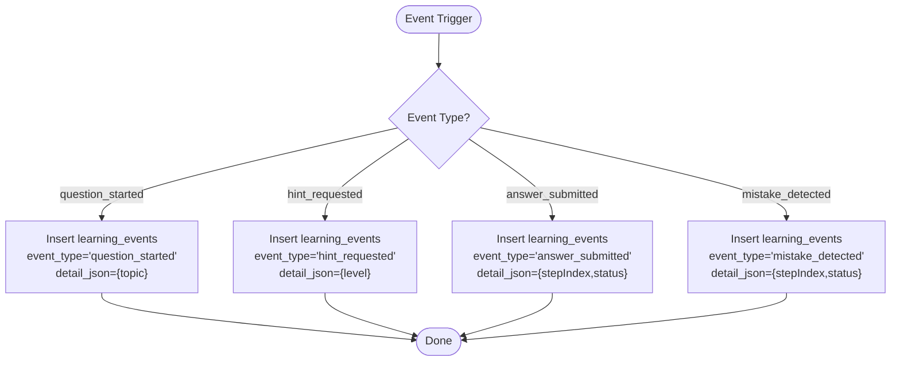
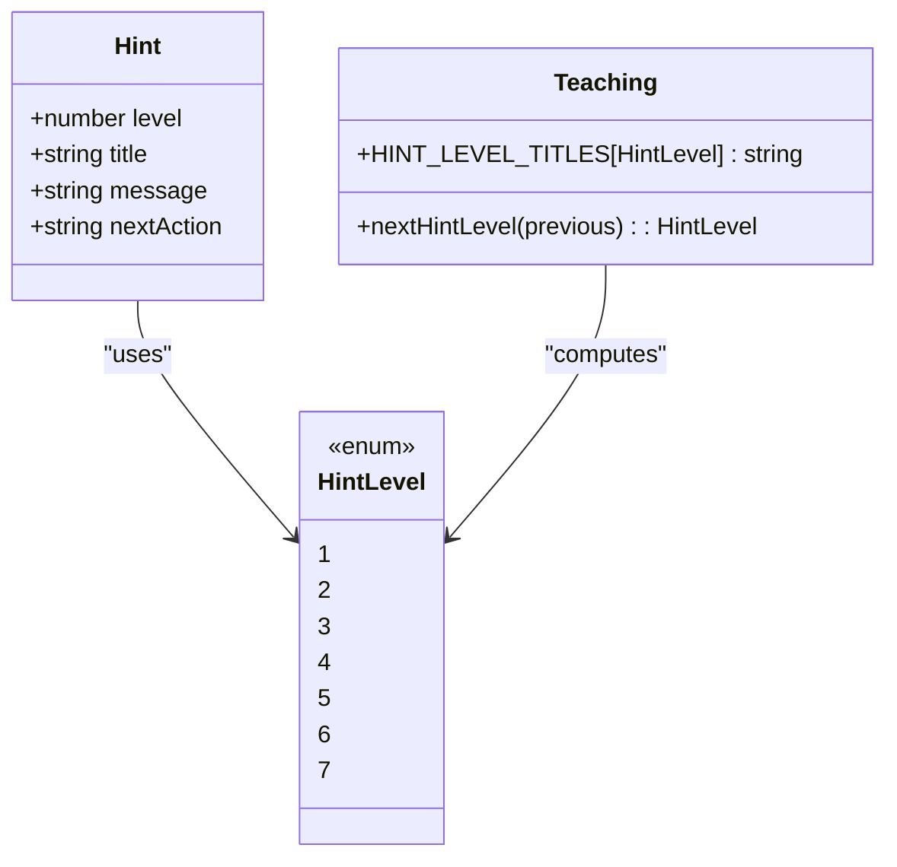
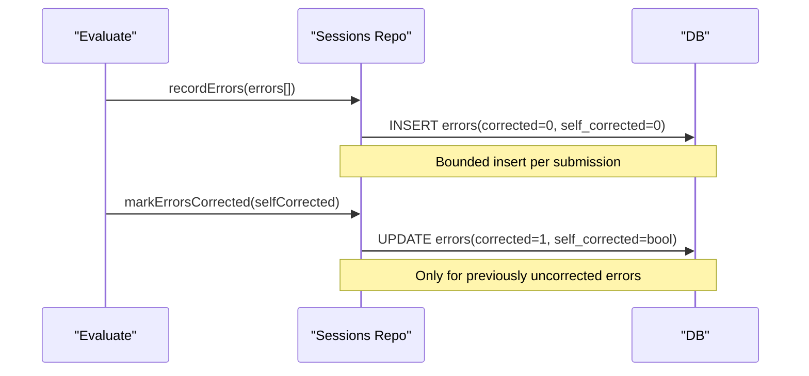
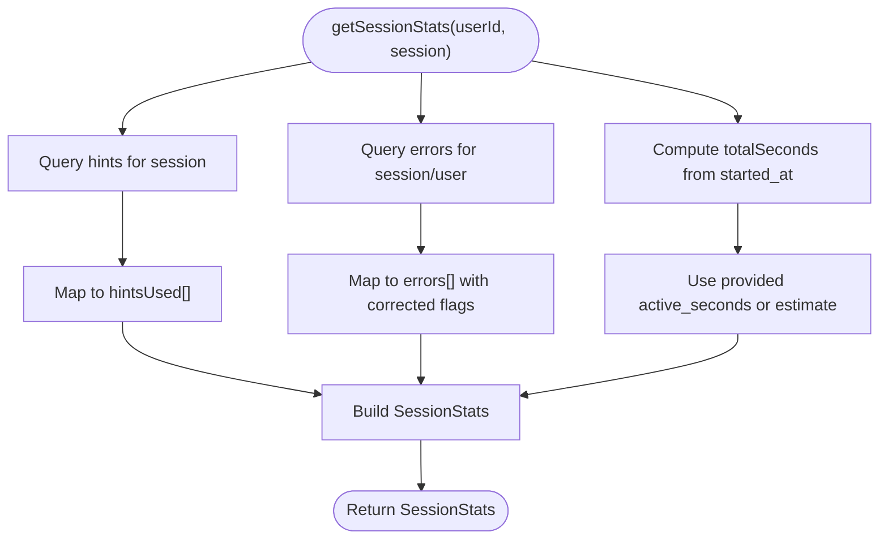
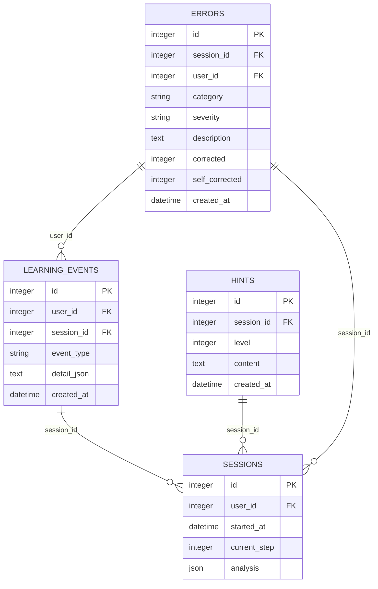
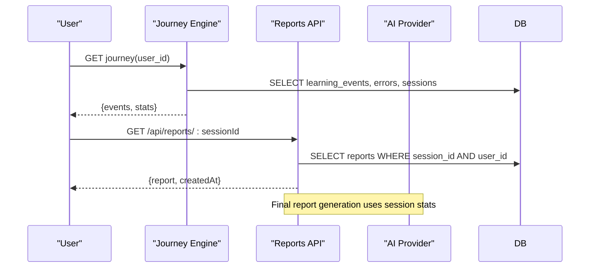
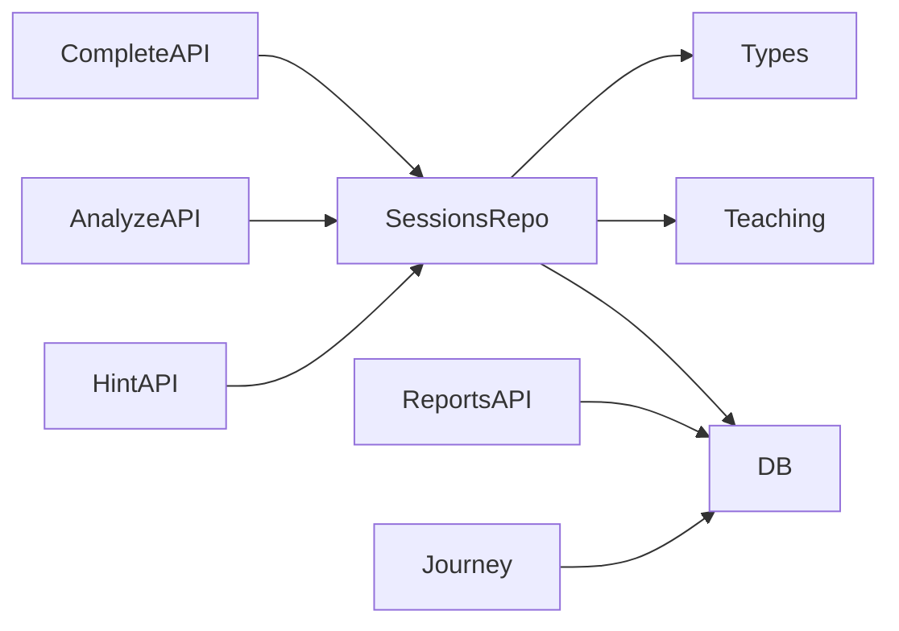

# Analytics and Learning Events

<cite>
**Referenced Files in This Document**
- [sessionsRepo.ts](file://stepwise ai/app/lib/sessionsRepo.ts)
- [types.ts](file://stepwise ai/app/lib/types.ts)
- [teaching.ts](file://stepwise ai/app/lib/teaching.ts)
- [db.ts](file://stepwise ai/app/lib/db.ts)
- [analyze route.ts](file://stepwise ai/app/app/api/sessions/[id]/analyze/route.ts)
- [hint route.ts](file://stepwise ai/app/app/api/sessions/[id]/hint/route.ts)
- [complete route.ts](file://stepwise ai/app/app/api/sessions/[id]/complete/route.ts)
- [journey.ts](file://stepwise ai/app/lib/journey.ts)
- [reports route.ts](file://stepwise ai/app/app/api/reports/[sessionId]/route.ts)
</cite>

## Table of Contents
1. [Introduction](#introduction)
2. [Project Structure](#project-structure)
3. [Core Components](#core-components)
4. [Architecture Overview](#architecture-overview)
5. [Detailed Component Analysis](#detailed-component-analysis)
6. [Dependency Analysis](#dependency-analysis)
7. [Performance Considerations](#performance-considerations)
8. [Troubleshooting Guide](#troubleshooting-guide)
9. [Conclusion](#conclusion)
10. [Appendices](#appendices)

## Introduction
This document explains the analytics and learning events tracking system used by session management. It covers how learning events are recorded for key milestones, how hints are tracked with escalating levels, how errors and self-corrections are monitored, and how session statistics are aggregated. It also documents data models, example queries and reports, privacy and retention considerations, and performance implications of high-frequency event logging.

## Project Structure
The analytics system spans repository layers:
- API routes capture user actions (hints, analysis submissions, completion) and persist events and metrics.
- The sessions repository centralizes persistence for sessions, hints, errors, and learning events.
- Types define domain models for hints, errors, evaluation results, and final reports.
- Teaching utilities implement hint escalation and intervention logic.
- The database layer provides a small relational-style store with transactional writes.

**Diagram sources**
- [hint route.ts:18-93](file://stepwise ai/app/app/api/sessions/[id]/hint/route.ts#L18-L93)
- [analyze route.ts:19-180](file://stepwise ai/app/app/api/sessions/[id]/analyze/route.ts#L19-L180)
- [complete route.ts:27-64](file://stepwise ai/app/app/api/sessions/[id]/complete/route.ts#L27-L64)
- [sessionsRepo.ts:314-398](file://stepwise ai/app/lib/sessionsRepo.ts#L314-L398)
- [teaching.ts:18-45](file://stepwise ai/app/lib/teaching.ts#L18-L45)
- [db.ts:23-44](file://stepwise ai/app/lib/db.ts#L23-L44)

**Section sources**
- [sessionsRepo.ts:1-399](file://stepwise ai/app/lib/sessionsRepo.ts#L1-L399)
- [db.ts:1-224](file://stepwise ai/app/lib/db.ts#L1-L224)

## Core Components
- Learning events: Persisted via the sessions repository when sessions start, hints are requested, answers are submitted, or mistakes are detected.
- Hint tracking: Escalating hint levels are computed and persisted; each request logs both a hint record and a learning event.
- Error tracking: Errors are recorded per submission; later corrections can be marked as self-corrected based on context.
- Session stats: Aggregates total time, active time, hints used, errors, and step progress for reporting and AI-generated insights.

Key responsibilities:
- Record learning events for question_started, hint_requested, answer_submitted, mistake_detected.
- Maintain hint ladder and escalate levels.
- Capture and update error correction status.
- Compute session-level metrics for downstream reporting.

**Section sources**
- [sessionsRepo.ts:106-112](file://stepwise ai/app/lib/sessionsRepo.ts#L106-L112)
- [sessionsRepo.ts:314-330](file://stepwise ai/app/lib/sessionsRepo.ts#L314-L330)
- [sessionsRepo.ts:332-361](file://stepwise ai/app/lib/sessionsRepo.ts#L332-L361)
- [sessionsRepo.ts:378-398](file://stepwise ai/app/lib/sessionsRepo.ts#L378-L398)
- [analyze route.ts:160-166](file://stepwise ai/app/app/api/sessions/[id]/analyze/route.ts#L160-L166)

## Architecture Overview
The flow from user action to analytics is:
- Hint requests compute the next level using teaching utilities, persist a hint and a learning event, and update session state.
- Analysis submissions evaluate student work, record errors if present, mark corrections when appropriate, and log learning events.
- Completion aggregates stats and generates a final report using the AI provider.

**Diagram sources**
- [hint route.ts:20-93](file://stepwise ai/app/app/api/sessions/[id]/hint/route.ts#L20-L93)
- [analyze route.ts:22-180](file://stepwise ai/app/app/api/sessions/[id]/analyze/route.ts#L22-L180)
- [sessionsRepo.ts:314-398](file://stepwise ai/app/lib/sessionsRepo.ts#L314-L398)
- [teaching.ts:41-45](file://stepwise ai/app/lib/teaching.ts#L41-L45)

## Detailed Component Analysis

### Learning Events Recording
Learning events are inserted at key milestones:
- question_started: When a new learning session is created.
- hint_requested: Each time a hint is requested, including the hint level.
- answer_submitted or mistake_detected: On each meaningful submission, depending on evaluation outcome.

These events include:
- user_id and session_id for ownership and grouping.
- event_type for categorization.
- detail_json for contextual metadata (e.g., topic, step index, status).
- created_at timestamp for temporal analysis.

**Diagram sources**
- [sessionsRepo.ts:106-112](file://stepwise ai/app/lib/sessionsRepo.ts#L106-L112)
- [sessionsRepo.ts:323-329](file://stepwise ai/app/lib/sessionsRepo.ts#L323-L329)
- [analyze route.ts:160-166](file://stepwise ai/app/app/api/sessions/[id]/analyze/route.ts#L160-L166)

**Section sources**
- [sessionsRepo.ts:106-112](file://stepwise ai/app/lib/sessionsRepo.ts#L106-L112)
- [sessionsRepo.ts:323-329](file://stepwise ai/app/lib/sessionsRepo.ts#L323-L329)
- [analyze route.ts:160-166](file://stepwise ai/app/app/api/sessions/[id]/analyze/route.ts#L160-L166)

### Hint Tracking System
Hints follow an escalating ladder:
- Levels range from 1 to 7, with titles indicating increasing specificity.
- The next level is derived from previous hints in the session, ensuring gradual support.
- Each hint request persists both a hint record and a learning event.

Relationship to difficulty progression:
- Higher hint levels indicate greater struggle or need for scaffolding.
- The sequence of hint levels informs adaptive strategies and mastery inference.

**Diagram sources**
- [types.ts:116-124](file://stepwise ai/app/lib/types.ts#L116-L124)
- [teaching.ts:18-45](file://stepwise ai/app/lib/teaching.ts#L18-L45)

**Section sources**
- [teaching.ts:18-45](file://stepwise ai/app/lib/teaching.ts#L18-L45)
- [hint route.ts:41-73](file://stepwise ai/app/app/api/sessions/[id]/hint/route.ts#L41-L73)
- [sessionsRepo.ts:314-330](file://stepwise ai/app/lib/sessionsRepo.ts#L314-L330)

### Error Tracking Mechanism
Errors are captured during evaluation:
- recordErrors stores up to a bounded number of errors per submission with category, severity, description, and flags for corrected/self_corrected.
- markErrorsCorrected updates uncorrected errors when the student improves without consuming a hint since the last error, marking self-correction accordingly.

Self-correction pattern:
- If no hints were consumed after an error and the subsequent evaluation shows improvement, errors are marked corrected and flagged as self-corrected.
- This evidence supports mastery inference and personalized recommendations.

**Diagram sources**
- [sessionsRepo.ts:332-361](file://stepwise ai/app/lib/sessionsRepo.ts#L332-L361)
- [analyze route.ts:90-112](file://stepwise ai/app/app/api/sessions/[id]/analyze/route.ts#L90-L112)

**Section sources**
- [sessionsRepo.ts:332-361](file://stepwise ai/app/lib/sessionsRepo.ts#L332-L361)
- [analyze route.ts:90-112](file://stepwise ai/app/app/api/sessions/[id]/analyze/route.ts#L90-L112)

### Session Statistics Aggregation
getSessionStats computes:
- totalSeconds: Elapsed time since session started.
- activeSeconds: Provided by client or estimated proportion of total time.
- hintsUsed: Array of hint levels used in the session.
- errors: List of errors with category, severity, description, and correction flags.
- stepsCompleted/stepsTotal: Progress through the question’s steps.

These metrics feed into final reports and adaptive learning decisions.

**Diagram sources**
- [sessionsRepo.ts:378-398](file://stepwise ai/app/lib/sessionsRepo.ts#L378-L398)

**Section sources**
- [sessionsRepo.ts:363-398](file://stepwise ai/app/lib/sessionsRepo.ts#L363-L398)

### Data Models
- Learning events: user_id, session_id, event_type, detail_json, created_at.
- Hints: session_id, level, content, created_at.
- Errors: session_id, user_id, category, severity, description, corrected, self_corrected, created_at.
- Session stats: totalSeconds, activeSeconds, hintsUsed[], errors[], stepsCompleted, stepsTotal.
- Evaluation and hints types: HintLevel enum, DetectedError structure, FinalReport fields.

**Diagram sources**
- [db.ts:23-44](file://stepwise ai/app/lib/db.ts#L23-L44)
- [sessionsRepo.ts:314-398](file://stepwise ai/app/lib/sessionsRepo.ts#L314-L398)
- [types.ts:80-124](file://stepwise ai/app/lib/types.ts#L80-L124)

**Section sources**
- [types.ts:80-124](file://stepwise ai/app/lib/types.ts#L80-L124)
- [sessionsRepo.ts:314-398](file://stepwise ai/app/lib/sessionsRepo.ts#L314-L398)
- [db.ts:23-44](file://stepwise ai/app/lib/db.ts#L23-L44)

### Example Queries and Reports
- Query recent learning events for a user:
  - Retrieve the latest events with event_type, created_at, and detail_json.
  - Use these to visualize activity timelines and milestone density.
- Generate session report:
  - Fetch session stats and pass them to the AI provider to produce a FinalReport including understanding progression, errors, self-corrections, and recommendations.
- Adaptive insights:
  - Use hint levels and error categories to adjust future interventions and review scheduling.

**Diagram sources**
- [journey.ts:329-356](file://stepwise ai/app/lib/journey.ts#L329-L356)
- [reports route.ts:8-20](file://stepwise ai/app/app/api/reports/[sessionId]/route.ts#L8-L20)
- [complete route.ts:27-64](file://stepwise ai/app/app/api/sessions/[id]/complete/route.ts#L27-L64)

**Section sources**
- [journey.ts:329-356](file://stepwise ai/app/lib/journey.ts#L329-L356)
- [reports route.ts:8-20](file://stepwise ai/app/app/api/reports/[sessionId]/route.ts#L8-L20)
- [complete route.ts:27-64](file://stepwise ai/app/app/api/sessions/[id]/complete/route.ts#L27-L64)

## Dependency Analysis
- API routes depend on sessionsRepo for persistence and teaching utilities for hint escalation and state transitions.
- SessionsRepo depends on db for all reads/writes and on types for domain contracts.
- Journey engine consumes learning_events and errors to update concept mastery and schedule reviews.
- Reports API retrieves stored reports scoped by user ownership.

**Diagram sources**
- [hint route.ts:1-93](file://stepwise ai/app/app/api/sessions/[id]/hint/route.ts#L1-L93)
- [analyze route.ts:1-180](file://stepwise ai/app/app/api/sessions/[id]/analyze/route.ts#L1-L180)
- [sessionsRepo.ts:1-399](file://stepwise ai/app/lib/sessionsRepo.ts#L1-L399)
- [journey.ts:1-356](file://stepwise ai/app/lib/journey.ts#L1-L356)

**Section sources**
- [hint route.ts:1-93](file://stepwise ai/app/app/api/sessions/[id]/hint/route.ts#L1-L93)
- [analyze route.ts:1-180](file://stepwise ai/app/app/api/sessions/[id]/analyze/route.ts#L1-L180)
- [sessionsRepo.ts:1-399](file://stepwise ai/app/lib/sessionsRepo.ts#L1-L399)
- [journey.ts:1-356](file://stepwise ai/app/lib/journey.ts#L1-L356)

## Performance Considerations
- High-frequency event logging:
  - Learning events and board events are written per meaningful interaction. Ensure batching or throttling at the client side to avoid excessive writes.
  - The database layer performs synchronous writes to a JSON file; frequent inserts may cause contention under concurrent dev instances.
- Bounding writes:
  - Errors are capped per submission to limit payload size and write volume.
  - Board snapshots are limited to a maximum number of objects.
- Transactional safety:
  - Multi-step operations use transactions to ensure consistency and reduce partial writes.
- Estimation fallbacks:
  - activeSeconds can be estimated if not provided, reducing reliance on precise client timing.

Recommendations:
- Throttle non-essential events to meaningful boundaries (e.g., per step submission rather than per keystroke).
- Use background jobs or queues for heavy analytics aggregation outside request paths.
- Monitor storage growth and consider archival or summarization policies for long-term retention.

[No sources needed since this section provides general guidance]

## Troubleshooting Guide
Common issues and resolutions:
- Missing learning events:
  - Verify that createLearningSession and analyze/hint routes call insertion functions.
  - Check that session ownership validation passes before writes.
- Incorrect hint levels:
  - Confirm previous hints are retrieved correctly and nextHintLevel is applied.
  - Validate that hint requests occur only in active sessions.
- Errors not marked corrected:
  - Ensure markErrorsCorrected is called after successful evaluations following errors and that hintsSinceLastError is accurate.
- Inaccurate session stats:
  - Confirm active_seconds is updated on meaningful interactions and that started_at is set on session creation.

**Section sources**
- [sessionsRepo.ts:106-112](file://stepwise ai/app/lib/sessionsRepo.ts#L106-L112)
- [hint route.ts:41-86](file://stepwise ai/app/app/api/sessions/[id]/hint/route.ts#L41-L86)
- [analyze route.ts:90-147](file://stepwise ai/app/app/api/sessions/[id]/analyze/route.ts#L90-L147)
- [sessionsRepo.ts:378-398](file://stepwise ai/app/lib/sessionsRepo.ts#L378-L398)

## Conclusion
The analytics and learning events system captures rich signals across sessions to support adaptive learning, mastery inference, and personalized feedback. By recording learning events, tracking hints with escalating levels, monitoring errors and self-corrections, and aggregating session statistics, the system enables actionable insights and robust reporting. Careful attention to privacy, retention, and performance ensures scalability and responsible data handling.

[No sources needed since this section summarizes without analyzing specific files]

## Appendices

### Privacy and Data Retention
- Ownership verification:
  - All reads and writes enforce user ownership (e.g., sessionsRepo checks user_id on lookups and updates).
- Data minimization:
  - Event payloads are structured and bounded; descriptions and contents are truncated to safe lengths.
- Retention policy:
  - No explicit expiration is implemented in the code; consider adding cleanup routines or archival strategies for long-lived datasets.
- User deletion:
  - Cascade deletion removes user-related tables including learning_events, errors, and other artifacts.

**Section sources**
- [sessionsRepo.ts:118-145](file://stepwise ai/app/lib/sessionsRepo.ts#L118-L145)
- [db.ts:201-224](file://stepwise ai/app/lib/db.ts#L201-L224)

### Using Insights for Adaptive Learning
- Concept mastery:
  - Journey engine updates concept statuses based on completion ratios, conceptual errors, and self-corrections.
- Recommendations:
  - Misconception lifecycle and review scheduling inform targeted practice and reinforcement.
- Reporting:
  - Final reports synthesize session stats, errors, and self-corrections into narrative insights and next steps.

**Section sources**
- [journey.ts:59-177](file://stepwise ai/app/lib/journey.ts#L59-L177)
- [journey.ts:247-260](file://stepwise ai/app/lib/journey.ts#L247-L260)
- [complete route.ts:27-64](file://stepwise ai/app/app/api/sessions/[id]/complete/route.ts#L27-L64)