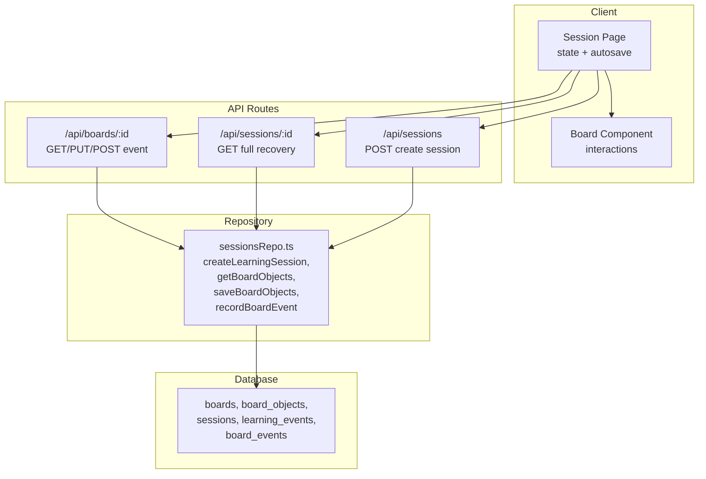
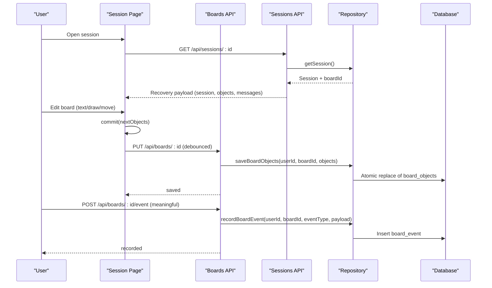
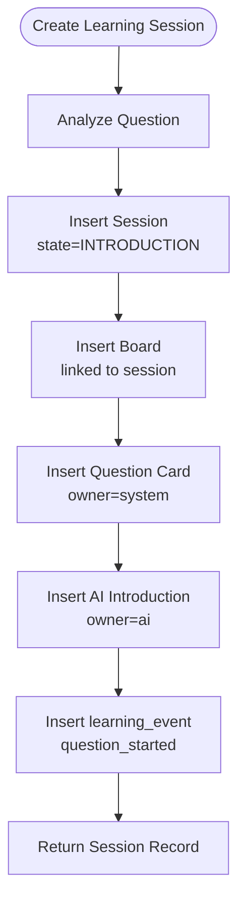
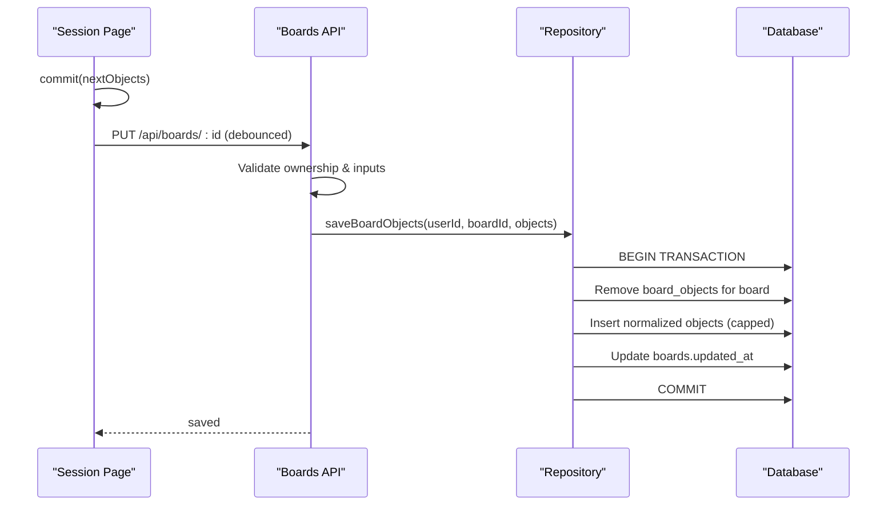
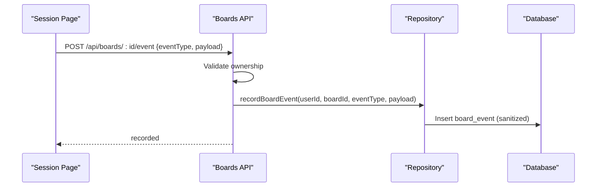
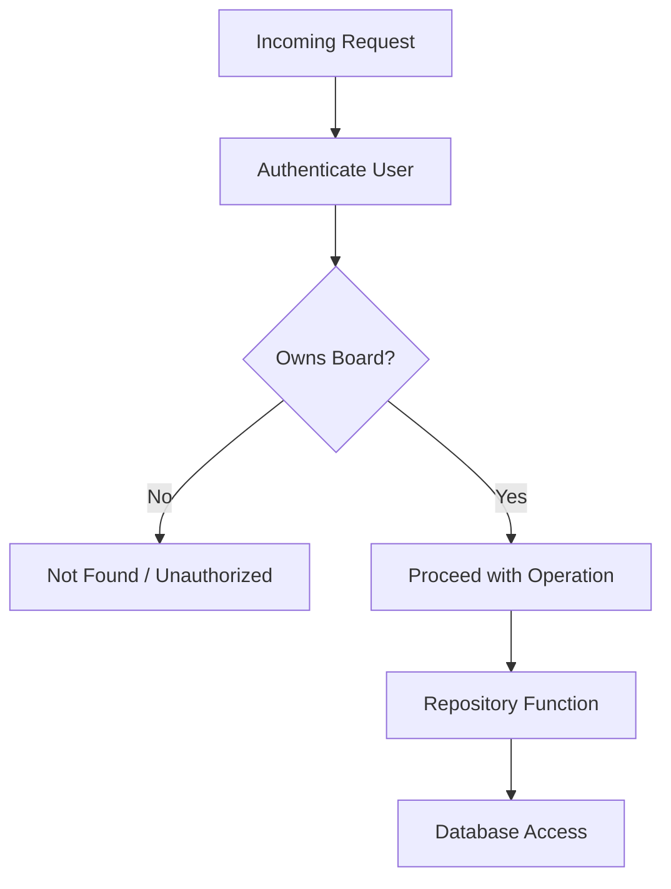
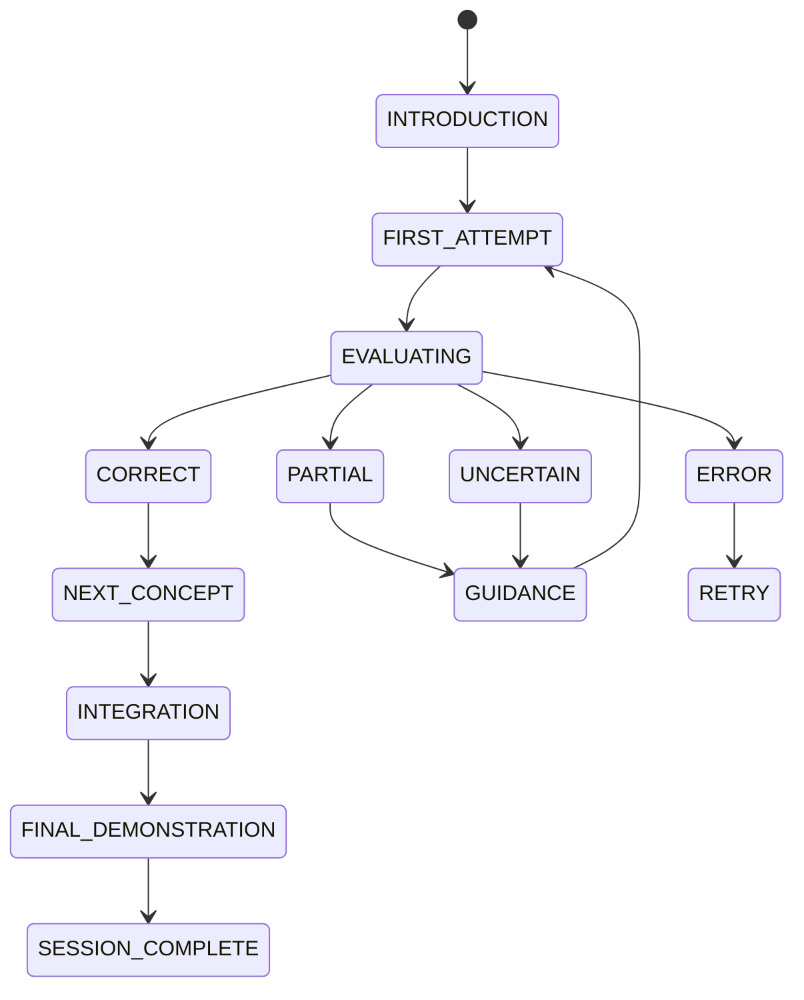
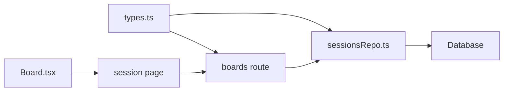

# Board Integration and Persistence

<cite>
**Referenced Files in This Document**
- [Board.tsx](file://stepwise ai/app/components/board/Board.tsx)
- [sessionsRepo.ts](file://stepwise ai/app/lib/sessionsRepo.ts)
- [types.ts](file://stepwise ai/app/lib/types.ts)
- [boards route](file://stepwise ai/app/app/api/boards/[id]/route.ts)
- [sessions route](file://stepwise ai/app/app/api/sessions/route.ts)
- [session page](file://stepwise ai/app/app/session/[id]/page.tsx)
</cite>

## Table of Contents
1. [Introduction](#introduction)
2. [Project Structure](#project-structure)
3. [Core Components](#core-components)
4. [Architecture Overview](#architecture-overview)
5. [Detailed Component Analysis](#detailed-component-analysis)
6. [Dependency Analysis](#dependency-analysis)
7. [Performance Considerations](#performance-considerations)
8. [Troubleshooting Guide](#troubleshooting-guide)
9. [Conclusion](#conclusion)

## Introduction
This document explains how the interactive board integrates with sessions, from board creation during session initialization to persistence, event recording, and alignment with the session state machine. It covers:
- How boards are created with a question card and AI introduction note
- The saveBoardObjects function for optimistic updates and atomic persistence
- The BoardObject data model fields and constraints
- Ownership and access control between boards and sessions
- Board event recording via recordBoardEvent
- Examples for saving snapshots, handling large states, and performance optimization
- Concurrent editing considerations, conflict resolution strategies, and versioning recommendations
- Integration with the session state machine to ensure board operations align with progression

## Project Structure
The board integration spans client components, API routes, and server-side repository logic:
- Client UI renders the board and handles user interactions, committing changes optimistically
- API routes enforce ownership, validate inputs, and delegate to repository functions
- Repository performs database transactions, persists board objects, and records events



**Diagram sources**
- [session page:77-130](file://stepwise ai/app/app/session/[id]/page.tsx#L77-L130)
- [boards route:28-105](file://stepwise ai/app/app/api/boards/[id]/route.ts#L28-L105)
- [sessions route:9-44](file://stepwise ai/app/app/api/sessions/route.ts#L9-L44)
- [sessionsRepo.ts:26-116](file://stepwise ai/app/lib/sessionsRepo.ts#L26-L116)
- [sessionsRepo.ts:198-282](file://stepwise ai/app/lib/sessionsRepo.ts#L198-L282)

**Section sources**
- [session page:77-130](file://stepwise ai/app/app/session/[id]/page.tsx#L77-L130)
- [boards route:28-105](file://stepwise ai/app/app/api/boards/[id]/route.ts#L28-L105)
- [sessions route:9-44](file://stepwise ai/app/app/api/sessions/route.ts#L9-L44)
- [sessionsRepo.ts:26-116](file://stepwise ai/app/lib/sessionsRepo.ts#L26-L116)
- [sessionsRepo.ts:198-282](file://stepwise ai/app/lib/sessionsRepo.ts#L198-L282)

## Core Components
- Board component: Renders the canvas, handles tools (select, text, draw, erase, pan), manages viewport, selection, editing, and emits commits through onCommit
- Session page: Loads session recovery payload, manages local object history (undo/redo), debounced autosave, and orchestrates teaching loop actions (check, hint, finish)
- API routes: Validate ownership, sanitize inputs, persist board snapshots, and record meaningful events
- Repository: Creates sessions with seeded board objects, retrieves and persists board objects atomically, and records board events

Key responsibilities:
- Board: User interaction and immediate UI updates; no direct DB writes
- Session page: Local state management, undo/redo, and debounced persistence
- API: Security checks, input validation, and delegation to repository
- Repository: Transactional persistence, ownership verification, and analytics/event logging

**Section sources**
- [Board.tsx:44-105](file://stepwise ai/app/components/board/Board.tsx#L44-L105)
- [session page:77-130](file://stepwise ai/app/app/session/[id]/page.tsx#L77-L130)
- [boards route:28-105](file://stepwise ai/app/app/api/boards/[id]/route.ts#L28-L105)
- [sessionsRepo.ts:26-116](file://stepwise ai/app/lib/sessionsRepo.ts#L26-L116)
- [sessionsRepo.ts:198-282](file://stepwise ai/app/lib/sessionsRepo.ts#L198-L282)

## Architecture Overview
The flow begins when a student starts a session. The system creates a session, seeds the board with a question card and AI introduction, and returns the board ID. The client loads the session, fetches board objects, and allows interactive edits. Edits are committed locally and persisted via an autosave mechanism that sends a full snapshot to the server. The server validates ownership, sanitizes inputs, and atomically replaces board objects. Meaningful board events can be recorded separately for analytics.



**Diagram sources**
- [sessions route:9-44](file://stepwise ai/app/app/api/sessions/route.ts#L9-L44)
- [sessionsRepo.ts:26-116](file://stepwise ai/app/lib/sessionsRepo.ts#L26-L116)
- [session page:77-130](file://stepwise ai/app/app/session/[id]/page.tsx#L77-L130)
- [boards route:28-105](file://stepwise ai/app/app/api/boards/[id]/route.ts#L28-L105)
- [sessionsRepo.ts:198-282](file://stepwise ai/app/lib/sessionsRepo.ts#L198-L282)

## Detailed Component Analysis

### Board Object Model
The BoardObject type defines the structure stored and rendered on the board:
- Identity and association: id, board_id
- Geometry: x, y, width, height, rotation, z_index
- Content and metadata: content (string), style (object), meta (object)
- Ownership and timestamps: owner (student, ai, system, imported), created_at, updated_at

Constraints and normalization occur at the API and repository layers:
- Input types and owners are validated against allowed sets
- Dimensions are clamped to safe ranges
- Content and JSON fields are truncated to limits
- IDs are sanitized to fixed length

```mermaid
classDiagram
class BoardObject {
+string id
+string board_id
+BoardObjectType type
+number x
+number y
+number width
+number height
+number rotation
+number z_index
+string content
+Record~string, unknown~ style
+Record~string, unknown~ meta
+Ownership owner
+string created_at
+string updated_at
}
class BoardObjectType {
<<enum>>
"text"
"handwriting"
"drawing"
"shape"
"connector"
"image"
"note"
"formula"
"annotation"
"visual"
}
class Ownership {
<<enum>>
"student"
"ai"
"system"
"imported"
}
BoardObject --> BoardObjectType : "uses"
BoardObject --> Ownership : "uses"
```

**Diagram sources**
- [types.ts:27-57](file://stepwise ai/app/lib/types.ts#L27-L57)

**Section sources**
- [types.ts:27-57](file://stepwise ai/app/lib/types.ts#L27-L57)
- [boards route:10-22](file://stepwise ai/app/app/api/boards/[id]/route.ts#L10-L22)
- [sessionsRepo.ts:206-233](file://stepwise ai/app/lib/sessionsRepo.ts#L206-L233)

### Session Initialization and Board Seeding
When a new session is created:
- A question is analyzed by the AI provider
- A session record is inserted with initial state INTRODUCTION
- A board is created linked to the session
- Two seed objects are inserted:
  - Question card: system-owned note with the question text and variant styling
  - AI introduction: ai-owned note with the generated introduction and variant styling
- A learning event is recorded indicating the question started



**Diagram sources**
- [sessionsRepo.ts:26-116](file://stepwise ai/app/lib/sessionsRepo.ts#L26-L116)

**Section sources**
- [sessionsRepo.ts:26-116](file://stepwise ai/app/lib/sessionsRepo.ts#L26-L116)

### Optimistic Updates and Atomic Persistence
The session page implements optimistic updates:
- Local state changes immediately via commit(next)
- Undo/Redo history is maintained in memory
- Autosave is debounced to reduce network load
- On flush, a full snapshot of objects is sent to the server

The server enforces ownership and sanitizes inputs before calling saveBoardObjects:
- Ownership check ensures the user owns the board
- Inputs are validated and normalized
- saveBoardObjects performs an atomic transaction:
  - Verifies ownership again
  - Removes existing board_objects for the board
  - Inserts up to a capped number of objects with normalized fields
  - Updates board updated_at timestamp



**Diagram sources**
- [session page:99-130](file://stepwise ai/app/app/session/[id]/page.tsx#L99-L130)
- [boards route:41-85](file://stepwise ai/app/app/api/boards/[id]/route.ts#L41-L85)
- [sessionsRepo.ts:239-265](file://stepwise ai/app/lib/sessionsRepo.ts#L239-L265)

**Section sources**
- [session page:99-130](file://stepwise ai/app/app/session/[id]/page.tsx#L99-L130)
- [boards route:41-85](file://stepwise ai/app/app/api/boards/[id]/route.ts#L41-L85)
- [sessionsRepo.ts:239-265](file://stepwise ai/app/lib/sessionsRepo.ts#L239-L265)

### Board Event Recording
Meaningful board events are recorded via a dedicated endpoint:
- The client posts an event type and payload
- The server verifies ownership and calls recordBoardEvent
- The repository inserts a board_event row with session linkage and sanitized fields



**Diagram sources**
- [boards route:87-105](file://stepwise ai/app/app/api/boards/[id]/route.ts#L87-L105)
- [sessionsRepo.ts:267-282](file://stepwise ai/app/lib/sessionsRepo.ts#L267-L282)

**Section sources**
- [boards route:87-105](file://stepwise ai/app/app/api/boards/[id]/route.ts#L87-L105)
- [sessionsRepo.ts:267-282](file://stepwise ai/app/lib/sessionsRepo.ts#L267-L282)

### Relationship Between Board Ownership and Session Ownership
Access control is enforced consistently:
- Every board operation checks that the board belongs to the authenticated user
- Sessions are also checked where applicable (e.g., adding AI messages)
- This ensures proper isolation and prevents unauthorized access across users



**Diagram sources**
- [boards route:24-35](file://stepwise ai/app/app/api/boards/[id]/route.ts#L24-L35)
- [sessionsRepo.ts:198-204](file://stepwise ai/app/lib/sessionsRepo.ts#L198-L204)
- [sessionsRepo.ts:239-243](file://stepwise ai/app/lib/sessionsRepo.ts#L239-L243)

**Section sources**
- [boards route:24-35](file://stepwise ai/app/app/api/boards/[id]/route.ts#L24-L35)
- [sessionsRepo.ts:198-204](file://stepwise ai/app/lib/sessionsRepo.ts#L198-L204)
- [sessionsRepo.ts:239-243](file://stepwise ai/app/lib/sessionsRepo.ts#L239-L243)

### Integration with Session State Machine
The session state machine governs progression:
- New sessions start in INTRODUCTION
- The session page tracks steps completed and current step
- Teaching loop actions (check, hint, finish) update state and progress
- Board operations should align with session progression (e.g., read-only mode when completed)



**Diagram sources**
- [types.ts:7-24](file://stepwise ai/app/lib/types.ts#L7-L24)
- [sessionsRepo.ts:45-57](file://stepwise ai/app/lib/sessionsRepo.ts#L45-L57)
- [session page:189-261](file://stepwise ai/app/app/session/[id]/page.tsx#L189-L261)

**Section sources**
- [types.ts:7-24](file://stepwise ai/app/lib/types.ts#L7-L24)
- [sessionsRepo.ts:45-57](file://stepwise ai/app/lib/sessionsRepo.ts#L45-L57)
- [session page:189-261](file://stepwise ai/app/app/session/[id]/page.tsx#L189-L261)

## Dependency Analysis
The board integration depends on clear boundaries:
- Client components depend on API endpoints for persistence and events
- API routes depend on repository functions for data access
- Repository functions depend on database operations and shared types



**Diagram sources**
- [types.ts:27-57](file://stepwise ai/app/lib/types.ts#L27-L57)
- [sessionsRepo.ts:198-282](file://stepwise ai/app/lib/sessionsRepo.ts#L198-L282)
- [boards route:28-105](file://stepwise ai/app/app/api/boards/[id]/route.ts#L28-L105)
- [session page:77-130](file://stepwise ai/app/app/session/[id]/page.tsx#L77-L130)
- [Board.tsx:44-105](file://stepwise ai/app/components/board/Board.tsx#L44-L105)

**Section sources**
- [types.ts:27-57](file://stepwise ai/app/lib/types.ts#L27-L57)
- [sessionsRepo.ts:198-282](file://stepwise ai/app/lib/sessionsRepo.ts#L198-L282)
- [boards route:28-105](file://stepwise ai/app/app/api/boards/[id]/route.ts#L28-L105)
- [session page:77-130](file://stepwise ai/app/app/session/[id]/page.tsx#L77-L130)
- [Board.tsx:44-105](file://stepwise ai/app/components/board/Board.tsx#L44-L105)

## Performance Considerations
- Debounced autosave reduces network overhead while preserving responsiveness
- Server caps the number of objects per save to prevent excessive payloads
- Dimensions and content are clamped/truncated to protect storage and rendering
- Sorting by z_index ensures correct layering without expensive computations on each render
- Undo/Redo history is bounded to avoid unbounded memory growth

Recommendations:
- Keep autosave interval tuned to balance latency and throughput
- Monitor object count and consider pagination or lazy loading for very large boards
- Use incremental diffs if concurrent editing becomes a requirement
- Offload heavy rendering tasks to Web Workers if needed

[No sources needed since this section provides general guidance]

## Troubleshooting Guide
Common issues and resolutions:
- Save failures: Check network connectivity and server availability; review save status indicators
- Not found errors: Ensure the board belongs to the authenticated user; verify board ID correctness
- Invalid inputs: Confirm object types and owners match allowed sets; check content length limits
- Stale state: Refresh the session to recover full state including board objects and messages

Debugging tips:
- Inspect browser console for API errors
- Verify board ownership checks in API logs
- Review board events for anomalies using the event endpoint

**Section sources**
- [boards route:41-85](file://stepwise ai/app/app/api/boards/[id]/route.ts#L41-L85)
- [boards route:87-105](file://stepwise ai/app/app/api/boards/[id]/route.ts#L87-L105)
- [session page:99-130](file://stepwise ai/app/app/session/[id]/page.tsx#L99-L130)

## Conclusion
The board integration provides a robust, secure, and performant system for interactive learning:
- Boards are initialized with meaningful context (question card and AI introduction)
- Optimistic updates deliver responsive UX while ensuring data integrity through atomic persistence
- Ownership checks enforce strict access control aligned with session ownership
- Event recording supports analytics and debugging
- The design aligns board operations with the session state machine for coherent progression

For future enhancements:
- Implement conflict resolution strategies (e.g., operational transforms or CRDTs) for concurrent editing
- Add explicit versioning to support rollbacks and audit trails
- Optimize large board handling with virtualization and chunked saves
- Expand event schema for richer telemetry

[No sources needed since this section summarizes without analyzing specific files]