# Session Lifecycle Management

<cite>
**Referenced Files in This Document**
- [sessionsRepo.ts](file://app/lib/sessionsRepo.ts)
- [types.ts](file://app/lib/types.ts)
- [db.ts](file://app/lib/db.ts)
- [auth.ts](file://app/lib/auth.ts)
- [sessions route.ts](file://app/app/api/sessions/route.ts)
- [session GET route.ts](file://app/app/api/sessions/[id]/route.ts)
- [analyze route.ts](file://app/app/api/sessions/[id]/analyze/route.ts)
- [hint route.ts](file://app/app/api/sessions/[id]/hint/route.ts)
- [complete route.ts](file://app/app/api/sessions/[id]/complete/route.ts)
</cite>

## Table of Contents
1. Introduction
2. Project Structure
3. Core Components
4. Architecture Overview
5. Detailed Component Analysis
6. Dependency Analysis
7. Performance Considerations
8. Troubleshooting Guide
9. Conclusion

## Introduction
This document explains StepWise AI’s session lifecycle management system, focusing on how a user question becomes a fully initialized learning session, how sessions transition through states, and how data integrity and ownership are enforced throughout the process. It covers the createLearningSession function, the session state machine, the SessionRecord data model, board seeding with initial objects, status management, and end-to-end API flows for creation, analysis, hints, and completion.

## Project Structure
The session lifecycle spans Next.js API routes (controllers), a repository layer for data access, shared domain types, and an embedded database abstraction. Ownership verification is enforced at every boundary by requiring the authenticated user ID alongside resource IDs.

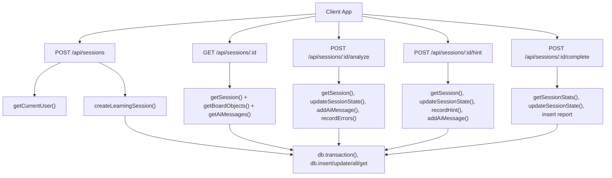

**Diagram sources**
- [sessions route.ts:11-43](file://app/app/api/sessions/route.ts#L11-L43)
- [session GET route.ts:11-49](file://app/app/api/sessions/[id]/route.ts#L11-L49)
- [analyze route.ts:22-179](file://app/app/api/sessions/[id]/analyze/route.ts#L22-L179)
- [hint route.ts:20-92](file://app/app/api/sessions/[id]/hint/route.ts#L20-L92)
- [complete route.ts:15-123](file://app/app/api/sessions/[id]/complete/route.ts#L15-L123)
- [sessionsRepo.ts:26-116](file://app/lib/sessionsRepo.ts#L26-L116)
- [db.ts:183-194](file://app/lib/db.ts#L183-L194)

**Section sources**
- [sessions route.ts:11-43](file://app/app/api/sessions/route.ts#L11-L43)
- [session GET route.ts:11-49](file://app/app/api/sessions/[id]/route.ts#L11-L49)
- [analyze route.ts:22-179](file://app/app/api/sessions/[id]/analyze/route.ts#L22-L179)
- [hint route.ts:20-92](file://app/app/api/sessions/[id]/hint/route.ts#L20-L92)
- [complete route.ts:15-123](file://app/app/api/sessions/[id]/complete/route.ts#L15-L123)
- [sessionsRepo.ts:26-116](file://app/lib/sessionsRepo.ts#L26-L116)
- [db.ts:183-194](file://app/lib/db.ts#L183-L194)

## Core Components
- Session creation pipeline: The POST /api/sessions endpoint authenticates the user, validates input, analyzes the question via the AI provider, and creates a new session with associated question, board, and initial board objects.
- Repository layer: Centralizes all data operations with strict ownership checks (user_id filters) and atomic transactions to ensure consistency.
- Domain types: Define the session state machine, board object model, evaluation and feedback structures, and reporting models.
- Database abstraction: Provides a relational-style interface over an embedded JSON store with transaction support and safe persistence.

Key responsibilities:
- Authentication and ownership verification at API boundaries.
- Atomic multi-step writes during session creation and completion.
- State transitions driven by AI evaluation results and explicit completion.
- Board seeding with a question card and AI introduction note.

**Section sources**
- [sessions route.ts:11-43](file://app/app/api/sessions/route.ts#L11-L43)
- [sessionsRepo.ts:26-116](file://app/lib/sessionsRepo.ts#L26-L116)
- [types.ts:6-24](file://app/lib/types.ts#L6-L24)
- [db.ts:183-194](file://app/lib/db.ts#L183-L194)

## Architecture Overview
The session lifecycle is orchestrated by API routes that delegate to the repository layer. Each operation verifies ownership using the authenticated user ID before reading or mutating resources. Transactions guarantee atomicity for multi-step writes such as creating a session with its question, board, and initial objects.

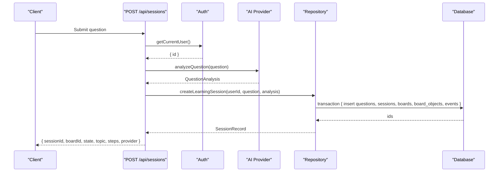

**Diagram sources**
- [sessions route.ts:11-43](file://app/app/api/sessions/route.ts#L11-L43)
- [auth.ts:78-102](file://app/lib/auth.ts#L78-L102)
- [sessionsRepo.ts:26-116](file://app/lib/sessionsRepo.ts#L26-L116)
- [db.ts:183-194](file://app/lib/db.ts#L183-L194)

## Detailed Component Analysis

### Session Creation Flow
- Input validation: The request body is parsed and validated; empty or too-short questions are rejected early.
- AI analysis: The question is analyzed to produce intent, topic, difficulty, steps, and an introductory message. If clarification is needed, the client is instructed to ask for more details instead of creating a session.
- Session initialization: createLearningSession performs an atomic transaction that:
  - Inserts a question record linked to the user.
  - Creates a session with initial state INTRODUCTION and status active.
  - Creates a board tied to the session and user.
  - Seeds two board objects:
    - A system-owned note containing the original question text.
    - An AI-owned note containing the generated introduction.
  - Records a learning event marking the start of the session.
- Response: Returns identifiers and metadata required to render the board and guide the student.

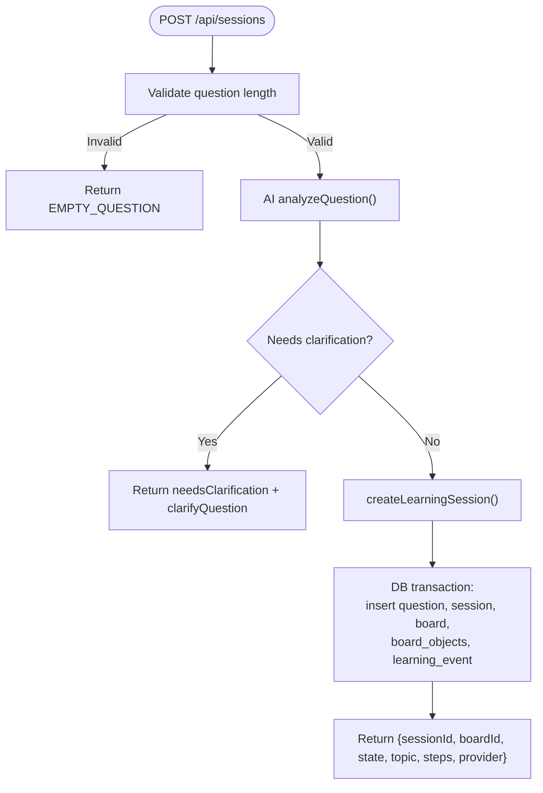

**Diagram sources**
- [sessions route.ts:11-43](file://app/app/api/sessions/route.ts#L11-L43)
- [sessionsRepo.ts:26-116](file://app/lib/sessionsRepo.ts#L26-L116)

**Section sources**
- [sessions route.ts:11-43](file://app/app/api/sessions/route.ts#L11-L43)
- [sessionsRepo.ts:26-116](file://app/lib/sessionsRepo.ts#L26-L116)

### Session Data Model and Validation Rules
- SessionRecord fields:
  - id: numeric session identifier.
  - user_id: owner of the session.
  - question_id: reference to the stored question.
  - started_at, ended_at: timestamps for session duration.
  - active_seconds: tracked active time.
  - status: operational status ("active", "completed").
  - current_step: index of the current step in the analysis.steps array.
  - state: enum from SessionState describing the phase of the session.
  - state_json: serialized runtime state (e.g., stepsCompleted, failedChecks, selfCorrections).
  - question_text: normalized question text used for display.
  - analysis: structured QuestionAnalysis including steps and introduction.
  - board_id, board_title: link to the visual board and its title.
- Validation and safety:
  - Text fields are truncated to safe lengths when inserted.
  - JSON fields are safely parsed with fallbacks to empty objects where appropriate.
  - Ownership checks require matching user_id on reads and updates.

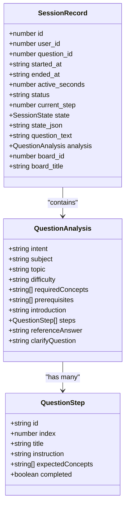

**Diagram sources**
- [sessionsRepo.ts:9-24](file://app/lib/sessionsRepo.ts#L9-L24)
- [types.ts:127-147](file://app/lib/types.ts#L127-L147)

**Section sources**
- [sessionsRepo.ts:9-24](file://app/lib/sessionsRepo.ts#L9-L24)
- [types.ts:127-147](file://app/lib/types.ts#L127-L147)

### Session State Machine
- States include QUESTION_RECEIVED, QUESTION_ANALYZED, LEARNING_BLUEPRINT_CREATED, INTRODUCTION, FIRST_ATTEMPT, EVALUATING, CORRECT, PARTIAL, ERROR, UNCERTAIN, GUIDANCE, RETRY, CONCEPT_CHECK, NEXT_CONCEPT, INTEGRATION, FINAL_DEMONSTRATION, SESSION_COMPLETE.
- Transitions:
  - Creation initializes state to INTRODUCTION with status active.
  - Evaluation drives transitions between FIRST_ATTEMPT/EVALUATING/CORRECT/PARTIAL/ERROR/UNCERTAIN/GUIDANCE/RETRY based on AI evaluation outcomes.
  - When all steps are completed, the session moves to INTEGRATION and then to SESSION_COMPLETE upon finalization.
  - Status transitions: active -> completed when finalized.

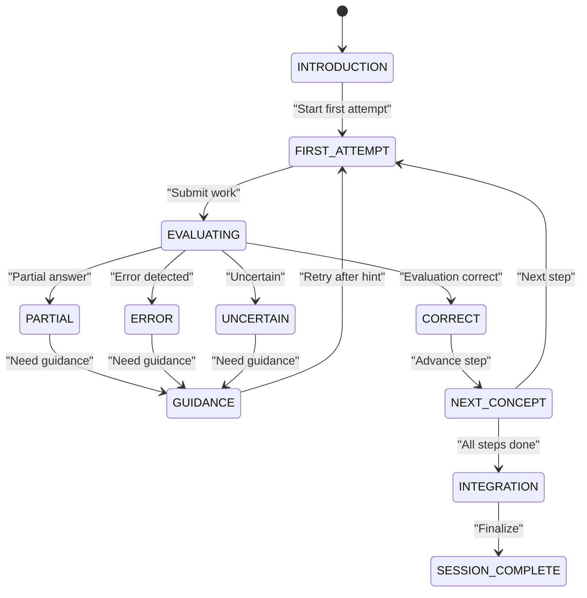

**Diagram sources**
- [types.ts:6-24](file://app/lib/types.ts#L6-L24)
- [sessionsRepo.ts:26-116](file://app/lib/sessionsRepo.ts#L26-L116)
- [analyze route.ts:114-147](file://app/app/api/sessions/[id]/analyze/route.ts#L114-L147)
- [complete route.ts:76-98](file://app/app/api/sessions/[id]/complete/route.ts#L76-L98)

**Section sources**
- [types.ts:6-24](file://app/lib/types.ts#L6-L24)
- [analyze route.ts:114-147](file://app/app/api/sessions/[id]/analyze/route.ts#L114-L147)
- [complete route.ts:76-98](file://app/app/api/sessions/[id]/complete/route.ts#L76-L98)

### Board Seeding and Initial Objects
- On session creation, two board objects are seeded:
  - A system-owned note displaying the original question.
  - An AI-owned note containing the generated introduction.
- These objects anchor the board UI and provide context for subsequent interactions.

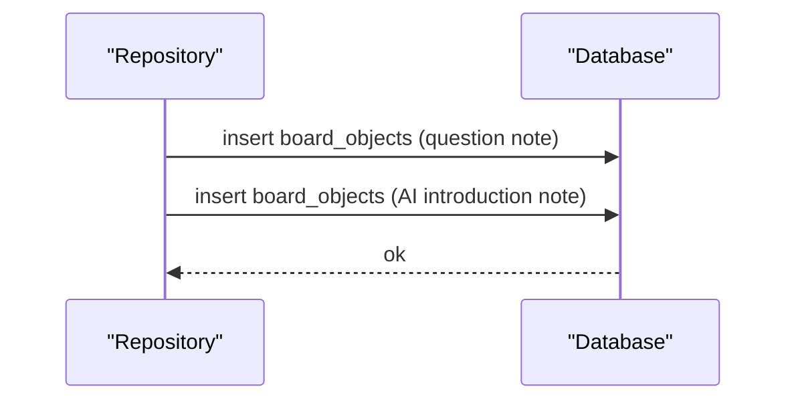

**Diagram sources**
- [sessionsRepo.ts:70-104](file://app/lib/sessionsRepo.ts#L70-L104)

**Section sources**
- [sessionsRepo.ts:70-104](file://app/lib/sessionsRepo.ts#L70-L104)

### Session Status Management
- Active state: Sessions begin with status "active" and state "INTRODUCTION".
- Completed state: Finalization sets status "completed" and state "SESSION_COMPLETE".
- Error handling: Errors during evaluation are recorded and can influence state transitions to GUIDANCE or RETRY.

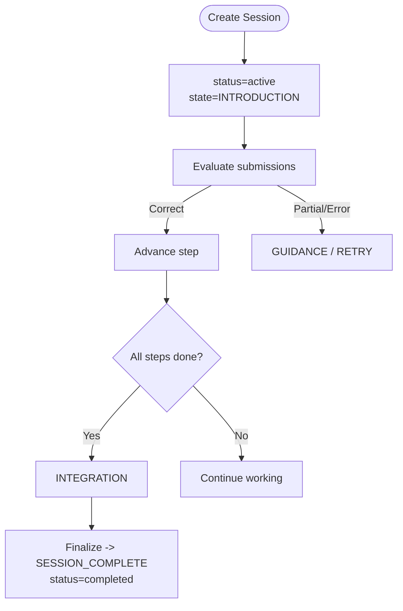

**Diagram sources**
- [sessionsRepo.ts:26-116](file://app/lib/sessionsRepo.ts#L26-L116)
- [analyze route.ts:114-147](file://app/app/api/sessions/[id]/analyze/route.ts#L114-L147)
- [complete route.ts:76-98](file://app/app/api/sessions/[id]/complete/route.ts#L76-L98)

**Section sources**
- [sessionsRepo.ts:26-116](file://app/lib/sessionsRepo.ts#L26-L116)
- [analyze route.ts:114-147](file://app/app/api/sessions/[id]/analyze/route.ts#L114-L147)
- [complete route.ts:76-98](file://app/app/api/sessions/[id]/complete/route.ts#L76-L98)

### Programmatic Session Creation and Metadata Handling
- Creating a session programmatically involves calling createLearningSession with the authenticated user ID, the question text, and the AI-generated analysis. The function returns a SessionRecord suitable for rendering the board and guiding the student.
- Metadata handling includes:
  - Storing analysis JSON and parsing it safely on retrieval.
  - Tracking runtime state in state_json (stepsCompleted, failedChecks, selfCorrections).
  - Recording learning events for analytics and reporting.

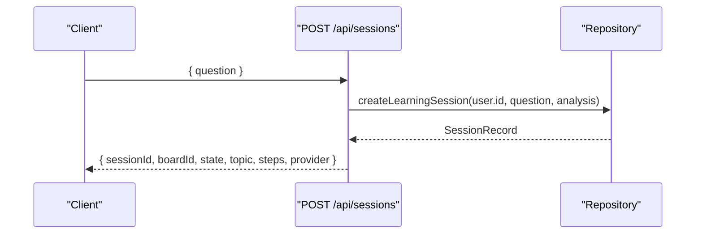

**Diagram sources**
- [sessions route.ts:11-43](file://app/app/api/sessions/route.ts#L11-L43)
- [sessionsRepo.ts:26-116](file://app/lib/sessionsRepo.ts#L26-L116)

**Section sources**
- [sessions route.ts:11-43](file://app/app/api/sessions/route.ts#L11-L43)
- [sessionsRepo.ts:26-116](file://app/lib/sessionsRepo.ts#L26-L116)

### Concurrent Session Handling and Ownership Verification
- Ownership verification: Every read/write operation requires both the resource ID and the authenticated user ID, ensuring users cannot access or modify others’ sessions or boards.
- Concurrency safety: The database layer uses transactions to buffer changes and commit atomically, preventing partial writes across multiple tables during session creation and completion.
- Idempotency: Completion generates a report only once per session; repeated calls return the existing report without duplication.

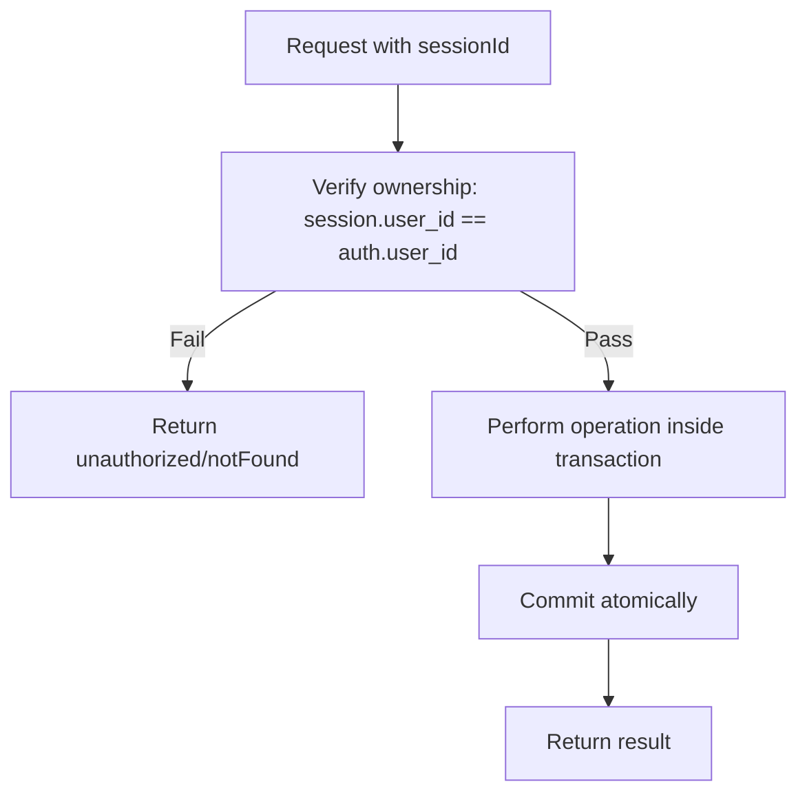

**Diagram sources**
- [sessionsRepo.ts:118-146](file://app/lib/sessionsRepo.ts#L118-L146)
- [db.ts:183-194](file://app/lib/db.ts#L183-L194)
- [complete route.ts:23-27](file://app/app/api/sessions/[id]/complete/route.ts#L23-L27)

**Section sources**
- [sessionsRepo.ts:118-146](file://app/lib/sessionsRepo.ts#L118-L146)
- [db.ts:183-194](file://app/lib/db.ts#L183-L194)
- [complete route.ts:23-27](file://app/app/api/sessions/[id]/complete/route.ts#L23-L27)

### Evaluation, Hints, and Completion Flows
- Evaluation: Submissions trigger AI evaluation; errors are recorded, corrections are tracked, and state transitions occur based on outcomes.
- Hints: Escalating hints are generated and persisted; consuming a hint after an error affects independence tracking for self-correction.
- Completion: Finalization generates a report, updates session state to completed, records learning events, and updates the learning journey atomically.

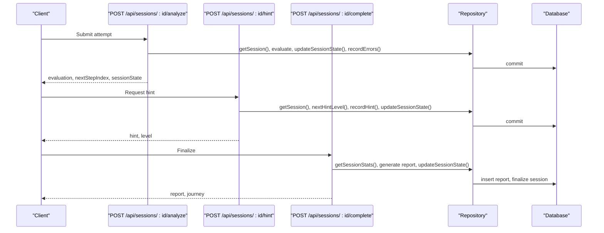

**Diagram sources**
- [analyze route.ts:22-179](file://app/app/api/sessions/[id]/analyze/route.ts#L22-L179)
- [hint route.ts:20-92](file://app/app/api/sessions/[id]/hint/route.ts#L20-L92)
- [complete route.ts:15-123](file://app/app/api/sessions/[id]/complete/route.ts#L15-L123)
- [sessionsRepo.ts:176-195](file://app/lib/sessionsRepo.ts#L176-L195)
- [sessionsRepo.ts:314-330](file://app/lib/sessionsRepo.ts#L314-L330)
- [sessionsRepo.ts:378-398](file://app/lib/sessionsRepo.ts#L378-L398)

**Section sources**
- [analyze route.ts:22-179](file://app/app/api/sessions/[id]/analyze/route.ts#L22-L179)
- [hint route.ts:20-92](file://app/app/api/sessions/[id]/hint/route.ts#L20-L92)
- [complete route.ts:15-123](file://app/app/api/sessions/[id]/complete/route.ts#L15-L123)
- [sessionsRepo.ts:176-195](file://app/lib/sessionsRepo.ts#L176-L195)
- [sessionsRepo.ts:314-330](file://app/lib/sessionsRepo.ts#L314-L330)
- [sessionsRepo.ts:378-398](file://app/lib/sessionsRepo.ts#L378-L398)

## Dependency Analysis
- API routes depend on authentication utilities to obtain the current user and enforce ownership.
- Repository functions depend on the database abstraction for safe, transactional operations.
- Domain types define contracts for AI providers, evaluation contexts, and reports, ensuring consistent data flow across components.

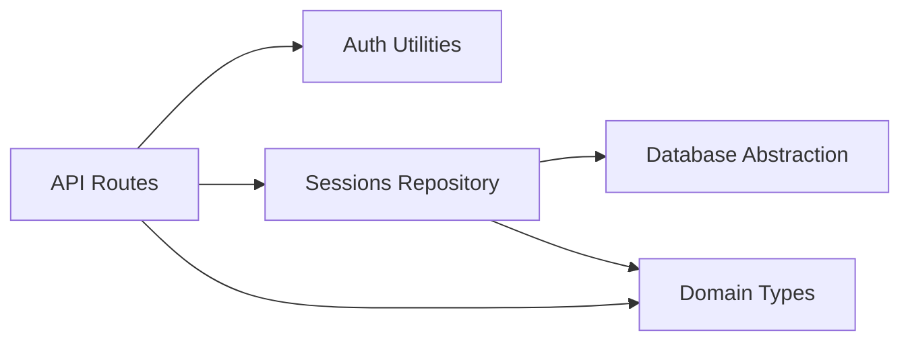

**Diagram sources**
- [sessions route.ts:11-43](file://app/app/api/sessions/route.ts#L11-L43)
- [auth.ts:78-102](file://app/lib/auth.ts#L78-L102)
- [sessionsRepo.ts:26-116](file://app/lib/sessionsRepo.ts#L26-L116)
- [db.ts:183-194](file://app/lib/db.ts#L183-L194)
- [types.ts:6-24](file://app/lib/types.ts#L6-L24)

**Section sources**
- [sessions route.ts:11-43](file://app/app/api/sessions/route.ts#L11-L43)
- [auth.ts:78-102](file://app/lib/auth.ts#L78-L102)
- [sessionsRepo.ts:26-116](file://app/lib/sessionsRepo.ts#L26-L116)
- [db.ts:183-194](file://app/lib/db.ts#L183-L194)
- [types.ts:6-24](file://app/lib/types.ts#L6-L24)

## Performance Considerations
- Use transactions to batch writes and reduce disk I/O during session creation and completion.
- Limit payload sizes for board objects and content to prevent oversized storage entries.
- Avoid per-keystroke evaluations; submit meaningful changes to minimize AI calls and database writes.
- Cache frequently accessed metadata (e.g., profiles) within the same request scope if needed.

[No sources needed since this section provides general guidance]

## Troubleshooting Guide
- Unauthorized or not found: Ensure the authenticated user matches the resource’s user_id; verify session existence before operations.
- Empty or invalid inputs: Validate question length and step indices; handle missing or malformed JSON gracefully.
- Duplicate reports: Completion is idempotent; repeated calls return the existing report without generating duplicates.
- State inconsistencies: Inspect state_json for stepsCompleted, failedChecks, and selfCorrections; ensure updates are applied within transactions.

**Section sources**
- [session GET route.ts:11-49](file://app/app/api/sessions/[id]/route.ts#L11-L49)
- [analyze route.ts:22-179](file://app/app/api/sessions/[id]/analyze/route.ts#L22-L179)
- [complete route.ts:23-27](file://app/app/api/sessions/[id]/complete/route.ts#L23-L27)

## Conclusion
StepWise AI’s session lifecycle management ensures robust, secure, and consistent handling of learning sessions from creation to completion. Ownership verification, transactional writes, and clear state transitions provide a reliable foundation for interactive learning experiences. The design supports scalable evaluation, hinting, and reporting while maintaining data integrity and performance.

[No sources needed since this section summarizes without analyzing specific files]