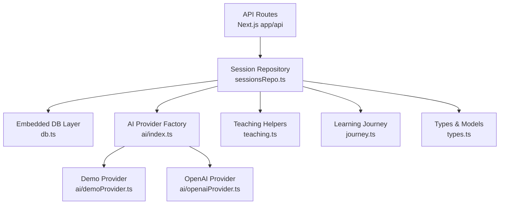
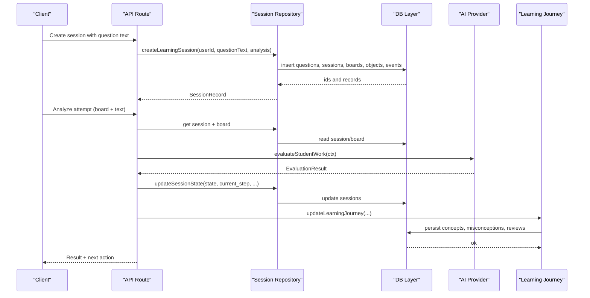
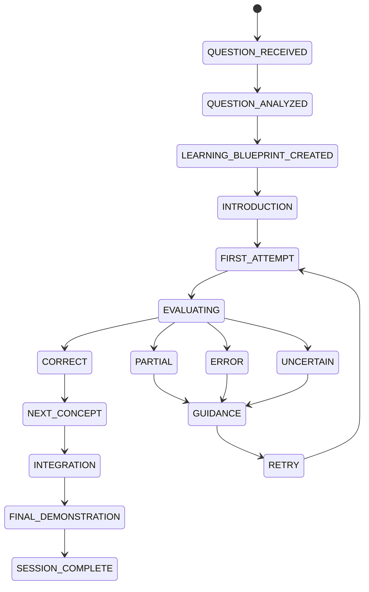
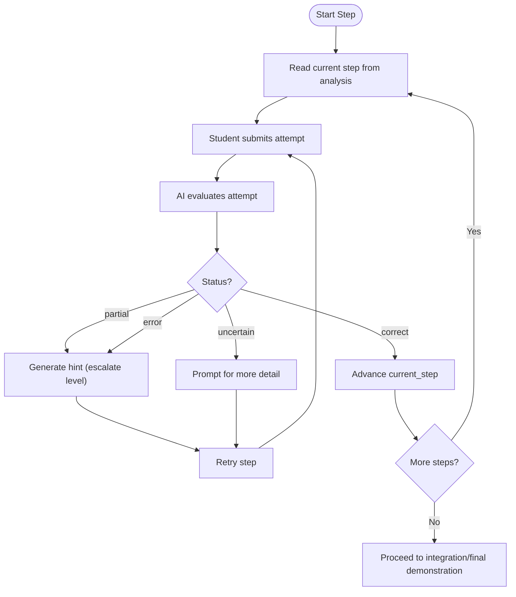
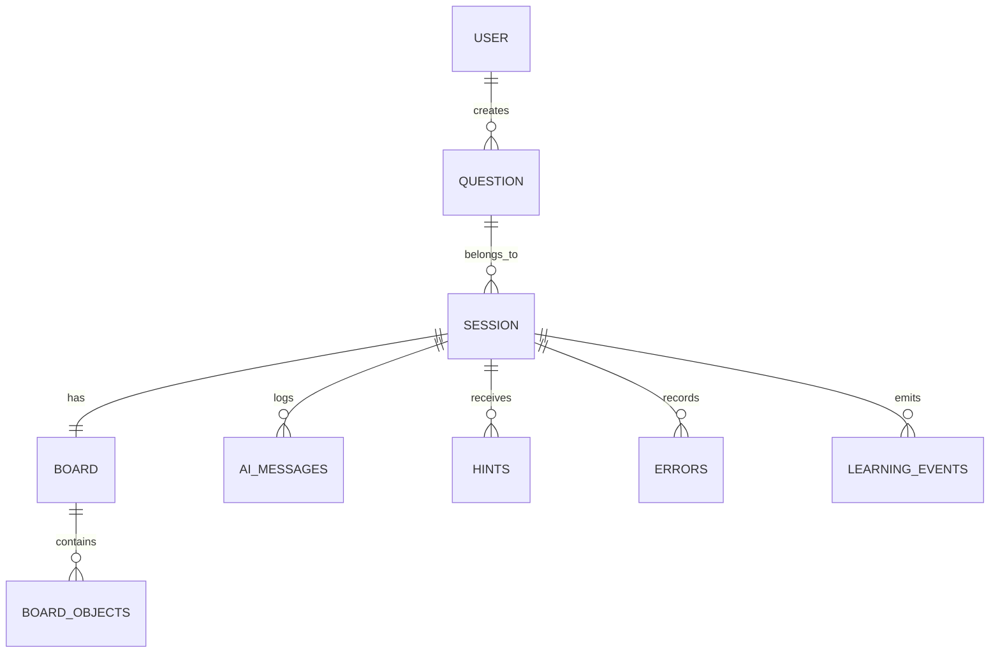
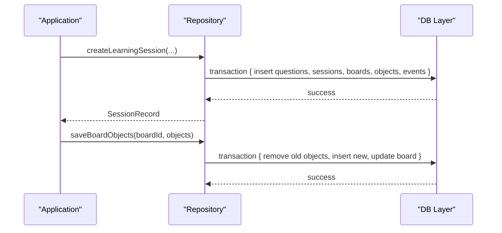
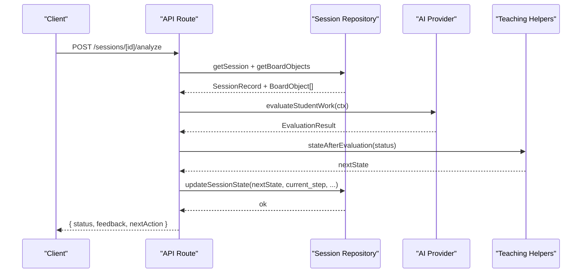
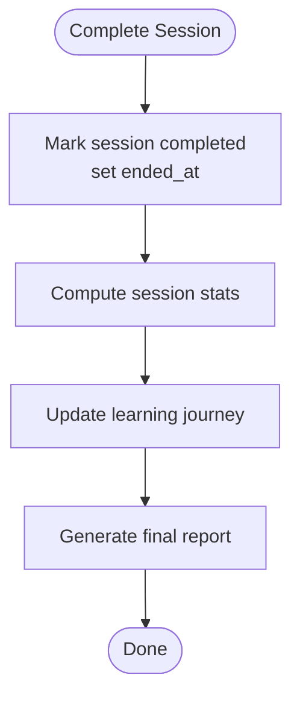
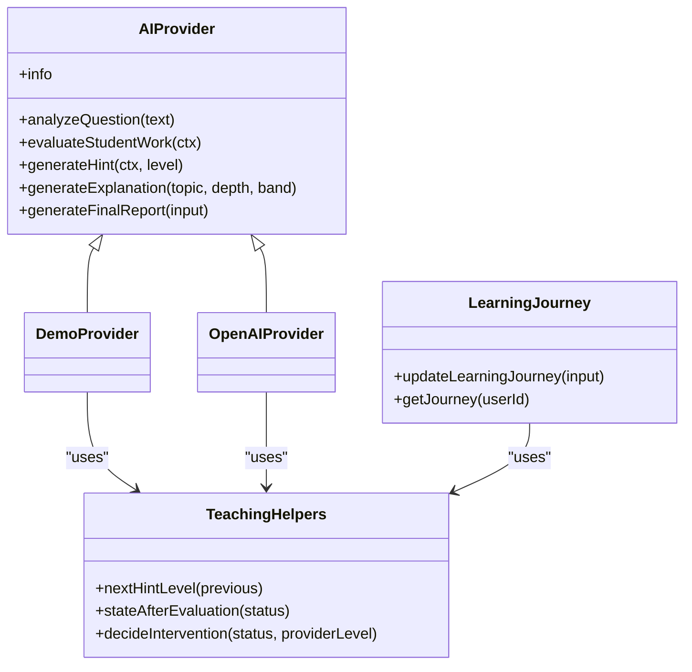
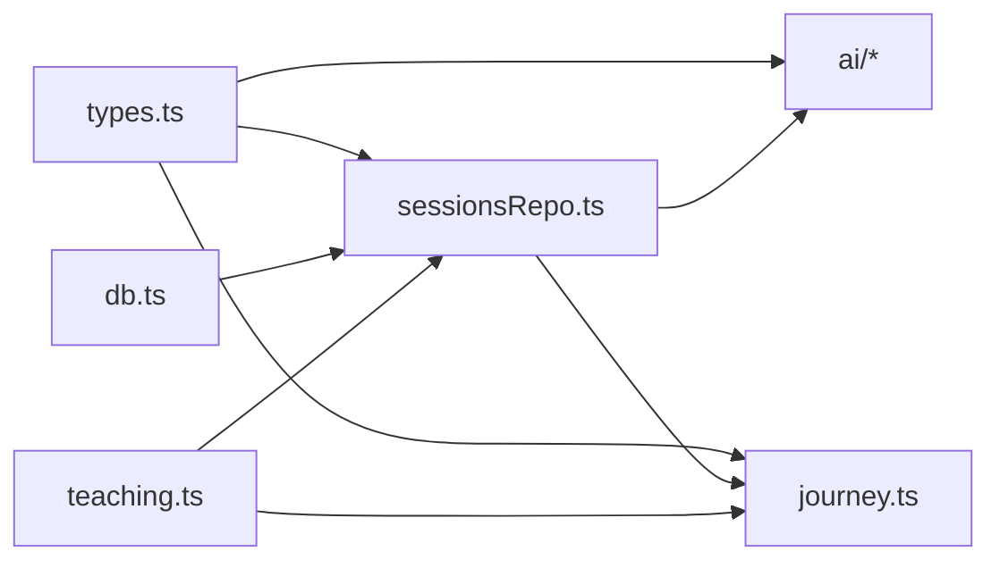

# Session Management

<cite>
**Referenced Files in This Document**
- [sessionsRepo.ts](file://app/lib/sessionsRepo.ts)
- [types.ts](file://app/lib/types.ts)
- [db.ts](file://app/lib/db.ts)
- [teaching.ts](file://app/lib/teaching.ts)
- [journey.ts](file://app/lib/journey.ts)
- [ai/index.ts](file://app/lib/ai/index.ts)
- [ai/demoProvider.ts](file://app/lib/ai/demoProvider.ts)
- [ai/openaiProvider.ts](file://app/lib/ai/openaiProvider.ts)
</cite>

## Table of Contents
1. Introduction
2. Project Structure
3. Core Components
4. Architecture Overview
5. Detailed Component Analysis
6. Dependency Analysis
7. Performance Considerations
8. Troubleshooting Guide
9. Conclusion
10. Appendices

## Introduction
This document explains StepWise AI’s session management system: how sessions are created, progressed through a state machine, persisted, analyzed for understanding, and completed with learning journey updates. It covers the data model (questions, steps, responses, feedback, errors), persistence via an embedded JSON store, integration with the AI teaching engine, and strategies for concurrency, timeouts, and cleanup.

## Project Structure
The session system is implemented as a set of server-side modules:
- Data access and persistence: db.ts, sessionsRepo.ts
- Domain types and models: types.ts
- Teaching engine helpers: teaching.ts
- Learning journey engine: journey.ts
- AI provider abstraction and implementations: ai/index.ts, ai/demoProvider.ts, ai/openaiProvider.ts

**Diagram sources**
- [sessionsRepo.ts:26-116](file://app/lib/sessionsRepo.ts#L26-L116)
- [db.ts:123-199](file://app/lib/db.ts#L123-L199)
- [ai/index.ts:12-26](file://app/lib/ai/index.ts#L12-L26)
- [ai/demoProvider.ts:69-201](file://app/lib/ai/demoProvider.ts#L69-L201)
- [ai/openaiProvider.ts:72-147](file://app/lib/ai/openaiProvider.ts#L72-L147)
- [teaching.ts:41-76](file://app/lib/teaching.ts#L41-L76)
- [journey.ts:59-262](file://app/lib/journey.ts#L59-L262)
- [types.ts:6-24](file://app/lib/types.ts#L6-L24)

**Section sources**
- [sessionsRepo.ts:1-116](file://app/lib/sessionsRepo.ts#L1-L116)
- [db.ts:1-44](file://app/lib/db.ts#L1-L44)
- [types.ts:1-302](file://app/lib/types.ts#L1-L302)

## Core Components
- Session lifecycle and state machine: defined by SessionState and enforced by repository and teaching helpers.
- Step-by-step progression: QuestionAnalysis.steps drive the student’s path; current_step tracks progress.
- Persistence: all writes go through db.ts transactions to ensure atomicity and durability.
- AI integration: providers analyze questions, evaluate attempts, generate hints, and produce final reports.
- Learning journey: evidence-based concept mastery, misconception tracking, and recommendations.

Key responsibilities:
- Create sessions with question analysis, board seeding, and initial events.
- Update session state and step progress safely.
- Persist board snapshots and interaction events.
- Record hints, errors, and corrections.
- Compute analytics and update the learning journey.

**Section sources**
- [sessionsRepo.ts:26-116](file://app/lib/sessionsRepo.ts#L26-L116)
- [sessionsRepo.ts:176-195](file://app/lib/sessionsRepo.ts#L176-L195)
- [types.ts:6-24](file://app/lib/types.ts#L6-L24)
- [types.ts:126-147](file://app/lib/types.ts#L126-L147)
- [db.ts:183-194](file://app/lib/db.ts#L183-L194)

## Architecture Overview
The session system orchestrates user actions, AI evaluation, persistence, and long-term learning updates.

**Diagram sources**
- [sessionsRepo.ts:26-116](file://app/lib/sessionsRepo.ts#L26-L116)
- [sessionsRepo.ts:176-195](file://app/lib/sessionsRepo.ts#L176-L195)
- [journey.ts:59-262](file://app/lib/journey.ts#L59-L262)
- [ai/openaiProvider.ts:92-147](file://app/lib/ai/openaiProvider.ts#L92-L147)
- [ai/demoProvider.ts:82-201](file://app/lib/ai/demoProvider.ts#L82-L201)
- [db.ts:123-199](file://app/lib/db.ts#L123-L199)

## Detailed Component Analysis

### Session State Machine
The session state machine governs transitions from introduction through attempts, guidance, and completion.

- Transitions after evaluation are driven by teaching helpers that map evaluation status to states.
- The repository enforces ownership and persists state changes atomically.

**Diagram sources**
- [types.ts:6-24](file://app/lib/types.ts#L6-L24)
- [teaching.ts:47-63](file://app/lib/teaching.ts#L47-L63)
- [sessionsRepo.ts:176-195](file://app/lib/sessionsRepo.ts#L176-L195)

**Section sources**
- [types.ts:6-24](file://app/lib/types.ts#L6-L24)
- [teaching.ts:47-63](file://app/lib/teaching.ts#L47-L63)
- [sessionsRepo.ts:176-195](file://app/lib/sessionsRepo.ts#L176-L195)

### Step-by-Step Learning Progression
- Each question is decomposed into steps with expected concepts and instructions.
- current_step advances when evaluations return correct outcomes or guided retries succeed.
- Steps are stored in QuestionAnalysis.steps and tracked per session.

**Diagram sources**
- [types.ts:126-147](file://app/lib/types.ts#L126-L147)
- [ai/openaiProvider.ts:100-112](file://app/lib/ai/openaiProvider.ts#L100-L112)
- [ai/demoProvider.ts:90-95](file://app/lib/ai/demoProvider.ts#L90-L95)
- [sessionsRepo.ts:176-195](file://app/lib/sessionsRepo.ts#L176-L195)

**Section sources**
- [types.ts:126-147](file://app/lib/types.ts#L126-L147)
- [ai/openaiProvider.ts:100-112](file://app/lib/ai/openaiProvider.ts#L100-L112)
- [ai/demoProvider.ts:90-95](file://app/lib/ai/demoProvider.ts#L90-L95)
- [sessionsRepo.ts:176-195](file://app/lib/sessionsRepo.ts#L176-L195)

### Session Data Model
Core entities and relationships:
- Questions: original_text, subject, topic, difficulty, normalized_question, analysis_json.
- Sessions: user_id, question_id, started_at, ended_at, active_seconds, status, current_step, state, state_json.
- Boards and Board Objects: visual workspace tied to a session.
- AI Messages, Hints, Errors, Learning Events: persistent artifacts of the learning process.

**Diagram sources**
- [db.ts:23-44](file://app/lib/db.ts#L23-L44)
- [sessionsRepo.ts:9-24](file://app/lib/sessionsRepo.ts#L9-L24)
- [sessionsRepo.ts:197-312](file://app/lib/sessionsRepo.ts#L197-L312)

**Section sources**
- [db.ts:23-44](file://app/lib/db.ts#L23-L44)
- [sessionsRepo.ts:9-24](file://app/lib/sessionsRepo.ts#L9-L24)
- [sessionsRepo.ts:197-312](file://app/lib/sessionsRepo.ts#L197-L312)

### Persistence Mechanism
- All writes use db.transaction to ensure atomic multi-step operations.
- Storage is a JSON file on disk with atomic write via temp file + rename.
- Ownership checks prevent cross-user access to sessions and boards.

**Diagram sources**
- [sessionsRepo.ts:26-116](file://app/lib/sessionsRepo.ts#L26-L116)
- [sessionsRepo.ts:239-265](file://app/lib/sessionsRepo.ts#L239-L265)
- [db.ts:183-194](file://app/lib/db.ts#L183-L194)
- [db.ts:88-94](file://app/lib/db.ts#L88-L94)

**Section sources**
- [sessionsRepo.ts:26-116](file://app/lib/sessionsRepo.ts#L26-L116)
- [sessionsRepo.ts:239-265](file://app/lib/sessionsRepo.ts#L239-L265)
- [db.ts:88-94](file://app/lib/db.ts#L88-L94)
- [db.ts:183-194](file://app/lib/db.ts#L183-L194)

### Analysis Endpoints and Adaptive Feedback
- Evaluation uses either demoProvider or openaiProvider based on configuration.
- Providers return structured EvaluationResult with status, feedback, errors, strengths, missing elements, interventionLevel, and nextAction.
- Teaching helpers map evaluation status to session state transitions and determine intervention levels.

**Diagram sources**
- [ai/index.ts:12-26](file://app/lib/ai/index.ts#L12-L26)
- [ai/openaiProvider.ts:92-147](file://app/lib/ai/openaiProvider.ts#L92-L147)
- [ai/demoProvider.ts:82-201](file://app/lib/ai/demoProvider.ts#L82-L201)
- [teaching.ts:47-63](file://app/lib/teaching.ts#L47-L63)
- [sessionsRepo.ts:176-195](file://app/lib/sessionsRepo.ts#L176-L195)

**Section sources**
- [ai/index.ts:12-26](file://app/lib/ai/index.ts#L12-L26)
- [ai/openaiProvider.ts:92-147](file://app/lib/ai/openaiProvider.ts#L92-L147)
- [ai/demoProvider.ts:82-201](file://app/lib/ai/demoProvider.ts#L82-L201)
- [teaching.ts:47-63](file://app/lib/teaching.ts#L47-L63)
- [sessionsRepo.ts:176-195](file://app/lib/sessionsRepo.ts#L176-L195)

### Session Completion and Analytics
- Completion sets status to "completed", ends session time, and triggers learning journey updates.
- Analytics include total/active seconds, hints used, errors, steps completed vs total.

**Diagram sources**
- [sessionsRepo.ts:176-195](file://app/lib/sessionsRepo.ts#L176-L195)
- [sessionsRepo.ts:378-399](file://app/lib/sessionsRepo.ts#L378-L399)
- [journey.ts:59-262](file://app/lib/journey.ts#L59-L262)
- [ai/openaiProvider.ts:124-147](file://app/lib/ai/openaiProvider.ts#L124-L147)
- [ai/demoProvider.ts:111-201](file://app/lib/ai/demoProvider.ts#L111-L201)

**Section sources**
- [sessionsRepo.ts:176-195](file://app/lib/sessionsRepo.ts#L176-L195)
- [sessionsRepo.ts:378-399](file://app/lib/sessionsRepo.ts#L378-L399)
- [journey.ts:59-262](file://app/lib/journey.ts#L59-L262)
- [ai/openaiProvider.ts:124-147](file://app/lib/ai/openaiProvider.ts#L124-L147)
- [ai/demoProvider.ts:111-201](file://app/lib/ai/demoProvider.ts#L111-L201)

### Integration with AI Teaching Engine and Learning Journey
- AI providers supply structured outputs validated by sanitizers and helpers.
- Learning journey updates concept statuses, schedules reviews, and generates recommendations based on evidence.

**Diagram sources**
- [ai/openaiProvider.ts:72-147](file://app/lib/ai/openaiProvider.ts#L72-L147)
- [ai/demoProvider.ts:69-201](file://app/lib/ai/demoProvider.ts#L69-L201)
- [teaching.ts:41-76](file://app/lib/teaching.ts#L41-L76)
- [journey.ts:59-262](file://app/lib/journey.ts#L59-L262)

**Section sources**
- [ai/openaiProvider.ts:72-147](file://app/lib/ai/openaiProvider.ts#L72-L147)
- [ai/demoProvider.ts:69-201](file://app/lib/ai/demoProvider.ts#L69-L201)
- [teaching.ts:41-76](file://app/lib/teaching.ts#L41-L76)
- [journey.ts:59-262](file://app/lib/journey.ts#L59-L262)

## Dependency Analysis
- Repository depends on db layer for persistence and on types for domain contracts.
- AI integration is abstracted behind a factory; providers implement the same interface.
- Teaching helpers provide policy functions used across evaluation flows.
- Learning journey depends on db and types to maintain long-term concept states.

**Diagram sources**
- [types.ts:1-302](file://app/lib/types.ts#L1-L302)
- [db.ts:123-199](file://app/lib/db.ts#L123-L199)
- [sessionsRepo.ts:1-399](file://app/lib/sessionsRepo.ts#L1-L399)
- [ai/index.ts:12-26](file://app/lib/ai/index.ts#L12-L26)
- [teaching.ts:41-76](file://app/lib/teaching.ts#L41-L76)
- [journey.ts:59-262](file://app/lib/journey.ts#L59-L262)

**Section sources**
- [types.ts:1-302](file://app/lib/types.ts#L1-L302)
- [db.ts:123-199](file://app/lib/db.ts#L123-L199)
- [sessionsRepo.ts:1-399](file://app/lib/sessionsRepo.ts#L1-L399)
- [ai/index.ts:12-26](file://app/lib/ai/index.ts#L12-L26)
- [teaching.ts:41-76](file://app/lib/teaching.ts#L41-L76)
- [journey.ts:59-262](file://app/lib/journey.ts#L59-L262)

## Performance Considerations
- Use local state and optimistic UI updates before persisting board snapshots.
- Debounce persistence calls; batch board object saves within limits.
- Avoid AI calls on every keystroke; trigger analysis on meaningful events.
- Leverage transactions to reduce disk writes and ensure consistency.
- Cache provider selection at startup to avoid repeated config reads.

[No sources needed since this section provides general guidance]

## Troubleshooting Guide
Common issues and resolutions:
- Unauthorized access: Ensure userId is verified on every repository call; ownership checks prevent IDOR.
- Invalid AI output: Sanitizers enforce schema; fallback values protect against malformed responses.
- Stale board state: Re-fetch board objects before analysis; save full snapshots atomically.
- Missing steps or concepts: Validate QuestionAnalysis.steps; default to minimal steps if empty.
- Concurrency conflicts: Transactions serialize writes; ensure single-writer semantics per request.

**Section sources**
- [sessionsRepo.ts:1-10](file://app/lib/sessionsRepo.ts#L1-L10)
- [sessionsRepo.ts:239-265](file://app/lib/sessionsRepo.ts#L239-L265)
- [ai/openaiProvider.ts:172-279](file://app/lib/ai/openaiProvider.ts#L172-L279)
- [db.ts:183-194](file://app/lib/db.ts#L183-L194)

## Conclusion
StepWise AI’s session management system combines a robust state machine, stepwise learning progression, secure persistence, and adaptive AI-driven feedback. It integrates tightly with the learning journey to build long-term understanding, while maintaining performance and safety through transactions, validation, and provider abstraction.

[No sources needed since this section summarizes without analyzing specific files]

## Appendices

### Creating Sessions Programmatically
- Call createLearningSession with userId, questionText, and pre-analyzed QuestionAnalysis.
- The function inserts related records and seeds the board with question and AI introduction.

**Section sources**
- [sessionsRepo.ts:26-116](file://app/lib/sessionsRepo.ts#L26-L116)

### Managing Session State
- Use updateSessionState to transition states and advance steps.
- When status becomes "completed", ended_at is set automatically.

**Section sources**
- [sessionsRepo.ts:176-195](file://app/lib/sessionsRepo.ts#L176-L195)

### Retrieving Session Analytics
- Use getSessionStats to compute time, hints, errors, and step metrics.
- Combine with listSessions to enumerate recent sessions.

**Section sources**
- [sessionsRepo.ts:378-399](file://app/lib/sessionsRepo.ts#L378-L399)
- [sessionsRepo.ts:148-174](file://app/lib/sessionsRepo.ts#L148-L174)

### Concurrent Session Handling
- All writes occur within transactions; requests are serialized per process.
- For production scaling, replace db.ts with a relational backend while preserving the repository interface.

**Section sources**
- [db.ts:183-194](file://app/lib/db.ts#L183-L194)

### Session Timeout Management
- Track active_seconds and total time; consider implementing idle detection at the API layer to pause or expire sessions.
- Use ended_at to mark completed or timed-out sessions.

**Section sources**
- [sessionsRepo.ts:176-195](file://app/lib/sessionsRepo.ts#L176-L195)

### Data Cleanup Strategies
- Use deleteUserCascade to remove all user-related data atomically.
- Periodic jobs can archive or prune old sessions and boards based on retention policies.

**Section sources**
- [db.ts:201-224](file://app/lib/db.ts#L201-L224)