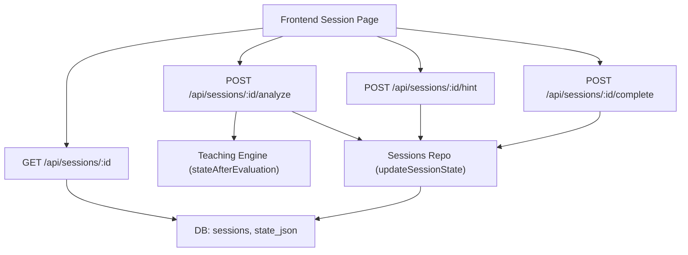
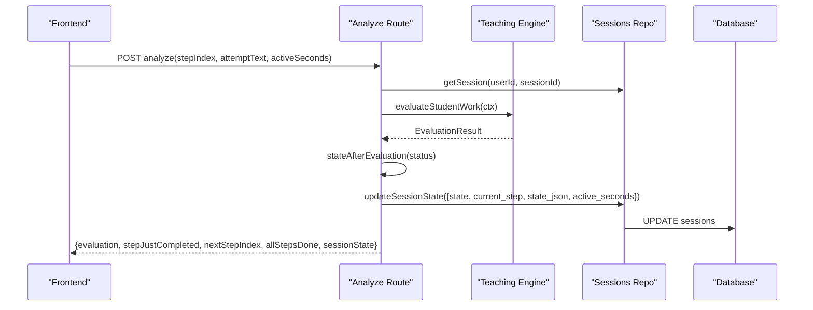
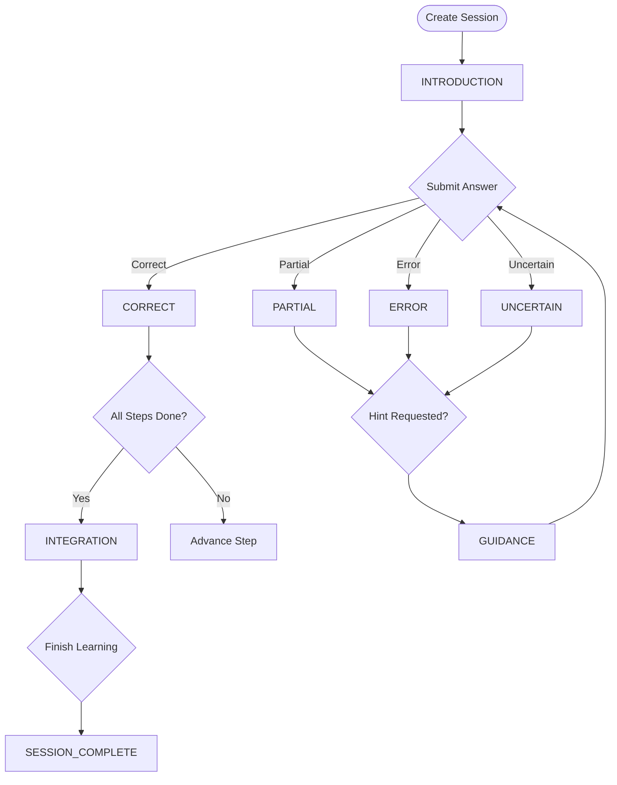
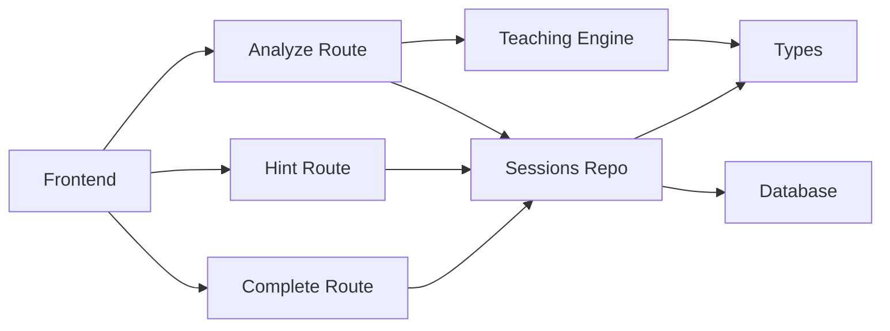

# Session State Machine

<cite>
**Referenced Files in This Document**
- [types.ts](file://stepwise ai/app/lib/types.ts)
- [sessionsRepo.ts](file://stepwise ai/app/lib/sessionsRepo.ts)
- [teaching.ts](file://stepwise ai/app/lib/teaching.ts)
- [analyze route](file://stepwise ai/app/app/api/sessions/[id]/analyze/route.ts)
- [hint route](file://stepwise ai/app/app/api/sessions/[id]/hint/route.ts)
- [complete route](file://stepwise ai/app/app/api/sessions/[id]/complete/route.ts)
- [session GET route](file://stepwise ai/app/app/api/sessions/[id]/route.ts)
- [session page](file://stepwise ai/app/app/session/[id]/page.tsx)
</cite>

## Table of Contents
1. [Introduction](#introduction)
2. [Project Structure](#project-structure)
3. [Core Components](#core-components)
4. [Architecture Overview](#architecture-overview)
5. [Detailed Component Analysis](#detailed-component-analysis)
6. [Dependency Analysis](#dependency-analysis)
7. [Performance Considerations](#performance-considerations)
8. [Troubleshooting Guide](#troubleshooting-guide)
9. [Conclusion](#conclusion)
10. [Appendices](#appendices)

## Introduction
This document explains the session state machine that governs transitions during a learning workflow, ensuring data consistency from creation through completion. It covers:
- The SessionState type and all possible states
- Valid transitions and their triggers
- The updateSessionState function and its role in enforcing rules
- How state_json stores additional context beyond simple transitions
- Examples of transitions across scenarios
- Handling invalid changes and debugging issues
- Relationship between backend state and frontend rendering
- Persistence, crash recovery, and migration strategies for schema changes

## Project Structure
The session state machine spans several modules:
- Types define the state machine and domain models
- Repository functions persist and retrieve session state
- API routes enforce business rules and transition logic
- Frontend renders UI based on server-provided state and updates it via API calls

**Diagram sources**
- [session page:17-34](file://stepwise ai/app/app/session/[id]/page.tsx#L17-L34)
- [session GET route:9-36](file://stepwise ai/app/app/api/sessions/[id]/route.ts#L9-L36)
- [analyze route:19-31](file://stepwise ai/app/app/api/sessions/[id]/analyze/route.ts#L19-L31)
- [hint route:18-29](file://stepwise ai/app/app/api/sessions/[id]/hint/route.ts#L18-L29)
- [complete route:12-15](file://stepwise ai/app/app/api/sessions/[id]/complete/route.ts#L12-L15)
- [teaching.ts:47-63](file://stepwise ai/app/lib/teaching.ts#L47-L63)
- [sessionsRepo.ts:176-195](file://stepwise ai/app/lib/sessionsRepo.ts#L176-L195)

**Section sources**
- [types.ts:7-24](file://stepwise ai/app/lib/types.ts#L7-L24)
- [sessionsRepo.ts:26-116](file://stepwise ai/app/lib/sessionsRepo.ts#L26-L116)
- [analyze route:22-179](file://stepwise ai/app/app/api/sessions/[id]/analyze/route.ts#L22-L179)
- [hint route:20-92](file://stepwise ai/app/app/api/sessions/[id]/hint/route.ts#L20-L92)
- [complete route:15-123](file://stepwise ai/app/app/api/sessions/[id]/complete/route.ts#L15-L123)
- [session GET route:11-36](file://stepwise ai/app/app/api/sessions/[id]/route.ts#L11-L36)
- [session page:76-91](file://stepwise ai/app/app/session/[id]/page.tsx#L76-L91)

## Core Components
- SessionState type defines all valid states for a session’s lifecycle.
- updateSessionState persists state changes atomically with timestamps and finalization hooks.
- Teaching engine maps evaluation outcomes to next states and intervention levels.
- API routes orchestrate transitions by validating inputs, computing new state, and updating persistence.
- Frontend reads full session payload including state_json and renders UI accordingly.

Key responsibilities:
- Type safety: SessionState constrains allowed values.
- Consistency: updateSessionState centralizes writes and ensures ended_at is set when status becomes completed.
- Policy: stateAfterEvaluation and decideIntervention encode teaching policies.
- Context: state_json carries complex per-session context like stepsCompleted, failedChecks, hintsSinceLastError, selfCorrections, initialAttempt, lastAttempt, finalAttempt.

**Section sources**
- [types.ts:7-24](file://stepwise ai/app/lib/types.ts#L7-L24)
- [sessionsRepo.ts:176-195](file://stepwise ai/app/lib/sessionsRepo.ts#L176-L195)
- [teaching.ts:47-76](file://stepwise ai/app/lib/teaching.ts#L47-L76)
- [analyze route:114-147](file://stepwise ai/app/app/api/sessions/[id]/analyze/route.ts#L114-L147)
- [hint route:75-86](file://stepwise ai/app/app/api/sessions/[id]/hint/route.ts#L75-L86)
- [complete route:77-98](file://stepwise ai/app/app/api/sessions/[id]/complete/route.ts#L77-L98)

## Architecture Overview
The state machine operates around three primary flows:
- Analyze flow: evaluates student work, records errors or corrections, computes next state, advances steps if correct, and may transition to INTEGRATION when all steps are done.
- Hint flow: escalates hint level, records hint usage, sets GUIDANCE state, and tracks hintsSinceLastError to influence self-correction detection.
- Complete flow: generates final report, marks session as completed, and transitions to SESSION_COMPLETE.

**Diagram sources**
- [analyze route:22-179](file://stepwise ai/app/app/api/sessions/[id]/analyze/route.ts#L22-L179)
- [teaching.ts:47-63](file://stepwise ai/app/lib/teaching.ts#L47-L63)
- [sessionsRepo.ts:176-195](file://stepwise ai/app/lib/sessionsRepo.ts#L176-L195)

**Section sources**
- [analyze route:22-179](file://stepwise ai/app/app/api/sessions/[id]/analyze/route.ts#L22-L179)
- [teaching.ts:47-76](file://stepwise ai/app/lib/teaching.ts#L47-L76)
- [sessionsRepo.ts:176-195](file://stepwise ai/app/lib/sessionsRepo.ts#L176-L195)

## Detailed Component Analysis

### SessionState Type Definition and States
- SessionState enumerates all valid states used throughout the session lifecycle.
- Includes phases such as INTRODUCTION, FIRST_ATTEMPT, EVALUATING, CORRECT, PARTIAL, ERROR, UNCERTAIN, GUIDANCE, RETRY, CONCEPT_CHECK, NEXT_CONCEPT, INTEGRATION, FINAL_DEMONSTRATION, SESSION_COMPLETE, plus intermediate processing states like QUESTION_RECEIVED, QUESTION_ANALYZED, LEARNING_BLUEPRINT_CREATED.

These states represent both user-facing phases and internal processing markers. The most visible transitions for learners occur around evaluation results and completion.

**Section sources**
- [types.ts:7-24](file://stepwise ai/app/lib/types.ts#L7-L24)

### Valid Transitions and Triggers
- Creation: New sessions start with state INTRODUCTION and status active.
- Evaluate:
  - On successful submission, the system computes an evaluation status and transitions to CORRECT, PARTIAL, ERROR, or UNCERTAIN using stateAfterEvaluation.
  - If all steps are completed after a correct answer, the state transitions to INTEGRATION.
- Hint:
  - Requesting a hint sets state to GUIDANCE and increments hintsSinceLastError to mark later fixes as not independent unless no hints were consumed since last error.
- Completion:
  - Finalizing a session sets state to SESSION_COMPLETE and status to completed; ended_at is recorded.

**Diagram sources**
- [sessionsRepo.ts:53-54](file://stepwise ai/app/lib/sessionsRepo.ts#L53-L54)
- [analyze route:114-147](file://stepwise ai/app/app/api/sessions/[id]/analyze/route.ts#L114-L147)
- [hint route:75-86](file://stepwise ai/app/app/api/sessions/[id]/hint/route.ts#L75-L86)
- [complete route:77-98](file://stepwise ai/app/app/api/sessions/[id]/complete/route.ts#L77-L98)

**Section sources**
- [sessionsRepo.ts:53-54](file://stepwise ai/app/lib/sessionsRepo.ts#L53-L54)
- [analyze route:114-147](file://stepwise ai/app/app/api/sessions/[id]/analyze/route.ts#L114-L147)
- [hint route:75-86](file://stepwise ai/app/app/api/sessions/[id]/hint/route.ts#L75-L86)
- [complete route:77-98](file://stepwise ai/app/app/api/sessions/[id]/complete/route.ts#L77-L98)

### updateSessionState Function
- Centralized persistence layer for session state changes.
- Accepts partial patches including state, current_step, status, state_json, active_seconds.
- Automatically sets ended_at when status becomes completed.
- Ensures ownership verification via userId and sessionId parameters.

Role in enforcing rules:
- Prevents ad-hoc direct database writes; all transitions must go through this function.
- Guarantees consistent timestamping and finalization behavior.

**Section sources**
- [sessionsRepo.ts:176-195](file://stepwise ai/app/lib/sessionsRepo.ts#L176-L195)

### state_json: Additional Session Context
- Stores complex per-session context as JSON stringified object.
- Common fields:
  - stepsCompleted: array of completed step indices
  - failedChecks: counter tracking non-correct evaluations
  - hintsSinceLastError: counter to determine independence of self-corrections
  - selfCorrections: list of notes about independent reconsiderations
  - initialAttempt, lastAttempt, finalAttempt: snapshots of student attempts
- Used across routes to inform decisions:
  - Analyze route uses stepsCompleted to detect completion and transitions to INTEGRATION.
  - Hint route increments hintsSinceLastError to affect self-correction marking.
  - Complete route aggregates these fields into final report inputs.

**Section sources**
- [sessionsRepo.ts:53-54](file://stepwise ai/app/lib/sessionsRepo.ts#L53-L54)
- [sessionsRepo.ts:139-140](file://stepwise ai/app/lib/sessionsRepo.ts#L139-L140)
- [analyze route:54-61](file://stepwise ai/app/app/api/sessions/[id]/analyze/route.ts#L54-L61)
- [analyze route:121-136](file://stepwise ai/app/app/api/sessions/[id]/analyze/route.ts#L121-L136)
- [hint route:75-86](file://stepwise ai/app/app/api/sessions/[id]/hint/route.ts#L75-L86)
- [complete route:35-40](file://stepwise ai/app/app/api/sessions/[id]/complete/route.ts#L35-L40)
- [complete route:56-73](file://stepwise ai/app/app/api/sessions/[id]/complete/route.ts#L56-L73)

### Example Scenarios and Transition Logic

#### Scenario A: First Attempt Leads to Error
- User submits first attempt; AI returns error.
- State transitions to ERROR.
- state_json updated with failedChecks increment and hintsSinceLastError reset.
- Frontend shows “Needs work” feedback and allows retry or hint request.

**Section sources**
- [analyze route:90-136](file://stepwise ai/app/app/api/sessions/[id]/analyze/route.ts#L90-L136)
- [session page:189-227](file://stepwise ai/app/app/session/[id]/page.tsx#L189-L227)

#### Scenario B: Partial Answer and Hint Escalation
- User submits partial answer; state transitions to PARTIAL.
- User requests hint; state transitions to GUIDANCE and hintsSinceLastError increments.
- Later correction without consuming hints can be marked as self-corrected.

**Section sources**
- [teaching.ts:47-63](file://stepwise ai/app/lib/teaching.ts#L47-L63)
- [hint route:75-86](file://stepwise ai/app/app/api/sessions/[id]/hint/route.ts#L75-L86)
- [analyze route:102-112](file://stepwise ai/app/app/api/sessions/[id]/analyze/route.ts#L102-L112)

#### Scenario C: All Steps Completed and Integration
- After multiple correct answers, stepsCompleted reaches total steps.
- State transitions to INTEGRATION; current step remains at last completed index.
- Frontend enables “Finish Learning” to generate final report.

**Section sources**
- [analyze route:118-147](file://stepwise ai/app/app/api/sessions/[id]/analyze/route.ts#L118-L147)
- [session page:217-222](file://stepwise ai/app/app/session/[id]/page.tsx#L217-L222)

#### Scenario D: Session Completion
- User clicks “Finish Learning”; complete route generates final report and sets state to SESSION_COMPLETE with status completed.
- ended_at is recorded; session becomes read-only.

**Section sources**
- [complete route:77-98](file://stepwise ai/app/app/api/sessions/[id]/complete/route.ts#L77-L98)
- [session page:247-261](file://stepwise ai/app/app/session/[id]/page.tsx#L247-L261)

### Invalid State Changes and Guardrails
- Completed sessions reject further actions: analyze and hint routes return an error indicating the session is already finished.
- Invalid step indices are rejected with INVALID_STEP.
- Ownership checks ensure only the session owner can modify state.

**Section sources**
- [analyze route:27-31](file://stepwise ai/app/app/api/sessions/[id]/analyze/route.ts#L27-L31)
- [analyze route:38-41](file://stepwise ai/app/app/api/sessions/[id]/analyze/route.ts#L38-L41)
- [hint route:25-29](file://stepwise ai/app/app/api/sessions/[id]/hint/route.ts#L25-L29)

### Frontend Rendering and Backend State Synchronization
- Frontend loads full session payload including state, status, currentStep, stateData, objects, messages.
- Renders step progress, highlights, and action buttons based on backend state.
- Autosaves board objects and debounces saves to keep UI responsive while ensuring server-side consistency.
- When all steps are done, frontend enables finish action and navigates to report upon completion.

**Section sources**
- [session GET route:22-36](file://stepwise ai/app/app/api/sessions/[id]/route.ts#L22-L36)
- [session page:76-91](file://stepwise ai/app/app/session/[id]/page.tsx#L76-L91)
- [session page:99-130](file://stepwise ai/app/app/session/[id]/page.tsx#L99-L130)
- [session page:217-222](file://stepwise ai/app/app/session/[id]/page.tsx#L217-L222)
- [session page:247-261](file://stepwise ai/app/app/session/[id]/page.tsx#L247-L261)

### State Persistence, Crash Recovery, and Migration Strategies
- Persistence:
  - Sessions store state and state_json in the database; every write goes through updateSessionState with timestamps.
  - Board objects are saved atomically with size limits and sanitization.
- Crash recovery:
  - Full session payload includes state, currentStep, stateData, objects, and messages; frontend reconstructs UI from this data.
  - Active seconds are tracked client-side and merged with server values to avoid losing time metrics.
- Migration strategies:
  - state_json is flexible JSON; new fields can be added without breaking existing clients.
  - Safe parsing with fallback to empty object protects against malformed payloads.
  - For schema evolution, add migration logic in repository or API layers to transform legacy state_json structures when reading or writing.

**Section sources**
- [sessionsRepo.ts:239-265](file://stepwise ai/app/lib/sessionsRepo.ts#L239-L265)
- [sessionsRepo.ts:226-233](file://stepwise ai/app/lib/sessionsRepo.ts#L226-L233)
- [session GET route:22-36](file://stepwise ai/app/app/api/sessions/[id]/route.ts#L22-L36)
- [session page:76-91](file://stepwise ai/app/app/session/[id]/page.tsx#L76-L91)

## Dependency Analysis
- Frontend depends on API routes for state retrieval and updates.
- API routes depend on teaching engine for policy decisions and repository for persistence.
- Repository depends on database abstraction for atomic operations and safe parsing.
- Types provide shared contracts ensuring consistency across modules.

**Diagram sources**
- [analyze route:2-15](file://stepwise ai/app/app/api/sessions/[id]/analyze/route.ts#L2-L15)
- [hint route:2-14](file://stepwise ai/app/app/api/sessions/[id]/hint/route.ts#L2-L14)
- [complete route:2-8](file://stepwise ai/app/app/api/sessions/[id]/complete/route.ts#L2-L8)
- [teaching.ts:6-76](file://stepwise ai/app/lib/teaching.ts#L6-L76)
- [sessionsRepo.ts:6-7](file://stepwise ai/app/lib/sessionsRepo.ts#L6-L7)

**Section sources**
- [analyze route:2-15](file://stepwise ai/app/app/api/sessions/[id]/analyze/route.ts#L2-L15)
- [hint route:2-14](file://stepwise ai/app/app/api/sessions/[id]/hint/route.ts#L2-L14)
- [complete route:2-8](file://stepwise ai/app/app/api/sessions/[id]/complete/route.ts#L2-L8)
- [teaching.ts:6-76](file://stepwise ai/app/lib/teaching.ts#L6-L76)
- [sessionsRepo.ts:6-7](file://stepwise ai/app/lib/sessionsRepo.ts#L6-L7)

## Performance Considerations
- Debounced autosave reduces frequent writes while keeping UI responsive.
- Object saving caps content sizes and limits number of objects to prevent large payloads.
- State transitions are computed server-side to minimize client complexity and ensure consistency.
- Efficient state_json updates avoid unnecessary re-parsing by caching parsed objects within request scope.

[No sources needed since this section provides general guidance]

## Troubleshooting Guide
Common issues and diagnostics:
- Session already finished: analyze and hint routes reject requests when status is completed.
- Invalid step index: validate stepIndex before processing; handle INVALID_STEP responses.
- Malformed state_json: safe parsing falls back to empty object; check logs for parse errors.
- Self-correction not detected: ensure hintsSinceLastError is zero when marking corrections as independent.
- Frontend desync: verify that frontend loads full session payload and updates stepsDone and currentStep based on server responses.

Debugging tips:
- Inspect state_json fields like stepsCompleted, failedChecks, hintsSinceLastError, selfCorrections.
- Check evaluation responses for status, feedback, and nextAction.
- Use learning events and AI messages to trace decision paths.

**Section sources**
- [analyze route:27-31](file://stepwise ai/app/app/api/sessions/[id]/analyze/route.ts#L27-L31)
- [analyze route:38-41](file://stepwise ai/app/app/api/sessions/[id]/analyze/route.ts#L38-L41)
- [sessionsRepo.ts:226-233](file://stepwise ai/app/lib/sessionsRepo.ts#L226-L233)
- [analyze route:102-112](file://stepwise ai/app/app/api/sessions/[id]/analyze/route.ts#L102-L112)
- [session page:217-222](file://stepwise ai/app/app/session/[id]/page.tsx#L217-L222)

## Conclusion
The session state machine enforces a clear, policy-driven progression through learning steps, backed by robust persistence and context management. By centralizing transitions through updateSessionState and leveraging state_json for complex context, the system maintains consistency across frontend and backend. Proper handling of invalid changes, combined with comprehensive recovery and migration strategies, ensures reliability and adaptability as the application evolves.

[No sources needed since this section summarizes without analyzing specific files]

## Appendices

### State Transition Reference
- INTRODUCTION -> EVALUATING (via submit)
- EVALUATING -> CORRECT/PARTIAL/ERROR/UNCERTAIN (via evaluation)
- CORRECT -> INTEGRATION (if all steps completed)
- PARTIAL/ERROR/UNCERTAIN -> GUIDANCE (via hint request)
- GUIDANCE -> EVALUATING (via next submission)
- INTEGRATION -> SESSION_COMPLETE (via finish)

**Section sources**
- [sessionsRepo.ts:53-54](file://stepwise ai/app/lib/sessionsRepo.ts#L53-L54)
- [analyze route:114-147](file://stepwise ai/app/app/api/sessions/[id]/analyze/route.ts#L114-L147)
- [hint route:75-86](file://stepwise ai/app/app/api/sessions/[id]/hint/route.ts#L75-L86)
- [complete route:77-98](file://stepwise ai/app/app/api/sessions/[id]/complete/route.ts#L77-L98)