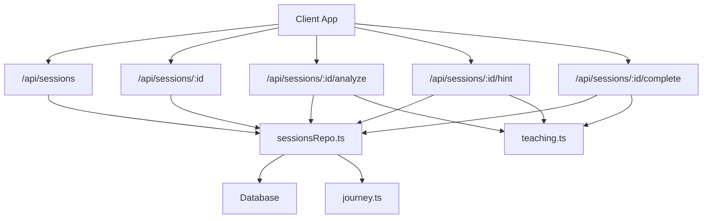
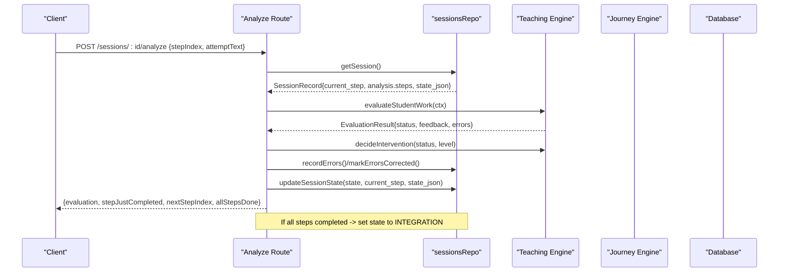
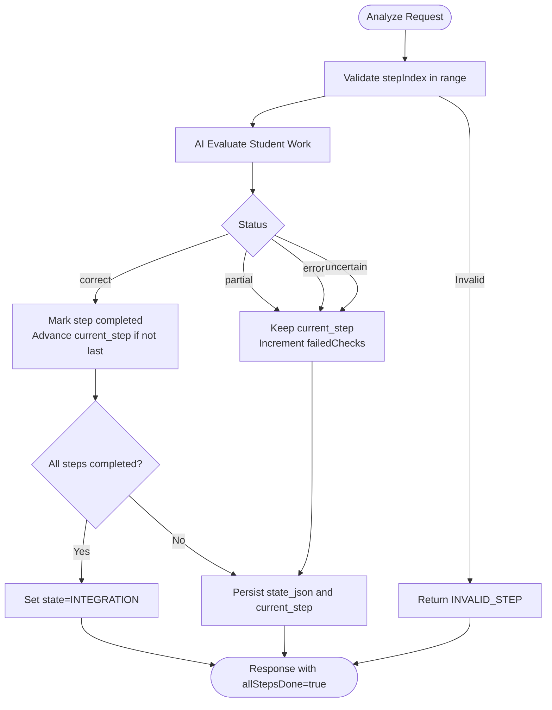
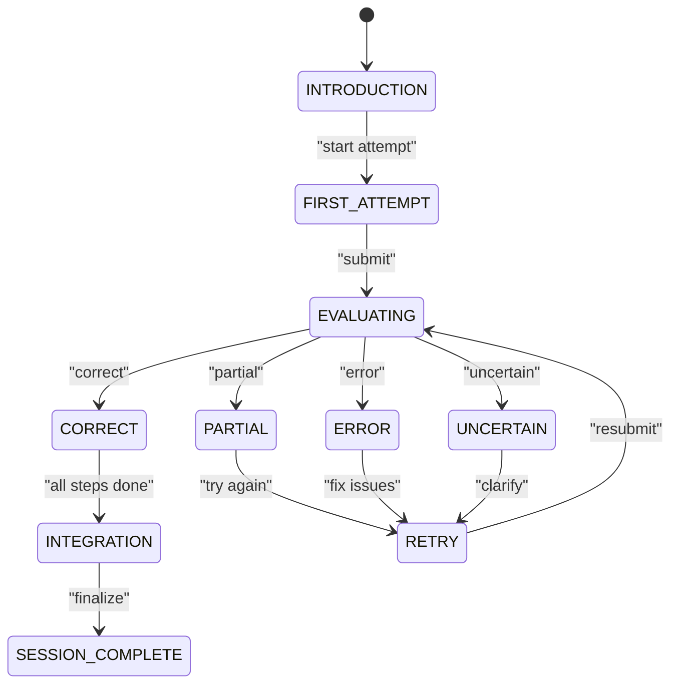
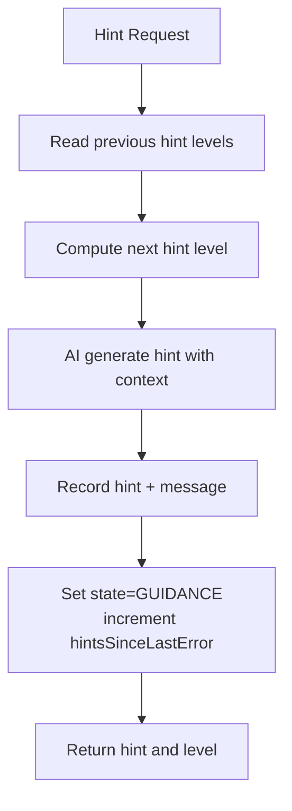
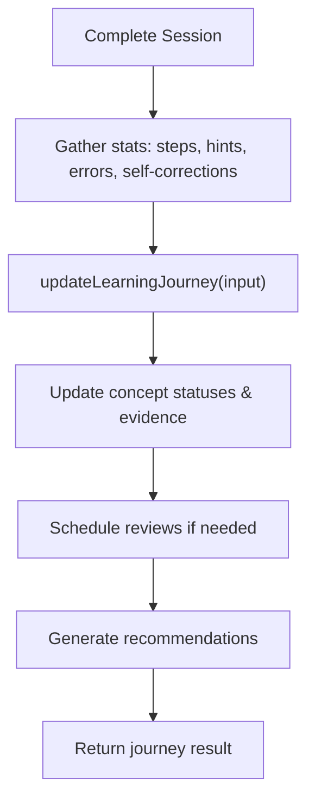
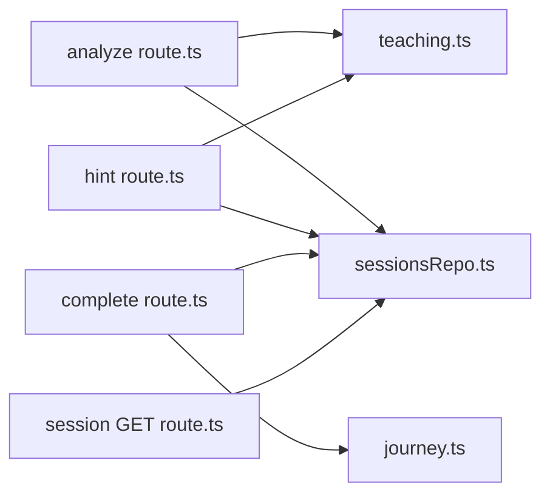

# Step-by-Step Progression System

<cite>
**Referenced Files in This Document**
- [sessionsRepo.ts](file://app/lib/sessionsRepo.ts)
- [teaching.ts](file://app/lib/teaching.ts)
- [journey.ts](file://app/lib/journey.ts)
- [types.ts](file://app/lib/types.ts)
- [sessions route.ts](file://app/app/api/sessions/route.ts)
- [session GET route.ts](file://app/app/api/sessions/[id]/route.ts)
- [analyze route.ts](file://app/app/api/sessions/[id]/analyze/route.ts)
- [hint route.ts](file://app/app/api/sessions/[id]/hint/route.ts)
- [complete route.ts](file://app/app/api/sessions/[id]/complete/route.ts)
</cite>

## Table of Contents
1. Introduction
2. Project Structure
3. Core Components
4. Architecture Overview
5. Detailed Component Analysis
6. Dependency Analysis
7. Performance Considerations
8. Troubleshooting Guide
9. Conclusion
10. Appendices

## Introduction
This document explains the step-by-step progression system that breaks complex learning problems into manageable steps. It focuses on how current_step tracks student progress, how it integrates with QuestionAnalysis.steps, and how step completion logic validates order and advances state. It also covers session state relationships, adaptive difficulty via the teaching engine, long-term tracking through the learning journey, and edge cases such as reordering, missing steps, and corrupted data recovery.

## Project Structure
The progression system spans API routes (entry points), a repository for persistence, a teaching engine for evaluation policies, and a learning journey module for long-term concept mastery.

**Diagram sources**
- [sessions route.ts:9-44](file://app/app/api/sessions/route.ts#L9-L44)
- [session GET route.ts:9-46](file://app/app/api/sessions/[id]/route.ts#L9-L46)
- [analyze route.ts:19-179](file://app/app/api/sessions/[id]/analyze/route.ts#L19-L179)
- [hint route.ts:18-92](file://app/app/api/sessions/[id]/hint/route.ts#L18-L92)
- [complete route.ts:12-118](file://app/app/api/sessions/[id]/complete/route.ts#L12-L118)
- [sessionsRepo.ts:26-195](file://app/lib/sessionsRepo.ts#L26-L195)
- [teaching.ts:28-77](file://app/lib/teaching.ts#L28-L77)
- [journey.ts:59-262](file://app/lib/journey.ts#L59-L262)

**Section sources**
- [sessions route.ts:9-44](file://app/app/api/sessions/route.ts#L9-L44)
- [session GET route.ts:9-46](file://app/app/api/sessions/[id]/route.ts#L9-L46)
- [sessionsRepo.ts:26-195](file://app/lib/sessionsRepo.ts#L26-L195)

## Core Components
- Session lifecycle and step tracking:
  - Sessions store current_step, state, and JSON-persisted state_data including stepsCompleted and failedChecks.
  - Steps are defined by QuestionAnalysis.steps; current_step indexes into this array to determine the active step.
- Teaching engine:
  - Maps AI evaluation status to session states and computes intervention levels and hint escalation.
- Learning journey:
  - Updates concept mastery based on step completion ratios, errors, hints, and self-corrections.

Key types involved:
- SessionState, EvaluationStatus, FeedbackLabel, HintLevel, QuestionAnalysis, QuestionStep, Recommendation, ConceptStatus.

**Section sources**
- [types.ts:6-24](file://app/lib/types.ts#L6-L24)
- [types.ts:61-117](file://app/lib/types.ts#L61-L117)
- [types.ts:126-147](file://app/lib/types.ts#L126-L147)
- [types.ts:149-187](file://app/lib/types.ts#L149-L187)
- [sessionsRepo.ts:17-23](file://app/lib/sessionsRepo.ts#L17-L23)
- [sessionsRepo.ts:26-116](file://app/lib/sessionsRepo.ts#L26-L116)
- [teaching.ts:28-77](file://app/lib/teaching.ts#L28-L77)
- [journey.ts:59-262](file://app/lib/journey.ts#L59-L262)

## Architecture Overview
The progression flow is driven by user submissions evaluated by the AI provider and governed by the teaching engine’s policy. The analyze endpoint orchestrates validation, evaluation, state transitions, and step advancement. The complete endpoint finalizes sessions and updates the learning journey.

**Diagram sources**
- [analyze route.ts:22-179](file://app/app/api/sessions/[id]/analyze/route.ts#L22-L179)
- [sessionsRepo.ts:118-195](file://app/lib/sessionsRepo.ts#L118-L195)
- [teaching.ts:47-77](file://app/lib/teaching.ts#L47-L77)

## Detailed Component Analysis

### Step Completion Logic and Order Validation
- Input validation:
  - stepIndex must be within bounds of analysis.steps; otherwise returns INVALID_STEP.
- Completion rules:
  - On correct evaluation, the step is marked completed in state_data.stepsCompleted and current_step advances to the next index unless all steps are done.
  - When all steps are completed, the session state transitions to INTEGRATION and current_step remains at the last step index.
- Error handling:
  - Errors increment failedChecks and do not advance current_step.
  - Self-correction is recorded when an error state resolves without consuming hints since the last error.

**Diagram sources**
- [analyze route.ts:33-147](file://app/app/api/sessions/[id]/analyze/route.ts#L33-L147)
- [sessionsRepo.ts:176-195](file://app/lib/sessionsRepo.ts#L176-L195)

**Section sources**
- [analyze route.ts:33-147](file://app/app/api/sessions/[id]/analyze/route.ts#L33-L147)
- [sessionsRepo.ts:176-195](file://app/lib/sessionsRepo.ts#L176-L195)

### Relationship Between Session State and Step Progression
- Session state machine:
  - States include INTRODUCTION, FIRST_ATTEMPT, EVALUATING, CORRECT, PARTIAL, ERROR, UNCERTAIN, GUIDANCE, RETRY, CONCEPT_CHECK, NEXT_CONCEPT, INTEGRATION, FINAL_DEMONSTRATION, SESSION_COMPLETE.
- Transitions:
  - Correct -> CORRECT or INTEGRATION (if all steps done).
  - Partial/Error/Uncertain -> respective states; guidance may follow after hints.
- current_step:
  - Index into analysis.steps; only advances on correct answers; stays on partial/error.

**Diagram sources**
- [types.ts:6-24](file://app/lib/types.ts#L6-L24)
- [analyze route.ts:114-147](file://app/app/api/sessions/[id]/analyze/route.ts#L114-L147)
- [complete route.ts:76-98](file://app/app/api/sessions/[id]/complete/route.ts#L76-L98)

**Section sources**
- [types.ts:6-24](file://app/lib/types.ts#L6-L24)
- [analyze route.ts:114-147](file://app/app/api/sessions/[id]/analyze/route.ts#L114-L147)
- [complete route.ts:76-98](file://app/app/api/sessions/[id]/complete/route.ts#L76-L98)

### Integration with Teaching Engine for Adaptive Difficulty
- Intervention policy:
  - Maps evaluation status to intervention levels; partial encourages with low-level hints; clearly wrong escalates to higher intervention.
- Hint escalation:
  - nextHintLevel increases based on previous hints, capped at level 7.
- Mode thresholds:
  - Different learning modes adjust when to escalate and auto-intervene.

**Diagram sources**
- [hint route.ts:31-88](file://app/app/api/sessions/[id]/hint/route.ts#L31-L88)
- [teaching.ts:28-45](file://app/lib/teaching.ts#L28-L45)

**Section sources**
- [hint route.ts:31-88](file://app/app/api/sessions/[id]/hint/route.ts#L31-L88)
- [teaching.ts:28-45](file://app/lib/teaching.ts#L28-L45)

### Long-Term Progress Tracking via Learning Journey
- Evidence-based mastery:
  - Uses completion ratio, conceptual errors, hints used, and self-corrections to transition concepts through statuses like DEVELOPING, UNDERSTOOD, STRONG, MASTERED.
- Misconception lifecycle:
  - Tracks occurrences and status changes; schedules reviews for developing concepts.
- Recommendations:
  - Generates explainable recommendations based on performance.

**Diagram sources**
- [complete route.ts:32-118](file://app/app/api/sessions/[id]/complete/route.ts#L32-L118)
- [journey.ts:59-262](file://app/lib/journey.ts#L59-L262)

**Section sources**
- [complete route.ts:32-118](file://app/app/api/sessions/[id]/complete/route.ts#L32-L118)
- [journey.ts:59-262](file://app/lib/journey.ts#L59-L262)

### Examples of Step-Based Workflows
- Successful progression:
  - Submit answer -> correct -> step marked completed -> current_step advances -> continue until all steps done -> state becomes INTEGRATION -> finalize to SESSION_COMPLETE.
- Handling failures:
  - Submit answer -> partial/error -> failedChecks increments -> state moves to PARTIAL/ERROR -> student retries or requests hints -> hints escalate -> eventually correct or move to guided mode.
- Recovery from interruption:
  - Refresh page -> GET session returns current_step, state, state_data, board objects, messages -> client resumes from where left off.

**Section sources**
- [analyze route.ts:114-175](file://app/app/api/sessions/[id]/analyze/route.ts#L114-L175)
- [session GET route.ts:11-46](file://app/app/api/sessions/[id]/route.ts#L11-L46)
- [complete route.ts:76-118](file://app/app/api/sessions/[id]/complete/route.ts#L76-L118)

### Edge Cases and Recovery Strategies
- Step reordering:
  - Steps are ordered by analysis.steps; current_step enforces sequential progression. Reordering is not supported mid-session; ensure stable ordering during question analysis.
- Missing steps:
  - If stepIndex is out of bounds, INVALID_STEP is returned. Clients should guard against invalid indices and fall back to current_step.
- Corrupted step data recovery:
  - state_json parsing failures default to empty object; system continues safely.
  - Board objects and messages are persisted separately and can be recovered on refresh.
  - If analysis JSON is malformed, session retrieval returns null to prevent inconsistent state.

**Section sources**
- [analyze route.ts:33-42](file://app/app/api/sessions/[id]/analyze/route.ts#L33-L42)
- [session GET route.ts:22-27](file://app/app/api/sessions/[id]/route.ts#L22-L27)
- [sessionsRepo.ts:124-129](file://app/lib/sessionsRepo.ts#L124-L129)

## Dependency Analysis
- API routes depend on:
  - sessionsRepo for persistence and session queries.
  - teaching for policy decisions and hint escalation.
  - journey for long-term concept updates.
- Cohesion:
  - Each route has a focused responsibility (create, read, evaluate, hint, complete).
- Coupling:
  - Strong coupling between analyze route and teaching engine for evaluation outcomes.
  - Journey depends on aggregated session stats and errors.

**Diagram sources**
- [analyze route.ts:1-179](file://app/app/api/sessions/[id]/analyze/route.ts#L1-L179)
- [hint route.ts:1-93](file://app/app/api/sessions/[id]/hint/route.ts#L1-L93)
- [complete route.ts:1-124](file://app/app/api/sessions/[id]/complete/route.ts#L1-L124)
- [session GET route.ts:1-51](file://app/app/api/sessions/[id]/route.ts#L1-L51)
- [sessionsRepo.ts:1-399](file://app/lib/sessionsRepo.ts#L1-L399)
- [teaching.ts:1-77](file://app/lib/teaching.ts#L1-L77)
- [journey.ts:1-357](file://app/lib/journey.ts#L1-L357)

**Section sources**
- [analyze route.ts:1-179](file://app/app/api/sessions/[id]/analyze/route.ts#L1-L179)
- [hint route.ts:1-93](file://app/app/api/sessions/[id]/hint/route.ts#L1-L93)
- [complete route.ts:1-124](file://app/app/api/sessions/[id]/complete/route.ts#L1-L124)
- [session GET route.ts:1-51](file://app/app/api/sessions/[id]/route.ts#L1-L51)
- [sessionsRepo.ts:1-399](file://app/lib/sessionsRepo.ts#L1-L399)
- [teaching.ts:1-77](file://app/lib/teaching.ts#L1-L77)
- [journey.ts:1-357](file://app/lib/journey.ts#L1-L357)

## Performance Considerations
- Avoid per-keystroke evaluations; analyze only on meaningful submissions.
- Persist minimal state_json fields to reduce payload size.
- Use transactions for atomic updates during completion to prevent partial state.
- Limit board object snapshots to necessary fields for evaluation context.

[No sources needed since this section provides general guidance]

## Troubleshooting Guide
- INVALID_STEP:
  - Occurs when stepIndex is out of bounds. Ensure client uses valid indices derived from analysis.steps length.
- SESSION_COMPLETED:
  - Further analyze/hint calls are blocked once session status is completed. Resume from report or start new session.
- Corrupted state_json:
  - Parsing failures default to empty object; system continues. Check logs for malformed payloads.
- Missing analysis JSON:
  - Session retrieval returns null; recreate session or investigate upstream creation path.

**Section sources**
- [analyze route.ts:29-41](file://app/app/api/sessions/[id]/analyze/route.ts#L29-L41)
- [hint route.ts:27-29](file://app/app/api/sessions/[id]/hint/route.ts#L27-L29)
- [session GET route.ts:22-27](file://app/app/api/sessions/[id]/route.ts#L22-L27)
- [sessionsRepo.ts:124-129](file://app/lib/sessionsRepo.ts#L124-L129)

## Conclusion
The step-by-step progression system ensures structured learning by validating step order, marking completions, and advancing session state based on AI-driven evaluations. The teaching engine adapts difficulty through hint escalation and intervention policies, while the learning journey captures long-term mastery and generates actionable recommendations. Robust recovery mechanisms handle interruptions and data anomalies, ensuring a resilient learning experience.

[No sources needed since this section summarizes without analyzing specific files]

## Appendices

### API Reference Summary
- Create session:
  - POST /api/sessions: Validates question, analyzes via AI, creates session with initial state and steps.
- Read session:
  - GET /api/sessions/:id: Returns full session recovery payload including current_step, state, state_data, board objects, and messages.
- Evaluate step:
  - POST /api/sessions/:id/analyze: Evaluates student work, updates state and current_step, records errors/self-corrections, and returns evaluation results.
- Request hint:
  - POST /api/sessions/:id/hint: Escalates hints, records usage, sets guidance state.
- Finalize session:
  - POST /api/sessions/:id/complete: Generates final report, marks session complete, updates learning journey.

**Section sources**
- [sessions route.ts:9-44](file://app/app/api/sessions/route.ts#L9-L44)
- [session GET route.ts:9-46](file://app/app/api/sessions/[id]/route.ts#L9-L46)
- [analyze route.ts:19-179](file://app/app/api/sessions/[id]/analyze/route.ts#L19-L179)
- [hint route.ts:18-92](file://app/app/api/sessions/[id]/hint/route.ts#L18-L92)
- [complete route.ts:12-118](file://app/app/api/sessions/[id]/complete/route.ts#L12-L118)