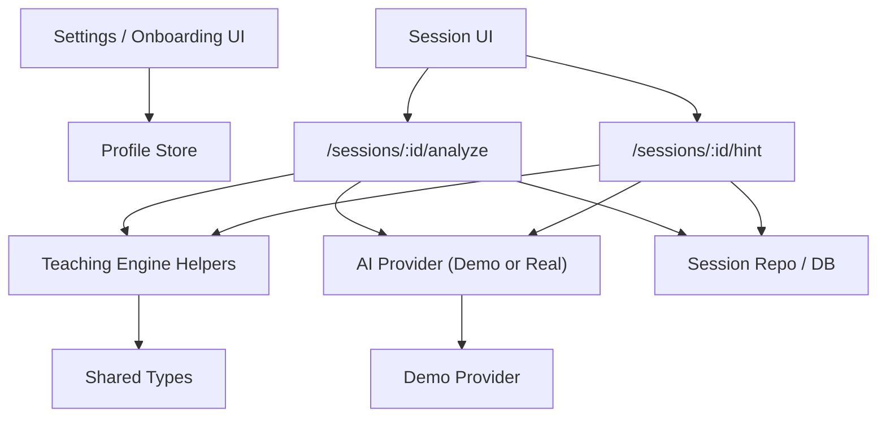
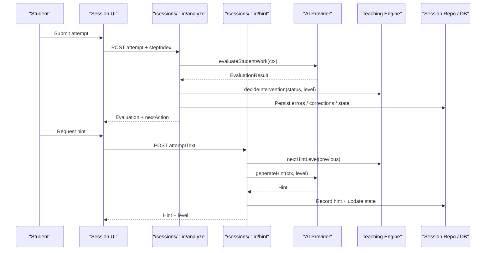
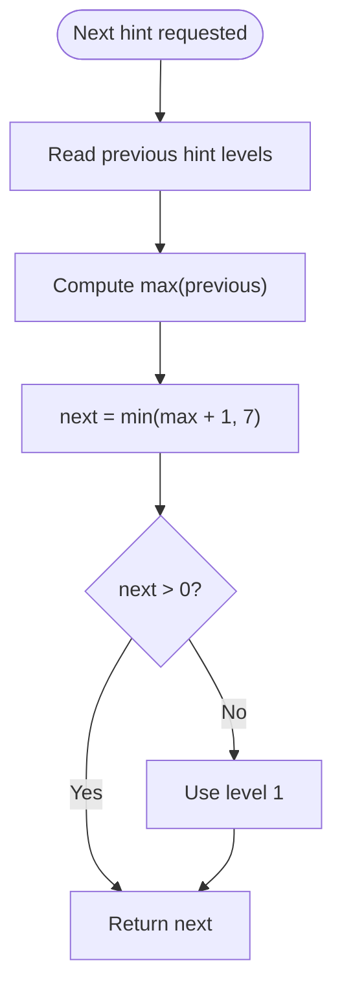
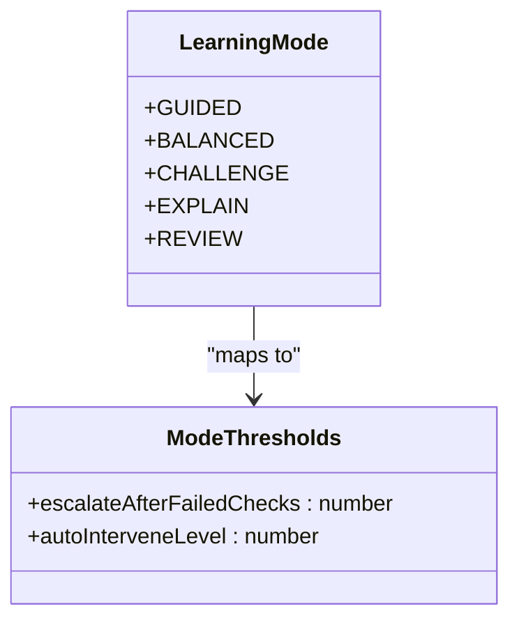
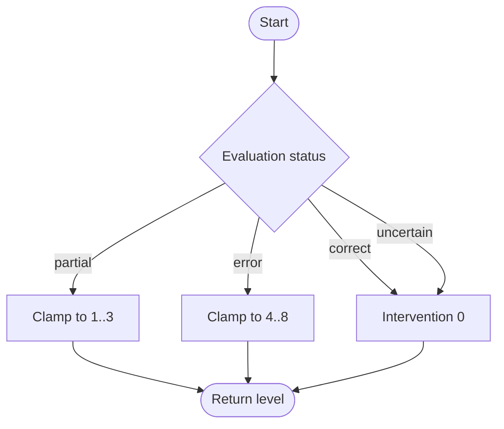
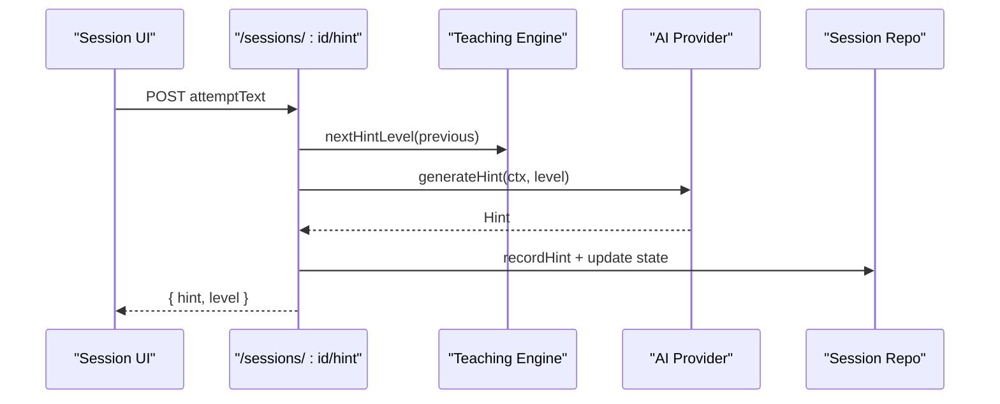
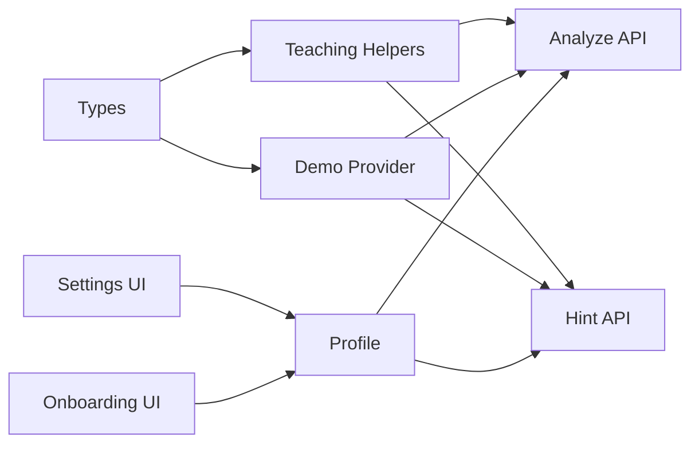

# Adaptive Guidance System

<cite>
**Referenced Files in This Document**
- [teaching.ts](file://stepwise ai/app/lib/teaching.ts)
- [types.ts](file://stepwise ai/app/lib/types.ts)
- [demoProvider.ts](file://stepwise ai/app/lib/ai/demoProvider.ts)
- [hint route.ts](file://stepwise ai/app/app/api/sessions/[id]/hint/route.ts)
- [analyze route.ts](file://stepwise ai/app/app/api/sessions/[id]/analyze/route.ts)
- [settings page.tsx](file://stepwise ai/app/app/settings/page.tsx)
- [onboarding page.tsx](file://stepwise ai/app/app/onboarding/page.tsx)
- [05-teaching-engine.md.txt](file://stepwise ai/specs/05-teaching-engine.md.txt)
- [STEPWISE_MASTER_SPEC.md.txt](file://stepwise ai/specs/STEPWISE_MASTER_SPEC.md.txt)
</cite>

## Table of Contents
1. Introduction
2. Project Structure
3. Core Components
4. Architecture Overview
5. Detailed Component Analysis
6. Dependency Analysis
7. Performance Considerations
8. Troubleshooting Guide
9. Conclusion
10. Appendices

## Introduction
This document explains StepWise AI’s Adaptive Guidance System: how it escalates hints, decides when to intervene, and adapts to student profiles and learning modes. It covers the 7-level hint ladder from “Gentle nudge” to “Worked explanation,” the five learning modes with threshold configurations, the nextHintLevel algorithm, and the decideIntervention policy that balances direct help with independent problem-solving. It also provides configuration examples for different student profiles and subject contexts.

## Project Structure
The adaptive guidance system spans a small set of focused modules:
- Teaching engine helpers define feedback labels, hint titles, thresholds per learning mode, escalation logic, and intervention decisions.
- Types define domain models such as EvaluationStatus, HintLevel, LearningMode, AgeBand, and ExplanationDepth.
- A demo provider implements evaluation heuristics and builds the 7-level hint ladder used by the hint API.
- API routes orchestrate session state transitions, persist evidence, and call into the AI provider for evaluation and hint generation.
- Settings and onboarding UI collect profile preferences (age band, autonomy level, explanation depth, learning mode).

**Diagram sources**
- [analyze route.ts:19-179](file://stepwise ai/app/app/api/sessions/[id]/analyze/route.ts#L19-L179)
- [hint route.ts:18-92](file://stepwise ai/app/app/api/sessions/[id]/hint/route.ts#L18-L92)
- [teaching.ts:8-76](file://stepwise ai/app/lib/teaching.ts#L8-L76)
- [demoProvider.ts:205-450](file://stepwise ai/app/lib/ai/demoProvider.ts#L205-L450)
- [types.ts:61-237](file://stepwise ai/app/lib/types.ts#L61-L237)

**Section sources**
- [teaching.ts:1-76](file://stepwise ai/app/lib/teaching.ts#L1-L76)
- [types.ts:1-302](file://stepwise ai/app/lib/types.ts#L1-L302)
- [demoProvider.ts:1-451](file://stepwise ai/app/lib/ai/demoProvider.ts#L1-L451)
- [hint route.ts:1-93](file://stepwise ai/app/app/api/sessions/[id]/hint/route.ts#L1-L93)
- [analyze route.ts:1-180](file://stepwise ai/app/app/api/sessions/[id]/analyze/route.ts#L1-L180)
- [settings page.tsx:109-170](file://stepwise ai/app/app/settings/page.tsx#L109-L170)
- [onboarding page.tsx:84-139](file://stepwise ai/app/app/onboarding/page.tsx#L84-L139)

## Core Components
- Feedback labels and hint titles: standardized icons and text for consistent user-facing feedback; hint titles map levels 1–7 to “Gentle nudge,” “Direction,” “Specific hint,” “Example,” “Partial structure,” “Nearly there,” and “Worked explanation.”
- Learning modes and thresholds: each mode configures how quickly hints escalate and when auto-intervention occurs.
- Escalation algorithm: nextHintLevel computes the next hint level based on previous hints, capped at 7.
- Intervention policy: decideIntervention maps evaluation status to an intervention level that determines whether to encourage independence or provide direct help.
- Hint ladder builder: constructs contextual hints from step metadata and expected concepts.

**Section sources**
- [teaching.ts:8-76](file://stepwise ai/app/lib/teaching.ts#L8-L76)
- [demoProvider.ts:404-450](file://stepwise ai/app/lib/ai/demoProvider.ts#L404-L450)
- [types.ts:116-237](file://stepwise ai/app/lib/types.ts#L116-L237)

## Architecture Overview
The system follows a clear loop:
- Student submits work or requests a hint.
- The analyze or hint API builds an evaluation context including question, step, board snapshot, previous hints, age band, and explanation depth.
- The AI provider evaluates work or generates a hint.
- The teaching engine adjusts intervention level and updates session state.
- Evidence is persisted for later reporting and journey updates.

**Diagram sources**
- [analyze route.ts:19-179](file://stepwise ai/app/app/api/sessions/[id]/analyze/route.ts#L19-L179)
- [hint route.ts:18-92](file://stepwise ai/app/app/api/sessions/[id]/hint/route.ts#L18-L92)
- [teaching.ts:41-76](file://stepwise ai/app/lib/teaching.ts#L41-L76)
- [demoProvider.ts:82-95](file://stepwise ai/app/lib/ai/demoProvider.ts#L82-L95)

## Detailed Component Analysis

### Hint Escalation Ladder (Levels 1–7)
The system escalates support progressively:
- Level 1: Gentle nudge — prompt re-reading and restating the step.
- Level 2: Direction — connect prior knowledge to the step.
- Level 3: Specific hint — highlight a key idea tied to expected concepts.
- Level 4: Example — model a pattern for structuring the answer.
- Level 5: Partial structure — provide a sentence frame to complete.
- Level 6: Nearly there — clarify what the step asks directly.
- Level 7: Worked explanation — walk through the concept, then continue independently.

These titles are defined centrally and used consistently across the UI and reports.

**Diagram sources**
- [teaching.ts:41-45](file://stepwise ai/app/lib/teaching.ts#L41-L45)

**Section sources**
- [teaching.ts:18-26](file://stepwise ai/app/lib/teaching.ts#L18-L26)
- [demoProvider.ts:404-450](file://stepwise ai/app/lib/ai/demoProvider.ts#L404-L450)

### Learning Modes and Thresholds
Learning modes tune pacing and intervention timing:
- GUIDED: escalate after 1 failed check; auto-intervene at level 2.
- BALANCED: escalate after 2 failed checks; auto-intervene at level 3.
- CHALLENGE: escalate after 3 failed checks; auto-intervene at level 4.
- EXPLAIN: escalate after 1 failed check; auto-intervene at level 2.
- REVIEW: escalate after 2 failed checks; auto-intervene at level 2.

These thresholds are retrieved via a helper and influence how quickly the system escalates hints and when it steps in automatically.

**Diagram sources**
- [teaching.ts:28-39](file://stepwise ai/app/lib/teaching.ts#L28-L39)
- [types.ts:232-237](file://stepwise ai/app/lib/types.ts#L232-L237)

**Section sources**
- [teaching.ts:28-39](file://stepwise ai/app/lib/teaching.ts#L28-L39)
- [settings page.tsx:151-163](file://stepwise ai/app/app/settings/page.tsx#L151-L163)

### nextHintLevel Algorithm
The algorithm ensures progressive escalation:
- Compute the maximum previous hint level.
- Increment by one, cap at 7.
- If no previous hints exist, start at level 1.

This guarantees steady progression without overwhelming the student and prevents regression in hint intensity.

**Section sources**
- [teaching.ts:41-45](file://stepwise ai/app/lib/teaching.ts#L41-L45)

### decideIntervention Policy
The policy balances encouragement and direct help:
- Correct or uncertain responses: no intervention (level 0).
- Partial correctness: encourage and ask first; clamp to levels 1–3.
- Errors: intervene more strongly; clamp to levels 4–8.

This policy is applied after AI evaluation to determine the appropriate response strategy.

**Diagram sources**
- [teaching.ts:65-76](file://stepwise ai/app/lib/teaching.ts#L65-L76)

**Section sources**
- [teaching.ts:65-76](file://stepwise ai/app/lib/teaching.ts#L65-L76)
- [analyze route.ts:83-88](file://stepwise ai/app/app/api/sessions/[id]/analyze/route.ts#L83-L88)

### Hint Generation Flow
When a student requests a hint:
- The API reads previous hints and computes the next level.
- It builds an evaluation context with step details, board snapshot, student age band, and explanation depth.
- The AI provider generates a contextual hint using the built ladder.
- The hint is recorded, session state updated, and returned to the UI.

**Diagram sources**
- [hint route.ts:18-92](file://stepwise ai/app/app/api/sessions/[id]/hint/route.ts#L18-L92)
- [teaching.ts:41-45](file://stepwise ai/app/lib/teaching.ts#L41-L45)
- [demoProvider.ts:90-95](file://stepwise ai/app/lib/ai/demoProvider.ts#L90-L95)

**Section sources**
- [hint route.ts:18-92](file://stepwise ai/app/app/api/sessions/[id]/hint/route.ts#L18-L92)
- [demoProvider.ts:90-95](file://stepwise ai/app/lib/ai/demoProvider.ts#L90-L95)

### Conceptual Overview
Conceptually, the system preserves the core teaching philosophy: provide the smallest useful assistance that allows the student to keep thinking. It observes, understands, evaluates, decides intervention, responds, and re-evaluates until mastery is demonstrated.

[No sources needed since this section summarizes conceptual principles]

## Dependency Analysis
Key dependencies and relationships:
- API routes depend on teaching helpers for escalation and intervention decisions.
- The demo provider implements evaluation heuristics and builds the hint ladder used by the hint API.
- Types unify domain models across components.
- Settings and onboarding UI feed profile preferences that shape evaluation context and hint tone.

**Diagram sources**
- [types.ts:61-237](file://stepwise ai/app/lib/types.ts#L61-L237)
- [teaching.ts:8-76](file://stepwise ai/app/lib/teaching.ts#L8-L76)
- [demoProvider.ts:205-450](file://stepwise ai/app/lib/ai/demoProvider.ts#L205-L450)
- [analyze route.ts:19-179](file://stepwise ai/app/app/api/sessions/[id]/analyze/route.ts#L19-L179)
- [hint route.ts:18-92](file://stepwise ai/app/app/api/sessions/[id]/hint/route.ts#L18-L92)
- [settings page.tsx:109-170](file://stepwise ai/app/app/settings/page.tsx#L109-L170)
- [onboarding page.tsx:84-139](file://stepwise ai/app/app/onboarding/page.tsx#L84-L139)

**Section sources**
- [types.ts:1-302](file://stepwise ai/app/lib/types.ts#L1-L302)
- [teaching.ts:1-76](file://stepwise ai/app/lib/teaching.ts#L1-L76)
- [demoProvider.ts:1-451](file://stepwise ai/app/lib/ai/demoProvider.ts#L1-L451)
- [analyze route.ts:1-180](file://stepwise ai/app/app/api/sessions/[id]/analyze/route.ts#L1-L180)
- [hint route.ts:1-93](file://stepwise ai/app/app/api/sessions/[id]/hint/route.ts#L1-L93)
- [settings page.tsx:109-170](file://stepwise ai/app/app/settings/page.tsx#L109-L170)
- [onboarding page.tsx:84-139](file://stepwise ai/app/app/onboarding/page.tsx#L84-L139)

## Performance Considerations
- Avoid per-keystroke AI calls; meaningful submissions trigger analysis.
- Use local state and optimistic updates where possible.
- Debounce persistence and cache frequently accessed data.
- Keep evaluation context minimal to reduce overhead.

[No sources needed since this section provides general guidance]

## Troubleshooting Guide
Common issues and resolutions:
- Session already completed: APIs reject further attempts; start a new session.
- Invalid step index: validate stepIndex against current steps before submission.
- Missing profile fields: default to adult age band and standard explanation depth if not set.
- Repeated errors: ensure hints are recorded and state transitions reflect guidance; verify hintsSinceLastError tracking.

**Section sources**
- [hint route.ts:27-29](file://stepwise ai/app/app/api/sessions/[id]/hint/route.ts#L27-L29)
- [analyze route.ts:38-42](file://stepwise ai/app/app/api/sessions/[id]/analyze/route.ts#L38-L42)
- [analyze route.ts:46-81](file://stepwise ai/app/app/api/sessions/[id]/analyze/route.ts#L46-L81)
- [hint route.ts:75-86](file://stepwise ai/app/app/api/sessions/[id]/hint/route.ts#L75-L86)

## Conclusion
StepWise AI’s Adaptive Guidance System delivers a structured, pedagogically sound experience:
- Hints escalate gradually from gentle nudges to full explanations.
- Learning modes adjust pacing and intervention timing to match instructional goals.
- Intervention decisions balance encouragement with timely support.
- Profiles and settings personalize tone, depth, and autonomy.
This design aligns with the teaching engine specification and keeps students in control while ensuring they receive help exactly when needed.

[No sources needed since this section summarizes without analyzing specific files]

## Appendices

### Configuration Examples by Student Profile
- Young learner (EARLY_LEARNER):
  - Autonomy: GUIDED
  - Explanation depth: STANDARD or DETAILED
  - Learning mode: GUIDED or EXPLAIN
  - Rationale: More scaffolding and clearer language; earlier auto-intervention.
- Teen (TEEN):
  - Autonomy: BALANCED
  - Explanation depth: STANDARD
  - Learning mode: BALANCED or CHALLENGE
  - Rationale: Encourage independence while providing targeted support.
- Adult (ADULT):
  - Autonomy: INDEPENDENT
  - Explanation depth: DETAILED or DEEP_DIVE
  - Learning mode: CHALLENGE or REVIEW
  - Rationale: Deeper exploration and self-paced review.

**Section sources**
- [onboarding page.tsx:92-131](file://stepwise ai/app/app/onboarding/page.tsx#L92-L131)
- [settings page.tsx:109-170](file://stepwise ai/app/app/settings/page.tsx#L109-L170)
- [types.ts:232-237](file://stepwise ai/app/lib/types.ts#L232-L237)

### Customizing Intervention Thresholds by Subject Difficulty
- Easy topics:
  - Use BALANCED or CHALLENGE mode to allow more independent attempts before escalation.
- Hard topics:
  - Use GUIDED or EXPLAIN mode to escalate sooner and provide stronger support.
- Review sessions:
  - Use REVIEW mode to reinforce understanding with moderate escalation and frequent checks.

**Section sources**
- [teaching.ts:28-39](file://stepwise ai/app/lib/teaching.ts#L28-L39)
- [05-teaching-engine.md.txt:9-11](file://stepwise ai/specs/05-teaching-engine.md.txt#L9-L11)

### Data Model Summary
Core types relevant to adaptive guidance:
- EvaluationStatus: correct, partial, error, uncertain.
- HintLevel: 1–7.
- LearningMode: GUIDED, BALANCED, CHALLENGE, EXPLAIN, REVIEW.
- AgeBand: EARLY_LEARNER, YOUNG_LEARNER, EARLY_TEEN, TEEN, ADULT.
- ExplanationDepth: QUICK, STANDARD, DETAILED, DEEP_DIVE.

**Section sources**
- [types.ts:61-237](file://stepwise ai/app/lib/types.ts#L61-L237)