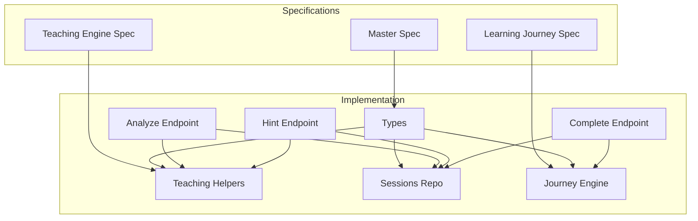
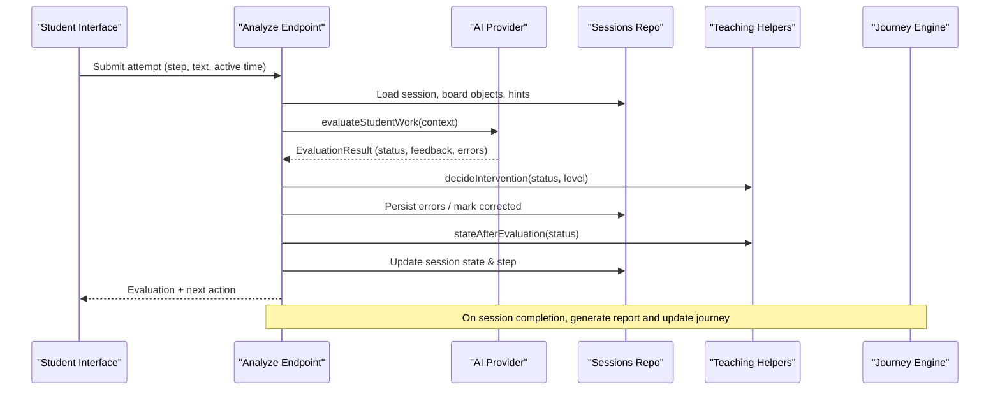
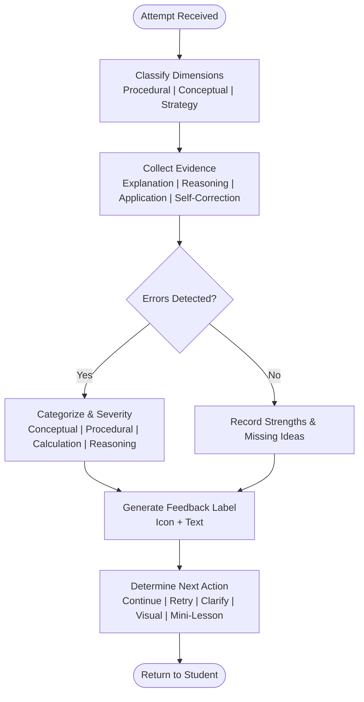
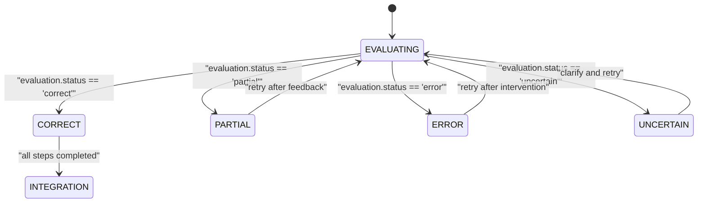
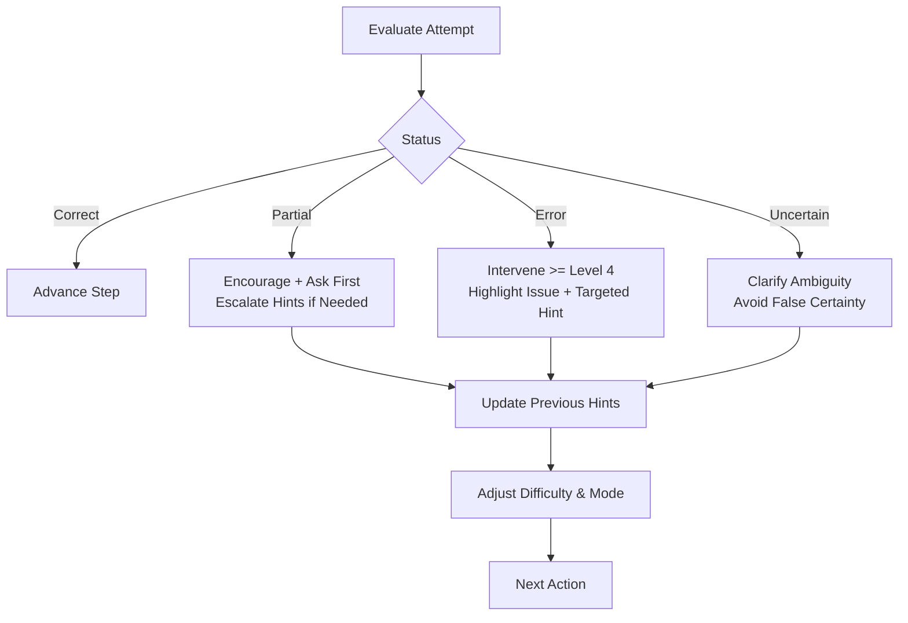
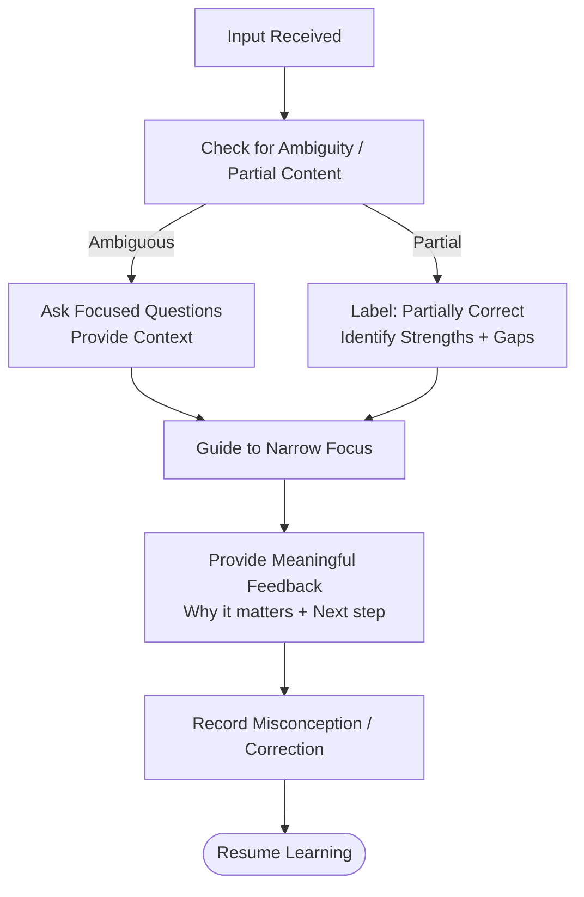
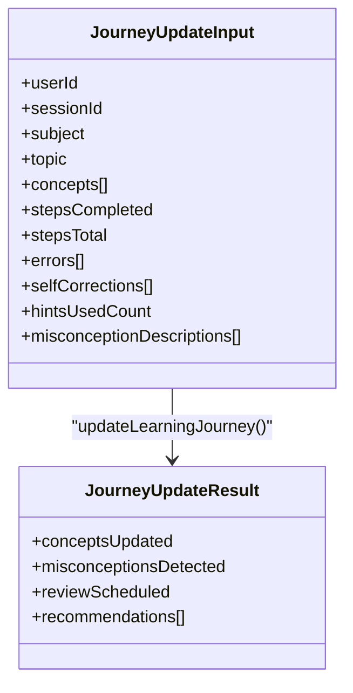
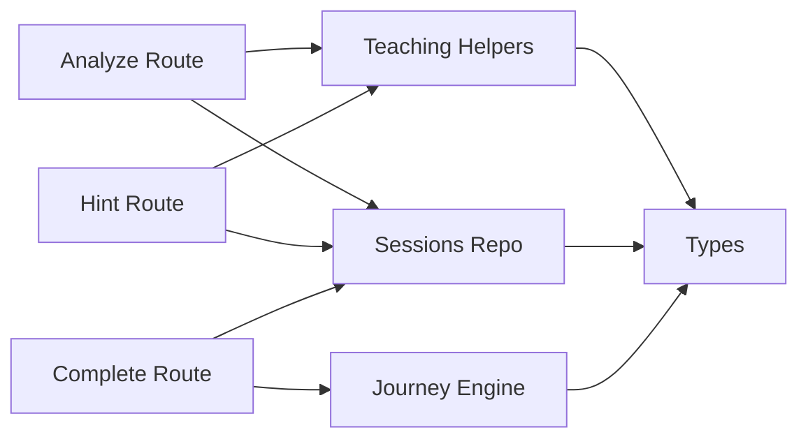

# Assessment Methods

<cite>
**Referenced Files in This Document**
- [STEPWISE_MASTER_SPEC.md.txt](file://stepwise ai/specs/STEPWISE_MASTER_SPEC.md.txt)
- [05-teaching-engine.md.txt](file://stepwise ai/specs/05-teaching-engine.md.txt)
- [07-learning-journey.md.txt](file://stepwise ai/specs/07-learning-journey.md.txt)
- [types.ts](file://stepwise ai/app/lib/types.ts)
- [teaching.ts](file://stepwise ai/app/lib/teaching.ts)
- [journey.ts](file://stepwise ai/app/lib/journey.ts)
- [sessionsRepo.ts](file://stepwise ai/app/lib/sessionsRepo.ts)
- [analyze route.ts](file://stepwise ai/app/app/api/sessions/[id]/analyze/route.ts)
- [hint route.ts](file://stepwise ai/app/app/api/sessions/[id]/hint/route.ts)
- [complete route.ts](file://stepwise ai/app/app/api/sessions/[id]/complete/route.ts)
</cite>

## Table of Contents
1. Introduction
2. Project Structure
3. Core Components
4. Architecture Overview
5. Detailed Component Analysis
6. Dependency Analysis
7. Performance Considerations
8. Troubleshooting Guide
9. Conclusion
10. Appendices

## Introduction
This document explains StepWise AI’s assessment methods that measure conceptual understanding beyond simple correctness. It covers a multi-dimensional approach evaluating procedural knowledge, conceptual understanding, and problem-solving strategies; the state machine transitions used to guide teaching decisions; integration with the Learning Journey for long-term progress tracking; adaptive techniques that adjust difficulty and type based on demonstrated understanding; and how ambiguous or partially correct responses are handled with meaningful feedback.

## Project Structure
Assessment logic spans specifications and implementation:
- Specifications define the philosophy, evaluation labels, hint escalation, journey model, and mastery evidence.
- Implementation provides types, teaching helpers, session lifecycle, learning journey updates, and API endpoints that orchestrate evaluation, hints, completion, and reporting.

**Diagram sources**
- [STEPWISE_MASTER_SPEC.md.txt](file://stepwise ai/specs/STEPWISE_MASTER_SPEC.md.txt)
- [05-teaching-engine.md.txt](file://stepwise ai/specs/05-teaching-engine.md.txt)
- [07-learning-journey.md.txt](file://stepwise ai/specs/07-learning-journey.md.txt)
- [types.ts](file://stepwise ai/app/lib/types.ts)
- [teaching.ts](file://stepwise ai/app/lib/teaching.ts)
- [sessionsRepo.ts](file://stepwise ai/app/lib/sessionsRepo.ts)
- [journey.ts](file://stepwise ai/app/lib/journey.ts)
- [analyze route.ts](file://stepwise ai/app/app/api/sessions/[id]/analyze/route.ts)
- [hint route.ts](file://stepwise ai/app/app/api/sessions/[id]/hint/route.ts)
- [complete route.ts](file://stepwise ai/app/app/api/sessions/[id]/complete/route.ts)

**Section sources**
- [STEPWISE_MASTER_SPEC.md.txt](file://stepwise ai/specs/STEPWISE_MASTER_SPEC.md.txt)
- [05-teaching-engine.md.txt](file://stepwise ai/specs/05-teaching-engine.md.txt)
- [07-learning-journey.md.txt](file://stepwise ai/specs/07-learning-journey.md.txt)

## Core Components
- Evaluation and feedback taxonomy: standardized labels and icons ensure consistent, accessible feedback across the system.
- Session state machine: transitions between CORRECT, PARTIAL, ERROR, UNCERTAIN drive next actions and progression.
- Hint escalation: progressive support levels avoid giving answers while guiding reasoning.
- Learning Journey: concept-based, evidence-driven mastery with misconception lifecycle and recommendations.
- Session repository: persists board objects, errors, hints, messages, and session state safely.
- API endpoints: analyze, hint, and complete orchestrate evaluation, guidance, and final reporting.

**Section sources**
- [types.ts](file://stepwise ai/app/lib/types.ts)
- [teaching.ts](file://stepwise ai/app/lib/teaching.ts)
- [journey.ts](file://stepwise ai/app/lib/journey.ts)
- [sessionsRepo.ts](file://stepwise ai/app/lib/sessionsRepo.ts)
- [analyze route.ts](file://stepwise ai/app/app/api/sessions/[id]/analyze/route.ts)
- [hint route.ts](file://stepwise ai/app/app/api/sessions/[id]/hint/route.ts)
- [complete route.ts](file://stepwise ai/app/app/api/sessions/[id]/complete/route.ts)

## Architecture Overview
The assessment pipeline connects student work to AI evaluation, teaching decisions, and long-term learning records.

**Diagram sources**
- [analyze route.ts](file://stepwise ai/app/app/api/sessions/[id]/analyze/route.ts)
- [teaching.ts](file://stepwise ai/app/lib/teaching.ts)
- [sessionsRepo.ts](file://stepwise ai/app/lib/sessionsRepo.ts)
- [journey.ts](file://stepwise ai/app/lib/journey.ts)

## Detailed Component Analysis

### Multi-Dimensional Assessment Model
StepWise evaluates multiple dimensions:
- Procedural knowledge: whether steps are followed correctly and in order.
- Conceptual understanding: meaning, relationships, and explanations.
- Problem-solving strategy: planning, reasoning, transfer, and application.

Evidence is captured through:
- Correct explanations, reasoning, applications, self-corrections, variations, and teach-backs.
- Error categories and severities distinguish conceptual, procedural, calculation, reasoning, and other issues.
- Feedback labels provide clear, icon-backed signals without relying solely on color.

**Diagram sources**
- [types.ts](file://stepwise ai/app/lib/types.ts)
- [teaching.ts](file://stepwise ai/app/lib/teaching.ts)
- [analyze route.ts](file://stepwise ai/app/app/api/sessions/[id]/analyze/route.ts)

**Section sources**
- [types.ts](file://stepwise ai/app/lib/types.ts)
- [05-teaching-engine.md.txt](file://stepwise ai/specs/05-teaching-engine.md.txt)

### State Machine Transitions and Teaching Decisions
The session state machine uses four primary outcomes per evaluation:
- CORRECT: advances the step; if all steps completed, moves toward integration/completion.
- PARTIAL: encourages retry with targeted feedback; may escalate hints.
- ERROR: pauses progression; highlights issues; provides targeted intervention.
- UNCERTAIN: clarifies ambiguity; avoids false certainty; asks focused questions.

Transitions are computed from AI evaluation status and influence next actions and progression.

**Diagram sources**
- [types.ts](file://stepwise ai/app/lib/types.ts)
- [teaching.ts](file://stepwise ai/app/lib/teaching.ts)
- [analyze route.ts](file://stepwise ai/app/app/api/sessions/[id]/analyze/route.ts)

**Section sources**
- [teaching.ts](file://stepwise ai/app/lib/teaching.ts)
- [analyze route.ts](file://stepwise ai/app/app/api/sessions/[id]/analyze/route.ts)

### Adaptive Assessment Techniques
Adaptation occurs at several layers:
- Difficulty control: internal difficulty adjusts based on accuracy, hints, time, mistakes, and confidence.
- Question type adaptation: supports math, science, CS, humanities, open-ended, numerical, and multi-step problems.
- Hint escalation: seven levels from gentle nudge to worked explanation, tuned by learning mode thresholds.
- Intervention policy: differentiates partial vs error vs uncertain to choose encouragement, questioning, examples, visuals, mini-lessons, or full explanations.
- Personalization: age band and explanation depth shape tone and complexity.

**Diagram sources**
- [teaching.ts](file://stepwise ai/app/lib/teaching.ts)
- [05-teaching-engine.md.txt](file://stepwise ai/specs/05-teaching-engine.md.txt)
- [types.ts](file://stepwise ai/app/lib/types.ts)

**Section sources**
- [teaching.ts](file://stepwise ai/app/lib/teaching.ts)
- [05-teaching-engine.md.txt](file://stepwise ai/specs/05-teaching-engine.md.txt)
- [types.ts](file://stepwise ai/app/lib/types.ts)

### Handling Ambiguous and Partially Correct Responses
Ambiguity and partial correctness are treated as learning opportunities:
- Uncertain evaluations trigger clarification rather than correction.
- Partially correct responses receive specific feedback identifying what is right and what is missing.
- Misconceptions are tracked with lifecycle states and recurring patterns inform future interventions.
- The system avoids replacing student work; it preserves original attempts and corrections as evidence.

**Diagram sources**
- [teaching.ts](file://stepwise ai/app/lib/teaching.ts)
- [05-teaching-engine.md.txt](file://stepwise ai/specs/05-teaching-engine.md.txt)
- [journey.ts](file://stepwise ai/app/lib/journey.ts)

**Section sources**
- [teaching.ts](file://stepwise ai/app/lib/teaching.ts)
- [05-teaching-engine.md.txt](file://stepwise ai/specs/05-teaching-engine.md.txt)
- [journey.ts](file://stepwise ai/app/lib/journey.ts)

### Integration with the Learning Journey
The Learning Journey maintains a concept-based map of understanding:
- Concepts transition through states like INTRODUCED, EXPLORING, DEVELOPING, UNDERSTOOD, STRONG, MASTERED.
- Mastery requires varied evidence; one session does not grant mastery.
- Misconceptions have lifecycles and recurring patterns increase priority.
- Recommendations are explainable and shame-free, suggesting continue, review, strengthen prerequisites, practice, go deeper, apply, explore, or rest.
- Spaced review items are scheduled for developing concepts.

**Diagram sources**
- [journey.ts](file://stepwise ai/app/lib/journey.ts)
- [types.ts](file://stepwise ai/app/lib/types.ts)

**Section sources**
- [journey.ts](file://stepwise ai/app/lib/journey.ts)
- [07-learning-journey.md.txt](file://stepwise ai/specs/07-learning-journey.md.txt)
- [types.ts](file://stepwise ai/app/lib/types.ts)

### Performance and Reliability Characteristics
- Evaluation is triggered only on meaningful submissions, not per keystroke or object move.
- Ownership checks re-verify access for every protected resource.
- Board snapshots and state data are persisted efficiently; large payloads are truncated safely.
- Completion endpoint is idempotent to prevent duplicate reports.

**Section sources**
- [analyze route.ts](file://stepwise ai/app/app/api/sessions/[id]/analyze/route.ts)
- [sessionsRepo.ts](file://stepwise ai/app/lib/sessionsRepo.ts)
- [complete route.ts](file://stepwise ai/app/app/api/sessions/[id]/complete/route.ts)

## Dependency Analysis
Key dependencies and coupling:
- API routes depend on sessionsRepo for persistence and teaching helpers for decision logic.
- Teaching helpers centralize feedback labels, hint escalation, and intervention policies.
- Journey engine depends on types and DB to maintain concept states, misconceptions, and recommendations.
- Types unify domain models across evaluation, hints, sessions, and journey.

**Diagram sources**
- [analyze route.ts](file://stepwise ai/app/app/api/sessions/[id]/analyze/route.ts)
- [hint route.ts](file://stepwise ai/app/app/api/sessions/[id]/hint/route.ts)
- [complete route.ts](file://stepwise ai/app/app/api/sessions/[id]/complete/route.ts)
- [teaching.ts](file://stepwise ai/app/lib/teaching.ts)
- [sessionsRepo.ts](file://stepwise ai/app/lib/sessionsRepo.ts)
- [journey.ts](file://stepwise ai/app/lib/journey.ts)
- [types.ts](file://stepwise ai/app/lib/types.ts)

**Section sources**
- [teaching.ts](file://stepwise ai/app/lib/teaching.ts)
- [sessionsRepo.ts](file://stepwise ai/app/lib/sessionsRepo.ts)
- [journey.ts](file://stepwise ai/app/lib/journey.ts)
- [types.ts](file://stepwise ai/app/lib/types.ts)

## Performance Considerations
- Avoid per-keystroke AI calls; evaluate only on meaningful events.
- Use local state and optimistic updates where appropriate; persist snapshots atomically.
- Truncate large fields to protect database integrity and performance.
- Debounce persistence and caching can further reduce overhead.

[No sources needed since this section provides general guidance]

## Troubleshooting Guide
Common issues and resolutions:
- Unauthorized or not found: verify user authentication and session ownership before accessing resources.
- Invalid step index: validate stepIndex against analysis.steps length.
- Completed session: do not allow further analyze/hint requests once status is completed.
- Duplicate reports: complete endpoint is idempotent; existing reports are returned.
- Misclassification of uncertainty: use UNCERTAIN to clarify rather than force correctness.

**Section sources**
- [analyze route.ts](file://stepwise ai/app/app/api/sessions/[id]/analyze/route.ts)
- [hint route.ts](file://stepwise ai/app/app/api/sessions/[id]/hint/route.ts)
- [complete route.ts](file://stepwise ai/app/app/api/sessions/[id]/complete/route.ts)

## Conclusion
StepWise AI’s assessment methods measure conceptual understanding through multi-dimensional evaluation, structured feedback, and adaptive teaching. The state machine transitions guide immediate instructional decisions, while the Learning Journey captures long-term growth, misconceptions, and personalized recommendations. By handling ambiguity carefully and preserving student reasoning, the system fosters independent thinking and durable understanding.

[No sources needed since this section summarizes without analyzing specific files]

## Appendices

### Assessment Rubrics and Labels
- Feedback labels include correct understanding, partially correct, missing idea, concept error, think about this, check this step, and AI uncertain. Each label pairs an icon with text for accessibility.
- Error categories cover conceptual, procedural, calculation, misreading, missing step, incomplete answer, vocabulary, reasoning, application, graph/diagram, unit/notation, and language-only issues.
- Severity levels range from minor to foundational, informing intervention intensity.

**Section sources**
- [teaching.ts](file://stepwise ai/app/lib/teaching.ts)
- [types.ts](file://stepwise ai/app/lib/types.ts)
- [05-teaching-engine.md.txt](file://stepwise ai/specs/05-teaching-engine.md.txt)

### Performance Analytics and Reporting
- Session stats include total and active seconds, hints used, errors with correction status, and step completion metrics.
- Final reports summarize understanding progression, key takeaways, remaining gaps, and next learning recommendations.
- Journey analytics show concept statuses, misconception histories, reviews due, and recommendations.

**Section sources**
- [sessionsRepo.ts](file://stepwise ai/app/lib/sessionsRepo.ts)
- [complete route.ts](file://stepwise ai/app/app/api/sessions/[id]/complete/route.ts)
- [journey.ts](file://stepwise ai/app/lib/journey.ts)
- [types.ts](file://stepwise ai/app/lib/types.ts)