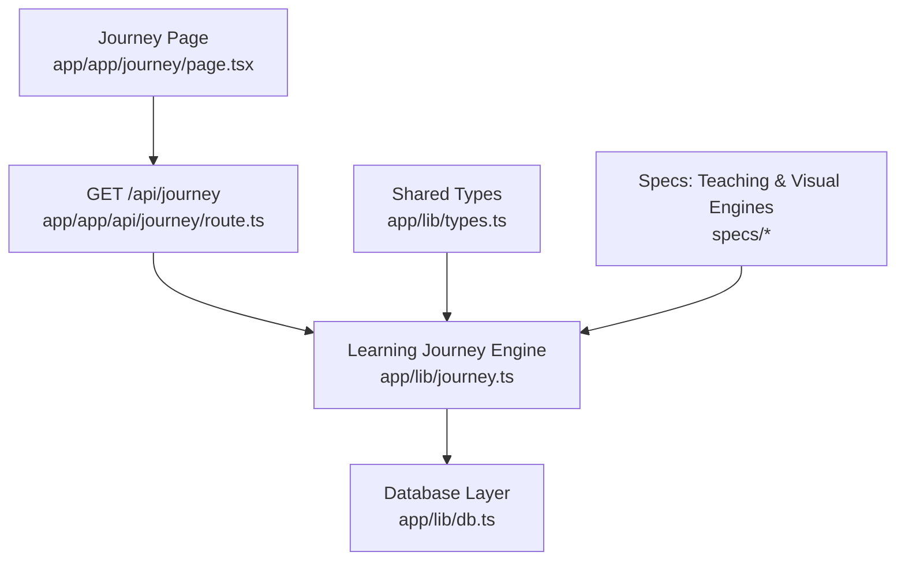
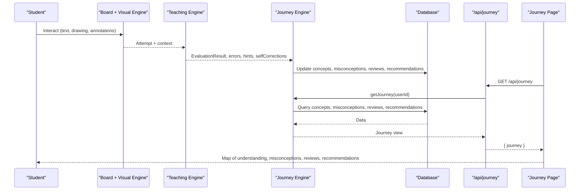
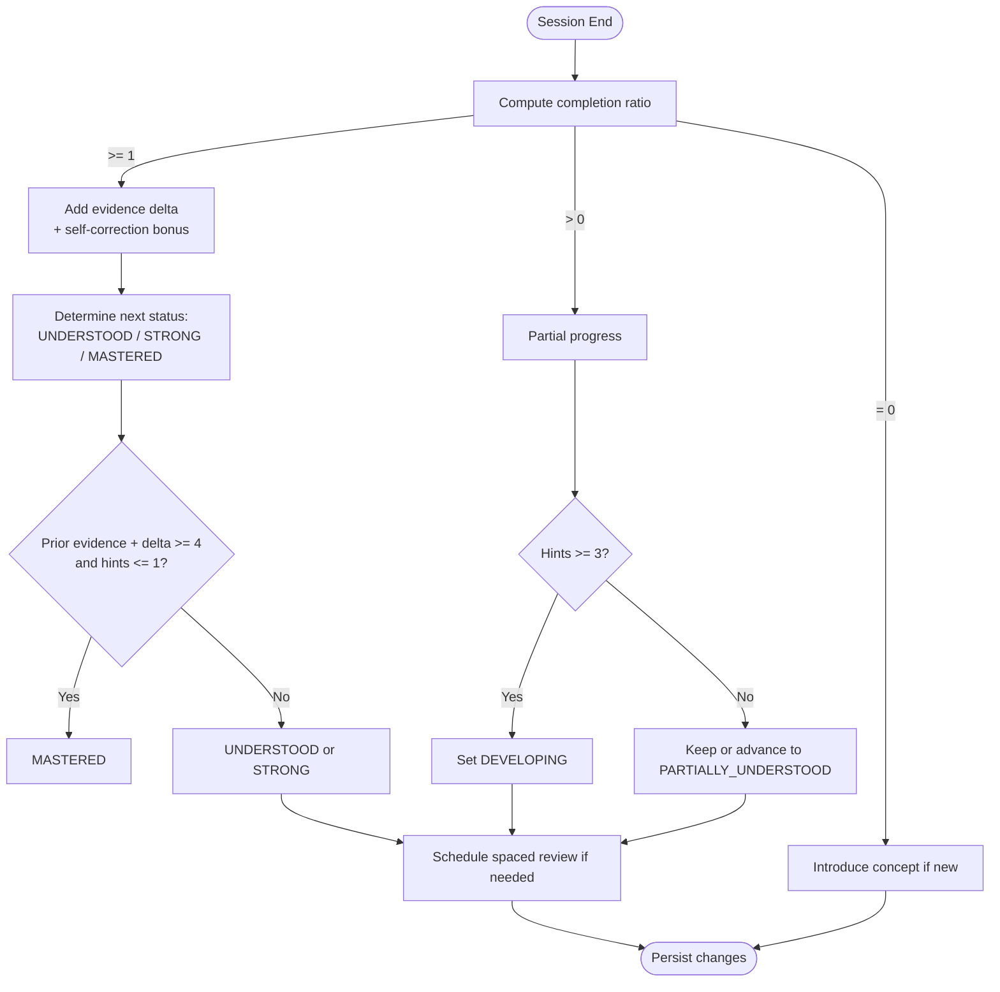
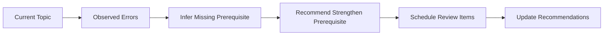
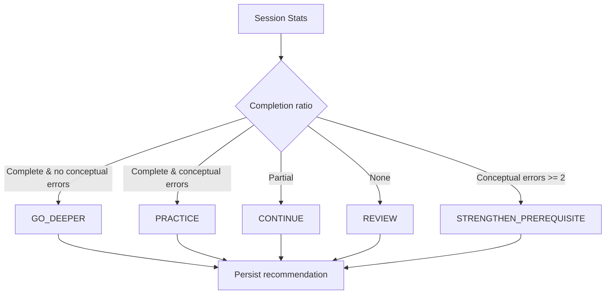
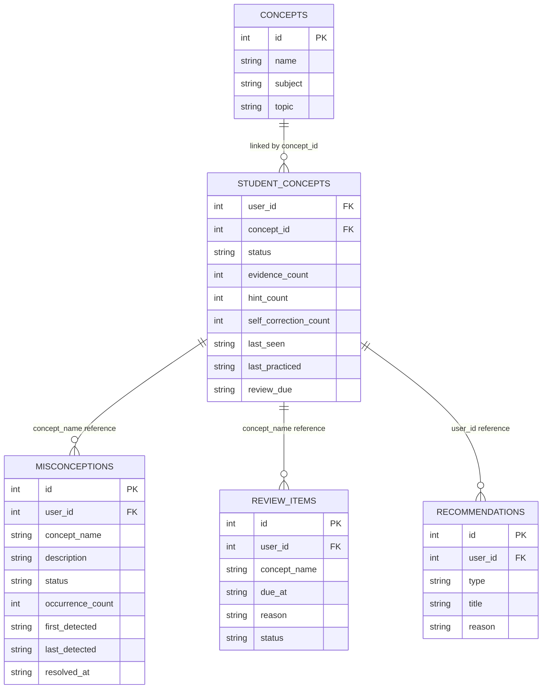
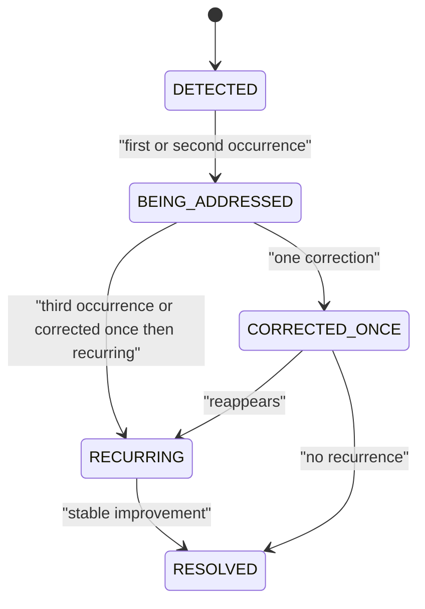
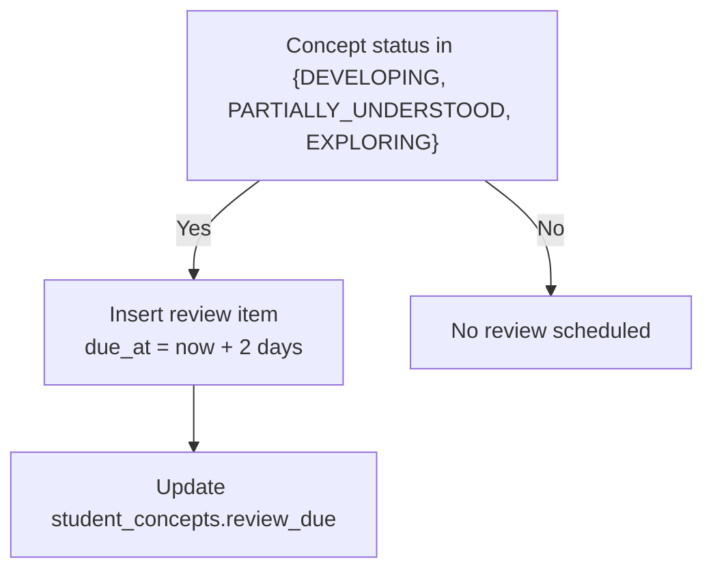
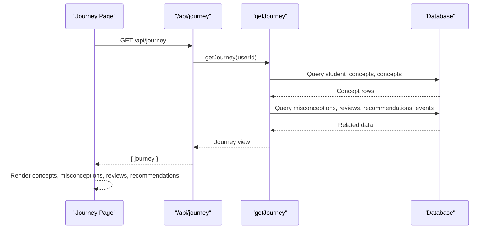
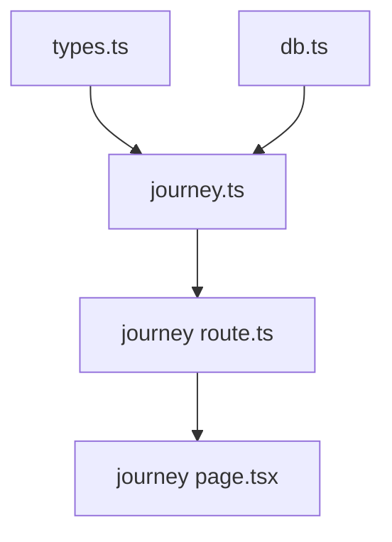

# Concept Mapping System

<cite>
**Referenced Files in This Document**
- [journey.ts](file://stepwise ai/app/lib/journey.ts)
- [types.ts](file://stepwise ai/app/lib/types.ts)
- [db.ts](file://stepwise ai/app/lib/db.ts)
- [route.ts (journey)](file://stepwise ai/app/app/api/journey/route.ts)
- [page.tsx (journey UI)](file://stepwise ai/app/app/journey/page.tsx)
- [07-learning-journey.md.txt](file://stepwise ai/specs/07-learning-journey.md.txt)
- [05-teaching-engine.md.txt](file://stepwise ai/specs/05-teaching-engine.md.txt)
- [06-visual-learning-engine.md.txt](file://stepwise ai/specs/06-visual-learning-engine.md.txt)
</cite>

## Table of Contents
1. Introduction
2. Project Structure
3. Core Components
4. Architecture Overview
5. Detailed Component Analysis
6. Dependency Analysis
7. Performance Considerations
8. Troubleshooting Guide
9. Conclusion
10. Appendices

## Introduction
This document explains StepWise AI’s Concept Mapping System: how concepts are structured hierarchically with dependencies, how student understanding is mapped across related topics, and how personalized learning paths are generated from evidence collected during sessions. It focuses on concept mastery assessment beyond simple right/wrong answers, prerequisite tracking to identify knowledge gaps, and the generation of tailored next steps based on misconceptions and progress.

The system treats each concept as a node in a learning graph. Evidence from board interactions, hints used, self-corrections, and conceptual errors drives state transitions for each concept. Misconceptions are tracked with lifecycles and recurrence signals. Recommendations are explainable and tied to current goals, prerequisites, and recent performance.

## Project Structure
At a high level, the Concept Mapping System spans:
- Domain types that define states, errors, recommendations, and session artifacts
- A journey engine that updates and reads the long-term learning map
- A database layer that persists concepts, student-concept states, misconceptions, reviews, and recommendations
- An API route exposing the current user’s journey
- A UI page visualizing concepts, misconceptions, upcoming reviews, and recommendations
- Specifications defining the intended behavior of the teaching and visual engines that feed evidence into the journey

**Diagram sources**
- [route.ts (journey):1-17](file://stepwise ai/app/app/api/journey/route.ts#L1-L17)
- [journey.ts:1-357](file://stepwise ai/app/lib/journey.ts#L1-L357)
- [db.ts:1-224](file://stepwise ai/app/lib/db.ts#L1-L224)
- [types.ts:1-302](file://stepwise ai/app/lib/types.ts#L1-L302)
- [page.tsx (journey UI):1-207](file://stepwise ai/app/app/journey/page.tsx#L1-L207)

**Section sources**
- [route.ts (journey):1-17](file://stepwise ai/app/app/api/journey/route.ts#L1-L17)
- [journey.ts:1-357](file://stepwise ai/app/lib/journey.ts#L1-L357)
- [db.ts:1-224](file://stepwise ai/app/lib/db.ts#L1-L224)
- [types.ts:1-302](file://stepwise ai/app/lib/types.ts#L1-L302)
- [page.tsx (journey UI):1-207](file://stepwise ai/app/app/journey/page.tsx#L1-L207)

## Core Components
- Concept model and states: Concepts are identified by name, subject, and topic. Each student has per-concept status, confidence, evidence counts, hint usage, and review scheduling.
- Mastery evidence: Completion ratios, self-corrections, conceptual errors, and hint levels influence whether a concept moves toward UNDERSTOOD, STRONG, or MASTERED.
- Misconception lifecycle: Detected misconceptions are recorded with occurrence counts and statuses such as DETECTED, BEING_ADDRESSED, RECURRING, RESOLVED.
- Spaced review: Developing or partially understood concepts schedule future review items.
- Recommendations: Explainable suggestions like CONTINUE, REVIEW, STRENGTHEN_PREREQUISITE, PRACTICE, GO_DEEPER, APPLY, EXPLORE, REST.
- Read side: Aggregates concepts, misconceptions, reviews, recommendations, events, and summary stats for the UI.

**Section sources**
- [journey.ts:10-19](file://stepwise ai/app/lib/journey.ts#L10-L19)
- [journey.ts:26-36](file://stepwise ai/app/lib/journey.ts#L26-L36)
- [journey.ts:59-261](file://stepwise ai/app/lib/journey.ts#L59-L261)
- [journey.ts:274-357](file://stepwise ai/app/lib/journey.ts#L274-L357)
- [types.ts:149-193](file://stepwise ai/app/lib/types.ts#L149-L193)

## Architecture Overview
The Concept Mapping System integrates three layers:
- Evidence capture: The Teaching Engine and Visual Learning Engine produce structured evaluation results, errors, hints, and board snapshots. These become inputs to the journey update.
- Journey processing: The journey engine computes concept state transitions, schedules reviews, records misconceptions, and generates recommendations.
- Persistence and exposure: The database layer stores all entities; an API exposes the current user’s journey; the UI renders it.

**Diagram sources**
- [journey.ts:59-261](file://stepwise ai/app/lib/journey.ts#L59-L261)
- [journey.ts:274-357](file://stepwise ai/app/lib/journey.ts#L274-L357)
- [route.ts (journey):1-17](file://stepwise ai/app/app/api/journey/route.ts#L1-L17)
- [page.tsx (journey UI):61-87](file://stepwise ai/app/app/journey/page.tsx#L61-L87)

## Detailed Component Analysis

### Concept Mastery Assessment
Concept mastery is not binary. The system uses multiple signals:
- Session completion ratio: Full completion adds evidence; partial completion advances to developing or partially understood depending on hint usage.
- Self-corrections: Recognized as strong evidence of understanding and increase confidence.
- Conceptual errors: Presence pushes concepts back to DEVELOPING when incomplete.
- Hint dependency: High hint usage prevents premature mastery.
- Evidence accumulation: Multiple varied evidences over time are required to reach MASTERED.

**Diagram sources**
- [journey.ts:100-196](file://stepwise ai/app/lib/journey.ts#L100-L196)
- [types.ts:149-193](file://stepwise ai/app/lib/types.ts#L149-L193)

**Section sources**
- [journey.ts:100-196](file://stepwise ai/app/lib/journey.ts#L100-L196)
- [types.ts:149-193](file://stepwise ai/app/lib/types.ts#L149-L193)

### Prerequisite Tracking and Knowledge Gaps
Prerequisites are modeled as relationships between concepts. When repeated conceptual errors occur, the system can infer missing foundational knowledge and recommend strengthening prerequisites. The read side surfaces misconceptions and review items that indicate gaps.

**Diagram sources**
- [journey.ts:199-242](file://stepwise ai/app/lib/journey.ts#L199-L242)
- [types.ts:179-193](file://stepwise ai/app/lib/types.ts#L179-L193)

**Section sources**
- [journey.ts:199-242](file://stepwise ai/app/lib/journey.ts#L199-L242)
- [types.ts:179-193](file://stepwise ai/app/lib/types.ts#L179-L193)

### Personalized Learning Path Generation
After meaningful sessions, the system produces explainable recommendations based on:
- Completion ratio
- Conceptual error count
- Recent progress
- Current goal and prerequisite needs

Examples include continuing, reviewing, practicing, going deeper, applying, exploring, or resting.

**Diagram sources**
- [journey.ts:199-242](file://stepwise ai/app/lib/journey.ts#L199-L242)
- [types.ts:179-193](file://stepwise ai/app/lib/types.ts#L179-L193)

**Section sources**
- [journey.ts:199-242](file://stepwise ai/app/lib/journey.ts#L199-L242)
- [types.ts:179-193](file://stepwise ai/app/lib/types.ts#L179-L193)

### Concept Graph Construction and Dependency Resolution
Concepts are stored with name, subject, and topic. Student-concept rows track per-user status and evidence. While explicit prerequisite edges are defined in the data schema, the current journey update logic primarily uses observed errors and completion to infer prerequisite needs and generate recommendations. Dependency resolution occurs at recommendation time by identifying foundational gaps from conceptual errors.

**Diagram sources**
- [db.ts:23-44](file://stepwise ai/app/lib/db.ts#L23-L44)
- [journey.ts:26-36](file://stepwise ai/app/lib/journey.ts#L26-L36)
- [journey.ts:68-98](file://stepwise ai/app/lib/journey.ts#L68-L98)
- [journey.ts:138-196](file://stepwise ai/app/lib/journey.ts#L138-L196)
- [journey.ts:234-242](file://stepwise ai/app/lib/journey.ts#L234-L242)

**Section sources**
- [db.ts:23-44](file://stepwise ai/app/lib/db.ts#L23-L44)
- [journey.ts:26-36](file://stepwise ai/app/lib/journey.ts#L26-L36)
- [journey.ts:68-98](file://stepwise ai/app/lib/journey.ts#L68-L98)
- [journey.ts:138-196](file://stepwise ai/app/lib/journey.ts#L138-L196)
- [journey.ts:234-242](file://stepwise ai/app/lib/journey.ts#L234-L242)

### Misconception Lifecycle and Recurrence
Misconceptions are tracked with occurrence counts and statuses. Recurring patterns elevate priority and inform future interventions.

**Diagram sources**
- [journey.ts:68-98](file://stepwise ai/app/lib/journey.ts#L68-L98)
- [types.ts:171-177](file://stepwise ai/app/lib/types.ts#L171-L177)

**Section sources**
- [journey.ts:68-98](file://stepwise ai/app/lib/journey.ts#L68-L98)
- [types.ts:171-177](file://stepwise ai/app/lib/types.ts#L171-L177)

### Spaced Review Scheduling
Developing or partially understood concepts trigger scheduled review items and update review_due timestamps.

**Diagram sources**
- [journey.ts:179-196](file://stepwise ai/app/lib/journey.ts#L179-L196)

**Section sources**
- [journey.ts:179-196](file://stepwise ai/app/lib/journey.ts#L179-L196)

### Journey Read Side and UI Integration
The read side aggregates:
- Concepts with status, evidence, and review due dates
- Misconceptions with occurrence counts
- Pending reviews
- Recent recommendations
- Events and stats

The UI displays these elements with status labels and tones.

**Diagram sources**
- [route.ts (journey):1-17](file://stepwise ai/app/app/api/journey/route.ts#L1-L17)
- [journey.ts:274-357](file://stepwise ai/app/lib/journey.ts#L274-L357)
- [page.tsx (journey UI):61-87](file://stepwise ai/app/app/journey/page.tsx#L61-L87)

**Section sources**
- [route.ts (journey):1-17](file://stepwise ai/app/app/api/journey/route.ts#L1-L17)
- [journey.ts:274-357](file://stepwise ai/app/lib/journey.ts#L274-L357)
- [page.tsx (journey UI):61-87](file://stepwise ai/app/app/journey/page.tsx#L61-L87)

## Dependency Analysis
Key dependencies:
- Journey engine depends on shared types for domain modeling and on the database layer for persistence.
- API route depends on authentication helpers and the journey engine.
- UI depends on the API and renders journey data using typed structures.

**Diagram sources**
- [types.ts:1-302](file://stepwise ai/app/lib/types.ts#L1-302)
- [journey.ts:1-357](file://stepwise ai/app/lib/journey.ts#L1-L357)
- [db.ts:1-224](file://stepwise ai/app/lib/db.ts#L1-L224)
- [route.ts (journey):1-17](file://stepwise ai/app/app/api/journey/route.ts#L1-L17)
- [page.tsx (journey UI):1-207](file://stepwise ai/app/app/journey/page.tsx#L1-L207)

**Section sources**
- [types.ts:1-302](file://stepwise ai/app/lib/types.ts#L1-L302)
- [journey.ts:1-357](file://stepwise ai/app/lib/journey.ts#L1-L357)
- [db.ts:1-224](file://stepwise ai/app/lib/db.ts#L1-L224)
- [route.ts (journey):1-17](file://stepwise ai/app/app/api/journey/route.ts#L1-L17)
- [page.tsx (journey UI):1-207](file://stepwise ai/app/app/journey/page.tsx#L1-L207)

## Performance Considerations
- Database writes are synchronous and atomic within transactions to ensure consistency during journey updates.
- Queries limit results to recent entries to keep UI responsive.
- Avoid sending AI requests for every interaction; only process meaningful events to reduce overhead.
- Use local state and optimistic updates where appropriate to maintain responsiveness.

[No sources needed since this section provides general guidance]

## Troubleshooting Guide
Common issues and diagnostics:
- No journey data returned: Verify authentication and user context in the API route.
- Stalled concept progression: Check completion ratio, conceptual errors, and hint usage in journey updates.
- Excessive misconceptions: Inspect occurrence counts and statuses; recurring misconceptions may require prerequisite strengthening.
- Review backlog: Ensure review items are being created for developing concepts and that due dates are set correctly.

**Section sources**
- [route.ts (journey):1-17](file://stepwise ai/app/app/api/journey/route.ts#L1-L17)
- [journey.ts:68-98](file://stepwise ai/app/lib/journey.ts#L68-L98)
- [journey.ts:179-196](file://stepwise ai/app/lib/journey.ts#L179-L196)
- [journey.ts:199-242](file://stepwise ai/app/lib/journey.ts#L199-L242)

## Conclusion
StepWise AI’s Concept Mapping System builds a living map of student understanding by treating concepts as nodes in a graph and updating their states based on real evidence from sessions. It goes beyond right/wrong answers by considering self-corrections, conceptual errors, hint dependency, and completion ratios. Prerequisite gaps are inferred from repeated conceptual errors and surfaced through recommendations and review scheduling. The result is a personalized, explainable learning path that adapts to individual progress and misconceptions.

[No sources needed since this section summarizes without analyzing specific files]

## Appendices

### Example: Concept Graph Construction
- Concepts are ensured by name and linked to subjects/topics.
- Student-concept rows store per-user status and evidence.
- Misconceptions and reviews are attached to concepts via names.

**Section sources**
- [journey.ts:26-36](file://stepwise ai/app/lib/journey.ts#L26-L36)
- [journey.ts:138-196](file://stepwise ai/app/lib/journey.ts#L138-L196)
- [db.ts:23-44](file://stepwise ai/app/lib/db.ts#L23-L44)

### Example: Dependency Resolution
- Conceptual errors trigger prerequisite strengthening recommendations.
- Reviews are scheduled for developing concepts.
- Read side aggregates these signals for the UI.

**Section sources**
- [journey.ts:199-242](file://stepwise ai/app/lib/journey.ts#L199-L242)
- [journey.ts:274-357](file://stepwise ai/app/lib/journey.ts#L274-L357)

### Example: Personalized Learning Path Generation
- Based on completion ratio and conceptual errors, the system recommends CONTINUE, REVIEW, STRENGTHEN_PREREQUISITE, PRACTICE, or GO_DEEPER.
- Recommendations are persisted and displayed alongside misconceptions and reviews.

**Section sources**
- [journey.ts:199-242](file://stepwise ai/app/lib/journey.ts#L199-L242)
- [page.tsx (journey UI):82-207](file://stepwise ai/app/app/journey/page.tsx#L82-L207)