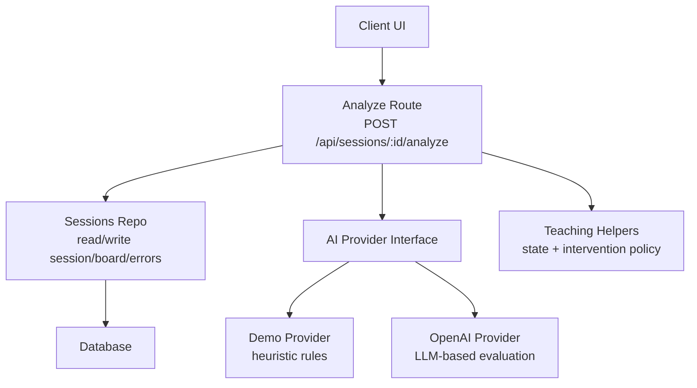
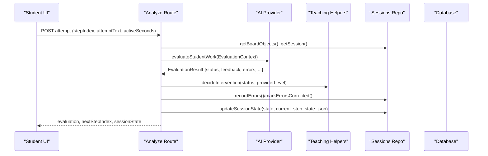
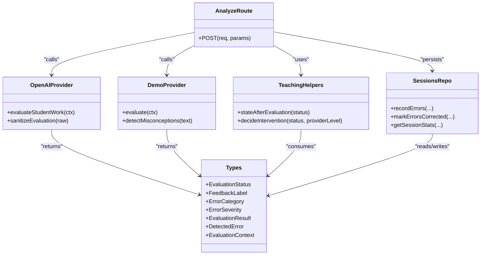

# Error Detection System

<cite>
**Referenced Files in This Document**
- [types.ts](file://stepwise ai/app/lib/types.ts)
- [openaiProvider.ts](file://stepwise ai/app/lib/ai/openaiProvider.ts)
- [demoProvider.ts](file://stepwise ai/app/lib/ai/demoProvider.ts)
- [teaching.ts](file://stepwise ai/app/lib/teaching.ts)
- [sessionsRepo.ts](file://stepwise ai/app/lib/sessionsRepo.ts)
- [analyze route.ts](file://stepwise ai/app/app/api/sessions/[id]/analyze/route.ts)
</cite>

## Table of Contents
1. Introduction
2. Project Structure
3. Core Components
4. Architecture Overview
5. Detailed Component Analysis
6. Dependency Analysis
7. Performance Considerations
8. Troubleshooting Guide
9. Conclusion

## Introduction
This document explains StepWise AI’s Error Detection System that identifies mathematical mistakes, logical fallacies, and conceptual misunderstandings in student work. It covers:
- Evaluation status system (correct, partial, error, uncertain)
- Feedback label taxonomy with visual indicators and use cases
- Error classification algorithms distinguishing calculation errors, conceptual misunderstandings, and procedural mistakes
- Error detection patterns, false positive prevention, and confidence scoring mechanisms
- How the system integrates into the session lifecycle and learning journey

## Project Structure
The error detection system spans several layers:
- Types define evaluation statuses, feedback labels, error categories/severities, and provider interfaces
- Providers implement evaluation logic: a deterministic demo provider and an OpenAI-compatible provider
- Teaching helpers map evaluation outcomes to intervention levels and state transitions
- API routes orchestrate evaluation, persist evidence, and update session state
- Repository functions record errors, hints, and session stats used for final reporting

**Diagram sources**
- [analyze route.ts:22-179](file://stepwise ai/app/app/api/sessions/[id]/analyze/route.ts#L22-L179)
- [openaiProvider.ts:72-170](file://stepwise ai/app/lib/ai/openaiProvider.ts#L72-L170)
- [demoProvider.ts:69-402](file://stepwise ai/app/lib/ai/demoProvider.ts#L69-L402)
- [teaching.ts:47-76](file://stepwise ai/app/lib/teaching.ts#L47-L76)
- [sessionsRepo.ts:332-399](file://stepwise ai/app/lib/sessionsRepo.ts#L332-L399)

**Section sources**
- [types.ts:61-114](file://stepwise ai/app/lib/types.ts#L61-L114)
- [openaiProvider.ts:72-170](file://stepwise ai/app/lib/ai/openaiProvider.ts#L72-L170)
- [demoProvider.ts:69-402](file://stepwise ai/app/lib/ai/demoProvider.ts#L69-L402)
- [teaching.ts:47-76](file://stepwise ai/app/lib/teaching.ts#L47-L76)
- [sessionsRepo.ts:332-399](file://stepwise ai/app/lib/sessionsRepo.ts#L332-L399)
- [analyze route.ts:22-179](file://stepwise ai/app/app/api/sessions/[id]/analyze/route.ts#L22-L179)

## Core Components
- Evaluation types and labels:
  - Statuses: correct, partial, error, uncertain
  - Feedback labels: CORRECT_UNDERSTANDING, PARTIALLY_CORRECT, MISSING_IDEA, CONCEPT_ERROR, THINK_ABOUT_THIS, CHECK_THIS_STEP, AI_UNCERTAIN
  - Error categories: CONCEPTUAL, PROCEDURAL, CALCULATION, MISREADING, MISSING_STEP, INCOMPLETE_ANSWER, VOCABULARY, REASONING, APPLICATION, GRAPH_DIAGRAM, UNIT_NOTATION, LANGUAGE_ONLY
  - Severity: MINOR, MODERATE, IMPORTANT, FOUNDATIONAL
- Providers:
  - Demo provider: deterministic heuristics and misconception pattern matching
  - OpenAI provider: LLM-based evaluation with strict JSON schema and sanitization
- Teaching helpers:
  - Map status to session states
  - Decide intervention level based on status and provider suggestion
- API route:
  - Builds context from board and step
  - Calls provider, applies intervention policy, persists errors, updates state
- Repository:
  - Records errors and hints
  - Marks corrections and self-corrections
  - Aggregates session stats for final reports

**Section sources**
- [types.ts:61-114](file://stepwise ai/app/lib/types.ts#L61-L114)
- [openaiProvider.ts:149-170](file://stepwise ai/app/lib/ai/openaiProvider.ts#L149-L170)
- [demoProvider.ts:205-402](file://stepwise ai/app/lib/ai/demoProvider.ts#L205-L402)
- [teaching.ts:47-76](file://stepwise ai/app/lib/teaching.ts#L47-L76)
- [analyze route.ts:62-147](file://stepwise ai/app/app/api/sessions/[id]/analyze/route.ts#L62-L147)
- [sessionsRepo.ts:332-399](file://stepwise ai/app/lib/sessionsRepo.ts#L332-L399)

## Architecture Overview
End-to-end flow when a student submits an attempt:

**Diagram sources**
- [analyze route.ts:22-179](file://stepwise ai/app/app/api/sessions/[id]/analyze/route.ts#L22-L179)
- [openaiProvider.ts:149-170](file://stepwise ai/app/lib/ai/openaiProvider.ts#L149-L170)
- [demoProvider.ts:205-402](file://stepwise ai/app/lib/ai/demoProvider.ts#L205-L402)
- [teaching.ts:47-76](file://stepwise ai/app/lib/teaching.ts#L47-L76)
- [sessionsRepo.ts:332-399](file://stepwise ai/app/lib/sessionsRepo.ts#L332-L399)

## Detailed Component Analysis

### Evaluation Status System
- correct: Student answer fully satisfies the step’s intent and expected concepts; move forward.
- partial: Some ideas present but incomplete or partially aligned; encourage refinement.
- error: Conceptual or procedural issues detected; prompt reconsideration.
- uncertain: Insufficient signal to judge confidently; invite more detail or clarification.

Status mapping to session state is enforced by teaching helpers to ensure consistent UX and progression.

**Section sources**
- [types.ts:61-63](file://stepwise ai/app/lib/types.ts#L61-L63)
- [teaching.ts:47-63](file://stepwise ai/app/lib/teaching.ts#L47-L63)
- [analyze route.ts:114-147](file://stepwise ai/app/app/api/sessions/[id]/analyze/route.ts#L114-L147)

### Feedback Label Taxonomy and Visual Indicators
Each label has a fixed icon and human-readable label for consistent UI presentation:
- CORRECT_UNDERSTANDING: 🟢 Correct understanding — affirm complete alignment with step goals
- PARTIALLY_CORRECT: 🟡 Partially correct — acknowledge partial idea coverage
- MISSING_IDEA: 🔵 Missing idea — highlight absent key concept(s)
- CONCEPT_ERROR: 🔴 Concept error — flag fundamental misunderstanding
- THINK_ABOUT_THIS: 🟣 Think about this — prompt reflection on reasoning
- CHECK_THIS_STEP: 🟠 Check this step — indicate misalignment with step prompt
- AI_UNCERTAIN: ⚪ AI uncertain — request more information or clarify ambiguity

These are validated server-side to prevent invalid labels from reaching the UI.

**Section sources**
- [types.ts:64-78](file://stepwise ai/app/lib/types.ts#L64-L78)
- [teaching.ts:8-16](file://stepwise ai/app/lib/teaching.ts#L8-L16)
- [openaiProvider.ts:224-232](file://stepwise ai/app/lib/ai/openaiProvider.ts#L224-L232)
- [openaiProvider.ts:234-279](file://stepwise ai/app/lib/ai/openaiProvider.ts#L234-L279)

### Error Classification Algorithms
Two complementary engines classify errors:

- Demo provider (deterministic):
  - Misconception pattern matching using regular expressions to detect known conceptual errors (e.g., incorrect beliefs about photosynthesis inputs). When matched, categorizes as CONCEPTUAL with IMPORTANT severity and returns CONCEPT_ERROR feedback.
  - Expected concept matching: tokenizes expected concepts and checks presence in normalized student text. Computes a ratio to determine correctness:
    - Ratio near 1.0 → correct
    - Ratio ≥ 0.5 → partial
    - Otherwise → error
  - Generic steps without expected concepts: uses word count thresholds to distinguish minimal vs adequate responses.

- OpenAI provider (LLM-based):
  - Sends structured context (question intent, step instruction, expected concepts, board objects, student attempt) with a strict JSON schema requiring one of the four statuses and specific feedback labels.
  - Sanitization layer enforces allowed values, clamps lengths, and caps arrays to protect against malformed or unsafe outputs.

Error categories include CONCEPTUAL, PROCEDURAL, CALCULATION, MISREADING, MISSING_STEP, INCOMPLETE_ANSWER, VOCABULARY, REASONING, APPLICATION, GRAPH_DIAGRAM, UNIT_NOTATION, LANGUAGE_ONLY. Severity ranges from MINOR to FOUNDATIONAL.

**Section sources**
- [demoProvider.ts:29-67](file://stepwise ai/app/lib/ai/demoProvider.ts#L29-L67)
- [demoProvider.ts:205-402](file://stepwise ai/app/lib/ai/demoProvider.ts#L205-L402)
- [openaiProvider.ts:149-170](file://stepwise ai/app/lib/ai/openaiProvider.ts#L149-L170)
- [openaiProvider.ts:234-279](file://stepwise ai/app/lib/ai/openaiProvider.ts#L234-L279)
- [types.ts:80-103](file://stepwise ai/app/lib/types.ts#L80-L103)

### Confidence Scoring Mechanisms
- Provider-level intervention level (0–8) acts as a proxy for confidence and needed support:
  - correct → 0 (no intervention)
  - uncertain → 0 (clarify, never false certainty)
  - partial → 1–3 (encourage and ask first)
  - error → 4–8 (intervene more strongly)
- The teaching helper adjusts the provider’s suggested level within safe bounds.
- Journey tracking uses evidence deltas and hint usage to infer mastery and confidence over time, updating concept status and confidence levels.

**Section sources**
- [teaching.ts:65-76](file://stepwise ai/app/lib/teaching.ts#L65-L76)
- [openaiProvider.ts:266-277](file://stepwise ai/app/lib/ai/openaiProvider.ts#L266-L277)
- [journey integration via sessionsRepo and types]

### False Positive Prevention
- Strict validation:
  - Only predefined feedback labels are accepted; unknown labels are replaced with AI_UNCERTAIN.
  - Error severities are whitelisted; invalid values default to MODERATE.
  - Strings are clamped to safe lengths; arrays are truncated to limits.
- Heuristic safeguards:
  - Misconception patterns require contextual phrasing to avoid flagging legitimate statements.
  - Concept matching normalizes input and requires tokens longer than two characters to reduce noise.
  - No content triggers AI_UNCERTAIN rather than forcing a judgment.

**Section sources**
- [openaiProvider.ts:224-279](file://stepwise ai/app/lib/ai/openaiProvider.ts#L224-L279)
- [demoProvider.ts:50-67](file://stepwise ai/app/lib/ai/demoProvider.ts#L50-L67)
- [demoProvider.ts:235-239](file://stepwise ai/app/lib/ai/demoProvider.ts#L235-L239)

### Integration with Session Lifecycle
- The analyze route builds an EvaluationContext from the current step, board snapshot, previous hints, and learner profile.
- After evaluation:
  - Errors are recorded; if previously in error/partial state and now correct/partial, errors are marked corrected and optionally self-corrected when no hints were consumed between error and fix.
  - State transitions follow the teaching helper mapping; completion advances steps and tracks final attempts.
  - Learning events log mistakes or submissions for analytics.

**Section sources**
- [analyze route.ts:62-147](file://stepwise ai/app/app/api/sessions/[id]/analyze/route.ts#L62-L147)
- [sessionsRepo.ts:332-361](file://stepwise ai/app/lib/sessionsRepo.ts#L332-L361)
- [teaching.ts:47-63](file://stepwise ai/app/lib/teaching.ts#L47-L63)

## Dependency Analysis

**Diagram sources**
- [types.ts:61-114](file://stepwise ai/app/lib/types.ts#L61-L114)
- [openaiProvider.ts:72-170](file://stepwise ai/app/lib/ai/openaiProvider.ts#L72-L170)
- [demoProvider.ts:69-402](file://stepwise ai/app/lib/ai/demoProvider.ts#L69-L402)
- [teaching.ts:47-76](file://stepwise ai/app/lib/teaching.ts#L47-L76)
- [analyze route.ts:22-179](file://stepwise ai/app/app/api/sessions/[id]/analyze/route.ts#L22-L179)
- [sessionsRepo.ts:332-399](file://stepwise ai/app/lib/sessionsRepo.ts#L332-L399)

**Section sources**
- [types.ts:61-114](file://stepwise ai/app/lib/types.ts#L61-L114)
- [openaiProvider.ts:72-170](file://stepwise ai/app/lib/ai/openaiProvider.ts#L72-L170)
- [demoProvider.ts:69-402](file://stepwise ai/app/lib/ai/demoProvider.ts#L69-L402)
- [teaching.ts:47-76](file://stepwise ai/app/lib/teaching.ts#L47-L76)
- [analyze route.ts:22-179](file://stepwise ai/app/app/api/sessions/[id]/analyze/route.ts#L22-L179)
- [sessionsRepo.ts:332-399](file://stepwise ai/app/lib/sessionsRepo.ts#L332-L399)

## Performance Considerations
- Avoid per-keystroke evaluations: the analyze endpoint is intended for meaningful submissions only, reducing unnecessary AI calls.
- Limit AI output sizes: sanitization truncates strings and arrays to bounded sizes to control payload and processing time.
- Deterministic fallbacks: the demo provider provides fast, predictable evaluations during development or when AI keys are unavailable.
- Batch persistence: errors and hints are recorded in controlled slices to prevent excessive writes.

[No sources needed since this section provides general guidance]

## Troubleshooting Guide
Common issues and resolutions:
- Invalid feedback labels or severities:
  - The sanitization layer replaces unknown labels with AI_UNCERTAIN and defaults unknown severities to MODERATE. Ensure providers adhere to the defined enums.
- Unexpected “uncertain” status:
  - If the model lacks sufficient signal, it must return uncertain rather than fabricating certainty. Encourage students to provide more detail or refine their attempt.
- Errors not marking as corrected:
  - Corrections are only marked when transitioning from error/partial to correct/partial without consuming hints in between. Review hint usage and state transitions.
- High false positives in demo mode:
  - Misconception patterns are intentionally narrow; adjust patterns or normalize text further if legitimate answers are flagged.

**Section sources**
- [openaiProvider.ts:224-279](file://stepwise ai/app/lib/ai/openaiProvider.ts#L224-L279)
- [analyze route.ts:90-112](file://stepwise ai/app/app/api/sessions/[id]/analyze/route.ts#L90-L112)
- [demoProvider.ts:29-67](file://stepwise ai/app/lib/ai/demoProvider.ts#L29-L67)

## Conclusion
StepWise AI’s Error Detection System combines deterministic heuristics and LLM-based evaluation to identify and classify student errors accurately while preventing false positives. It uses a robust status and feedback taxonomy, enforces strict validation, and integrates tightly with session state and learning journey tracking. Intervention policies ensure appropriate support levels, and persistent records enable reflective reporting and adaptive learning paths.