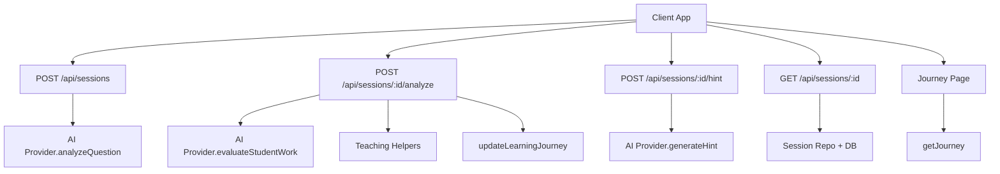
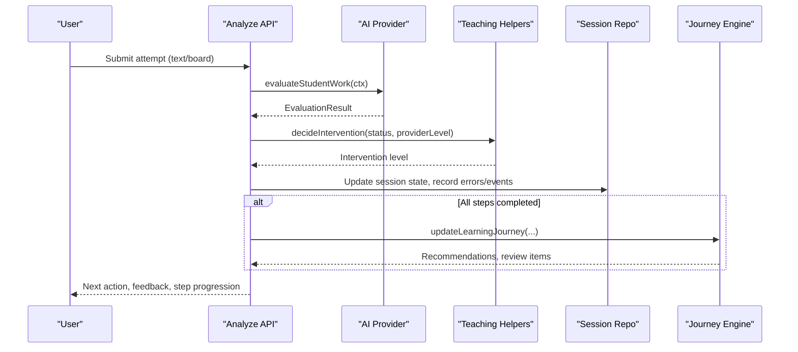
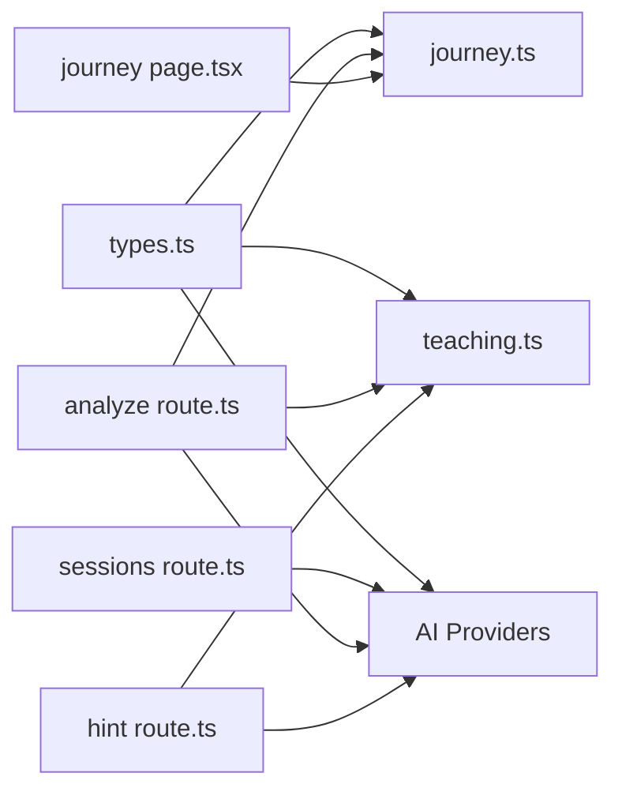
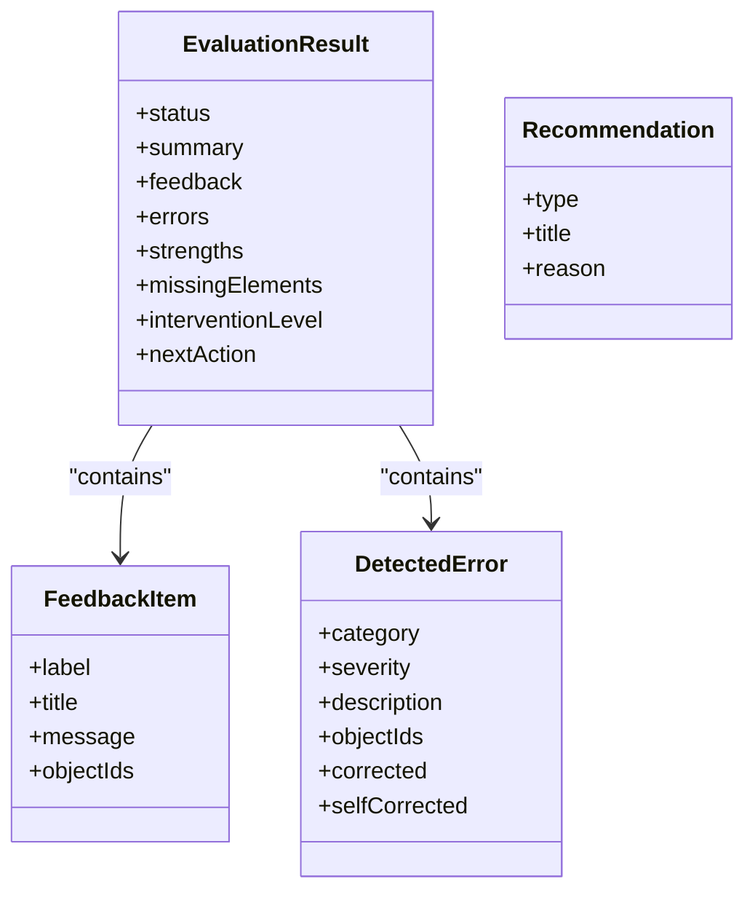

# Teaching Engine

<cite>
**Referenced Files in This Document**
- [05-teaching-engine.md.txt](file://stepwise ai/specs/05-teaching-engine.md.txt)
- [teaching.ts](file://stepwise ai/app/lib/teaching.ts)
- [journey.ts](file://stepwise ai/app/lib/journey.ts)
- [types.ts](file://stepwise ai/app/lib/types.ts)
- [sessions route.ts](file://stepwise ai/app/app/api/sessions/route.ts)
- [session GET route.ts](file://stepwise ai/app/app/api/sessions/[id]/route.ts)
- [analyze route.ts](file://stepwise ai/app/app/api/sessions/[id]/analyze/route.ts)
- [hint route.ts](file://stepwise ai/app/app/api/sessions/[id]/hint/route.ts)
- [demoProvider.ts](file://stepwise ai/app/lib/ai/demoProvider.ts)
- [openaiProvider.ts](file://stepwise ai/app/lib/ai/openaiProvider.ts)
- [onboarding page.tsx](file://stepwise ai/app/app/onboarding/page.tsx)
- [journey page.tsx](file://stepwise ai/app/app/journey/page.tsx)
</cite>

## Table of Contents
1. [Introduction](#introduction)
2. [Project Structure](#project-structure)
3. [Core Components](#core-components)
4. [Architecture Overview](#architecture-overview)
5. [Detailed Component Analysis](#detailed-component-analysis)
6. [Dependency Analysis](#dependency-analysis)
7. [Performance Considerations](#performance-considerations)
8. [Troubleshooting Guide](#troubleshooting-guide)
9. [Conclusion](#conclusion)
10. [Appendices](#appendices)

## Introduction
This document explains StepWise AI’s Teaching Engine—the pedagogical brain that adapts instruction to individual student needs. It covers the teaching methodology (Socratic questioning, guided discovery, adaptive feedback), error detection for mathematical mistakes, logical fallacies, and conceptual misunderstandings, the adaptive guidance system that adjusts difficulty, pacing, and explanation style, the concept mapping system that tracks prerequisite relationships and builds personalized learning paths, assessment methods that measure conceptual understanding beyond right/wrong answers, configuration options for strategies and feedback styles, extension points for the assessment framework, and integration with the Learning Journey system for long-term progress tracking and recommendations.

## Project Structure
The Teaching Engine spans a small set of focused modules:
- API routes orchestrate session lifecycle, evaluation, hints, and recovery.
- The teaching helpers define feedback labels, hint escalation, and intervention policy.
- The journey engine updates long-term concept mastery, misconceptions, reviews, and recommendations.
- Types define the shared domain model across components.
- AI providers implement evaluation, hints, explanations, and final reports (demo and OpenAI-backed).
- Onboarding and journey UI surfaces personalization and progress.

**Diagram sources**
- [sessions route.ts:9-44](file://stepwise ai/app/app/api/sessions/route.ts#L9-L44)
- [analyze route.ts:19-179](file://stepwise ai/app/app/api/sessions/[id]/analyze/route.ts#L19-L179)
- [hint route.ts:18-92](file://stepwise ai/app/app/api/sessions/[id]/hint/route.ts#L18-L92)
- [session GET route.ts:9-50](file://stepwise ai/app/app/api/sessions/[id]/route.ts#L9-L50)
- [journey.ts:59-261](file://stepwise ai/app/lib/journey.ts#L59-L261)
- [journey page.tsx:61-180](file://stepwise ai/app/app/journey/page.tsx#L61-L180)

**Section sources**
- [sessions route.ts:9-44](file://stepwise ai/app/app/api/sessions/route.ts#L9-L44)
- [analyze route.ts:19-179](file://stepwise ai/app/app/api/sessions/[id]/analyze/route.ts#L19-L179)
- [hint route.ts:18-92](file://stepwise ai/app/app/api/sessions/[id]/hint/route.ts#L18-L92)
- [session GET route.ts:9-50](file://stepwise ai/app/app/api/sessions/[id]/route.ts#L9-L50)
- [journey.ts:59-261](file://stepwise ai/app/lib/journey.ts#L59-L261)
- [journey page.tsx:61-180](file://stepwise ai/app/app/journey/page.tsx#L61-L180)

## Core Components
- Teaching helpers: Feedback label taxonomy, hint level titles, mode-based thresholds, next hint level calculation, state transitions, and intervention policy.
- Journey engine: Evidence-driven concept status transitions, misconception lifecycle, spaced review scheduling, explainable recommendations, and read-side queries.
- AI providers: Demo provider with heuristic evaluation and hint ladder; OpenAI provider with structured prompts and schema-constrained outputs.
- API layer: Session creation, analysis, hint generation, and full session recovery.
- Types: Shared domain model for sessions, board objects, evaluations, errors, hints, profiles, and reports.

**Section sources**
- [teaching.ts:8-76](file://stepwise ai/app/lib/teaching.ts#L8-L76)
- [journey.ts:10-261](file://stepwise ai/app/lib/journey.ts#L10-L261)
- [demoProvider.ts:29-451](file://stepwise ai/app/lib/ai/demoProvider.ts#L29-L451)
- [openaiProvider.ts:130-154](file://stepwise ai/app/lib/ai/openaiProvider.ts#L130-L154)
- [types.ts:6-302](file://stepwise ai/app/lib/types.ts#L6-L302)

## Architecture Overview
The Teaching Engine follows a continuous loop: student acts → AI observes → AI understands → AI evaluates → AI decides intervention → AI responds → student tries again or continues. The API routes enforce this flow by calling the AI provider for evaluation or hints, applying teaching helper policies, updating session state, recording errors and events, and optionally triggering journey updates.

**Diagram sources**
- [analyze route.ts:22-179](file://stepwise ai/app/app/api/sessions/[id]/analyze/route.ts#L22-L179)
- [teaching.ts:47-76](file://stepwise ai/app/lib/teaching.ts#L47-L76)
- [journey.ts:59-261](file://stepwise ai/app/lib/journey.ts#L59-L261)

## Detailed Component Analysis

### Teaching Methodology and Adaptive Guidance
- Philosophy: Provide the smallest useful assistance; prefer observe → ask → hint → clarify → visualize → demonstrate partially → explain fully.
- Dynamic steps: Adaptively skip, compress, expand, or revisit prerequisites based on student performance.
- Checkpoints: Conceptual checkpoints confirm genuine understanding before moving forward.
- Hints: Contextual, progressive levels from gentle nudge to worked explanation; never generic.
- Intervention policy: Correct → no intervention; Uncertain → clarify; Partial → encourage + question; Error → intervene at higher level.
- Difficulty control: Internal difficulty level adapts to accuracy, hints, time, mistakes, confidence, and prior performance.
- Stuck detection and frustration-aware teaching: Reduce cognitive load when stuck; offer smaller clues, visuals, or mini-lessons.
- Explain-back and application checks: Use teach-back and variations to verify deeper understanding.

Implementation highlights:
- Feedback labels are standardized with icons and text to avoid color-only semantics.
- Mode-based thresholds tune escalation behavior per learning mode.
- State transitions map evaluation status to session states.

**Section sources**
- [05-teaching-engine.md.txt:1-60](file://stepwise ai/specs/05-teaching-engine.md.txt#L1-L60)
- [teaching.ts:8-76](file://stepwise ai/app/lib/teaching.ts#L8-L76)

### Error Detection System
- Detects conceptual errors via pattern matching and expected concept coverage.
- Classifies errors into categories such as conceptual, procedural, calculation, reasoning, incomplete answer, etc.
- Severity is assigned to guide intervention intensity.
- Misconception patterns are tracked and escalated through a lifecycle (detected → being addressed → corrected once → recurring → resolved).
- Errors are persisted with object references so students can see original content, why it was an issue, hints, correction, and resulting understanding.

Demo provider demonstrates:
- Misconception pattern detection for specific domains.
- Concept matching against expected concepts to determine partial vs correct.
- Structured feedback with labels and messages tied to student board objects.

OpenAI provider integrates structured JSON schemas to ensure consistent evaluation output and report generation.

**Section sources**
- [demoProvider.ts:29-67](file://stepwise ai/app/lib/ai/demoProvider.ts#L29-L67)
- [demoProvider.ts:205-402](file://stepwise ai/app/lib/ai/demoProvider.ts#L205-L402)
- [types.ts:80-114](file://stepwise ai/app/lib/types.ts#L80-L114)
- [openaiProvider.ts:130-154](file://stepwise ai/app/lib/ai/openaiProvider.ts#L130-L154)

### Adaptive Guidance System
- Hint escalation: Next hint level computed from previous hints; capped at level 7.
- Intervention decision: Adjusts intervention level based on evaluation status and provider-level suggestion.
- Learning modes: Guided, Balanced, Challenge, Explain, Review—each tunes escalation thresholds.
- Profile-based adaptation: Age band and explanation depth influence hint tone and explanation style.

Configuration examples:
- Choose autonomy level and explanation depth during onboarding to shape guidance intensity and detail.
- Select learning mode to balance independence vs support.

**Section sources**
- [teaching.ts:28-45](file://stepwise ai/app/lib/teaching.ts#L28-L45)
- [teaching.ts:47-76](file://stepwise ai/app/lib/teaching.ts#L47-L76)
- [onboarding page.tsx:106-139](file://stepwise ai/app/app/onboarding/page.tsx#L106-L139)
- [types.ts:232-250](file://stepwise ai/app/lib/types.ts#L232-L250)

### Concept Mapping and Personalized Learning Paths
- Concepts are primary units; mastery is evidence-based, never granted for reading or clicking continue.
- Status transitions reflect completion ratio, self-corrections, hints used, and conceptual errors.
- Misconception lifecycle tracks frequency and resolution over time.
- Spaced review items are scheduled for developing concepts.
- Recommendations are explainable and shame-free, guiding next steps (continue, review, strengthen prerequisite, practice, go deeper).

Personalized path building:
- Evidence accumulation drives movement from unknown to mastered.
- Prerequisite gaps trigger mini-lessons or foundational strengthening.
- Long-term view includes misconceptions, reviews, and recommendations.

**Section sources**
- [journey.ts:10-261](file://stepwise ai/app/lib/journey.ts#L10-L261)
- [journey page.tsx:61-180](file://stepwise ai/app/app/journey/page.tsx#L61-L180)
- [types.ts:149-193](file://stepwise ai/app/lib/types.ts#L149-L193)

### Assessment Methods Beyond Right/Wrong
- Multi-dimensional evaluation: correct, partial, error, uncertain.
- Feedback includes strengths, missing elements, and targeted messages.
- Self-correction recognition: Independent corrections count as evidence.
- Mastery checks: Explain-back, application variation, generalization questions.
- Final reports synthesize understanding progression, key takeaways, remaining gaps, and next learning.

**Section sources**
- [demoProvider.ts:205-402](file://stepwise ai/app/lib/ai/demoProvider.ts#L205-L402)
- [openaiProvider.ts:130-154](file://stepwise ai/app/lib/ai/openaiProvider.ts#L130-L154)
- [types.ts:195-230](file://stepwise ai/app/lib/types.ts#L195-L230)

### Integration with Learning Journey System
- After meaningful submissions, analyze route records errors, updates session state, and may transition to integration phase upon completion.
- Journey engine updates concept statuses, schedules reviews, and generates recommendations.
- Read side provides concepts, misconceptions, reviews, recommendations, events, and stats for UI display.

**Section sources**
- [analyze route.ts:22-179](file://stepwise ai/app/app/api/sessions/[id]/analyze/route.ts#L22-L179)
- [journey.ts:59-261](file://stepwise ai/app/lib/journey.ts#L59-L261)
- [journey page.tsx:61-180](file://stepwise ai/app/app/journey/page.tsx#L61-L180)

## Dependency Analysis

**Diagram sources**
- [types.ts:6-302](file://stepwise ai/app/lib/types.ts#L6-L302)
- [teaching.ts:1-76](file://stepwise ai/app/lib/teaching.ts#L1-L76)
- [journey.ts:1-261](file://stepwise ai/app/lib/journey.ts#L1-L261)
- [sessions route.ts:9-44](file://stepwise ai/app/app/api/sessions/route.ts#L9-L44)
- [analyze route.ts:19-179](file://stepwise ai/app/app/api/sessions/[id]/analyze/route.ts#L19-L179)
- [hint route.ts:18-92](file://stepwise ai/app/app/api/sessions/[id]/hint/route.ts#L18-L92)
- [journey page.tsx:61-180](file://stepwise ai/app/app/journey/page.tsx#L61-L180)

**Section sources**
- [types.ts:6-302](file://stepwise ai/app/lib/types.ts#L6-L302)
- [teaching.ts:1-76](file://stepwise ai/app/lib/teaching.ts#L1-L76)
- [journey.ts:1-261](file://stepwise ai/app/lib/journey.ts#L1-L261)
- [sessions route.ts:9-44](file://stepwise ai/app/app/api/sessions/route.ts#L9-L44)
- [analyze route.ts:19-179](file://stepwise ai/app/app/api/sessions/[id]/analyze/route.ts#L19-L179)
- [hint route.ts:18-92](file://stepwise ai/app/app/api/sessions/[id]/hint/route.ts#L18-L92)
- [journey page.tsx:61-180](file://stepwise ai/app/app/journey/page.tsx#L61-L180)

## Performance Considerations
- Keep evaluation context minimal to reduce AI calls and latency.
- Avoid per-keystroke evaluations; only evaluate on meaningful submissions.
- Cache or reuse step analysis where appropriate to prevent redundant work.
- Limit hint escalation frequency; use mode thresholds to balance responsiveness and cognitive load.
- Batch journey updates at session completion or milestone boundaries.

[No sources needed since this section provides general guidance]

## Troubleshooting Guide
Common issues and resolutions:
- Empty or ambiguous question: Ensure minimum length and clarity; the session creation endpoint validates input and returns clarification requests when needed.
- Session already completed: Subsequent analyze or hint calls will fail; start a new session.
- Invalid step index: Validate stepIndex against current analysis steps before submission.
- No student content detected: Evaluation returns uncertain; prompt the student to write, speak, or draw thinking on the board.
- Persistent misconceptions: Track occurrence counts; schedule reviews and consider prerequisite strengthening.

Operational notes:
- Always persist errors and events for traceability.
- Record self-corrections only when independent (no hints consumed between error and fix).
- Use feedback labels consistently to aid UI rendering and analytics.

**Section sources**
- [sessions route.ts:11-44](file://stepwise ai/app/app/api/sessions/route.ts#L11-L44)
- [analyze route.ts:22-179](file://stepwise ai/app/app/api/sessions/[id]/analyze/route.ts#L22-L179)
- [hint route.ts:20-92](file://stepwise ai/app/app/api/sessions/[id]/hint/route.ts#L20-L92)
- [demoProvider.ts:205-402](file://stepwise ai/app/lib/ai/demoProvider.ts#L205-L402)

## Conclusion
StepWise AI’s Teaching Engine combines a principled pedagogy with robust technical implementation. It detects errors and misconceptions, adapts guidance through hints and interventions, maps concepts with evidence-based mastery, and integrates with the Learning Journey system to provide personalized, long-term learning paths. By configuring learning modes, autonomy levels, and explanation depth, educators and learners can tailor the experience while preserving the core philosophy: help the student take the next step toward understanding.

[No sources needed since this section summarizes without analyzing specific files]

## Appendices

### Configuration Examples
- Set explanation depth and autonomy level during onboarding to control guidance intensity and detail.
- Choose learning mode to adjust escalation thresholds for hints and interventions.
- Extend assessment framework by implementing custom AI provider logic for domain-specific evaluation and hints.

**Section sources**
- [onboarding page.tsx:106-139](file://stepwise ai/app/app/onboarding/page.tsx#L106-L139)
- [types.ts:232-250](file://stepwise ai/app/lib/types.ts#L232-L250)
- [demoProvider.ts:90-109](file://stepwise ai/app/lib/ai/demoProvider.ts#L90-L109)
- [openaiProvider.ts:130-154](file://stepwise ai/app/lib/ai/openaiProvider.ts#L130-L154)

### Data Models Overview

**Diagram sources**
- [types.ts:105-124](file://stepwise ai/app/lib/types.ts#L105-L124)
- [types.ts:189-193](file://stepwise ai/app/lib/types.ts#L189-L193)