# End-to-End Testing

<cite>
**Referenced Files in This Document**
- [e2e.mjs](file://stepwise ai/e2e.mjs)
- [smoke.mjs](file://stepwise ai/smoke.mjs)
- [route.ts (signup)](file://stepwise ai/app/app/api/auth/signup/route.ts)
- [auth.ts](file://stepwise ai/app/lib/auth.ts)
- [sessions route.ts](file://stepwise ai/app/app/api/sessions/route.ts)
- [analyze route.ts](file://stepwise ai/app/app/api/sessions/[id]/analyze/route.ts)
- [complete route.ts](file://stepwise ai/app/app/api/sessions/[id]/complete/route.ts)
- [sessionsRepo.ts](file://stepwise ai/app/lib/sessionsRepo.ts)
- [journey.ts](file://stepwise ai/app/lib/journey.ts)
- [types.ts](file://stepwise ai/app/lib/types.ts)
- [teaching.ts](file://stepwise ai/app/lib/teaching.ts)
- [package.json](file://stepwise ai/app/package.json)
</cite>

## Table of Contents
1. Introduction
2. Project Structure
3. Core Components
4. Architecture Overview
5. Detailed Component Analysis
6. Dependency Analysis
7. Performance Considerations
8. Troubleshooting Guide
9. Conclusion
10. Appendices

## Introduction
This document provides end-to-end testing guidance for StepWise AI using the existing e2e.mjs test suite. It explains how to validate the MVP learning loop from user signup through session completion and final report generation, how to set up the environment, manage cookies, handle authentication, and verify interactive Board operations, AI-powered teaching responses, and adaptive learning flows. It also covers multi-step sessions, hint systems, misconception detection, CI setup ideas, parallelization strategies, reporting, debugging, performance considerations, and maintenance practices for evolving features.

## Project Structure
StepWise AI is a Next.js application with API routes under app/api and shared server logic under app/lib. The e2e tests are Node scripts at the repository root that call the running server endpoints directly via fetch and maintain an HTTP cookie jar for authenticated requests. A lightweight smoke test verifies page availability.

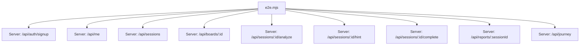

**Diagram sources**
- [e2e.mjs:1-147](file://stepwise ai/e2e.mjs#L1-L147)
- [sessions route.ts:1-56](file://stepwise ai/app/app/api/sessions/route.ts#L1-L56)
- [analyze route.ts:1-180](file://stepwise ai/app/app/api/sessions/[id]/analyze/route.ts#L1-L180)
- [complete route.ts:1-124](file://stepwise ai/app/app/api/sessions/[id]/complete/route.ts#L1-L124)

**Section sources**
- [package.json:6-11](file://stepwise ai/app/package.json#L6-L11)
- [e2e.mjs:1-23](file://stepwise ai/e2e.mjs#L1-L23)
- [smoke.mjs:1-14](file://stepwise ai/smoke.mjs#L1-L14)

## Core Components
- Authentication and session cookies: Signup creates a signed httpOnly session cookie used by subsequent requests.
- Session lifecycle: Creating a session seeds the Board with system/AI objects and returns steps for guided learning.
- Board persistence: PUT updates replace board objects atomically; ownership checks prevent cross-user access.
- Evaluation engine: analyze endpoint evaluates student attempts, records errors, transitions state, and advances steps when correct.
- Hint system: Escalating hints are generated and persisted per session.
- Completion and reporting: complete endpoint generates a Final Report idempotently, updates the Learning Journey, and persists events.
- Journey and reports: GET endpoints expose journey data and saved reports.

**Section sources**
- [auth.ts:104-138](file://stepwise ai/app/lib/auth.ts#L104-L138)
- [sessions route.ts:11-43](file://stepwise ai/app/app/api/sessions/route.ts#L11-L43)
- [sessionsRepo.ts:26-116](file://stepwise ai/app/lib/sessionsRepo.ts#L26-L116)
- [sessionsRepo.ts:198-265](file://stepwise ai/app/lib/sessionsRepo.ts#L198-L265)
- [analyze route.ts:22-179](file://stepwise ai/app/app/api/sessions/[id]/analyze/route.ts#L22-L179)
- [complete route.ts:15-123](file://stepwise ai/app/app/api/sessions/[id]/complete/route.ts#L15-L123)
- [journey.ts:59-261](file://stepwise ai/app/lib/journey.ts#L59-L261)

## Architecture Overview
The e2e script orchestrates the full MVP loop by calling API endpoints in sequence. Each request carries a Cookie header derived from the signup response. The server enforces authentication, validates inputs, interacts with the database, and optionally calls the AI provider abstraction to evaluate work or generate reports.

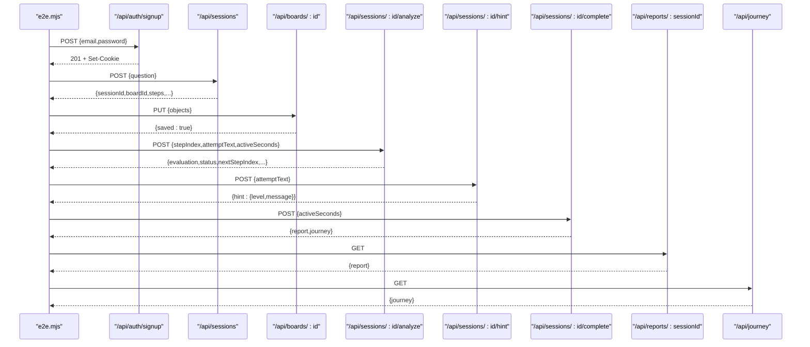

**Diagram sources**
- [e2e.mjs:36-146](file://stepwise ai/e2e.mjs#L36-L146)
- [sessions route.ts:11-43](file://stepwise ai/app/app/api/sessions/route.ts#L11-L43)
- [analyze route.ts:22-179](file://stepwise ai/app/app/api/sessions/[id]/analyze/route.ts#L22-L179)
- [complete route.ts:15-123](file://stepwise ai/app/app/api/sessions/[id]/complete/route.ts#L15-L123)

## Detailed Component Analysis

### MVP Verification Loop (e2e.mjs)
The e2e script performs a linear flow:
- Signup and onboarding update
- Create a learning session and capture sessionId/boardId
- Seed and autosave Board objects
- Evaluate multiple attempts, including deliberate misconceptions
- Request hints and observe escalation
- Complete all steps and finalize the session
- Verify idempotent report generation
- Fetch report and journey
- Validate ownership isolation and unauthenticated blocking

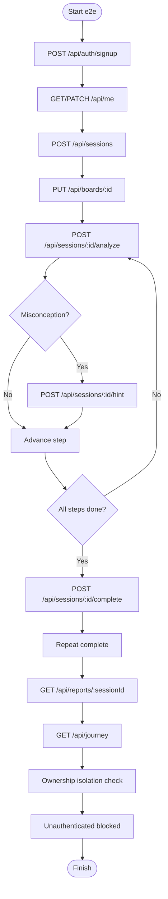

**Diagram sources**
- [e2e.mjs:36-146](file://stepwise ai/e2e.mjs#L36-L146)

**Section sources**
- [e2e.mjs:36-146](file://stepwise ai/e2e.mjs#L36-L146)

### Authentication and Cookies
- Signup sets a signed httpOnly session cookie. The e2e script extracts it and attaches it to every subsequent request.
- Protected endpoints require a valid session; missing or invalid cookies result in 401.
- Ownership checks ensure users can only access their own resources.

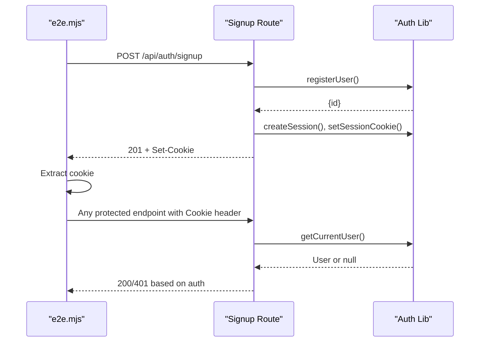

**Diagram sources**
- [route.ts (signup):10-35](file://stepwise ai/app/app/api/auth/signup/route.ts#L10-L35)
- [auth.ts:46-67](file://stepwise ai/app/lib/auth.ts#L46-L67)
- [auth.ts:78-102](file://stepwise ai/app/lib/auth.ts#L78-L102)

**Section sources**
- [route.ts (signup):10-35](file://stepwise ai/app/app/api/auth/signup/route.ts#L10-L35)
- [auth.ts:46-67](file://stepwise ai/app/lib/auth.ts#L46-L67)
- [auth.ts:78-102](file://stepwise ai/app/lib/auth.ts#L78-L102)

### Interactive Board Operations
- Board objects are seeded with question and introduction content.
- Student contributions are appended and saved via PUT; the server replaces objects atomically with size limits and sanitization.
- Ownership is enforced at read/write time.

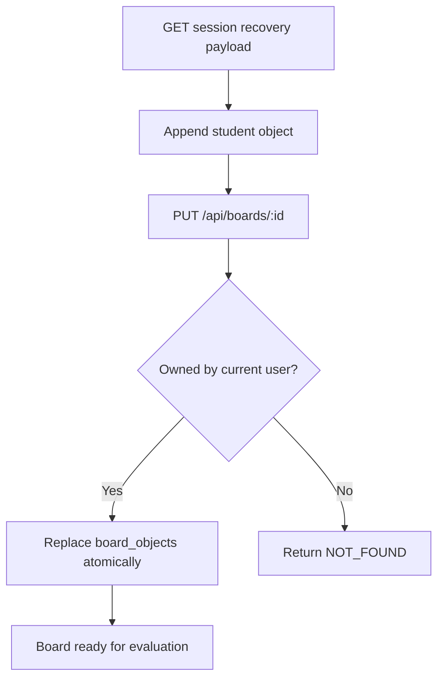

**Diagram sources**
- [sessionsRepo.ts:26-116](file://stepwise ai/app/lib/sessionsRepo.ts#L26-L116)
- [sessionsRepo.ts:198-265](file://stepwise ai/app/lib/sessionsRepo.ts#L198-L265)

**Section sources**
- [sessionsRepo.ts:198-265](file://stepwise ai/app/lib/sessionsRepo.ts#L198-L265)

### AI-Powered Teaching Engine Responses
- The analyze endpoint builds an evaluation context from the current step, attempt text, board snapshot, profile, and prior hints.
- AI evaluation determines status (correct/partial/error/uncertain), produces feedback and errors, and drives state transitions.
- Errors are recorded; self-corrections are tracked when no hints were consumed between error and fix.

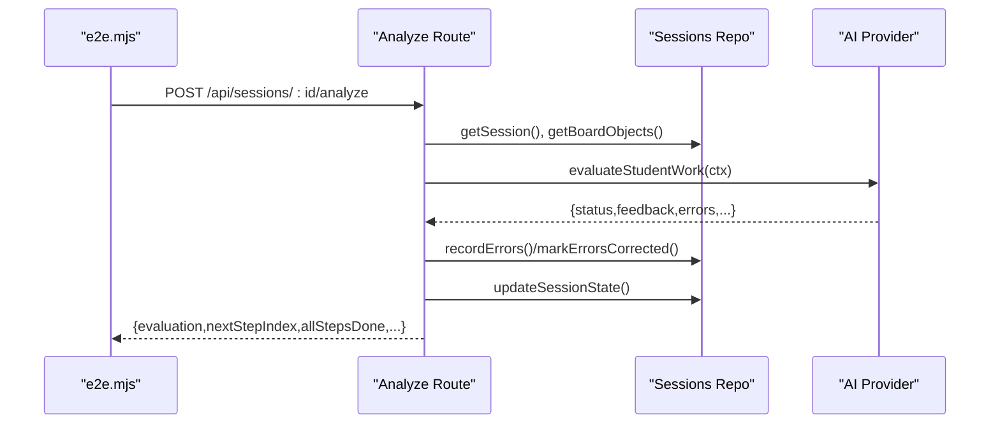

**Diagram sources**
- [analyze route.ts:22-179](file://stepwise ai/app/app/api/sessions/[id]/analyze/route.ts#L22-L179)
- [sessionsRepo.ts:284-330](file://stepwise ai/app/lib/sessionsRepo.ts#L284-L330)

**Section sources**
- [analyze route.ts:22-179](file://stepwise ai/app/app/api/sessions/[id]/analyze/route.ts#L22-L179)
- [sessionsRepo.ts:284-330](file://stepwise ai/app/lib/sessionsRepo.ts#L284-L330)

### Adaptive Learning Flows and Hint System
- Hint levels escalate based on previous hints and evaluation outcomes.
- Intervention policy adjusts support level depending on correctness and uncertainty.
- The e2e script exercises the hint ladder after introducing a misconception.

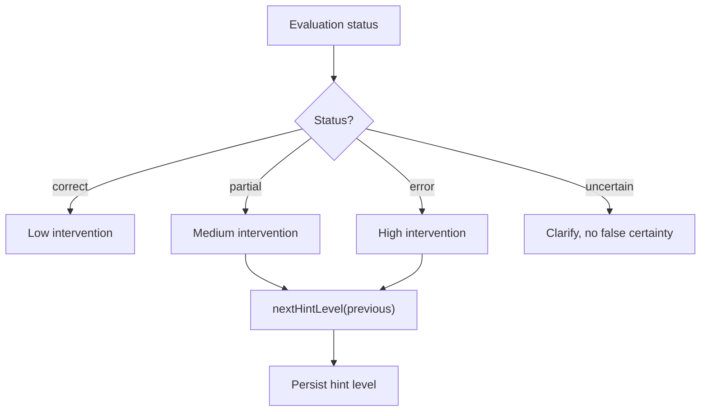

**Diagram sources**
- [teaching.ts:41-76](file://stepwise ai/app/lib/teaching.ts#L41-L76)
- [e2e.mjs:100-103](file://stepwise ai/e2e.mjs#L100-L103)

**Section sources**
- [teaching.ts:41-76](file://stepwise ai/app/lib/teaching.ts#L41-L76)
- [e2e.mjs:100-103](file://stepwise ai/e2e.mjs#L100-L103)

### Multi-Step Learning Sessions
- The session creation returns a structured list of steps with titles, instructions, and expected concepts.
- The e2e script iterates over steps, submitting attempts aligned with each step’s expectations until all steps are completed.

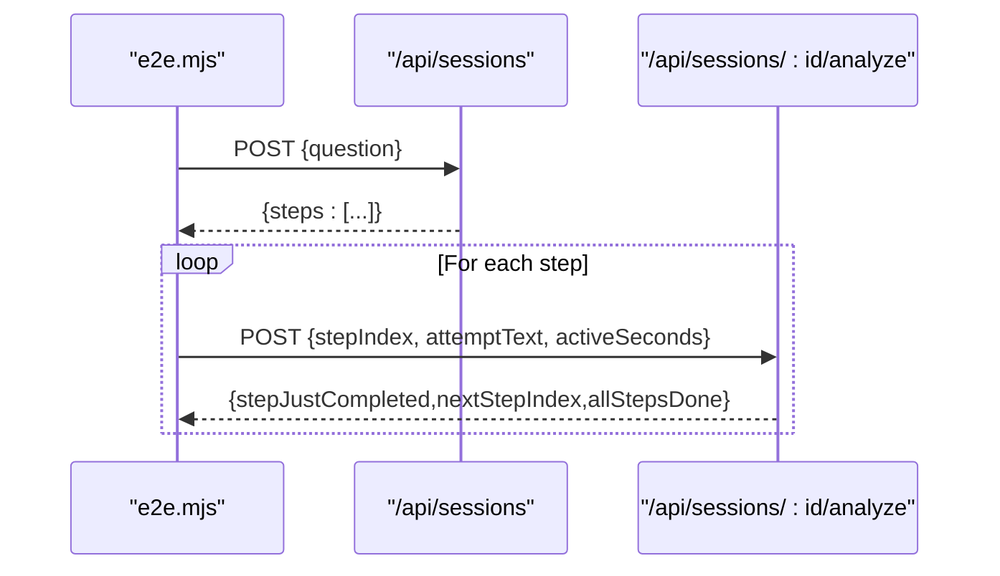

**Diagram sources**
- [sessions route.ts:11-43](file://stepwise ai/app/app/api/sessions/route.ts#L11-L43)
- [e2e.mjs:105-116](file://stepwise ai/e2e.mjs#L105-L116)
- [analyze route.ts:114-147](file://stepwise ai/app/app/api/sessions/[id]/analyze/route.ts#L114-L147)

**Section sources**
- [sessions route.ts:11-43](file://stepwise ai/app/app/api/sessions/route.ts#L11-L43)
- [e2e.mjs:105-116](file://stepwise ai/e2e.mjs#L105-L116)
- [analyze route.ts:114-147](file://stepwise ai/app/app/api/sessions/[id]/analyze/route.ts#L114-L147)

### Misconception Detection
- Deliberate incorrect statements trigger conceptual error classification and feedback labels.
- Errors are persisted and later included in the final report and journey updates.

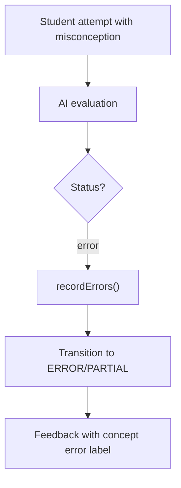

**Diagram sources**
- [e2e.mjs:83-98](file://stepwise ai/e2e.mjs#L83-L98)
- [analyze route.ts:90-112](file://stepwise ai/app/app/api/sessions/[id]/analyze/route.ts#L90-L112)
- [types.ts:80-103](file://stepwise ai/app/lib/types.ts#L80-L103)

**Section sources**
- [e2e.mjs:83-98](file://stepwise ai/e2e.mjs#L83-L98)
- [analyze route.ts:90-112](file://stepwise ai/app/app/api/sessions/[id]/analyze/route.ts#L90-L112)
- [types.ts:80-103](file://stepwise ai/app/lib/types.ts#L80-L103)

### Final Report Generation and Journey Update
- Completion is idempotent; repeated calls return the same report without duplication.
- The report aggregates session stats, errors, self-corrections, and step progress.
- The Learning Journey is updated with concept statuses, misconceptions, and recommendations.

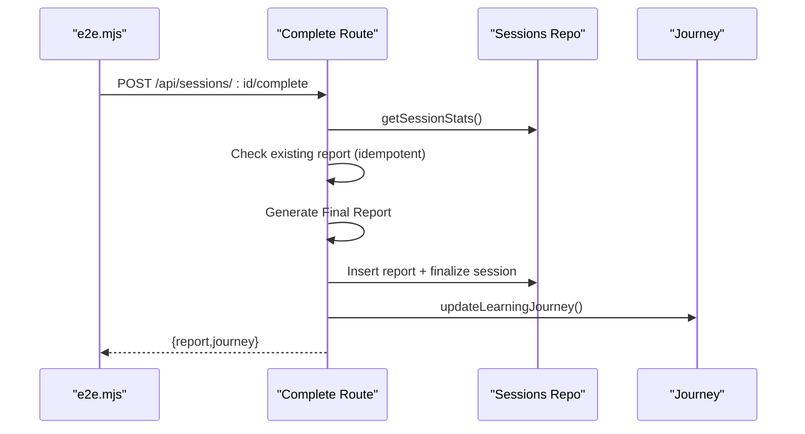

**Diagram sources**
- [complete route.ts:15-123](file://stepwise ai/app/app/api/sessions/[id]/complete/route.ts#L15-L123)
- [journey.ts:59-261](file://stepwise ai/app/lib/journey.ts#L59-L261)

**Section sources**
- [complete route.ts:15-123](file://stepwise ai/app/app/api/sessions/[id]/complete/route.ts#L15-L123)
- [journey.ts:59-261](file://stepwise ai/app/lib/journey.ts#L59-L261)

## Dependency Analysis
Key runtime dependencies for e2e execution:
- Node.js runtime to run e2e.mjs and smoke.mjs
- Next.js server running locally on port 3000
- Database backing stored data (files ignored by git include *.db)
- Optional AI provider configuration via environment variables

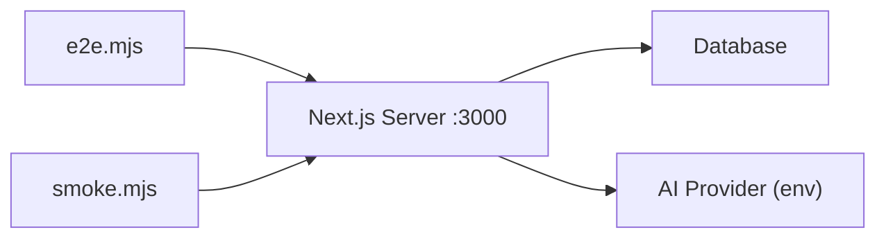

**Diagram sources**
- [e2e.mjs:1-23](file://stepwise ai/e2e.mjs#L1-L23)
- [smoke.mjs:1-14](file://stepwise ai/smoke.mjs#L1-L14)
- [package.json:6-11](file://stepwise ai/app/package.json#L6-L11)

**Section sources**
- [e2e.mjs:1-23](file://stepwise ai/e2e.mjs#L1-L23)
- [smoke.mjs:1-14](file://stepwise ai/smoke.mjs#L1-L14)
- [package.json:6-11](file://stepwise ai/app/package.json#L6-L11)

## Performance Considerations
- Avoid per-keystroke AI calls; evaluate only on meaningful submissions as implemented in the analyze route.
- Use local state and optimistic updates on the client side; persist board snapshots atomically on the server.
- Debounce persistence where applicable and limit payload sizes (content and style/meta fields are truncated).
- Cache AI provider initialization and avoid redundant re-instantiation.
- Keep e2e assertions minimal and focused on critical paths to reduce flakiness and runtime.

[No sources needed since this section provides general guidance]

## Troubleshooting Guide
Common issues and resolutions:
- Missing or expired session cookie: Ensure signup response sets a cookie and e2e attaches it to subsequent requests.
- Unauthenticated access: Protected endpoints return 401 if no valid cookie is present.
- Ownership violations: Accessing another user’s board returns 404; verify current user context.
- Invalid step index: Ensure stepIndex is within bounds of analysis.steps.
- AI provider misconfiguration: If AI calls fail, confirm environment variables and fallback behavior.
- Database not initialized: Ensure the server has started and the database file exists before running tests.

**Section sources**
- [auth.ts:78-102](file://stepwise ai/app/lib/auth.ts#L78-L102)
- [sessions route.ts:11-20](file://stepwise ai/app/app/api/sessions/route.ts#L11-L20)
- [analyze route.ts:38-42](file://stepwise ai/app/app/api/sessions/[id]/analyze/route.ts#L38-L42)
- [complete route.ts:23-27](file://stepwise ai/app/app/api/sessions/[id]/complete/route.ts#L23-L27)

## Conclusion
The e2e.mjs suite validates the core StepWise AI learning experience end-to-end: authentication, session creation, Board interactions, AI-driven evaluation, hint escalation, misconception handling, step progression, idempotent report generation, and journey updates. By following the setup and strategies outlined here, you can reliably verify MVP functionality, extend coverage for new features, and integrate these tests into continuous integration pipelines.

[No sources needed since this section summarizes without analyzing specific files]

## Appendices

### Environment Setup
- Install dependencies and start the Next.js server on port 3000.
- Ensure required environment variables are set (for example, AUTH_SECRET and optional AI_PROVIDER/OpenAI key).
- Run the smoke test to verify pages respond with HTML.
- Run the e2e suite against the live server.

**Section sources**
- [package.json:6-11](file://stepwise ai/app/package.json#L6-L11)
- [smoke.mjs:1-14](file://stepwise ai/smoke.mjs#L1-L14)
- [e2e.mjs:1-23](file://stepwise ai/e2e.mjs#L1-L23)

### Test Data Management
- Use unique emails per run to avoid collisions.
- Clear or reset the database between runs if necessary.
- Reuse session IDs returned by the server for subsequent steps.

**Section sources**
- [e2e.mjs:34-52](file://stepwise ai/e2e.mjs#L34-L52)

### Handling Authentication Cookies
- Extract Set-Cookie from signup response and attach Cookie header to all subsequent requests.
- Preserve cookies across steps and restore them after temporary switches (for example, ownership isolation checks).

**Section sources**
- [e2e.mjs:6-23](file://stepwise ai/e2e.mjs#L6-L23)
- [e2e.mjs:134-144](file://stepwise ai/e2e.mjs#L134-L144)

### Continuous Integration, Parallelization, and Reporting
- CI setup:
  - Install dependencies, build/start the server, run smoke tests, then run e2e.mjs.
  - Export logs and artifacts for failed runs.
- Parallelization:
  - Split independent scenarios (for example, separate sessions per user) into parallel processes.
  - Ensure each process uses unique credentials and does not share mutable state.
- Reporting:
  - Capture console output from e2e.mjs and smoke.mjs.
  - Summarize pass/fail counts and print key metrics such as steps completed and hints used.

[No sources needed since this section provides general guidance]

### Debugging Failing End-to-End Tests
- Print request payloads and responses around failing assertions.
- Verify server logs for validation errors or exceptions.
- Confirm environment variables and provider configuration.
- Isolate failing steps by commenting out later assertions to narrow scope.

**Section sources**
- [e2e.mjs:25-32](file://stepwise ai/e2e.mjs#L25-L32)
- [analyze route.ts:168-175](file://stepwise ai/app/app/api/sessions/[id]/analyze/route.ts#L168-L175)
- [complete route.ts:119-123](file://stepwise ai/app/app/api/sessions/[id]/complete/route.ts#L119-L123)

### Maintenance Strategies for Evolving Features
- Keep e2e assertions aligned with API contracts defined in types.ts.
- Update step iteration logic when analysis.steps change shape.
- Extend hint and misconception scenarios to cover new edge cases.
- Refactor shared helpers (for example, cookie handling) to reduce duplication.

**Section sources**
- [types.ts:126-147](file://stepwise ai/app/lib/types.ts#L126-L147)
- [e2e.mjs:105-116](file://stepwise ai/e2e.mjs#L105-L116)
- [e2e.mjs:100-103](file://stepwise ai/e2e.mjs#L100-L103)