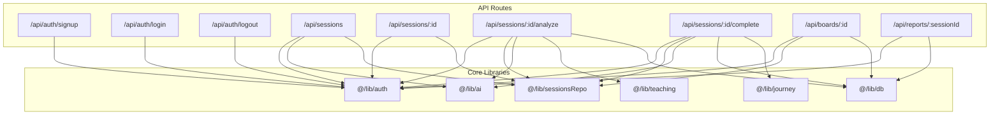
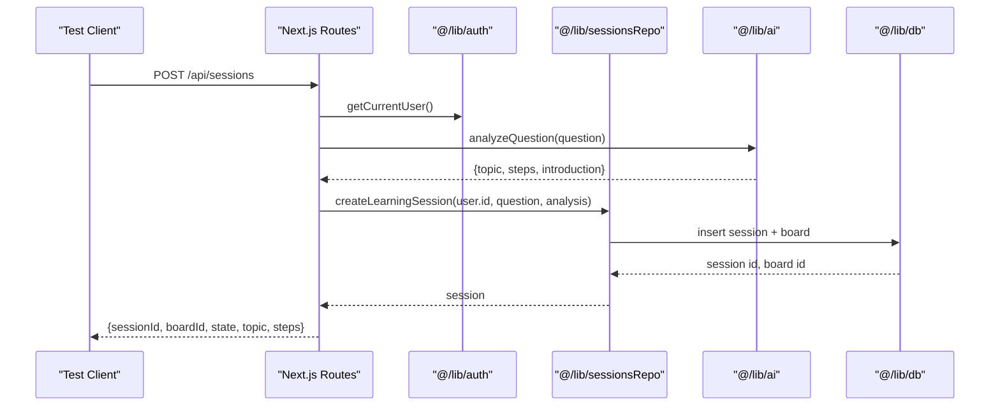
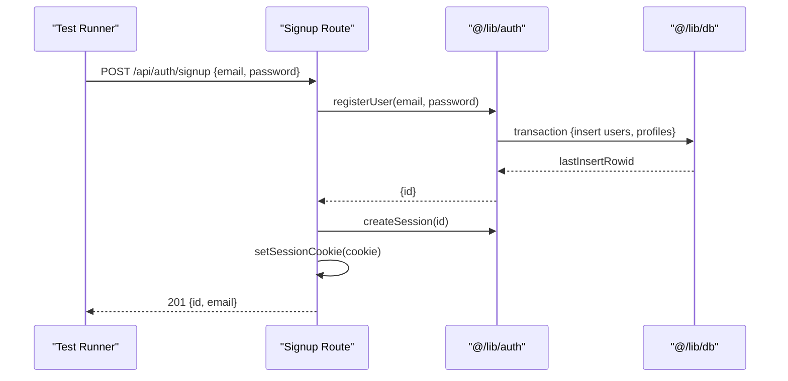
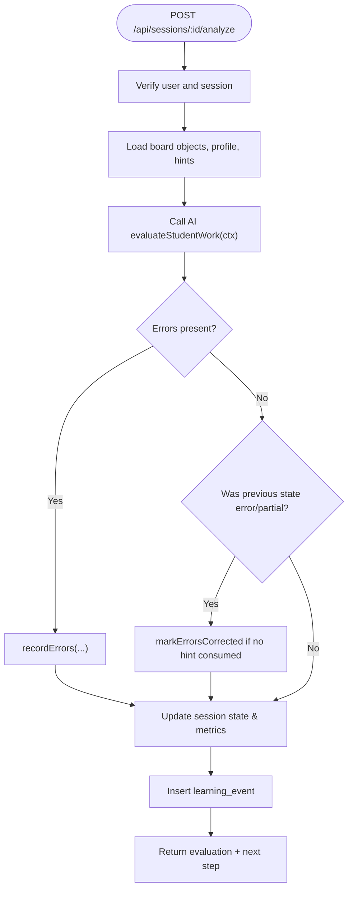
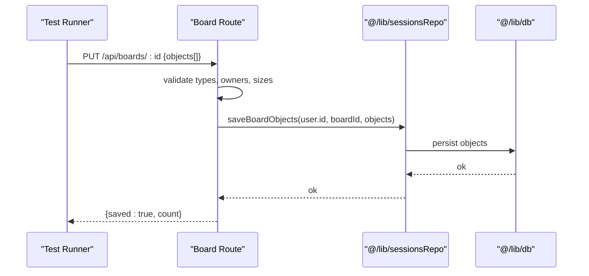
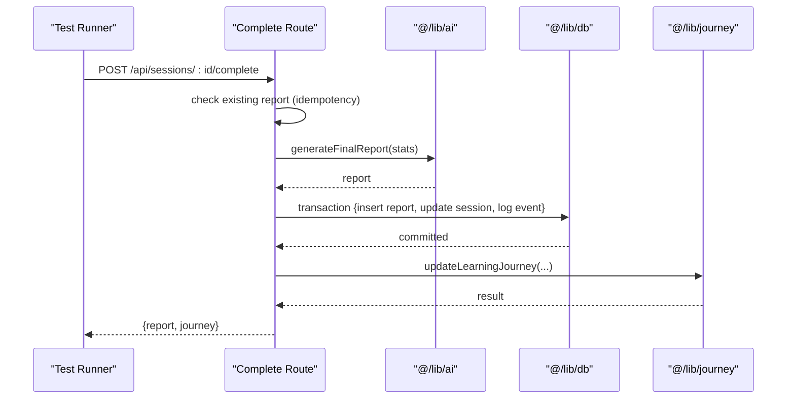
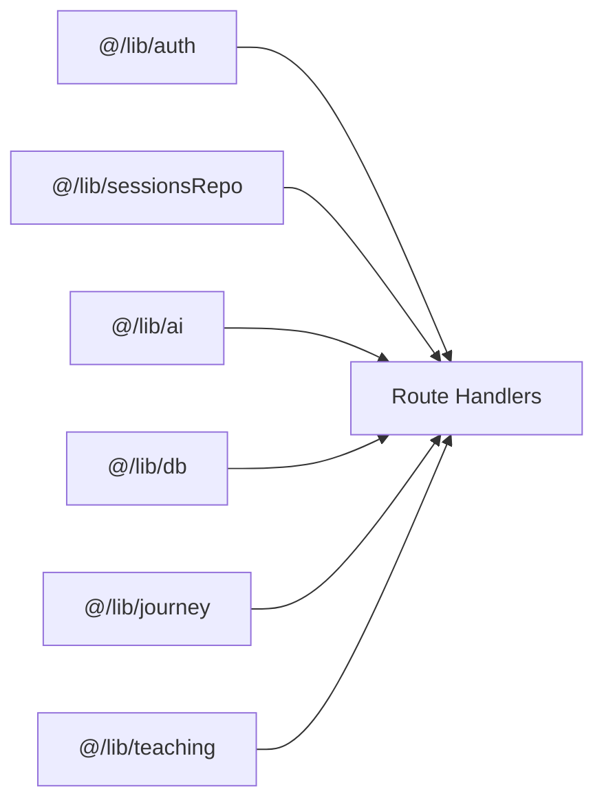

# Integration Testing

<cite>
**Referenced Files in This Document**
- [route.ts](file://stepwise ai/app/app/api/auth/login/route.ts)
- [route.ts](file://stepwise ai/app/app/api/auth/signup/route.ts)
- [route.ts](file://stepwise ai/app/app/api/auth/logout/route.ts)
- [auth.ts](file://stepwise ai/app/lib/auth.ts)
- [route.ts](file://stepwise ai/app/app/api/sessions/route.ts)
- [route.ts](file://stepwise ai/app/app/api/sessions/[id]/route.ts)
- [route.ts](file://stepwise ai/app/app/api/sessions/[id]/analyze/route.ts)
- [route.ts](file://stepwise ai/app/app/api/sessions/[id]/complete/route.ts)
- [route.ts](file://stepwise ai/app/app/api/boards/[id]/route.ts)
- [route.ts](file://stepwise ai/app/app/api/reports/[sessionId]/route.ts)
</cite>

## Table of Contents
1. Introduction
2. Project Structure
3. Core Components
4. Architecture Overview
5. Detailed Component Analysis
6. Dependency Analysis
7. Performance Considerations
8. Troubleshooting Guide
9. Conclusion

## Introduction
This document provides a comprehensive integration testing guide for StepWise AI, focusing on API endpoint testing and service integration validation. It covers authentication flows, session management, board operations, report generation, database interactions, transaction handling, data consistency, AI service integrations (with mocking strategies), end-to-end user workflows, environment setup, seeding, cleanup, concurrency, error propagation, and security validations across integrated components.

## Project Structure
StepWise AI exposes Next.js Route Handlers under app/api that implement the core features:
- Authentication: login, signup, logout
- Sessions: create, recover, analyze, complete
- Boards: read, update, event logging
- Reports: retrieve final reports

**Diagram sources**
- [route.ts:1-36](file://stepwise ai/app/app/api/auth/signup/route.ts#L1-L36)
- [route.ts:1-30](file://stepwise ai/app/app/api/auth/login/route.ts#L1-L30)
- [route.ts:1-12](file://stepwise ai/app/app/api/auth/logout/route.ts#L1-L12)
- [route.ts:1-56](file://stepwise ai/app/app/api/sessions/route.ts#L1-L56)
- [route.ts:1-51](file://stepwise ai/app/app/api/sessions/[id]/route.ts#L1-L51)
- [route.ts:1-180](file://stepwise ai/app/app/api/sessions/[id]/analyze/route.ts#L1-L180)
- [route.ts:1-124](file://stepwise ai/app/app/api/sessions/[id]/complete/route.ts#L1-L124)
- [route.ts:1-106](file://stepwise ai/app/app/api/boards/[id]/route.ts#L1-L106)
- [route.ts:1-21](file://stepwise ai/app/app/api/reports/[sessionId]/route.ts#L1-L21)
- [auth.ts:1-139](file://stepwise ai/app/lib/auth.ts#L1-L139)

**Section sources**
- [route.ts:1-36](file://stepwise ai/app/app/api/auth/signup/route.ts#L1-L36)
- [route.ts:1-30](file://stepwise ai/app/app/api/auth/login/route.ts#L1-L30)
- [route.ts:1-12](file://stepwise ai/app/app/api/auth/logout/route.ts#L1-L12)
- [route.ts:1-56](file://stepwise ai/app/app/api/sessions/route.ts#L1-L56)
- [route.ts:1-51](file://stepwise ai/app/app/api/sessions/[id]/route.ts#L1-L51)
- [route.ts:1-180](file://stepwise ai/app/app/api/sessions/[id]/analyze/route.ts#L1-L180)
- [route.ts:1-124](file://stepwise ai/app/app/api/sessions/[id]/complete/route.ts#L1-L124)
- [route.ts:1-106](file://stepwise ai/app/app/api/boards/[id]/route.ts#L1-L106)
- [route.ts:1-21](file://stepwise ai/app/app/api/reports/[sessionId]/route.ts#L1-L21)
- [auth.ts:1-139](file://stepwise ai/app/lib/auth.ts#L1-L139)

## Core Components
- Authentication module: password hashing, session creation/validation, cookie management, user registration and login.
- Session endpoints: create learning sessions, recover state, evaluate student work, finalize sessions with reports.
- Board endpoints: fetch and persist board objects, record meaningful events.
- Report endpoint: ownership-verified retrieval of final reports.
- Shared helpers: request parsing, response formatting, authorization checks.

Key testing targets:
- Auth flow: signup, login, logout, session cookie lifecycle.
- Session lifecycle: creation, recovery, analysis loop, completion.
- Board persistence: object validation, ownership checks, event recording.
- Report generation: idempotent completion, atomic DB updates, journey updates.
- AI integration: provider abstraction, mockable interfaces, response shape validation.

**Section sources**
- [auth.ts:1-139](file://stepwise ai/app/lib/auth.ts#L1-L139)
- [route.ts:1-56](file://stepwise ai/app/app/api/sessions/route.ts#L1-L56)
- [route.ts:1-180](file://stepwise ai/app/app/api/sessions/[id]/analyze/route.ts#L1-L180)
- [route.ts:1-124](file://stepwise ai/app/app/api/sessions/[id]/complete/route.ts#L1-L124)
- [route.ts:1-106](file://stepwise ai/app/app/api/boards/[id]/route.ts#L1-L106)
- [route.ts:1-21](file://stepwise ai/app/app/api/reports/[sessionId]/route.ts#L1-L21)

## Architecture Overview
The system follows a layered architecture:
- API layer: Next.js route handlers validate inputs, enforce authorization, orchestrate business logic.
- Service layer: repositories and utilities handle domain operations (sessions, boards, journeys).
- Data layer: SQLite-backed db abstraction with transactions and typed queries.
- External services: AI provider abstraction for question analysis, evaluation, and final report generation.

**Diagram sources**
- [route.ts:1-56](file://stepwise ai/app/app/api/sessions/route.ts#L1-L56)
- [auth.ts:78-102](file://stepwise ai/app/lib/auth.ts#L78-L102)
- [route.ts:1-51](file://stepwise ai/app/app/api/sessions/[id]/route.ts#L1-L51)

## Detailed Component Analysis

### Authentication Endpoints
- Signup: validates email format and password strength, checks uniqueness, registers user and profile, creates session, sets httpOnly cookie.
- Login: validates credentials, creates session, sets httpOnly cookie, returns minimal user info.
- Logout: destroys server-side session, clears cookie.

Testing strategy:
- Validate input sanitization and error codes for invalid or weak credentials.
- Assert cookie attributes (httpOnly, sameSite, secure in production).
- Verify session creation and destruction in auth_sessions table.
- Ensure constant-time messaging to avoid enumeration.

**Diagram sources**
- [route.ts:1-36](file://stepwise ai/app/app/api/auth/signup/route.ts#L1-L36)
- [auth.ts:104-128](file://stepwise ai/app/lib/auth.ts#L104-L128)

**Section sources**
- [route.ts:1-36](file://stepwise ai/app/app/api/auth/signup/route.ts#L1-L36)
- [route.ts:1-30](file://stepwise ai/app/app/api/auth/login/route.ts#L1-L30)
- [route.ts:1-12](file://stepwise ai/app/app/api/auth/logout/route.ts#L1-L12)
- [auth.ts:1-139](file://stepwise ai/app/lib/auth.ts#L1-L139)

### Session Management APIs
- Create session: requires authenticated user, calls AI to analyze question, persists session and board, returns initial state.
- Recover session: returns full recovery payload including session metadata, board objects, AI messages, and provider info.
- Analyze step: evaluates student work, records errors/hints, transitions state, logs events.
- Complete session: idempotent finalization, generates final report, updates session status, updates learning journey atomically.

Testing strategy:
- Authorization: ensure unauthorized requests are rejected.
- Input validation: boundary values for question length, step index, attempt text.
- AI mocking: provide deterministic responses for analyzeQuestion and evaluateStudentWork; assert downstream behavior.
- State machine: verify transitions from creation through steps to INTEGRATION and SESSION_COMPLETE.
- Persistence: confirm rows in sessions, board objects, hints, learning_events, and reports tables after completion.

**Diagram sources**
- [route.ts:1-180](file://stepwise ai/app/app/api/sessions/[id]/analyze/route.ts#L1-L180)

**Section sources**
- [route.ts:1-56](file://stepwise ai/app/app/api/sessions/route.ts#L1-L56)
- [route.ts:1-51](file://stepwise ai/app/app/api/sessions/[id]/route.ts#L1-L51)
- [route.ts:1-180](file://stepwise ai/app/app/api/sessions/[id]/analyze/route.ts#L1-L180)
- [route.ts:1-124](file://stepwise ai/app/app/api/sessions/[id]/complete/route.ts#L1-L124)

### Board Operations
- GET board: ownership check via user_id, returns persisted objects.
- PUT board: validates object types and owners, limits payload size, persists snapshot.
- POST event: records meaningful board events with sanitized payload.

Testing strategy:
- Ownership enforcement: assert notFound when accessing another user’s board.
- Payload validation: test max object count, content truncation, type/owner whitelisting.
- Event recording: verify event_type and payload constraints.

**Diagram sources**
- [route.ts:1-106](file://stepwise ai/app/app/api/boards/[id]/route.ts#L1-L106)

**Section sources**
- [route.ts:1-106](file://stepwise ai/app/app/api/boards/[id]/route.ts#L1-L106)

### Report Generation Endpoint
- Completion endpoint: idempotent report generation, atomic DB transaction to persist report and finalize session, then update learning journey.
- Retrieval endpoint: ownership-verified report access.

Testing strategy:
- Idempotency: call complete multiple times; expect same report and alreadyExisted flag.
- Atomicity: verify both report row and session status updated together.
- Journey update: assert learning journey reflects completed steps, errors, hints, misconceptions.
- Security: ensure only owner can retrieve reports.

**Diagram sources**
- [route.ts:1-124](file://stepwise ai/app/app/api/sessions/[id]/complete/route.ts#L1-L124)

**Section sources**
- [route.ts:1-124](file://stepwise ai/app/app/api/sessions/[id]/complete/route.ts#L1-L124)
- [route.ts:1-21](file://stepwise ai/app/app/api/reports/[sessionId]/route.ts#L1-L21)

### AI Service Integrations
- Provider abstraction: getAIProvider returns an implementation with methods like analyzeQuestion, evaluateStudentWork, generateFinalReport and metadata (displayName, isDemo).
- Mocking strategy: replace provider with a deterministic stub that returns fixed structures for each method; assert downstream state changes and persisted artifacts.

Validation points:
- Response shapes: ensure fields like topic, steps, evaluation.status, feedback, strengths, missingElements, nextAction exist where used.
- Error paths: simulate provider failures and assert serverError responses without leaking internals.
- Demo mode: toggle isDemoMode and assert UI/provider flags returned by endpoints.

**Section sources**
- [route.ts:1-56](file://stepwise ai/app/app/api/sessions/route.ts#L1-L56)
- [route.ts:1-180](file://stepwise ai/app/app/api/sessions/[id]/analyze/route.ts#L1-L180)
- [route.ts:1-124](file://stepwise ai/app/app/api/sessions/[id]/complete/route.ts#L1-L124)

## Dependency Analysis
Coupling and cohesion:
- Route handlers depend on auth for identity, sessionsRepo for domain operations, ai for external intelligence, and db for persistence.
- Cohesion is high within each handler; cross-cutting concerns (validation, response helpers) are centralized.

Potential risks:
- Tight coupling to AI provider contract; changes require coordinated tests.
- Transaction boundaries must be respected to avoid partial state.

**Diagram sources**
- [route.ts:1-56](file://stepwise ai/app/app/api/sessions/route.ts#L1-L56)
- [route.ts:1-180](file://stepwise ai/app/app/api/sessions/[id]/analyze/route.ts#L1-L180)
- [route.ts:1-124](file://stepwise ai/app/app/api/sessions/[id]/complete/route.ts#L1-L124)
- [auth.ts:1-139](file://stepwise ai/app/lib/auth.ts#L1-L139)

**Section sources**
- [route.ts:1-56](file://stepwise ai/app/app/api/sessions/route.ts#L1-L56)
- [route.ts:1-180](file://stepwise ai/app/app/api/sessions/[id]/analyze/route.ts#L1-L180)
- [route.ts:1-124](file://stepwise ai/app/app/api/sessions/[id]/complete/route.ts#L1-L124)
- [auth.ts:1-139](file://stepwise ai/app/lib/auth.ts#L1-L139)

## Performance Considerations
- Board snapshots: limit payload size and sanitize inputs to prevent large writes; tests should assert counts and truncation behavior.
- AI calls: cache or mock to reduce latency in tests; measure timeouts and retries.
- Transactions: keep them short and focused; verify commit success in completion flow.
- Concurrency: serialize tests per user/session to avoid contention; use isolated databases or unique namespaces.

[No sources needed since this section provides general guidance]

## Troubleshooting Guide
Common issues and how to detect them:
- Unauthorized access: ensure cookies are sent correctly; verify session signature and expiration handling.
- Invalid inputs: assert specific error codes for missing or malformed fields.
- AI provider failures: wrap calls with error handling; assert serverError responses and no partial state changes.
- Transaction failures: verify rollback behavior by simulating DB errors mid-transaction during completion.

Security validations:
- Password hashing and verification: assert non-plaintext storage and constant-time comparison usage.
- Cookie security: httpOnly, sameSite, secure flags based on environment.
- Ownership checks: ensure board and report endpoints enforce user_id scoping.

**Section sources**
- [auth.ts:1-139](file://stepwise ai/app/lib/auth.ts#L1-L139)
- [route.ts:1-106](file://stepwise ai/app/app/api/boards/[id]/route.ts#L1-L106)
- [route.ts:1-21](file://stepwise ai/app/app/api/reports/[sessionId]/route.ts#L1-L21)

## Conclusion
This guide outlines robust integration testing practices for StepWise AI’s authentication, sessions, boards, and reports, with clear strategies for mocking AI providers, validating data consistency via transactions, and ensuring security and performance. Use the provided diagrams and section references to build targeted tests that cover happy paths, edge cases, and failure modes across the entire user workflow from signup to session completion.