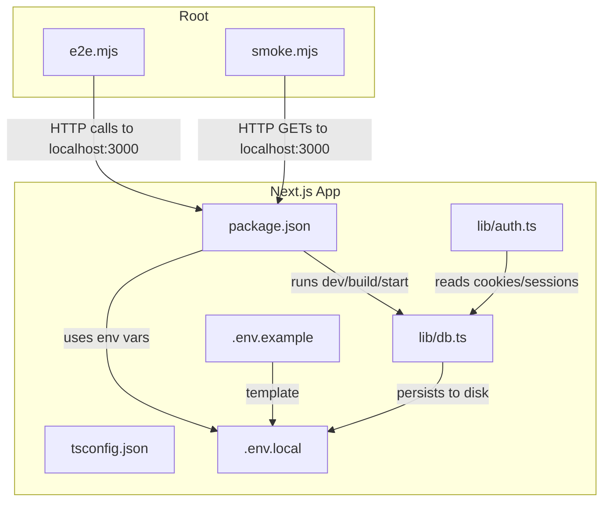
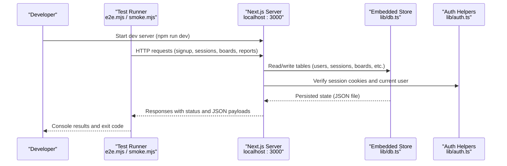
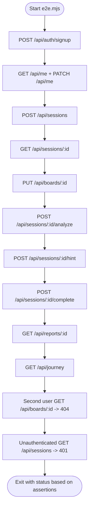
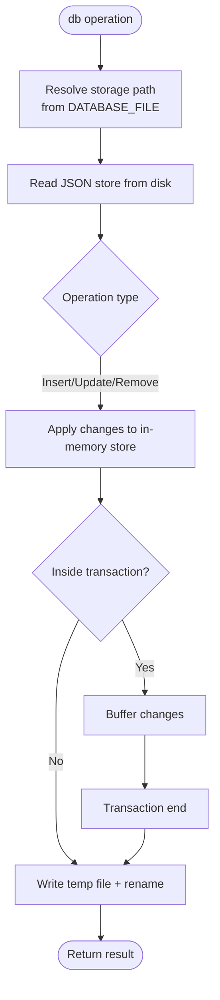
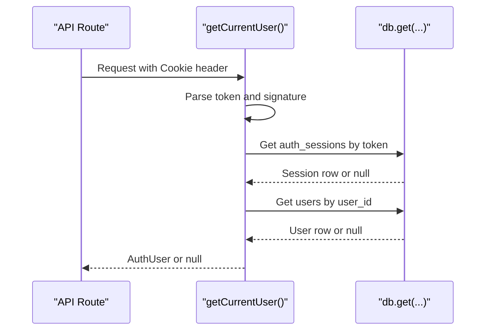
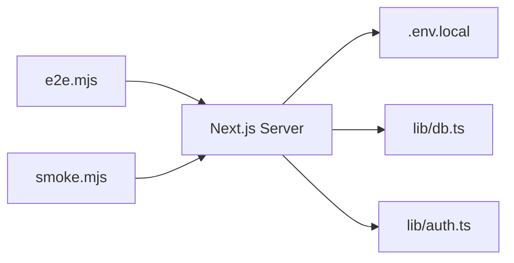

# Testing Infrastructure

<cite>
**Referenced Files in This Document**
- [package.json](file://stepwise ai/app/package.json)
- [tsconfig.json](file://stepwise ai/app/tsconfig.json)
- [.env.example](file://stepwise ai/app/.env.example)
- [.env.local](file://stepwise ai/app/.env.local)
- [e2e.mjs](file://stepwise ai/e2e.mjs)
- [smoke.mjs](file://stepwise ai/smoke.mjs)
- [db.ts](file://stepwise ai/app/lib/db.ts)
- [auth.ts](file://stepwise ai/app/lib/auth.ts)
</cite>

## Table of Contents
1. Introduction
2. Project Structure
3. Core Components
4. Architecture Overview
5. Detailed Component Analysis
6. Dependency Analysis
7. Performance Considerations
8. Troubleshooting Guide
9. Conclusion

## Introduction
This document explains the testing infrastructure for StepWise AI, focusing on how to run and extend tests, configure environments, manage test data, and integrate with CI/CD. The project currently includes:
- A Node-based end-to-end (E2E) script that exercises the live Next.js server via HTTP
- A smoke test that validates key pages return HTML responses
- An embedded JSON database layer that persists state to disk and supports transactions
- Environment configuration for AI provider selection, authentication secrets, and database file location

The goal is to provide a clear, practical guide for setting up test databases, mocking services, organizing tests, running them locally and in CI, and debugging issues.

## Project Structure
At a high level, testing-related assets are located at the repository root and within the Next.js app:
- Root-level scripts: e2e.mjs (full MVP loop), smoke.mjs (page health checks)
- App-level configuration: package.json (scripts and dependencies), tsconfig.json (TypeScript settings), .env files (runtime configuration)
- Data layer: lib/db.ts (embedded JSON store with transaction support)
- Auth helpers: lib/auth.ts (session handling and user operations used by API routes)

**Diagram sources**
- [e2e.mjs:1-147](file://stepwise ai/e2e.mjs#L1-L147)
- [smoke.mjs:1-14](file://stepwise ai/smoke.mjs#L1-L14)
- [package.json:6-12](file://stepwise ai/app/package.json#L6-L12)
- [tsconfig.json:1-22](file://stepwise ai/app/tsconfig.json#L1-L22)
- [.env.example:1-21](file://stepwise ai/app/.env.example#L1-L21)
- [.env.local:1-7](file://stepwise ai/app/.env.local#L1-L7)
- [db.ts:66-94](file://stepwise ai/app/lib/db.ts#L66-L94)
- [auth.ts:78-102](file://stepwise ai/app/lib/auth.ts#L78-L102)

**Section sources**
- [package.json:6-12](file://stepwise ai/app/package.json#L6-L12)
- [tsconfig.json:1-22](file://stepwise ai/app/tsconfig.json#L1-L22)
- [.env.example:1-21](file://stepwise ai/app/.env.example#L1-L21)
- [.env.local:1-7](file://stepwise ai/app/.env.local#L1-L7)
- [e2e.mjs:1-147](file://stepwise ai/e2e.mjs#L1-L147)
- [smoke.mjs:1-14](file://stepwise ai/smoke.mjs#L1-L14)
- [db.ts:66-94](file://stepwise ai/app/lib/db.ts#L66-L94)
- [auth.ts:78-102](file://stepwise ai/app/lib/auth.ts#L78-L102)

## Core Components
- End-to-end test runner (e2e.mjs): Executes a full MVP scenario against a running Next.js server, including signup, onboarding, session creation, board autosave, analysis, hints, completion, report generation, journey updates, ownership isolation, and unauthenticated access blocking.
- Smoke test runner (smoke.mjs): Verifies core pages respond with HTML or redirects as expected.
- Database layer (db.ts): Embedded JSON store with atomic writes, transactions, and cascade deletes; persisted to a configurable file path derived from environment variables.
- Authentication helpers (auth.ts): Session cookie verification and user registration/authentication functions used by API routes.

Key responsibilities:
- e2e.mjs orchestrates multi-step workflows and asserts outcomes using simple console logging and exit codes.
- smoke.mjs performs lightweight page availability checks suitable for quick health probes.
- db.ts ensures consistent persistence and isolation between runs via a configurable storage file.
- auth.ts enforces session integrity and user identity across requests.

**Section sources**
- [e2e.mjs:1-147](file://stepwise ai/e2e.mjs#L1-L147)
- [smoke.mjs:1-14](file://stepwise ai/smoke.mjs#L1-L14)
- [db.ts:66-94](file://stepwise ai/app/lib/db.ts#L66-L94)
- [auth.ts:78-102](file://stepwise ai/app/lib/auth.ts#L78-L102)

## Architecture Overview
The testing architecture centers around a running Next.js application and Node-based test scripts that interact over HTTP. The database layer persists state to disk, enabling deterministic test scenarios and isolation through environment-driven file paths.

**Diagram sources**
- [e2e.mjs:1-147](file://stepwise ai/e2e.mjs#L1-L147)
- [smoke.mjs:1-14](file://stepwise ai/smoke.mjs#L1-L14)
- [db.ts:66-94](file://stepwise ai/app/lib/db.ts#L66-L94)
- [auth.ts:78-102](file://stepwise ai/app/lib/auth.ts#L78-L102)

## Detailed Component Analysis

### E2E Test Runner (e2e.mjs)
Purpose:
- Validates the complete MVP flow end-to-end, covering user lifecycle, session management, board interactions, evaluation/hints, completion, reporting, and security boundaries.

Key behaviors:
- Uses fetch to call API endpoints and maintains a cookie jar for authenticated sessions.
- Asserts response statuses and payload fields; sets process.exitCode on failures.
- Exercises ownership isolation by creating a second user and verifying access control.
- Confirms idempotent report generation and retrieval of reports/journey data.

**Diagram sources**
- [e2e.mjs:36-146](file://stepwise ai/e2e.mjs#L36-L146)

**Section sources**
- [e2e.mjs:1-147](file://stepwise ai/e2e.mjs#L1-L147)

### Smoke Test Runner (smoke.mjs)
Purpose:
- Quick health check to ensure critical pages respond with HTML or appropriate redirects.

Behavior:
- Iterates over a predefined list of page paths and fetches each.
- Logs pass/fail per page and exits non-zero if any page fails.

**Section sources**
- [smoke.mjs:1-14](file://stepwise ai/smoke.mjs#L1-L14)

### Database Layer (db.ts)
Purpose:
- Provides an embedded relational-style API backed by a JSON file with atomic writes and transaction support.

Key features:
- Configurable storage path via DATABASE_FILE environment variable; resolves to a JSON file.
- Atomic write pattern using temporary file and rename to prevent partial writes.
- Transaction buffer that commits once at the end of a transaction block.
- Cascade delete helper to maintain referential integrity.

**Diagram sources**
- [db.ts:66-94](file://stepwise ai/app/lib/db.ts#L66-L94)
- [db.ts:183-194](file://stepwise ai/app/lib/db.ts#L183-L194)

**Section sources**
- [db.ts:66-94](file://stepwise ai/app/lib/db.ts#L66-L94)
- [db.ts:183-194](file://stepwise ai/app/lib/db.ts#L183-L194)
- [db.ts:201-223](file://stepwise ai/app/lib/db.ts#L201-L223)

### Authentication Helpers (auth.ts)
Purpose:
- Validates session cookies and retrieves the current user context for API routes.

Key behaviors:
- Parses and verifies signed session cookies using timing-safe comparison.
- Checks session expiration and removes expired sessions.
- Resolves user identity from stored sessions and users tables.

**Diagram sources**
- [auth.ts:78-102](file://stepwise ai/app/lib/auth.ts#L78-L102)

**Section sources**
- [auth.ts:78-102](file://stepwise ai/app/lib/auth.ts#L78-L102)

## Dependency Analysis
Testing depends on:
- Running Next.js server (dev/start)
- Environment variables for AI provider, auth secret, and database file path
- Embedded JSON store for persistent state during tests
- HTTP client behavior in test scripts (fetch)

**Diagram sources**
- [e2e.mjs:1-147](file://stepwise ai/e2e.mjs#L1-L147)
- [smoke.mjs:1-14](file://stepwise ai/smoke.mjs#L1-L14)
- [.env.local:1-7](file://stepwise ai/app/.env.local#L1-L7)
- [db.ts:66-94](file://stepwise ai/app/lib/db.ts#L66-L94)
- [auth.ts:78-102](file://stepwise ai/app/lib/auth.ts#L78-L102)

**Section sources**
- [package.json:6-12](file://stepwise ai/app/package.json#L6-L12)
- [.env.example:1-21](file://stepwise ai/app/.env.example#L1-L21)
- [.env.local:1-7](file://stepwise ai/app/.env.local#L1-L7)
- [db.ts:66-94](file://stepwise ai/app/lib/db.ts#L66-L94)
- [auth.ts:78-102](file://stepwise ai/app/lib/auth.ts#L78-L102)

## Performance Considerations
- Use isolated database files per test run to avoid contention and enable parallel execution. Configure DATABASE_FILE to unique paths per process when running multiple instances.
- Prefer smoke tests for fast feedback loops; reserve e2e.mjs for comprehensive validation after build or deploy.
- Keep e2e.mjs minimal and focused on critical flows to reduce runtime; split into smaller scripts if needed.
- Avoid heavy external dependencies in tests; leverage built-in fetch and Node APIs for speed and stability.
- For large suites, consider sharding test scripts by feature area and aggregating results in CI.

[No sources needed since this section provides general guidance]

## Troubleshooting Guide
Common issues and resolutions:
- Missing or incorrect environment variables:
  - Ensure .env.local contains AI_PROVIDER, AUTH_SECRET, and DATABASE_FILE values. Use .env.example as a template.
  - If AI integration is not required for tests, keep AI_PROVIDER=mock to avoid network calls.
- Database file conflicts:
  - If tests fail due to stale state, remove or rotate the JSON store file referenced by DATABASE_FILE.
  - Use transactions to ensure consistent state during complex operations.
- Authentication failures:
  - Verify AUTH_SECRET is set and matches what API routes expect for signing cookies.
  - Confirm cookie handling in tests preserves session state across requests.
- Network errors:
  - Ensure the Next.js server is running on the expected port before executing tests.
  - Check firewall/proxy settings if running in restricted environments.
- Test flakiness:
  - Add small delays or retries for transient network issues in test scripts.
  - Validate response structures before asserting nested fields.

**Section sources**
- [.env.example:1-21](file://stepwise ai/app/.env.example#L1-L21)
- [.env.local:1-7](file://stepwise ai/app/.env.local#L1-L7)
- [db.ts:66-94](file://stepwise ai/app/lib/db.ts#L66-L94)
- [auth.ts:78-102](file://stepwise ai/app/lib/auth.ts#L78-L102)

## Conclusion
StepWise AI’s testing infrastructure combines lightweight smoke checks with a comprehensive E2E script that validates core product flows against a running Next.js server. The embedded JSON database enables deterministic, isolated test runs with transactional consistency. By configuring environment variables appropriately and organizing tests into focused scripts, teams can achieve reliable local development feedback and robust CI/CD quality gates. Extending the suite with additional unit or component tests can further improve coverage while maintaining performance and clarity.

[No sources needed since this section summarizes without analyzing specific files]