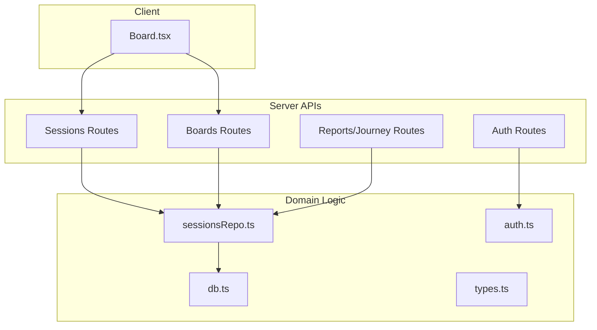
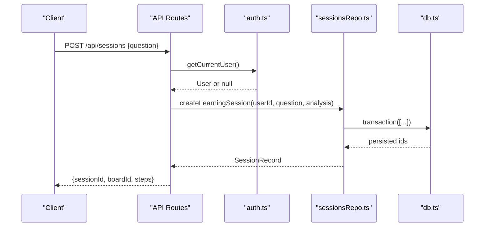
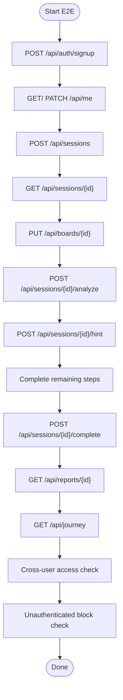
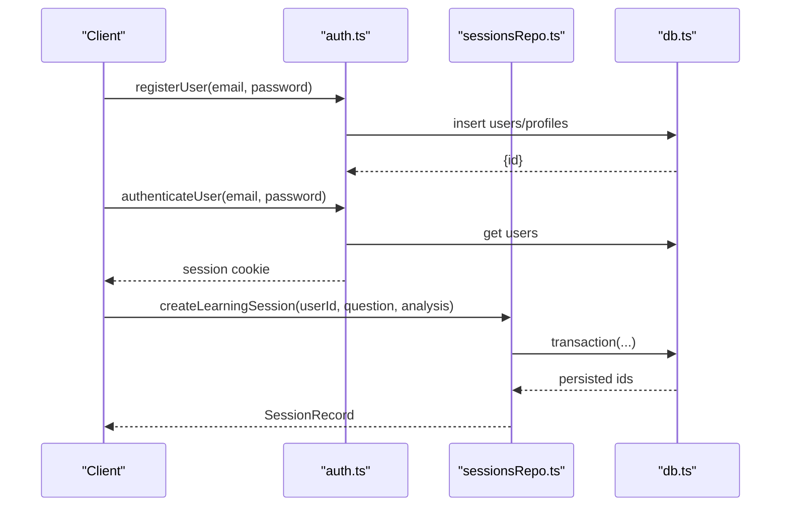
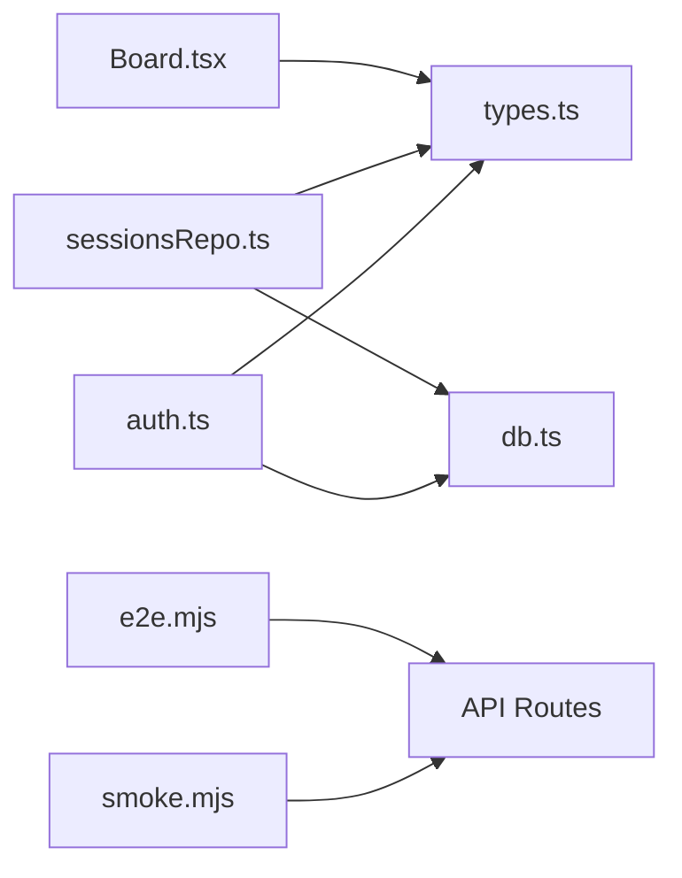

# Testing Strategy

<cite>
**Referenced Files in This Document**
- [package.json](file://stepwise ai/app/package.json)
- [e2e.mjs](file://stepwise ai/e2e.mjs)
- [smoke.mjs](file://stepwise ai/smoke.mjs)
- [Board.tsx](file://stepwise ai/app/components/board/Board.tsx)
- [db.ts](file://stepwise ai/app/lib/db.ts)
- [auth.ts](file://stepwise ai/app/lib/auth.ts)
- [sessionsRepo.ts](file://stepwise ai/app/lib/sessionsRepo.ts)
- [types.ts](file://stepwise ai/app/lib/types.ts)
</cite>

## Table of Contents
1. Introduction
2. Project Structure
3. Core Components
4. Architecture Overview
5. Detailed Component Analysis
6. Dependency Analysis
7. Performance Considerations
8. Troubleshooting Guide
9. Conclusion
10. Appendices

## Introduction
This document defines the testing strategy for StepWise AI across unit, integration, and end-to-end (E2E) layers. It explains how to set up tests, organize them, mock external dependencies, and validate critical flows such as Board interactions, authentication, session management, and AI-driven evaluation. It also covers test data management, environment setup, CI configuration, performance and accessibility testing, debugging techniques, parallelization, and reporting.

## Project Structure
StepWise AI is a Next.js application with:
- API routes under app/api for authentication, sessions, boards, reports, and journey endpoints
- A client-side interactive Board component
- Server-side repositories and database layer for persistence and business logic
- E2E smoke and full-flow scripts that exercise the running server

**Diagram sources**
- [Board.tsx:1-540](file://stepwise ai/app/components/board/Board.tsx#L1-L540)
- [sessionsRepo.ts:1-399](file://stepwise ai/app/lib/sessionsRepo.ts#L1-L399)
- [db.ts:1-224](file://stepwise ai/app/lib/db.ts#L1-L224)
- [auth.ts:1-139](file://stepwise ai/app/lib/auth.ts#L1-L139)
- [types.ts:1-302](file://stepwise ai/app/lib/types.ts#L1-L302)

**Section sources**
- [package.json:1-28](file://stepwise ai/app/package.json#L1-L28)

## Core Components
- Interactive Board: A React component handling user input, object creation/editing, pan/zoom, and committing changes via callbacks.
- Database Layer: An embedded JSON store with transactional writes and a small relational-style API.
- Authentication: Password hashing, session cookie signing, and current user resolution.
- Sessions Repository: Ownership-verified access to sessions, boards, events, hints, errors, and stats.
- Shared Types: Domain models for sessions, board objects, evaluations, hints, reports, profiles, and AI provider contracts.

Testing implications:
- Unit tests should target pure functions and isolated components using mocks/stubs.
- Integration tests should use the real db layer or an in-memory variant and verify repository behavior.
- E2E tests should run against a live server and validate complete user journeys.

**Section sources**
- [Board.tsx:1-540](file://stepwise ai/app/components/board/Board.tsx#L1-L540)
- [db.ts:1-224](file://stepwise ai/app/lib/db.ts#L1-L224)
- [auth.ts:1-139](file://stepwise ai/app/lib/auth.ts#L1-L139)
- [sessionsRepo.ts:1-399](file://stepwise ai/app/lib/sessionsRepo.ts#L1-L399)
- [types.ts:1-302](file://stepwise ai/app/lib/types.ts#L1-L302)

## Architecture Overview
The system follows a layered architecture:
- Client UI interacts with the Board component, which emits state changes via onCommit.
- API routes orchestrate requests by calling repositories and auth utilities.
- Repositories enforce ownership and persist data through the database layer.
- The database layer provides transactions and atomic writes to a JSON file.

**Diagram sources**
- [auth.ts:78-102](file://stepwise ai/app/lib/auth.ts#L78-L102)
- [sessionsRepo.ts:26-116](file://stepwise ai/app/lib/sessionsRepo.ts#L26-L116)
- [db.ts:183-194](file://stepwise ai/app/lib/db.ts#L183-L194)

## Detailed Component Analysis

### Unit Testing Strategy
- React Components (Board):
  - Render the component with mocked props and assert DOM structure and aria attributes.
  - Simulate pointer/keyboard events to trigger tool actions (text, draw, erase, pan).
  - Verify onCommit is called with expected next state for edits, deletions, and new objects.
  - Validate zoom controls update view state and reset functionality.
  - Use a lightweight test renderer or a headless browser; ensure event simulation supports pointer and keyboard.

- Utility Functions:
  - Test pure helpers from lib modules by invoking them directly with inputs and asserting outputs.
  - For crypto-based functions, isolate behavior by mocking time and random bytes where necessary.

- Business Logic Modules:
  - Test repository methods with a fresh in-memory or temporary JSON store per test.
  - Assert ownership checks prevent cross-user access.
  - Validate transaction boundaries by ensuring partial failures do not persist.

Mocking strategies:
- Mock external services (AI providers) via their interfaces defined in types.
- Stub network calls when testing client code that fetches APIs.
- Replace db.ts with a test double that uses an in-memory map or a temp file scoped to each test.

Test organization patterns:
- colocate tests near source files (unit.test.ts) or group by feature (tests/unit, tests/integration, tests/e2e).
- Use describe blocks to mirror domain areas: Auth, Sessions, Boards, Reports, Journey.

**Section sources**
- [Board.tsx:73-105](file://stepwise ai/app/components/board/Board.tsx#L73-L105)
- [Board.tsx:145-205](file://stepwise ai/app/components/board/Board.tsx#L145-L205)
- [Board.tsx:285-301](file://stepwise ai/app/components/board/Board.tsx#L285-L301)
- [types.ts:252-296](file://stepwise ai/app/lib/types.ts#L252-L296)

### Integration Testing Strategy
- API Endpoints:
  - Spin up the Next.js dev server and send HTTP requests to /api/auth/*, /api/sessions/*, /api/boards/*, /api/reports/*, /api/journey.
  - Assert status codes, envelope shapes, and data integrity.
  - Verify ownership isolation by creating separate users and accessing resources across accounts.

- Database Operations:
  - Use the real db.ts with a dedicated DATABASE_FILE per test process to avoid cross-test pollution.
  - Leverage db.transaction to wrap multi-step operations and assert atomicity.
  - Validate cascade deletion and cleanup routines.

- AI Service Integrations:
  - Provide a test implementation of AIProvider that returns deterministic results for analyzeQuestion, evaluateStudentWork, generateHint, and generateFinalReport.
  - Inject this provider into route handlers or repository adapters to avoid network calls.

- Session Management:
  - Create sessions, simulate student attempts, call analyze/hint endpoints, and verify state transitions and persisted artifacts.

**Section sources**
- [db.ts:123-199](file://stepwise ai/app/lib/db.ts#L123-L199)
- [sessionsRepo.ts:118-146](file://stepwise ai/app/lib/sessionsRepo.ts#L118-L146)
- [sessionsRepo.ts:197-265](file://stepwise ai/app/lib/sessionsRepo.ts#L197-L265)
- [types.ts:126-147](file://stepwise ai/app/lib/types.ts#L126-L147)

### End-to-End Testing Strategy
Two existing scripts demonstrate E2E approaches:

- Full MVP loop (e2e.mjs):
  - Signs up a user, completes onboarding, creates a session, autosaves board objects, evaluates attempts, exercises hint ladder, completes all steps, generates report, verifies idempotency, fetches report and journey, validates ownership isolation, and ensures unauthenticated access is blocked.

- Page smoke test (smoke.mjs):
  - Iterates known pages and asserts they return HTML responses with acceptable status codes.

**Diagram sources**
- [e2e.mjs:36-146](file://stepwise ai/e2e.mjs#L36-L146)

**Section sources**
- [e2e.mjs:1-147](file://stepwise ai/e2e.mjs#L1-L147)
- [smoke.mjs:1-14](file://stepwise ai/smoke.mjs#L1-L14)

### Testing the Interactive Board
- Input interactions:
  - Simulate pointer down/move/up to create text/drawing objects and verify onCommit payloads.
  - Trigger erase mode and confirm removal of student-owned objects and feedback clearing.
  - Validate keyboard shortcuts (Space pan, Delete remove, Escape deselect).

- Viewport interactions:
  - Wheel zoom centered on cursor and zoom buttons; assert scale bounds and reset behavior.

- Accessibility:
  - Ensure role="application" and aria-labels are present on the canvas and controls.
  - Verify focus management during editing and that screen readers can navigate controls.

**Section sources**
- [Board.tsx:73-105](file://stepwise ai/app/components/board/Board.tsx#L73-L105)
- [Board.tsx:117-128](file://stepwise ai/app/components/board/Board.tsx#L117-L128)
- [Board.tsx:316-404](file://stepwise ai/app/components/board/Board.tsx#L316-L404)

### Authentication Flows and Session Management
- Registration and login:
  - Hash passwords securely and compare using constant-time comparison.
  - Create signed session cookies and verify them on subsequent requests.

- Session lifecycle:
  - Create sessions with questions and seed board objects.
  - Update session state and track active seconds.
  - Record hints, errors, and learning events.

- Ownership verification:
  - All repository lookups must re-verify ownership based on authenticated user context.

**Diagram sources**
- [auth.ts:24-51](file://stepwise ai/app/lib/auth.ts#L24-L51)
- [auth.ts:78-102](file://stepwise ai/app/lib/auth.ts#L78-L102)
- [sessionsRepo.ts:26-116](file://stepwise ai/app/lib/sessionsRepo.ts#L26-L116)
- [db.ts:183-194](file://stepwise ai/app/lib/db.ts#L183-L194)

**Section sources**
- [auth.ts:1-139](file://stepwise ai/app/lib/auth.ts#L1-L139)
- [sessionsRepo.ts:118-195](file://stepwise ai/app/lib/sessionsRepo.ts#L118-L195)

### Test Data Management
- Use a unique DATABASE_FILE per test process to isolate state.
- Seed minimal fixtures for users, profiles, sessions, and boards before tests.
- Clean up after tests by deleting the temporary file or resetting the store.
- For E2E, create ephemeral accounts with timestamps to avoid collisions.

**Section sources**
- [db.ts:66-94](file://stepwise ai/app/lib/db.ts#L66-L94)
- [e2e.mjs:34-44](file://stepwise ai/e2e.mjs#L34-L44)

### Test Environment Setup
- Install dependencies and typecheck before running tests.
- Start the Next.js server in a background process for integration/E2E tests.
- Set required environment variables:
  - AUTH_SECRET for production-like behavior; development fallback is allowed.
  - DATABASE_FILE pointing to a temp path for tests.
- Ensure ports are free and handle server startup retries.

**Section sources**
- [package.json:6-12](file://stepwise ai/app/package.json#L6-L12)
- [auth.ts:12-22](file://stepwise ai/app/lib/auth.ts#L12-L22)
- [db.ts:66-71](file://stepwise ai/app/lib/db.ts#L66-L71)

### Continuous Integration Configuration
- Steps:
  - Install dependencies and run typecheck.
  - Lint code.
  - Run unit tests with coverage.
  - Start server and run integration tests.
  - Run E2E smoke and full flow scripts.
  - Upload coverage and test artifacts.

- Parallelization:
  - Run unit tests in parallel workers.
  - Isolate integration suites per feature to avoid shared state conflicts.
  - Queue E2E tests to run sequentially against a single server instance.

- Reporting:
  - Generate JUnit XML or similar reports for CI dashboards.
  - Capture screenshots/videos on E2E failures.

[No sources needed since this section provides general guidance]

### Performance and Load Testing
- Unit-level:
  - Measure rendering performance of Board with large datasets using profiling tools.
  - Validate that onCommit batching avoids excessive re-renders.

- Integration-level:
  - Stress the database layer with concurrent transactions to ensure atomicity and correctness.
  - Benchmark repository queries and updates under load.

- E2E-level:
  - Use load generators to simulate multiple users creating sessions and interacting with boards.
  - Monitor server memory, CPU, and disk I/O during sustained runs.

[No sources needed since this section provides general guidance]

### Accessibility Testing
- Automated checks:
  - Run axe-core or similar against rendered pages and interactive elements.
  - Validate aria roles and labels on the Board canvas and controls.

- Manual checks:
  - Keyboard navigation and focus order.
  - Screen reader announcements for feedback labels and states.

[No sources needed since this section provides general guidance]

### Debugging Techniques
- Logs:
  - Add structured logs around key operations in repositories and API routes.
  - Include request IDs and user context for traceability.

- Assertions:
  - Use descriptive assertion messages with extra context for failures.
  - Snapshot DOM for complex UI interactions when appropriate.

- E2E debugging:
  - Pause execution on failure and capture console output and network logs.
  - Use step-by-step execution to isolate failing steps.

**Section sources**
- [e2e.mjs:25-32](file://stepwise ai/e2e.mjs#L25-L32)

### Test Parallelization
- Unit tests:
  - Run in parallel with isolated module imports and no shared global state.
  - Avoid mutating shared constants; clone or reset state per test.

- Integration tests:
  - Use separate DATABASE_FILE per worker to prevent cross-talk.
  - Serialize tests that depend on shared seeds if necessary.

- E2E tests:
  - Run sequentially against one server instance to maintain session consistency.

[No sources needed since this section provides general guidance]

### Test Result Reporting
- Collect coverage metrics for unit tests.
- Produce standardized reports (JUnit, HTML coverage) for CI consumption.
- Archive E2E artifacts (logs, screenshots, videos) for post-mortem analysis.

[No sources needed since this section provides general guidance]

## Dependency Analysis
Key dependencies and relationships:
- Board.tsx depends on types and UI metadata for rendering and interaction.
- sessionsRepo.ts depends on db.ts for persistence and types for modeling.
- auth.ts depends on db.ts for session storage and Node crypto for secure hashing/signing.
- E2E scripts depend on running server and its API routes.

**Diagram sources**
- [Board.tsx:1-540](file://stepwise ai/app/components/board/Board.tsx#L1-L540)
- [sessionsRepo.ts:1-399](file://stepwise ai/app/lib/sessionsRepo.ts#L1-L399)
- [db.ts:1-224](file://stepwise ai/app/lib/db.ts#L1-L224)
- [auth.ts:1-139](file://stepwise ai/app/lib/auth.ts#L1-L139)
- [e2e.mjs:1-147](file://stepwise ai/e2e.mjs#L1-L147)
- [smoke.mjs:1-14](file://stepwise ai/smoke.mjs#L1-L14)

**Section sources**
- [types.ts:1-302](file://stepwise ai/app/lib/types.ts#L1-L302)

## Performance Considerations
- Prefer batched updates to onCommit to reduce re-renders.
- Limit board object count in tests to keep render times reasonable.
- Use transactions to minimize disk writes and ensure consistency.
- Profile AI provider calls and cache deterministic results in tests.

[No sources needed since this section provides general guidance]

## Troubleshooting Guide
Common issues and resolutions:
- Missing AUTH_SECRET:
  - Ensure it is set in the environment; development allows a fallback but production will throw.

- Database file permissions:
  - Confirm write access to the configured DATABASE_FILE path.

- Ownership violations:
  - Verify that repository methods always filter by user_id and that API routes resolve the current user correctly.

- E2E flakiness:
  - Add retries for server startup and stable timeouts for network calls.
  - Use unique emails and clean up temporary files between runs.

**Section sources**
- [auth.ts:12-22](file://stepwise ai/app/lib/auth.ts#L12-L22)
- [db.ts:66-94](file://stepwise ai/app/lib/db.ts#L66-L94)
- [sessionsRepo.ts:197-265](file://stepwise ai/app/lib/sessionsRepo.ts#L197-L265)

## Conclusion
StepWise AI’s testing strategy combines focused unit tests for components and utilities, robust integration tests leveraging the real database layer and repositories, and comprehensive E2E scripts that validate complete user workflows. By isolating state, mocking external services, and enforcing ownership checks in tests, the suite ensures reliability, security, and correctness across the application.

## Appendices

### Example Test Scenarios
- Board interactions:
  - Create text and drawing objects, edit content, delete items, pan/zoom, and verify onCommit calls.

- Authentication:
  - Register, login, set session cookie, and verify getCurrentUser resolves correctly.

- Sessions:
  - Create session, recover payload, autosave board, analyze attempts, request hints, complete steps, and finalize report.

- Ownership isolation:
  - Ensure another user cannot read or modify first user’s board.

- Unauthenticated access:
  - Block requests without valid session cookies.

**Section sources**
- [e2e.mjs:36-146](file://stepwise ai/e2e.mjs#L36-L146)