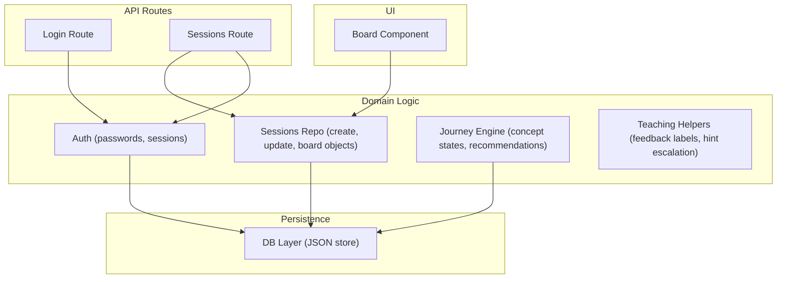
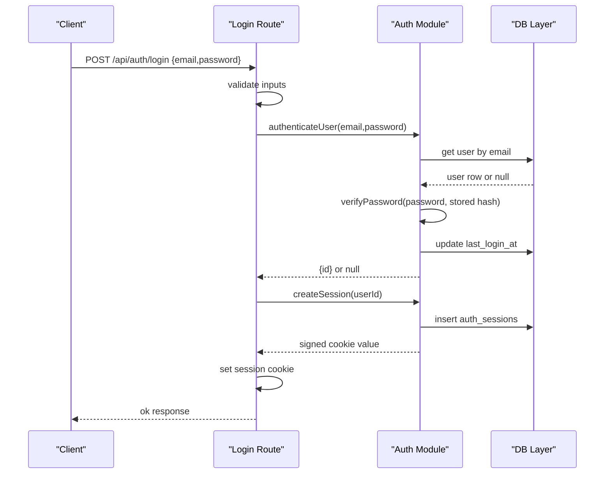
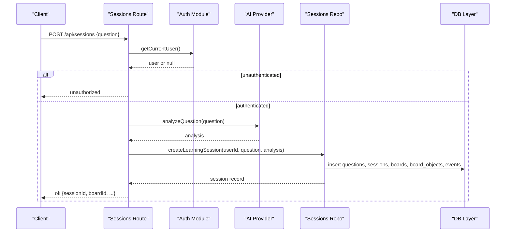
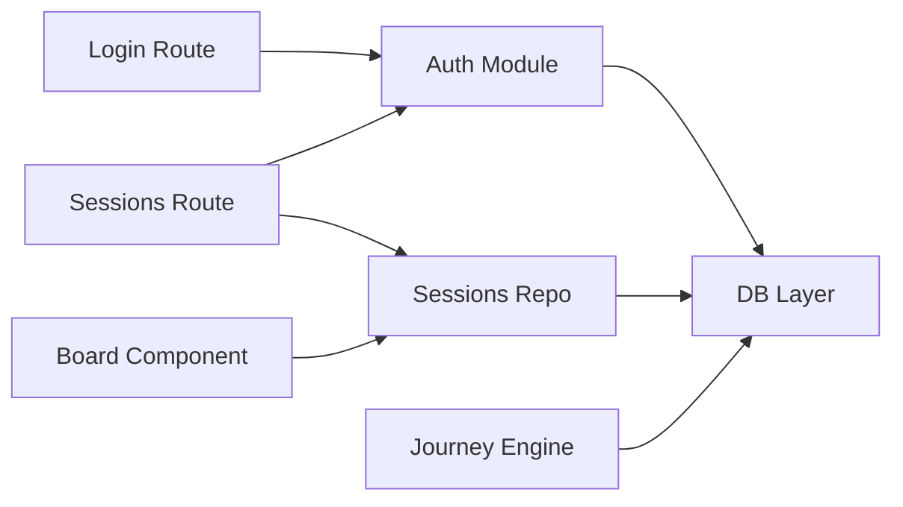

# Unit Testing

<cite>
**Referenced Files in This Document**
- [auth.ts](file://stepwise ai/app/lib/auth.ts)
- [db.ts](file://stepwise ai/app/lib/db.ts)
- [sessionsRepo.ts](file://stepwise ai/app/lib/sessionsRepo.ts)
- [types.ts](file://stepwise ai/app/lib/types.ts)
- [Board.tsx](file://stepwise ai/app/components/board/Board.tsx)
- [journey.ts](file://stepwise ai/app/lib/journey.ts)
- [teaching.ts](file://stepwise ai/app/lib/teaching.ts)
- [login route.ts](file://stepwise ai/app/app/api/auth/login/route.ts)
- [sessions route.ts](file://stepwise ai/app/app/api/sessions/route.ts)
- [package.json](file://stepwise ai/app/package.json)
</cite>

## Table of Contents
1. [Introduction](#introduction)
2. [Project Structure](#project-structure)
3. [Core Components](#core-components)
4. [Architecture Overview](#architecture-overview)
5. [Detailed Component Analysis](#detailed-component-analysis)
6. [Dependency Analysis](#dependency-analysis)
7. [Performance Considerations](#performance-considerations)
8. [Troubleshooting Guide](#troubleshooting-guide)
9. [Conclusion](#conclusion)
10. [Appendices](#appendices)

## Introduction
This document provides a comprehensive unit testing guide for StepWise AI. It covers strategies and patterns to test authentication functions, database operations, session management logic, utility modules, React components, TypeScript interfaces, and business logic. It also details mocking strategies for external dependencies such as AI services and file system operations, with examples for password hashing, session creation, board object manipulation, and data validation. Guidance is included for organizing tests, selecting assertion libraries, measuring coverage, and handling asynchronous operations, error scenarios, and edge cases.

## Project Structure
StepWise AI is a Next.js application with:
- API routes under app/app/api that orchestrate requests and call domain logic
- Domain logic in app/lib (authentication, sessions, journey engine, teaching helpers, types)
- A client-side Board component in app/components/board
- An embedded JSON-based database layer in app/lib/db

**Diagram sources**
- [login route.ts:1-30](file://stepwise ai/app/app/api/auth/login/route.ts#L1-L30)
- [sessions route.ts:1-56](file://stepwise ai/app/app/api/sessions/route.ts#L1-L56)
- [auth.ts:1-139](file://stepwise ai/app/lib/auth.ts#L1-L139)
- [sessionsRepo.ts:1-399](file://stepwise ai/app/lib/sessionsRepo.ts#L1-L399)
- [journey.ts:1-357](file://stepwise ai/app/lib/journey.ts#L1-L357)
- [teaching.ts:1-77](file://stepwise ai/app/lib/teaching.ts#L1-L77)
- [db.ts:1-224](file://stepwise ai/app/lib/db.ts#L1-L224)
- [Board.tsx:1-540](file://stepwise ai/app/components/board/Board.tsx#L1-L540)

**Section sources**
- [package.json:1-28](file://stepwise ai/app/package.json#L1-L28)

## Core Components
This section outlines what to test and how to structure tests for each core area.

- Authentication
  - Test password hashing and verification behavior, including invalid formats and timing-safe comparison paths.
  - Test session creation, cookie setting/clearing, and getCurrentUser resolution across valid, expired, and tampered cookies.
  - Test user registration and login flows, ensuring consistent messaging and no user enumeration.

- Database
  - Test CRUD operations on tables, transactional behavior, and cascade deletion.
  - Validate ordering, filtering, and safe parsing of JSON fields.
  - Ensure atomic writes and isolation within transactions.

- Sessions and Boards
  - Test creating learning sessions, updating session state, listing sessions, and ownership checks.
  - Test board object persistence, limits, sanitization, and event recording.
  - Test AI message and hint recording, error tracking, and stats computation.

- Journey Engine
  - Test concept status transitions based on completion ratios, hints used, and conceptual errors.
  - Test misconception lifecycle and review scheduling.
  - Test recommendation generation and event logging.

- Teaching Helpers
  - Test feedback label metadata, hint escalation, evaluation-to-state mapping, and intervention decisions.

- React Board Component
  - Test pointer interactions, tool modes, zoom/pan, selection, editing, drawing, erasing, and commit callbacks.
  - Test keyboard shortcuts and accessibility attributes.

**Section sources**
- [auth.ts:1-139](file://stepwise ai/app/lib/auth.ts#L1-L139)
- [db.ts:1-224](file://stepwise ai/app/lib/db.ts#L1-L224)
- [sessionsRepo.ts:1-399](file://stepwise ai/app/lib/sessionsRepo.ts#L1-L399)
- [journey.ts:1-357](file://stepwise ai/app/lib/journey.ts#L1-L357)
- [teaching.ts:1-77](file://stepwise ai/app/lib/teaching.ts#L1-L77)
- [Board.tsx:1-540](file://stepwise ai/app/components/board/Board.tsx#L1-L540)

## Architecture Overview
The following sequence diagrams illustrate key flows relevant to testing.

### Login Flow

**Diagram sources**
- [login route.ts:1-30](file://stepwise ai/app/app/api/auth/login/route.ts#L1-L30)
- [auth.ts:104-139](file://stepwise ai/app/lib/auth.ts#L104-L139)
- [db.ts:123-199](file://stepwise ai/app/lib/db.ts#L123-L199)

### Create Session Flow

**Diagram sources**
- [sessions route.ts:1-56](file://stepwise ai/app/app/api/sessions/route.ts#L1-L56)
- [sessionsRepo.ts:26-116](file://stepwise ai/app/lib/sessionsRepo.ts#L26-L116)
- [db.ts:123-199](file://stepwise ai/app/lib/db.ts#L123-L199)

## Detailed Component Analysis

### Authentication Unit Tests
Focus areas:
- Password hashing and verification
  - Verify format expectations and output structure.
  - Confirm timing-safe comparison path for correct passwords.
  - Assert false for malformed stored hashes and mismatched passwords.
- Session management
  - Verify token generation, expiration calculation, and insertion into sessions table.
  - Verify cookie options and clearing behavior.
  - Verify getCurrentUser resolves only valid, non-expired sessions and returns minimal user info.
- Registration and login
  - Ensure registration creates both user and profile records atomically.
  - Ensure login updates last_login_at and returns consistent messages regardless of user existence.

Mocking strategy:
- Mock db methods to isolate hashing/session logic from disk I/O.
- Mock Next cookies API to assert cookie settings without side effects.

Edge cases:
- Invalid AUTH_SECRET in production should throw; in development, allow insecure secret.
- Tampered cookie signatures must be rejected.
- Expired sessions must be cleaned up and return null.

**Section sources**
- [auth.ts:12-44](file://stepwise ai/app/lib/auth.ts#L12-L44)
- [auth.ts:46-71](file://stepwise ai/app/lib/auth.ts#L46-L71)
- [auth.ts:78-102](file://stepwise ai/app/lib/auth.ts#L78-L102)
- [auth.ts:104-139](file://stepwise ai/app/lib/auth.ts#L104-L139)

### Database Unit Tests
Focus areas:
- CRUD operations
  - Insert with auto-increment IDs.
  - Get with where clauses.
  - Update matching rows and changes count.
  - Remove matching rows and changes count.
- Ordering and filtering
  - Verify orderBy direction and null handling.
- Transactions
  - Verify atomicity: successful fn commits once; failures discard buffer.
- Cascade deletion
  - Verify deleteUserCascade removes related rows in the expected order.

Mocking strategy:
- For server-side tests, use the real db module but control the underlying file via environment variables or temporary directories.
- For pure unit tests, wrap db calls behind an interface and provide a mock implementation.

Edge cases:
- Missing tables default to empty arrays.
- Safe parsing of JSON fields in other modules should not crash on malformed data.

**Section sources**
- [db.ts:23-44](file://stepwise ai/app/lib/db.ts#L23-L44)
- [db.ts:73-99](file://stepwise ai/app/lib/db.ts#L73-L99)
- [db.ts:116-199](file://stepwise ai/app/lib/db.ts#L116-L199)
- [db.ts:201-224](file://stepwise ai/app/lib/db.ts#L201-L224)

### Sessions and Boards Unit Tests
Focus areas:
- Creating a learning session
  - Verify questions, sessions, boards, initial board objects, and learning events are created.
- Reading and listing sessions
  - Verify ownership filters and enriched data (question text, topic, report presence).
- Updating session state
  - Verify partial patches and automatic ended_at when status becomes completed.
- Board objects
  - Verify ownership checks before reads/writes.
  - Verify saveBoardObjects replaces objects atomically, enforces size limits, and updates timestamps.
  - Verify recordBoardEvent, addAiMessage, getAiMessages, recordHint, recordErrors, markErrorsCorrected.
- Stats computation
  - Verify totalSeconds, activeSeconds estimation, hintsUsed, errors mapping, and step counts.

Mocking strategy:
- Use the real db module with a controlled storage file or in-memory-like setup via transactions.
- For async AI integration points, mock getAIProvider at the route level.

Edge cases:
- Non-existent board or session should short-circuit safely.
- Overly large content should be truncated per constraints.
- Malformed JSON fields should parse to safe defaults.

**Section sources**
- [sessionsRepo.ts:26-116](file://stepwise ai/app/lib/sessionsRepo.ts#L26-L116)
- [sessionsRepo.ts:118-195](file://stepwise ai/app/lib/sessionsRepo.ts#L118-L195)
- [sessionsRepo.ts:197-282](file://stepwise ai/app/lib/sessionsRepo.ts#L197-L282)
- [sessionsRepo.ts:284-399](file://stepwise ai/app/lib/sessionsRepo.ts#L284-L399)

### Journey Engine Unit Tests
Focus areas:
- Concept status transitions
  - Full completion increases evidence and may move to UNDERSTOOD/STRONG/MASTERED depending on hints and prior evidence.
  - Partial completion moves to PARTIALLY_UNDERSTOOD or DEVELOPING based on hints.
  - No progress sets to INTRODUCED if lower than current.
- Misconception lifecycle
  - New misconceptions inserted; recurring after multiple occurrences.
- Review scheduling
  - Concepts in developing states schedule reviews and update due dates.
- Recommendations
  - Generate appropriate recommendations based on completion and errors.
- Event logging
  - Log journey_updated events with summary details.

Mocking strategy:
- Use db transactions to assert exact inserts/updates within a single logical operation.

Edge cases:
- Zero stepsTotal should avoid division issues.
- Concept names and topics should be truncated to field limits.

**Section sources**
- [journey.ts:10-36](file://stepwise ai/app/lib/journey.ts#L10-L36)
- [journey.ts:59-262](file://stepwise ai/app/lib/journey.ts#L59-L262)
- [journey.ts:264-357](file://stepwise ai/app/lib/journey.ts#L264-L357)

### Teaching Helpers Unit Tests
Focus areas:
- Feedback metadata completeness for all labels.
- Hint escalation: nextHintLevel increments based on previous levels and caps at 7.
- Evaluation-to-state mapping: correct/partial/error/uncertain map to CORRECT/PARTIAL/ERROR/UNCERTAIN.
- Intervention policy: decideIntervention thresholds per status and provider level.

Mocking strategy:
- Pure functions require no mocking; assert outputs directly.

Edge cases:
- Unknown learning mode falls back to balanced thresholds.
- Empty previous hints start at level 1.

**Section sources**
- [teaching.ts:8-77](file://stepwise ai/app/lib/teaching.ts#L8-L77)

### React Board Component Tests
Focus areas:
- Tool modes: select, text, draw, erase, pan.
- Pointer interactions: drag move, resize, draw polyline, erase hit detection.
- Zoom/pan controls and reset.
- Keyboard shortcuts: Space pan, Delete remove student-owned selected object, Escape deselect/edit.
- Commit callback behavior: verifies new objects added, edits applied, deletions propagated.
- Accessibility: roles, aria-labels, focus behavior during editing.

Mocking strategy:
- Render with test utilities and pass mock onCommit/onEraseFeedback handlers.
- Simulate pointer events and keyboard events to drive state changes.
- For rendering, ensure required props like objects, tool, readOnly, highlights are provided.

Edge cases:
- Editing textarea should prevent pointer events from bubbling to canvas.
- Erase should only affect student-owned objects.
- Drawing should produce a bounding box and points array.

**Section sources**
- [Board.tsx:13-105](file://stepwise ai/app/components/board/Board.tsx#L13-L105)
- [Board.tsx:107-205](file://stepwise ai/app/components/board/Board.tsx#L107-L205)
- [Board.tsx:207-283](file://stepwise ai/app/components/board/Board.tsx#L207-L283)
- [Board.tsx:285-405](file://stepwise ai/app/components/board/Board.tsx#L285-L405)
- [Board.tsx:408-540](file://stepwise ai/app/components/board/Board.tsx#L408-L540)

### API Route Tests
Focus areas:
- Login route
  - Validate input trimming and normalization.
  - Assert failure responses for missing credentials and invalid credentials.
  - Assert success includes user id and email and sets session cookie.
- Sessions route
  - Enforce authentication for POST and GET.
  - Validate question length and handle clarification responses.
  - Assert session creation returns expected fields and provider info.

Mocking strategy:
- Mock getCurrentUser and getAIProvider to control authentication and AI behavior.
- Assert returned envelopes and HTTP status codes.

Edge cases:
- Malformed JSON body should not crash; default to empty values.
- Unauthenticated access should return unauthorized.

**Section sources**
- [login route.ts:1-30](file://stepwise ai/app/app/api/auth/login/route.ts#L1-L30)
- [sessions route.ts:1-56](file://stepwise ai/app/app/api/sessions/route.ts#L1-L56)

## Dependency Analysis
Testing requires understanding how modules depend on each other and how to isolate them.

**Diagram sources**
- [auth.ts:1-139](file://stepwise ai/app/lib/auth.ts#L1-L139)
- [sessionsRepo.ts:1-399](file://stepwise ai/app/lib/sessionsRepo.ts#L1-L399)
- [journey.ts:1-357](file://stepwise ai/app/lib/journey.ts#L1-L357)
- [db.ts:1-224](file://stepwise ai/app/lib/db.ts#L1-L224)
- [login route.ts:1-30](file://stepwise ai/app/app/api/auth/login/route.ts#L1-L30)
- [sessions route.ts:1-56](file://stepwise ai/app/app/api/sessions/route.ts#L1-L56)
- [Board.tsx:1-540](file://stepwise ai/app/components/board/Board.tsx#L1-L540)

**Section sources**
- [db.ts:123-199](file://stepwise ai/app/lib/db.ts#L123-L199)
- [sessionsRepo.ts:197-282](file://stepwise ai/app/lib/sessionsRepo.ts#L197-L282)
- [journey.ts:59-262](file://stepwise ai/app/lib/journey.ts#L59-L262)

## Performance Considerations
- Prefer transactional tests to minimize disk writes and ensure deterministic outcomes.
- Keep test datasets small; limit lists and snapshots to essential assertions.
- Avoid heavy rendering in component tests; render only necessary parts and stub expensive UI features.
- Use fast mocks for AI providers and network-bound operations to keep tests quick and reliable.

[No sources needed since this section provides general guidance]

## Troubleshooting Guide
Common issues and resolutions:
- Flaky file-based DB tests
  - Isolate tests using separate DATABASE_FILE paths or clear state between tests.
  - Wrap mutations in transactions to ensure clean rollbacks on failure.
- Cookie-related test failures
  - Ensure cookies are mocked consistently; assert httpOnly, sameSite, secure flags per environment.
- AI provider variability
  - Mock analyzeQuestion and evaluateStudentWork to return deterministic results for stable assertions.
- Component interaction edge cases
  - Verify pointer capture and event propagation; ensure editing inputs do not trigger canvas actions.

**Section sources**
- [db.ts:66-99](file://stepwise ai/app/lib/db.ts#L66-L99)
- [auth.ts:59-71](file://stepwise ai/app/lib/auth.ts#L59-L71)
- [Board.tsx:73-105](file://stepwise ai/app/components/board/Board.tsx#L73-L105)

## Conclusion
A robust unit testing strategy for StepWise AI centers on isolating domain logic from infrastructure, leveraging transactions for deterministic persistence, and mocking external systems like AI providers. Focus on covering authentication security properties, session lifecycle, board object integrity, journey state transitions, and teaching helper policies. For React components, emphasize interaction-driven tests that validate state changes and side-effect callbacks. Adopt consistent organization, strong assertions, and coverage tools to maintain confidence as the codebase evolves.

[No sources needed since this section summarizes without analyzing specific files]

## Appendices

### Test Organization Patterns
- Group tests by feature: auth, db, sessions, journey, teaching, board.
- Co-locate tests near source files or organize under a tests directory mirroring src layout.
- Use descriptive test names that state inputs, behavior, and expected outcomes.

### Assertion Libraries and Coverage Tools
- Choose a Node-compatible assertion library compatible with your test runner.
- Configure coverage thresholds for critical modules (auth, db, sessions, journey).
- Exclude generated or third-party code from coverage reports.

### Asynchronous Operations and Error Handling
- For async AI calls, use promises and await patterns; assert resolved values and error branches.
- Validate error envelopes and status codes in route tests.
- Ensure error paths in domain logic return safe defaults and do not leak sensitive information.

### TypeScript Interfaces
- Validate shapes using runtime checks where necessary; rely on type checks in CI.
- Write tests that cover boundary conditions for enums and union types.

### External Dependencies Mocking
- AI provider: mock analyzeQuestion, evaluateStudentWork, generateHint, generateExplanation, generateFinalReport.
- File system: isolate db tests with isolated storage files or in-memory adapters.
- Next cookies: mock cookies() to assert header-level behavior without side effects.

[No sources needed since this section provides general guidance]