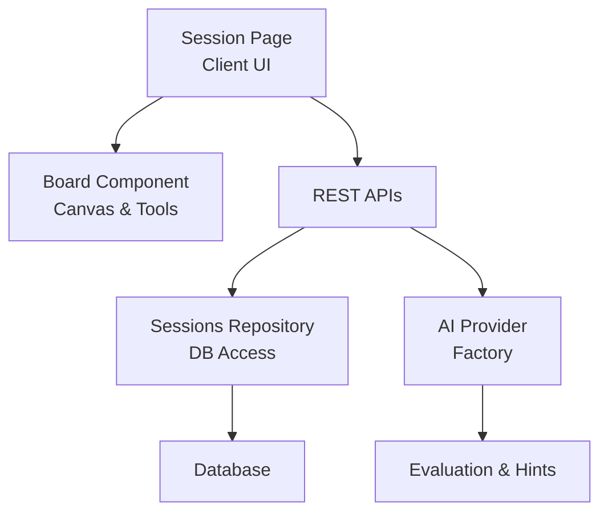
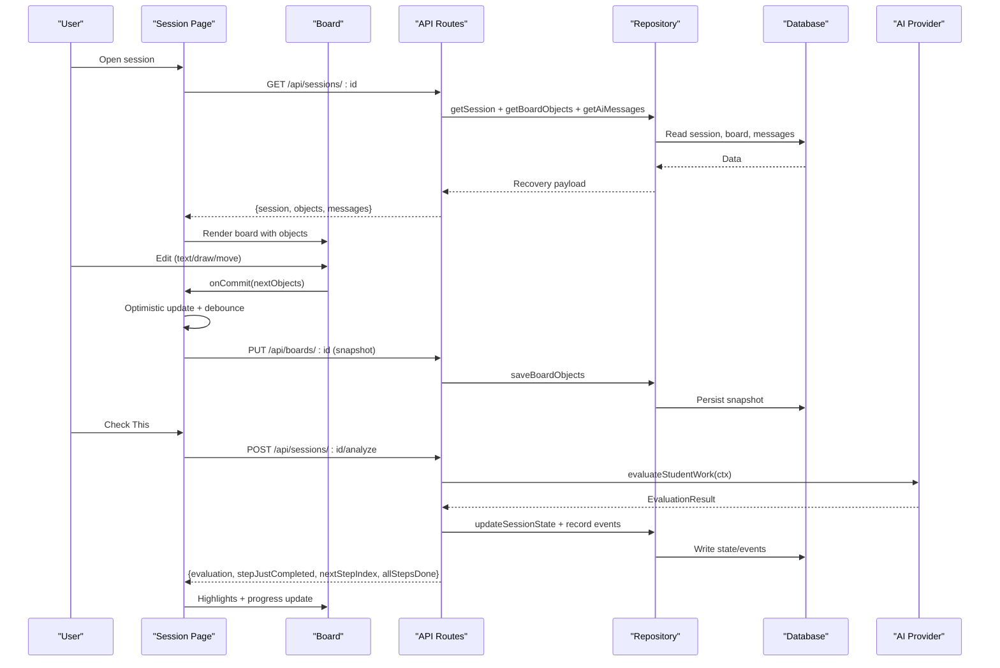
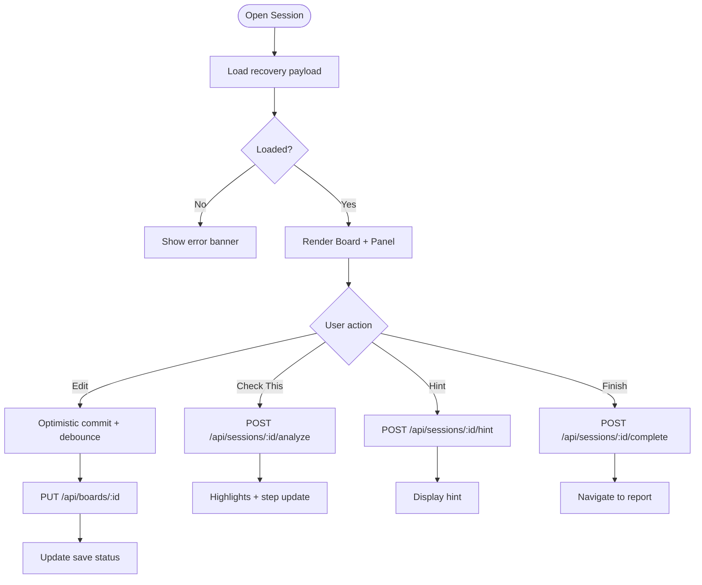
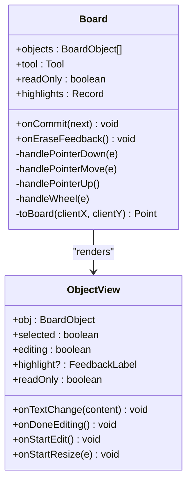
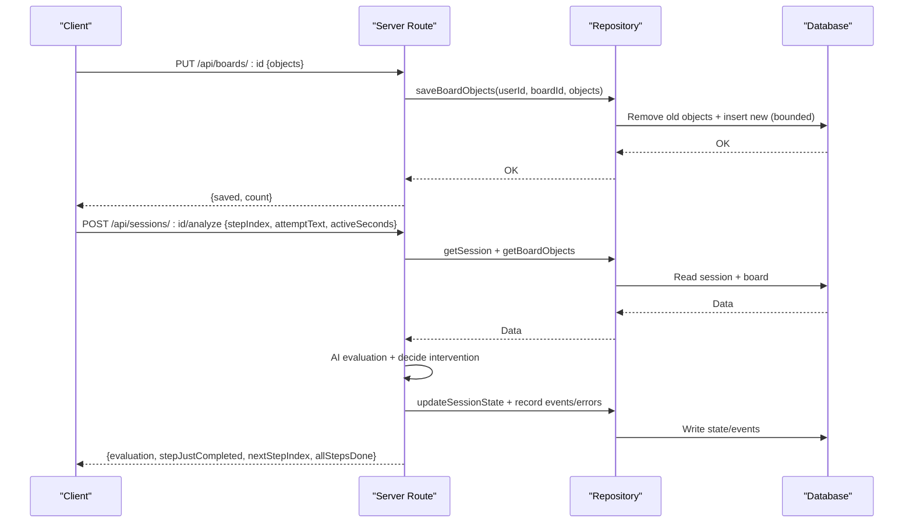
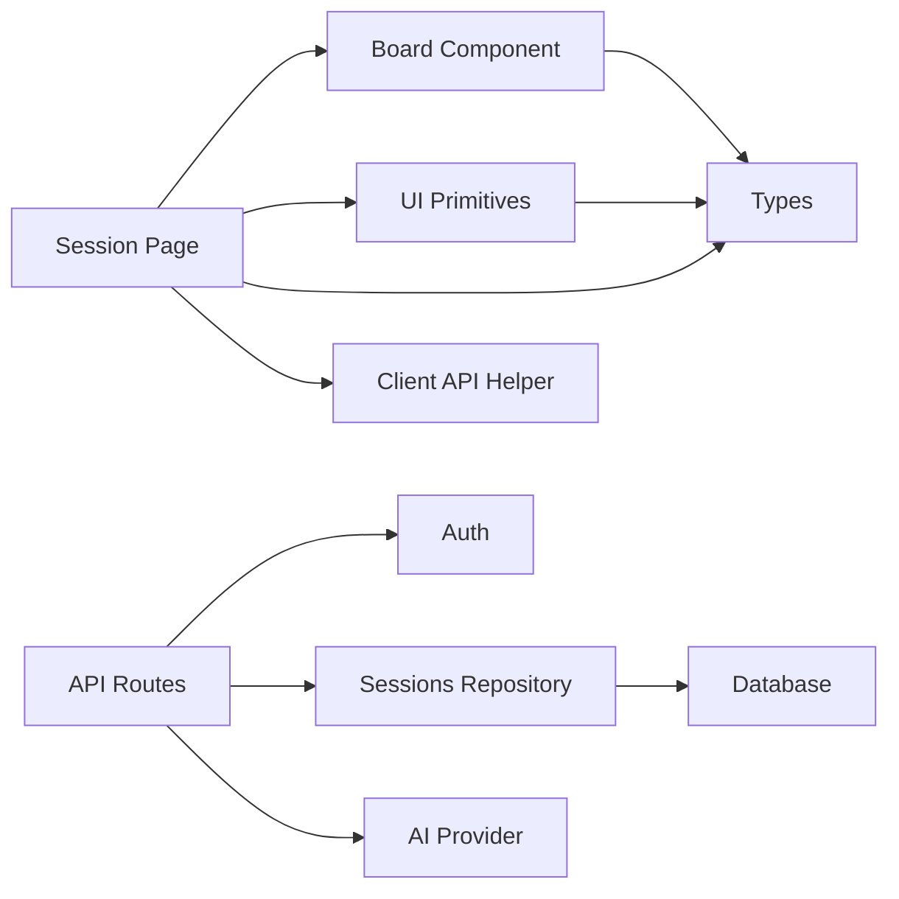

# Active Session Interface

<cite>
**Referenced Files in This Document**
- [page.tsx](file://app/app/session/[id]/page.tsx)
- [Board.tsx](file://app/components/board/Board.tsx)
- [route.ts (sessions/:id)](file://app/app/api/sessions/[id]/route.ts)
- [route.ts (boards/:id)](file://app/app/api/boards/[id]/route.ts)
- [route.ts (sessions/:id/analyze)](file://app/app/api/sessions/[id]/analyze/route.ts)
- [route.ts (sessions/:id/hint)](file://app/app/api/sessions/[id]/hint/route.ts)
- [route.ts (sessions/:id/complete)](file://app/app/api/sessions/[id]/complete/route.ts)
- [sessionsRepo.ts](file://app/lib/sessionsRepo.ts)
- [types.ts](file://app/lib/types.ts)
- [client.ts](file://app/lib/client.ts)
- [ui.tsx](file://app/components/ui.tsx)
- [auth.ts](file://app/lib/auth.ts)
- [ai/index.ts](file://app/lib/ai/index.ts)
</cite>

## Table of Contents
1. Introduction
2. Project Structure
3. Core Components
4. Architecture Overview
5. Detailed Component Analysis
6. Dependency Analysis
7. Performance Considerations
8. Troubleshooting Guide
9. Conclusion

## Introduction
This document explains StepWise AI’s active learning session interface: the page that orchestrates an interactive board, AI-driven evaluation and hints, step progression, and final reporting. It covers how the client manages state, persists changes optimistically, communicates with server APIs, and renders a responsive, accessible workspace. It also documents lifecycle management, error recovery, user interaction patterns, and performance considerations for large boards.

## Project Structure
The active session spans a Next.js client page, a reusable Board component, and several API routes backed by a repository layer. The session page loads a full recovery payload (session metadata, board objects, AI messages), renders the board with tools, and coordinates AI interactions through REST endpoints. The server enforces ownership, persists snapshots, and updates session state and analytics.

**Diagram sources**
- [page.tsx:45-116](file://app/app/session/[id]/page.tsx#L45-L116)
- [Board.tsx:44-105](file://app/components/board/Board.tsx#L44-L105)
- [route.ts (sessions/:id):11-49](file://app/app/api/sessions/[id]/route.ts#L11-L49)
- [route.ts (boards/:id):43-84](file://app/app/api/boards/[id]/route.ts#L43-L84)
- [sessionsRepo.ts:198-265](file://app/lib/sessionsRepo.ts#L198-L265)
- [ai/index.ts:12-26](file://app/lib/ai/index.ts#L12-L26)

**Section sources**
- [page.tsx:45-116](file://app/app/session/[id]/page.tsx#L45-L116)
- [route.ts (sessions/:id):11-49](file://app/app/api/sessions/[id]/route.ts#L11-L49)
- [route.ts (boards/:id):43-84](file://app/app/api/boards/[id]/route.ts#L43-L84)
- [sessionsRepo.ts:198-265](file://app/lib/sessionsRepo.ts#L198-L265)

## Core Components
- Session Page: Loads session recovery data, manages undo/redo history, debounced autosave, tool selection, progress tracking, and AI actions (check, hint, finish).
- Board Component: Spatial canvas supporting select, text, draw, erase, pan; keyboard shortcuts; zoom/pan; object editing; highlight overlays from AI feedback.
- API Layer: Endpoints to load session, persist board snapshots, evaluate student work, request hints, and complete sessions.
- Repository: Server-side persistence with ownership checks, atomic snapshots, event logging, and stats aggregation.
- Types: Shared domain models for sessions, board objects, evaluation results, hints, and reports.
- Utilities: Client fetch wrapper, UI primitives, authentication, and AI provider factory.

**Section sources**
- [page.tsx:45-116](file://app/app/session/[id]/page.tsx#L45-L116)
- [Board.tsx:44-105](file://app/components/board/Board.tsx#L44-L105)
- [types.ts:26-124](file://app/lib/types.ts#L26-L124)
- [client.ts:7-27](file://app/lib/client.ts#L7-L27)
- [ui.tsx:150-186](file://app/components/ui.tsx#L150-L186)
- [auth.ts:78-102](file://app/lib/auth.ts#L78-L102)
- [ai/index.ts:12-26](file://app/lib/ai/index.ts#L12-L26)

## Architecture Overview
The session follows a client-server architecture with optimistic UI updates and periodic persistence.

**Diagram sources**
- [page.tsx:77-116](file://app/app/session/[id]/page.tsx#L77-L116)
- [Board.tsx:145-283](file://app/components/board/Board.tsx#L145-L283)
- [route.ts (sessions/:id):11-49](file://app/app/api/sessions/[id]/route.ts#L11-L49)
- [route.ts (boards/:id):43-84](file://app/app/api/boards/[id]/route.ts#L43-L84)
- [route.ts (sessions/:id/analyze):22-179](file://app/app/api/sessions/[id]/analyze/route.ts#L22-L179)
- [sessionsRepo.ts:198-265](file://app/lib/sessionsRepo.ts#L198-L265)

## Detailed Component Analysis

### Session Page: Lifecycle, State Sync, and Error Recovery
- Loading and recovery: Fetches a full payload including session metadata, board objects, and AI messages to restore UI after refresh or navigation.
- Autosave strategy: Debounced optimistic snapshot persisted via PUT /api/boards/:id; status indicators reflect saved/saving/error states.
- Undo/Redo: Maintains local history stacks with bounded size; triggers autosave on change.
- Teaching loop: Calls analyze endpoint with current step, attempt text, and active time; updates highlights, step completion, and “all done” state.
- Hint flow: Requests escalating hints, displays contextual guidance, and tracks hint usage.
- Completion: Finalizes session, generates report, navigates to report view.

**Diagram sources**
- [page.tsx:77-116](file://app/app/session/[id]/page.tsx#L77-L116)
- [page.tsx:118-179](file://app/app/session/[id]/page.tsx#L118-L179)
- [page.tsx:190-261](file://app/app/session/[id]/page.tsx#L190-L261)
- [route.ts (boards/:id):43-84](file://app/app/api/boards/[id]/route.ts#L43-L84)
- [route.ts (sessions/:id/analyze):22-179](file://app/app/api/sessions/[id]/analyze/route.ts#L22-L179)
- [route.ts (sessions/:id/hint):20-92](file://app/app/api/sessions/[id]/hint/route.ts#L20-L92)
- [route.ts (sessions/:id/complete):15-123](file://app/app/api/sessions/[id]/complete/route.ts#L15-L123)

**Section sources**
- [page.tsx:77-116](file://app/app/session/[id]/page.tsx#L77-L116)
- [page.tsx:118-179](file://app/app/session/[id]/page.tsx#L118-L179)
- [page.tsx:190-261](file://app/app/session/[id]/page.tsx#L190-L261)

### Board Component: Interaction Model and Rendering
- Tools: Select, Text, Draw, Erase, Pan; Space temporarily enables pan; Delete removes selected student-owned objects; Escape clears selection/editing.
- Viewport: Zoom centered on cursor; reset view control; transform-based rendering for performance.
- Object editing: Double-click to edit text; resize handles for student-owned objects; read-only for AI/system objects.
- Feedback highlights: Rings and labels applied per object based on AI feedback mapping.
- Keyboard accessibility: Global listeners respect focus context; role and aria attributes set for application-like behavior.

**Diagram sources**
- [Board.tsx:44-105](file://app/components/board/Board.tsx#L44-L105)
- [Board.tsx:145-283](file://app/components/board/Board.tsx#L145-L283)
- [Board.tsx:408-539](file://app/components/board/Board.tsx#L408-L539)

**Section sources**
- [Board.tsx:73-105](file://app/components/board/Board.tsx#L73-L105)
- [Board.tsx:145-283](file://app/components/board/Board.tsx#L145-L283)
- [Board.tsx:316-405](file://app/components/board/Board.tsx#L316-L405)
- [Board.tsx:408-539](file://app/components/board/Board.tsx#L408-L539)

### API and Repository: Ownership, Persistence, and Analytics
- Ownership enforcement: Every lookup verifies user ownership before returning or mutating data.
- Board snapshots: Atomic replace of board objects with sanitization and limits; event logging for meaningful actions.
- Session state transitions: Analyze and hint flows update state, track steps completed, errors, and hints used.
- Completion: Idempotent finalization; generates final report atomically with session finalization and journey updates.

**Diagram sources**
- [route.ts (boards/:id):43-84](file://app/app/api/boards/[id]/route.ts#L43-L84)
- [route.ts (sessions/:id/analyze):22-179](file://app/app/api/sessions/[id]/analyze/route.ts#L22-L179)
- [sessionsRepo.ts:198-265](file://app/lib/sessionsRepo.ts#L198-L265)
- [sessionsRepo.ts:176-195](file://app/lib/sessionsRepo.ts#L176-L195)

**Section sources**
- [route.ts (boards/:id):43-84](file://app/app/api/boards/[id]/route.ts#L43-L84)
- [route.ts (sessions/:id/analyze):22-179](file://app/app/api/sessions/[id]/analyze/route.ts#L22-L179)
- [route.ts (sessions/:id/hint):20-92](file://app/app/api/sessions/[id]/hint/route.ts#L20-L92)
- [route.ts (sessions/:id/complete):15-123](file://app/app/api/sessions/[id]/complete/route.ts#L15-L123)
- [sessionsRepo.ts:176-195](file://app/lib/sessionsRepo.ts#L176-L195)
- [sessionsRepo.ts:198-265](file://app/lib/sessionsRepo.ts#L198-L265)

### Real-Time Collaboration and Conflict Resolution
- Current model: No WebSocket integration is implemented; collaboration is achieved via periodic optimistic snapshots and server-enforced ownership.
- Conflict resolution: Server replaces board objects atomically per snapshot; client debounces writes to reduce contention; undo/redo remains local until persisted.
- Future extension: If real-time updates are added, consider CRDTs or operational transforms for conflict-free merges and broadcasted deltas.

[No sources needed since this section provides conceptual guidance]

### Responsive Design, Keyboard Navigation, and Accessibility
- Responsive layout: Header, board canvas, and teaching panel adapt across screen sizes; side panel fixed width on larger screens; content scrolls within panels.
- Keyboard support: Ctrl/Cmd+Z/Y for undo/redo; Space for temporary pan; Delete removes selected student-owned objects; Escape deselects and exits editing.
- Accessibility: Application role and labels on board; aria-pressed on tool buttons; aria-live spinner; color-independent feedback using icons and labels.

**Section sources**
- [page.tsx:306-382](file://app/app/session/[id]/page.tsx#L306-L382)
- [Board.tsx:73-105](file://app/components/board/Board.tsx#L73-L105)
- [Board.tsx:316-405](file://app/components/board/Board.tsx#L316-L405)
- [ui.tsx:150-186](file://app/components/ui.tsx#L150-L186)

## Dependency Analysis
Key dependencies and coupling:
- Session Page depends on Board, UI components, types, and client API helper.
- Board depends on types and UI feedback metadata.
- API routes depend on auth, helpers, repository, and AI provider.
- Repository depends on database abstraction and shared types.
- Authentication ensures secure access to all endpoints.

**Diagram sources**
- [page.tsx:45-116](file://app/app/session/[id]/page.tsx#L45-L116)
- [Board.tsx:44-105](file://app/components/board/Board.tsx#L44-L105)
- [route.ts (sessions/:id):11-49](file://app/app/api/sessions/[id]/route.ts#L11-L49)
- [auth.ts:78-102](file://app/lib/auth.ts#L78-L102)
- [sessionsRepo.ts:198-265](file://app/lib/sessionsRepo.ts#L198-L265)
- [ai/index.ts:12-26](file://app/lib/ai/index.ts#L12-L26)

**Section sources**
- [page.tsx:45-116](file://app/app/session/[id]/page.tsx#L45-L116)
- [Board.tsx:44-105](file://app/components/board/Board.tsx#L44-L105)
- [route.ts (sessions/:id):11-49](file://app/app/api/sessions/[id]/route.ts#L11-L49)
- [auth.ts:78-102](file://app/lib/auth.ts#L78-L102)
- [sessionsRepo.ts:198-265](file://app/lib/sessionsRepo.ts#L198-L265)
- [ai/index.ts:12-26](file://app/lib/ai/index.ts#L12-L26)

## Performance Considerations
- Large boards:
  - Snapshot limit: Server caps persisted objects to prevent oversized payloads.
  - Bounds on dimensions: Width/height clamped to safe ranges during persistence.
  - Local history: Undo/redo stack bounded to avoid memory growth.
- Rendering:
  - Transform-based viewport avoids reflow; only visible objects rendered.
  - Drawing uses lightweight SVG polylines; points normalized to bounding box.
- Network:
  - Debounced autosave reduces write frequency; immediate commits only on meaningful edits.
  - Client fetch wrapper centralizes error handling and envelope unwrapping.
- Background tasks:
  - AI evaluation and hint generation run server-side; client remains responsive with optimistic updates and loading states.

[No sources needed since this section provides general guidance]

## Troubleshooting Guide
Common issues and recovery:
- Load failure: Display error banner with back navigation; verify session ID and authentication.
- Save failures: Persist status shows error; retry autosave; ensure ownership and valid object shapes.
- AI analysis errors: Busy state cleared; show actionable error message; allow retry.
- Hint errors: Clear busy state; prompt retry; verify attempt text length and format.
- Completion errors: Prevent duplicate reports via idempotency; navigate back to session if needed.

**Section sources**
- [page.tsx:264-282](file://app/app/session/[id]/page.tsx#L264-L282)
- [page.tsx:190-261](file://app/app/session/[id]/page.tsx#L190-L261)
- [route.ts (boards/:id):43-84](file://app/app/api/boards/[id]/route.ts#L43-L84)
- [route.ts (sessions/:id/analyze):22-179](file://app/app/api/sessions/[id]/analyze/route.ts#L22-L179)
- [route.ts (sessions/:id/hint):20-92](file://app/app/api/sessions/[id]/hint/route.ts#L20-L92)
- [route.ts (sessions/:id/complete):15-123](file://app/app/api/sessions/[id]/complete/route.ts#L15-L123)

## Conclusion
The active session interface combines an interactive board, AI-driven evaluation and hints, and robust lifecycle management. Optimistic UI updates paired with debounced snapshots provide responsiveness while ensuring consistency. Ownership checks and atomic persistence safeguard data integrity. The design supports keyboard navigation and accessibility, and scales to large boards through careful limits and efficient rendering. While not using WebSockets today, the architecture allows future real-time collaboration with appropriate conflict resolution strategies.