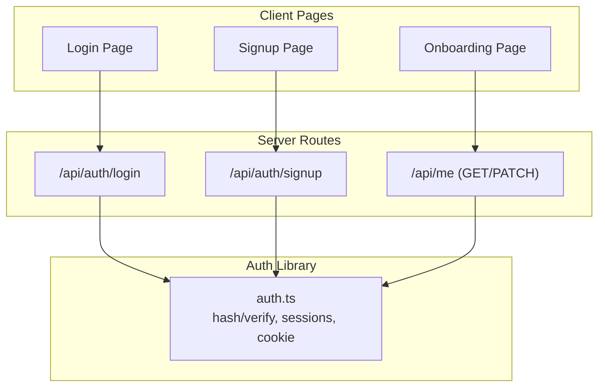
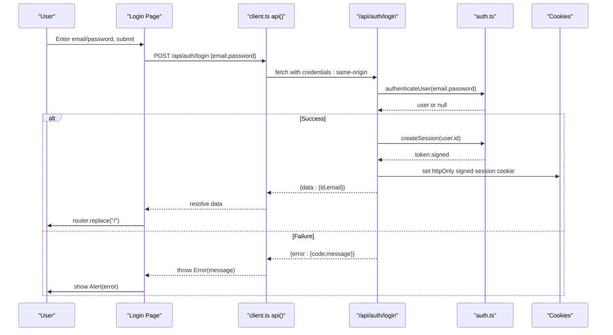
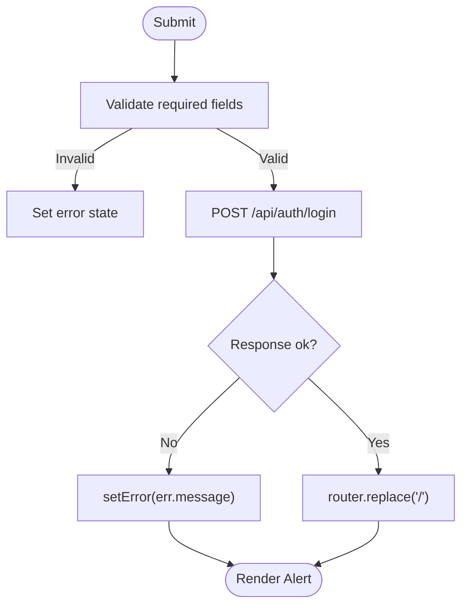
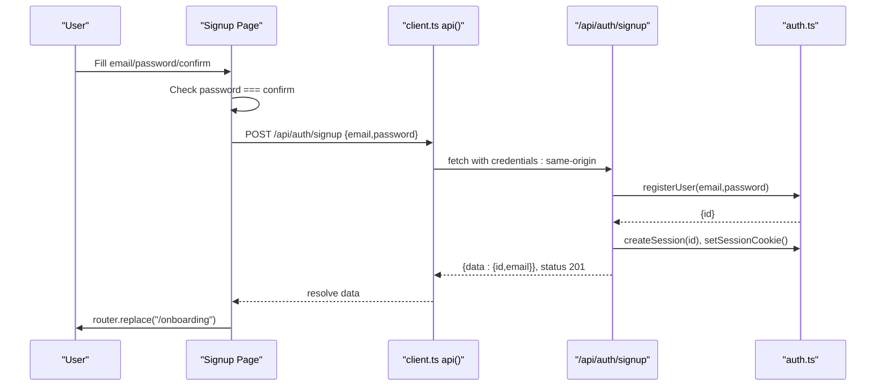
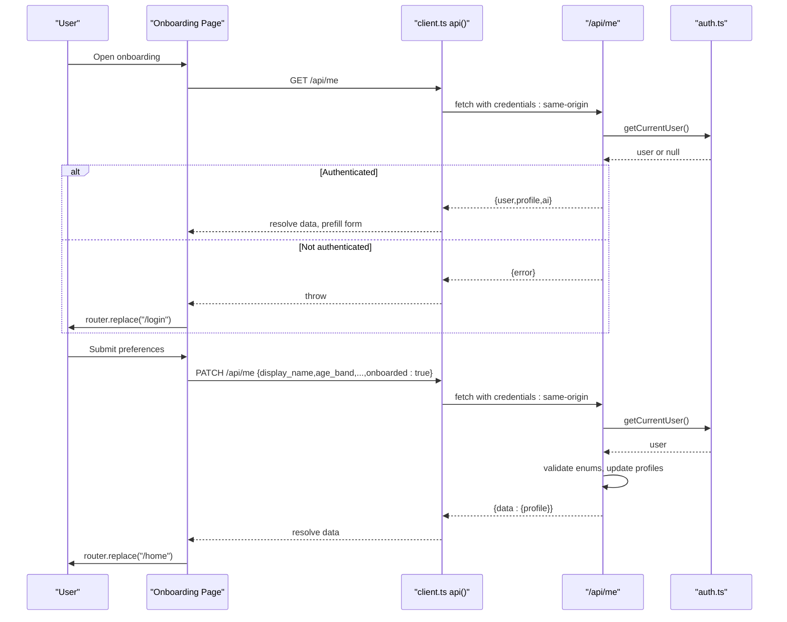
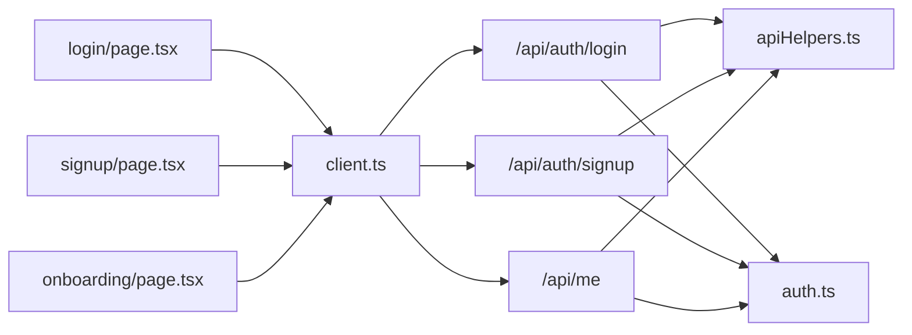

# Authentication Pages

<cite>
**Referenced Files in This Document**
- [login/page.tsx](file://stepwise ai/app/app/login/page.tsx)
- [signup/page.tsx](file://stepwise ai/app/app/signup/page.tsx)
- [onboarding/page.tsx](file://stepwise ai/app/app/onboarding/page.tsx)
- [auth/login/route.ts](file://stepwise ai/app/app/api/auth/login/route.ts)
- [auth/signup/route.ts](file://stepwise ai/app/app/api/auth/signup/route.ts)
- [me/route.ts](file://stepwise ai/app/app/api/me/route.ts)
- [auth.ts](file://stepwise ai/app/lib/auth.ts)
- [apiHelpers.ts](file://stepwise ai/app/lib/apiHelpers.ts)
- [client.ts](file://stepwise ai/app/lib/client.ts)
- [ui.tsx](file://stepwise ai/app/components/ui.tsx)
</cite>

## Table of Contents
1. Introduction
2. Project Structure
3. Core Components
4. Architecture Overview
5. Detailed Component Analysis
6. Dependency Analysis
7. Performance Considerations
8. Troubleshooting Guide
9. Conclusion

## Introduction
This document explains StepWise AI’s authentication and onboarding user interface pages: login, signup, and onboarding. It covers form validation, error handling, redirect logic, API integration patterns, state management, responsive design, accessibility, and security measures such as input sanitization, CSRF protection via same-origin cookies, and secure session handling.

## Project Structure
The authentication UI is implemented as Next.js App Router client components that call server routes to authenticate users and manage sessions. The onboarding page configures user preferences and marks the user as onboarded.

**Diagram sources**
- [login/page.tsx:16-27](file://stepwise ai/app/app/login/page.tsx#L16-L27)
- [signup/page.tsx:17-32](file://stepwise ai/app/app/signup/page.tsx#L17-L32)
- [onboarding/page.tsx:21-59](file://stepwise ai/app/app/onboarding/page.tsx#L21-L59)
- [auth/login/route.ts:7-29](file://stepwise ai/app/app/api/auth/login/route.ts#L7-L29)
- [auth/signup/route.ts:10-35](file://stepwise ai/app/app/api/auth/signup/route.ts#L10-L35)
- [me/route.ts:20-78](file://stepwise ai/app/app/api/me/route.ts#L20-L78)
- [auth.ts:24-67](file://stepwise ai/app/lib/auth.ts#L24-L67)

**Section sources**
- [login/page.tsx:1-76](file://stepwise ai/app/app/login/page.tsx#L1-L76)
- [signup/page.tsx:1-92](file://stepwise ai/app/app/signup/page.tsx#L1-L92)
- [onboarding/page.tsx:1-140](file://stepwise ai/app/app/onboarding/page.tsx#L1-L140)
- [auth/login/route.ts:1-30](file://stepwise ai/app/app/api/auth/login/route.ts#L1-L30)
- [auth/signup/route.ts:1-36](file://stepwise ai/app/app/api/auth/signup/route.ts#L1-L36)
- [me/route.ts:1-79](file://stepwise ai/app/app/api/me/route.ts#L1-L79)
- [auth.ts:1-139](file://stepwise ai/app/lib/auth.ts#L1-L139)

## Core Components
- Login Page: Collects email/password, validates required fields via HTML attributes, submits to /api/auth/login, redirects on success, shows errors via Alert.
- Signup Page: Collects email/password/confirm, enforces password match and minimum length, calls /api/auth/signup, redirects to /onboarding on success, shows errors.
- Onboarding Page: Preloads profile via GET /api/me, allows editing display name, age band, education level, explanation depth, autonomy level; saves via PATCH /api/me with onboarded flag; redirects to /home.

Key UI primitives used across pages: Button, Card, Input, Select, Alert, Spinner.

**Section sources**
- [login/page.tsx:9-76](file://stepwise ai/app/app/login/page.tsx#L9-L76)
- [signup/page.tsx:9-92](file://stepwise ai/app/app/signup/page.tsx#L9-L92)
- [onboarding/page.tsx:10-140](file://stepwise ai/app/app/onboarding/page.tsx#L10-L140)
- [ui.tsx:12-175](file://stepwise ai/app/components/ui.tsx#L12-L175)

## Architecture Overview
The flow uses a consistent envelope for API responses and a client helper that throws on errors. Server routes sanitize inputs, enforce business rules, create or verify sessions, and set httpOnly signed cookies.

**Diagram sources**
- [login/page.tsx:16-27](file://stepwise ai/app/app/login/page.tsx#L16-L27)
- [client.ts:7-27](file://stepwise ai/app/lib/client.ts#L7-L27)
- [auth/login/route.ts:7-29](file://stepwise ai/app/app/api/auth/login/route.ts#L7-L29)
- [auth.ts:24-67](file://stepwise ai/app/lib/auth.ts#L24-L67)

## Detailed Component Analysis

### Login Page
- Form state: email, password, error, busy flags.
- Validation: HTML required attributes; server-side checks for missing credentials.
- Submission: Calls /api/auth/login; on success navigates to root; on error sets Alert message.
- Redirect: Uses router.replace("/").
- Accessibility: Inputs have labels via UI component; form has accessible button text; error shown via Alert.
- Responsive: Centered card layout with max-width and padding for mobile.

**Diagram sources**
- [login/page.tsx:16-27](file://stepwise ai/app/app/login/page.tsx#L16-L27)
- [auth/login/route.ts:7-29](file://stepwise ai/app/app/api/auth/login/route.ts#L7-L29)

**Section sources**
- [login/page.tsx:9-76](file://stepwise ai/app/app/login/page.tsx#L9-L76)
- [auth/login/route.ts:7-29](file://stepwise ai/app/app/api/auth/login/route.ts#L7-L29)

### Signup Page
- Form state: email, password, confirm, error, busy.
- Client validation: Password match check before submission; minLength enforced by Input attribute.
- Submission: Calls /api/auth/signup; server validates email format and password length; creates user and session; returns 201.
- Redirect: Navigates to /onboarding on success.
- Feedback: Shows error messages via Alert; disabled button during submission.

**Diagram sources**
- [signup/page.tsx:17-32](file://stepwise ai/app/app/signup/page.tsx#L17-L32)
- [auth/signup/route.ts:10-35](file://stepwise ai/app/app/api/auth/signup/route.ts#L10-L35)
- [auth.ts:104-128](file://stepwise ai/app/lib/auth.ts#L104-L128)

**Section sources**
- [signup/page.tsx:9-92](file://stepwise ai/app/app/signup/page.tsx#L9-L92)
- [auth/signup/route.ts:10-35](file://stepwise ai/app/app/api/auth/signup/route.ts#L10-L35)

### Onboarding Page
- Preload: GET /api/me to verify auth and prefill profile values; if unauthenticated, redirects to /login.
- Fields: Display name, age band, education level, explanation depth, autonomy level.
- Submission: PATCH /api/me with selected values and onboarded=true; server validates allowed enums and updates profile; redirects to /home.
- Loading state: Spinner while fetching profile.
- Feedback: Errors displayed via Alert; button disabled during save.

**Diagram sources**
- [onboarding/page.tsx:21-59](file://stepwise ai/app/app/onboarding/page.tsx#L21-L59)
- [me/route.ts:20-78](file://stepwise ai/app/app/api/me/route.ts#L20-L78)
- [auth.ts:78-102](file://stepwise ai/app/lib/auth.ts#L78-L102)

**Section sources**
- [onboarding/page.tsx:10-140](file://stepwise ai/app/app/onboarding/page.tsx#L10-L140)
- [me/route.ts:20-78](file://stepwise ai/app/app/api/me/route.ts#L20-L78)

## Dependency Analysis
- Client pages depend on ui.tsx primitives for consistent UX and accessibility.
- All pages use client.ts api() which enforces same-origin credentials and unwraps the standard envelope.
- Server routes rely on apiHelpers.ts for consistent response envelopes and input sanitization helpers.
- Authentication flows are centralized in auth.ts for hashing, verification, session creation, and cookie management.

**Diagram sources**
- [login/page.tsx:16-27](file://stepwise ai/app/app/login/page.tsx#L16-L27)
- [signup/page.tsx:17-32](file://stepwise ai/app/app/signup/page.tsx#L17-L32)
- [onboarding/page.tsx:21-59](file://stepwise ai/app/app/onboarding/page.tsx#L21-L59)
- [client.ts:7-27](file://stepwise ai/app/lib/client.ts#L7-L27)
- [apiHelpers.ts:8-36](file://stepwise ai/app/lib/apiHelpers.ts#L8-L36)
- [auth.ts:24-67](file://stepwise ai/app/lib/auth.ts#L24-L67)

**Section sources**
- [client.ts:1-28](file://stepwise ai/app/lib/client.ts#L1-L28)
- [apiHelpers.ts:1-42](file://stepwise ai/app/lib/apiHelpers.ts#L1-L42)
- [auth.ts:1-139](file://stepwise ai/app/lib/auth.ts#L1-L139)

## Performance Considerations
- Minimal client state: Each page manages only necessary fields, reducing re-renders.
- Single network call per action: Login and signup perform one request; onboarding performs one GET then one PATCH.
- Server-side validation prevents unnecessary round-trips by returning early on invalid inputs.
- Cookie-based sessions avoid repeated credential exchanges after initial login.

[No sources needed since this section provides general guidance]

## Troubleshooting Guide
Common issues and where to inspect:
- Invalid credentials: Server route returns a specific error code; client displays Alert. Check server logs and ensure correct email/password.
- Email already taken: Signup route returns EMAIL_TAKEN; prompt user to sign in instead.
- Weak password: Signup route enforces minimum length; guide user to meet requirements.
- Unauthenticated access to onboarding: GET /api/me returns unauthorized; client redirects to login.
- Network or parsing errors: client.ts throws a generic message; verify endpoint availability and CORS/credentials settings.

Security-related checks:
- Ensure AUTH_SECRET is configured in production to sign session tokens securely.
- Verify cookies are set with httpOnly and appropriate SameSite/Secure flags.
- Confirm all inputs are sanitized via str() and validated against allowed sets.

**Section sources**
- [auth/login/route.ts:7-29](file://stepwise ai/app/app/api/auth/login/route.ts#L7-L29)
- [auth/signup/route.ts:10-35](file://stepwise ai/app/app/api/auth/signup/route.ts#L10-L35)
- [me/route.ts:20-78](file://stepwise ai/app/app/api/me/route.ts#L20-L78)
- [auth.ts:12-22](file://stepwise ai/app/lib/auth.ts#L12-L22)
- [auth.ts:59-67](file://stepwise ai/app/lib/auth.ts#L59-L67)
- [client.ts:7-27](file://stepwise ai/app/lib/client.ts#L7-L27)

## Conclusion
StepWise AI’s authentication and onboarding pages provide a clear, secure, and accessible user experience. They leverage consistent UI primitives, robust server-side validation, and secure session management. The onboarding flow personalizes learning preferences efficiently and guides new users into the application without friction.

[No sources needed since this section summarizes without analyzing specific files]