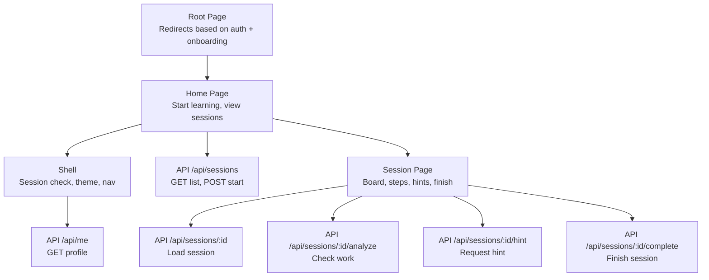
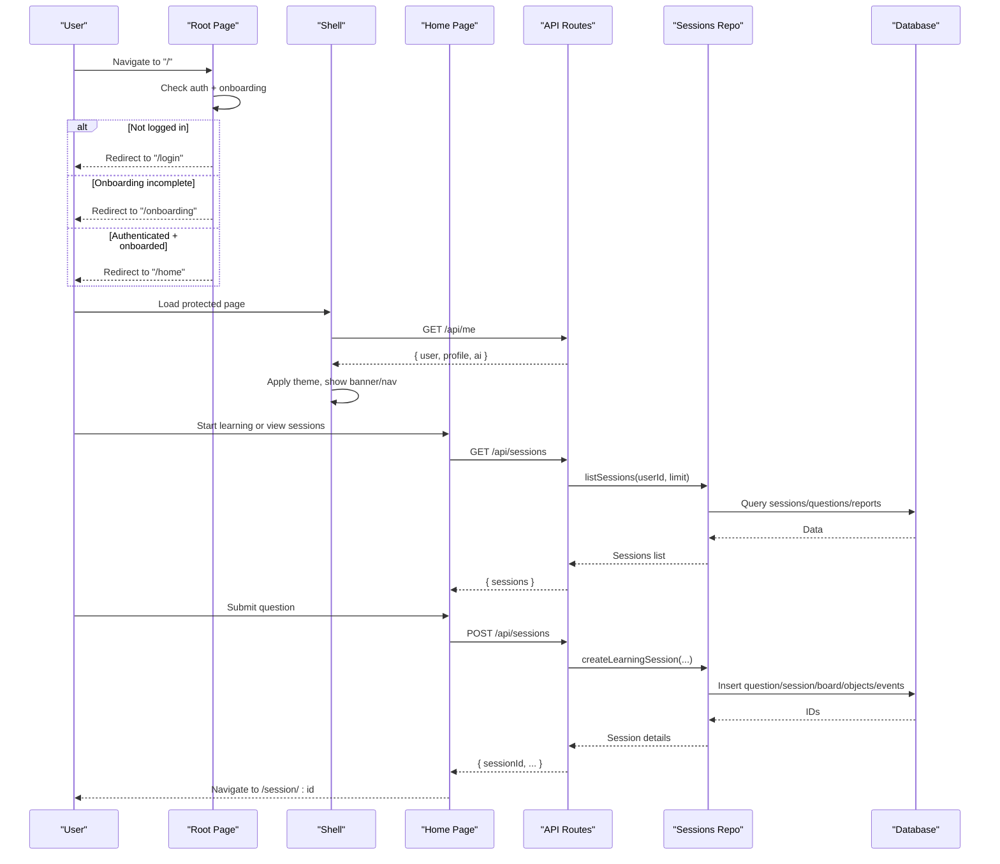
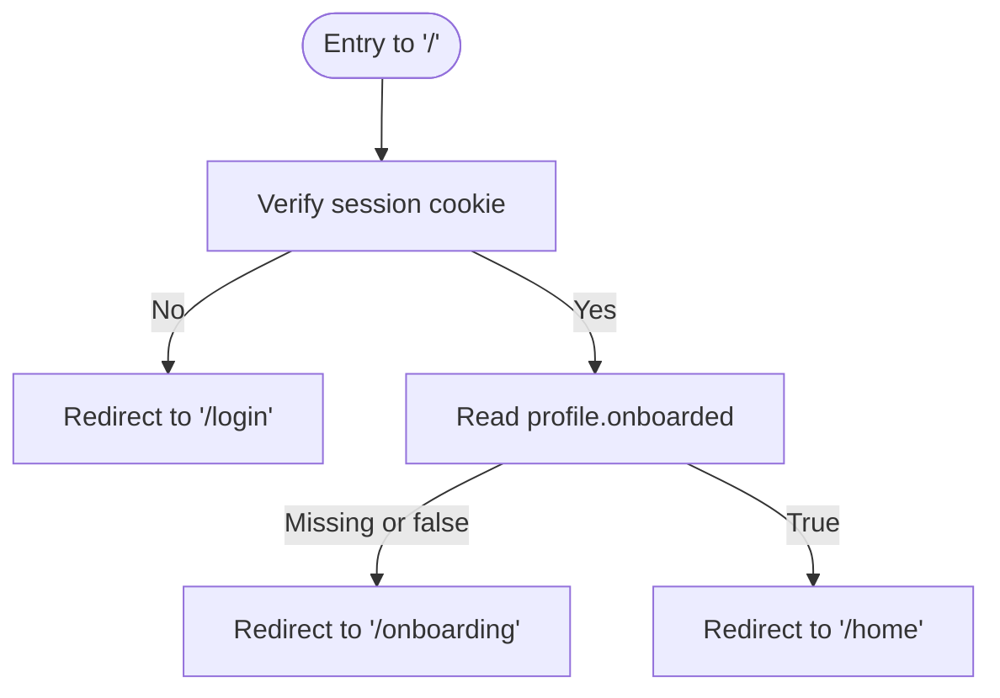
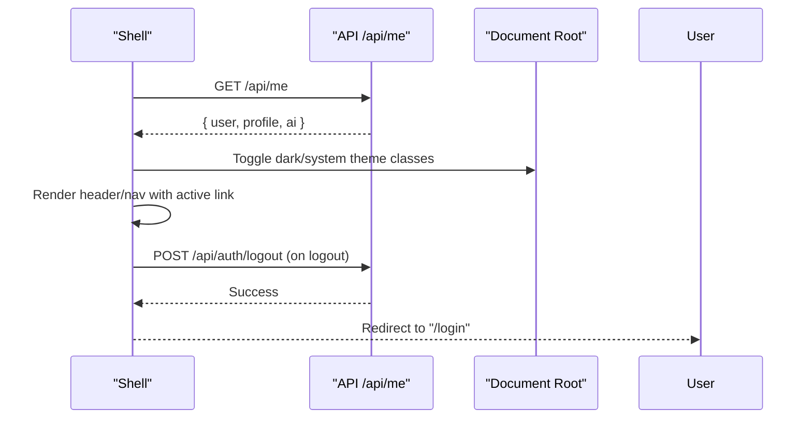
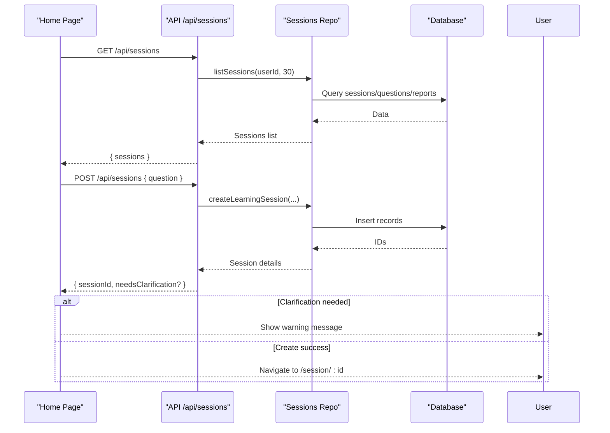
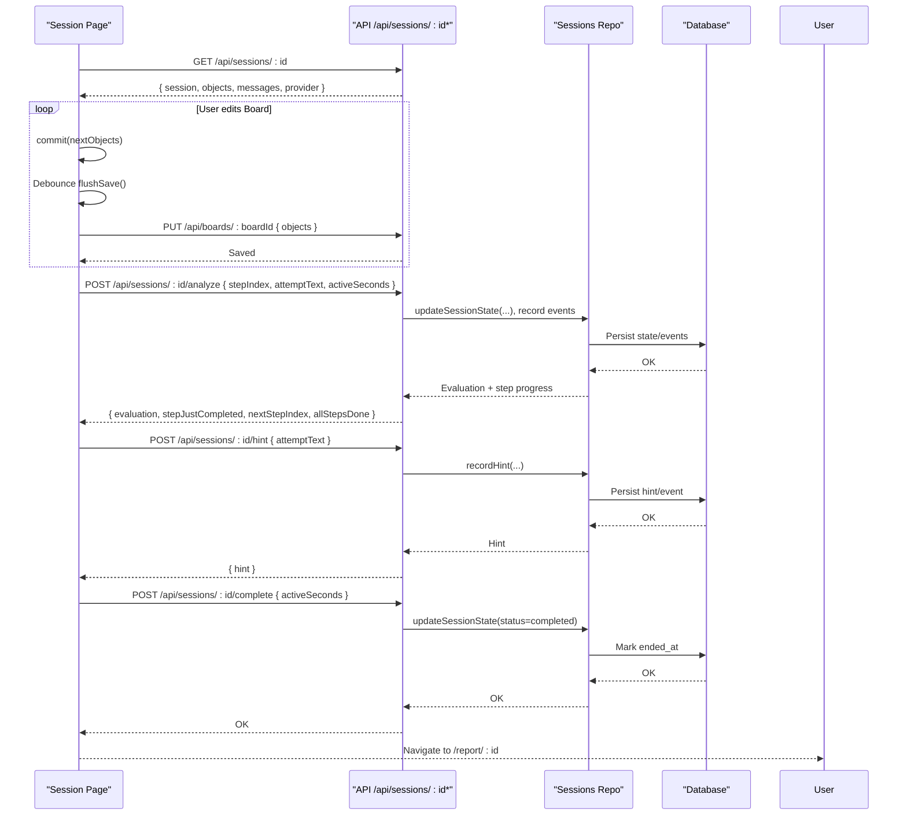
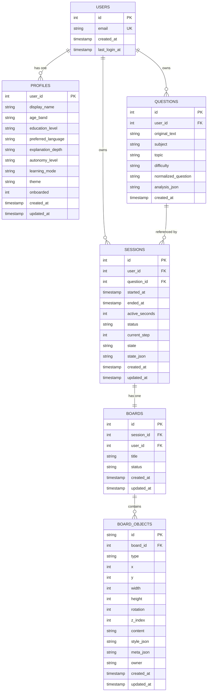
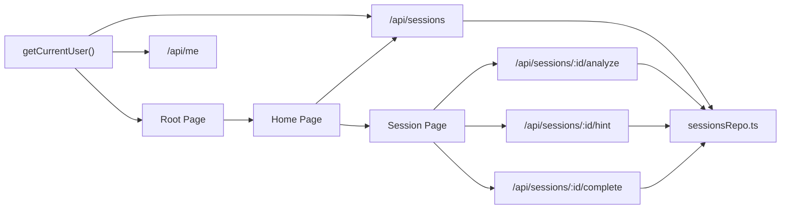

# Dashboard and Home Page

<cite>
**Referenced Files in This Document**
- [page.tsx](file://stepwise ai/app/app/page.tsx)
- [layout.tsx](file://stepwise ai/app/app/layout.tsx)
- [home/page.tsx](file://stepwise ai/app/app/home/page.tsx)
- [Shell.tsx](file://stepwise ai/app/components/Shell.tsx)
- [ui.tsx](file://stepwise ai/app/components/ui.tsx)
- [client.ts](file://stepwise ai/app/lib/client.ts)
- [auth.ts](file://stepwise ai/app/lib/auth.ts)
- [sessions/route.ts](file://stepwise ai/app/app/api/sessions/route.ts)
- [me/route.ts](file://stepwise ai/app/app/api/me/route.ts)
- [sessionsRepo.ts](file://stepwise ai/app/lib/sessionsRepo.ts)
- [session/[id]/page.tsx](file://stepwise ai/app/app/session/[id]/page.tsx)
</cite>

## Table of Contents
1. [Introduction](#introduction)
2. [Project Structure](#project-structure)
3. [Core Components](#core-components)
4. [Architecture Overview](#architecture-overview)
5. [Detailed Component Analysis](#detailed-component-analysis)
6. [Dependency Analysis](#dependency-analysis)
7. [Performance Considerations](#performance-considerations)
8. [Troubleshooting Guide](#troubleshooting-guide)
9. [Conclusion](#conclusion)

## Introduction
This document explains StepWise AI’s dashboard and home page components, focusing on the authenticated landing flow, session management, and learning workflow from the home page to an active Board session. It covers user session validation, routing logic, data fetching patterns, loading states, error handling, responsive layout, performance optimizations for large datasets, real-time updates for session status, personalization features, quick access shortcuts, and contextual help systems.

## Project Structure
The application uses Next.js App Router with:
- A root entry that enforces authentication and onboarding state before redirecting to the home page.
- A client-side Shell component that validates sessions, applies theme preferences, and renders shared navigation.
- A Home page that lists recent sessions, starts new learning sessions, and provides quick actions.
- API routes for sessions and profile retrieval/update.
- A repository layer for secure, ownership-verified data access.
- A Session page that implements the interactive Board experience with autosave, hints, evaluation, and completion flows.

**Diagram sources**
- [page.tsx:7-17](file://stepwise ai/app/app/page.tsx#L7-L17)
- [home/page.tsx:20-172](file://stepwise ai/app/app/home/page.tsx#L20-L172)
- [Shell.tsx:27-124](file://stepwise ai/app/components/Shell.tsx#L27-L124)
- [sessions/route.ts:9-55](file://stepwise ai/app/app/api/sessions/route.ts#L9-L55)
- [me/route.ts:20-33](file://stepwise ai/app/app/api/me/route.ts#L20-L33)
- [session/[id]/page.tsx:76-261](file://stepwise ai/app/app/session/[id]/page.tsx#L76-L261)

**Section sources**
- [page.tsx:7-17](file://stepwise ai/app/app/page.tsx#L7-L17)
- [layout.tsx:4-16](file://stepwise ai/app/app/layout.tsx#L4-L16)

## Core Components
- Root Page: Enforces login and onboarding; redirects unauthenticated users to login and incomplete onboarding to the onboarding flow.
- Shell: Client-side wrapper that verifies the current session via /api/me, applies theme and age band classes, shows demo banner, and renders main navigation.
- Home Page: Displays a question input, lists in-progress and completed sessions, handles starting new sessions, and navigates to the Board session.
- Session Page: Loads full session recovery payload, manages Board objects, autosaves changes, supports undo/redo, evaluates student attempts, provides hints, and completes sessions to generate reports.

Key responsibilities and interactions are implemented across these files with clear separation between UI, client helpers, server routes, and repository logic.

**Section sources**
- [page.tsx:7-17](file://stepwise ai/app/app/page.tsx#L7-L17)
- [Shell.tsx:27-124](file://stepwise ai/app/components/Shell.tsx#L27-L124)
- [home/page.tsx:20-172](file://stepwise ai/app/app/home/page.tsx#L20-L172)
- [session/[id]/page.tsx:45-565](file://stepwise ai/app/app/session/[id]/page.tsx#L45-L565)

## Architecture Overview
The dashboard architecture follows a layered approach:
- Presentation Layer: React pages (Home, Session) and shared Shell.
- Client Helpers: Unified fetch wrapper with envelope handling and error propagation.
- Server Routes: Next.js API routes enforcing authentication and delegating to repository functions.
- Repository Layer: Ownership-verified data operations, transactional writes, and safe parsing.

**Diagram sources**
- [page.tsx:7-17](file://stepwise ai/app/app/page.tsx#L7-L17)
- [Shell.tsx:38-52](file://stepwise ai/app/components/Shell.tsx#L38-L52)
- [home/page.tsx:28-59](file://stepwise ai/app/app/home/page.tsx#L28-L59)
- [sessions/route.ts:11-55](file://stepwise ai/app/app/api/sessions/route.ts#L11-L55)
- [sessionsRepo.ts:26-116](file://stepwise ai/app/lib/sessionsRepo.ts#L26-L116)

## Detailed Component Analysis

### Root Entry and Routing Logic
- Validates current user via server-side cookie verification.
- Checks onboarding status from profiles table.
- Redirects accordingly to ensure all students land on the learning home after authentication and onboarding.

**Diagram sources**
- [page.tsx:7-17](file://stepwise ai/app/app/page.tsx#L7-L17)
- [auth.ts:78-102](file://stepwise ai/app/lib/auth.ts#L78-L102)

**Section sources**
- [page.tsx:7-17](file://stepwise ai/app/app/page.tsx#L7-L17)
- [auth.ts:78-102](file://stepwise ai/app/lib/auth.ts#L78-L102)

### Shell: Session Validation and Personalization
- Fetches /api/me to validate session and retrieve profile and AI provider info.
- Applies theme and age band classes to the document root for adaptive UI.
- Shows demo banner when in demo mode and renders primary navigation with active state.
- Handles logout by calling /api/auth/logout and redirecting to login.

**Diagram sources**
- [Shell.tsx:38-70](file://stepwise ai/app/components/Shell.tsx#L38-L70)
- [Shell.tsx:94-121](file://stepwise ai/app/components/Shell.tsx#L94-L121)
- [me/route.ts:20-33](file://stepwise ai/app/app/api/me/route.ts#L20-L33)

**Section sources**
- [Shell.tsx:27-124](file://stepwise ai/app/components/Shell.tsx#L27-L124)
- [me/route.ts:20-33](file://stepwise ai/app/app/api/me/route.ts#L20-L33)

### Home Page: Learning Dashboard
- Loads recent sessions via GET /api/sessions and displays them in two sections: In progress and Completed.
- Provides a text input to start a new session; validates input and handles clarification requests from AI analysis.
- Navigates to /session/:id upon successful creation.
- Uses consistent UI primitives for cards, badges, alerts, and empty states.

**Diagram sources**
- [home/page.tsx:28-59](file://stepwise ai/app/app/home/page.tsx#L28-L59)
- [sessions/route.ts:11-55](file://stepwise ai/app/app/api/sessions/route.ts#L11-L55)
- [sessionsRepo.ts:26-116](file://stepwise ai/app/lib/sessionsRepo.ts#L26-L116)

**Section sources**
- [home/page.tsx:20-172](file://stepwise ai/app/app/home/page.tsx#L20-L172)
- [sessions/route.ts:11-55](file://stepwise ai/app/app/api/sessions/route.ts#L11-L55)

### Session Page: Active Learning Workflow
- Loads full session recovery payload including Board objects, messages, and provider info.
- Implements autosave with debounced optimistic snapshots and undo/redo history.
- Supports tools (select, text, draw, erase, pan) and keyboard shortcuts (Ctrl+Z/Y).
- Evaluates student attempts via analyze endpoint, highlights feedback per object, and advances steps.
- Provides hints and allows finishing the session to generate a report.

**Diagram sources**
- [session/[id]/page.tsx:76-261](file://stepwise ai/app/app/session/[id]/page.tsx#L76-L261)
- [sessionsRepo.ts:176-195](file://stepwise ai/app/lib/sessionsRepo.ts#L176-L195)
- [sessionsRepo.ts:314-330](file://stepwise ai/app/lib/sessionsRepo.ts#L314-L330)

**Section sources**
- [session/[id]/page.tsx:45-565](file://stepwise ai/app/app/session/[id]/page.tsx#L45-L565)
- [sessionsRepo.ts:176-195](file://stepwise ai/app/lib/sessionsRepo.ts#L176-L195)

### Data Models and Relationships

**Diagram sources**
- [sessionsRepo.ts:26-116](file://stepwise ai/app/lib/sessionsRepo.ts#L26-L116)
- [sessionsRepo.ts:198-265](file://stepwise ai/app/lib/sessionsRepo.ts#L198-L265)
- [auth.ts:104-128](file://stepwise ai/app/lib/auth.ts#L104-L128)

## Dependency Analysis
- Authentication dependency chain:
  - Root Page depends on getCurrentUser to enforce login and onboarding.
  - Shell depends on /api/me to validate session and apply personalization.
  - API routes depend on getCurrentUser to authorize requests.
- Data dependency chain:
  - Home Page depends on /api/sessions to list and start sessions.
  - Session Page depends on /api/sessions/:id, /analyze, /hint, /complete for interactive learning.
  - Repository functions enforce ownership checks and perform transactions.

**Diagram sources**
- [auth.ts:78-102](file://stepwise ai/app/lib/auth.ts#L78-L102)
- [page.tsx:7-17](file://stepwise ai/app/app/page.tsx#L7-L17)
- [me/route.ts:20-33](file://stepwise ai/app/app/api/me/route.ts#L20-L33)
- [sessions/route.ts:11-55](file://stepwise ai/app/app/api/sessions/route.ts#L11-L55)
- [session/[id]/page.tsx:76-261](file://stepwise ai/app/app/session/[id]/page.tsx#L76-L261)
- [sessionsRepo.ts:26-116](file://stepwise ai/app/lib/sessionsRepo.ts#L26-L116)

**Section sources**
- [auth.ts:78-102](file://stepwise ai/app/lib/auth.ts#L78-L102)
- [sessionsRepo.ts:26-116](file://stepwise ai/app/lib/sessionsRepo.ts#L26-L116)

## Performance Considerations
- Efficient listing: The sessions list is limited to a configurable number (default 30) to reduce payload size and rendering cost.
- Optimistic UI with debounced saves: The Session page batches changes and persists them after a delay, minimizing network overhead while keeping the interface responsive.
- Safe parsing and bounds: Repository functions safely parse JSON metadata and clamp values (e.g., dimensions, content length) to prevent oversized payloads and errors.
- Transactional writes: Creating sessions and boards uses database transactions to ensure consistency and avoid partial writes.
- Conditional rendering: Home page separates in-progress and completed sessions to optimize rendering and improve perceived performance.
- Theme application: Shell applies theme classes once per load to avoid repeated DOM manipulations.

[No sources needed since this section provides general guidance]

## Troubleshooting Guide
Common issues and their handling:
- Unauthenticated access:
  - Root Page redirects to login if no valid session cookie is present.
  - Shell redirects to login on failed /api/me calls.
- Onboarding not completed:
  - Root Page redirects to onboarding if profile.onboarded is missing or false.
- Empty or invalid questions:
  - Home page validates input and shows warnings; API returns structured errors for empty questions.
- Network or server errors:
  - Client helper throws standardized errors from non-OK responses or malformed payloads.
  - Session page displays actionable error messages and fallback navigation.
- Save failures:
  - Session page indicates save status (saved, saving, error) and allows retrying actions.

**Section sources**
- [page.tsx:7-17](file://stepwise ai/app/app/page.tsx#L7-L17)
- [Shell.tsx:38-52](file://stepwise ai/app/components/Shell.tsx#L38-L52)
- [home/page.tsx:36-59](file://stepwise ai/app/app/home/page.tsx#L36-L59)
- [client.ts:7-27](file://stepwise ai/app/lib/client.ts#L7-L27)
- [session/[id]/page.tsx:264-282](file://stepwise ai/app/app/session/[id]/page.tsx#L264-L282)

## Conclusion
StepWise AI’s dashboard and home page provide a robust, user-centric learning environment. The root entry ensures proper authentication and onboarding, the Shell personalizes the experience and secures navigation, and the Home page offers intuitive access to ongoing and completed sessions. The Session page delivers a rich interactive workflow with autosave, hints, evaluation, and completion, backed by secure, ownership-verified repository operations. Together, these components form a cohesive system that scales efficiently and adapts to user preferences.

[No sources needed since this section summarizes without analyzing specific files]