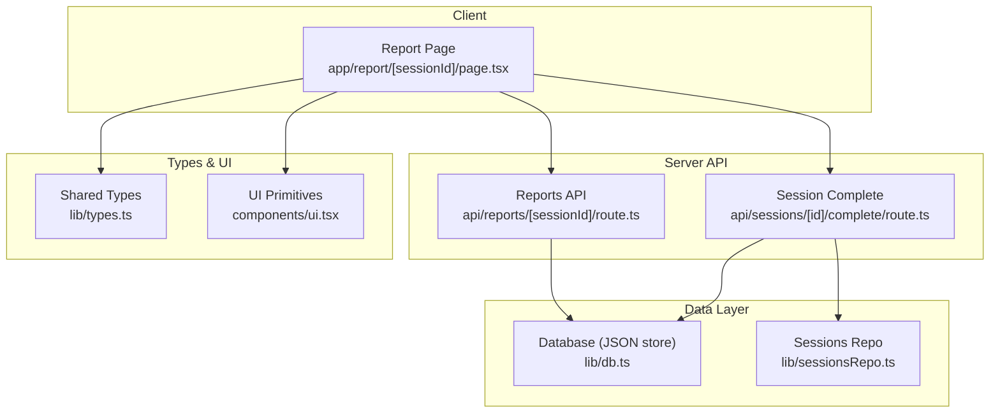
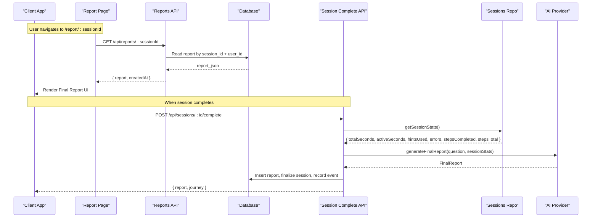
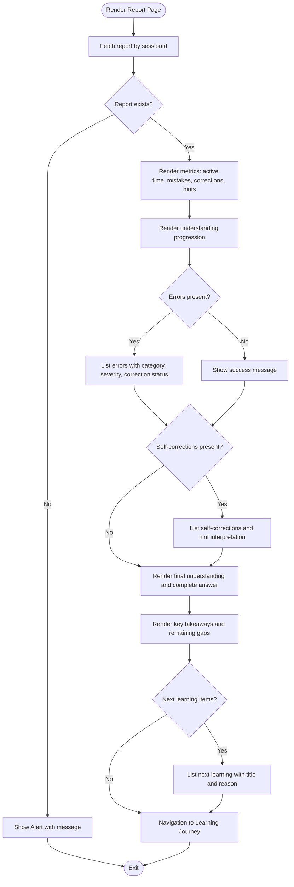
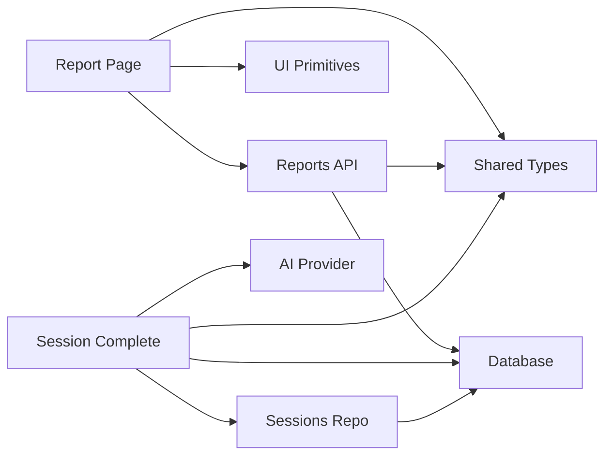

# Report and Analytics Views

<cite>
**Referenced Files in This Document**
- [page.tsx](file://stepwise ai/app/app/report/[sessionId]/page.tsx)
- [route.ts](file://stepwise ai/app/app/api/reports/[sessionId]/route.ts)
- [complete/route.ts](file://stepwise ai/app/app/api/sessions/[id]/complete/route.ts)
- [sessionsRepo.ts](file://stepwise ai/app/lib/sessionsRepo.ts)
- [types.ts](file://stepwise ai/app/lib/types.ts)
- [client.ts](file://stepwise ai/app/lib/client.ts)
- [db.ts](file://stepwise ai/app/lib/db.ts)
- [ui.tsx](file://stepwise ai/app/components/ui.tsx)
- [08-final-report.md.txt](file://stepwise ai/specs/08-final-report.md.txt)
</cite>

## Table of Contents
1. Introduction
2. Project Structure
3. Core Components
4. Architecture Overview
5. Detailed Component Analysis
6. Dependency Analysis
7. Performance Considerations
8. Troubleshooting Guide
9. Conclusion
10. Appendices

## Introduction
This document explains StepWise AI’s report and analytics viewing interface for completed learning sessions. It covers the report page component that displays learning outcomes, performance metrics, and progress analysis; the data visualization components used to present learning analytics; the report generation process; data aggregation methods; caching strategies; integration with reporting APIs; handling large datasets; interactive visualizations; export and sharing capabilities; printable formats; responsive design; filtering options; and customization based on user roles and preferences.

## Project Structure
The reporting feature spans a client-side Next.js route, a server API route, repository logic for session statistics, shared types, and UI primitives:
- Client report page renders the Final Report using structured data from the server.
- Server report API returns ownership-verified reports stored in the database.
- Session completion endpoint generates the Final Report, persists it, updates session state, and refreshes the Learning Journey.
- Repository functions aggregate hints, errors, steps, and timing into session stats.
- Shared types define the FinalReport model and related enums.
- UI primitives provide cards, badges, alerts, and spinners used by the report view.

**Diagram sources**
- [page.tsx:1-216](file://stepwise ai/app/app/report/[sessionId]/page.tsx#L1-L216)
- [route.ts:1-20](file://stepwise ai/app/app/api/reports/[sessionId]/route.ts#L1-L20)
- [complete/route.ts:1-124](file://stepwise ai/app/app/api/sessions/[id]/complete/route.ts#L1-L124)
- [db.ts:1-224](file://stepwise ai/app/lib/db.ts#L1-L224)
- [sessionsRepo.ts:1-399](file://stepwise ai/app/lib/sessionsRepo.ts#L1-L399)
- [types.ts:1-302](file://stepwise ai/app/lib/types.ts#L1-L302)
- [ui.tsx:1-218](file://stepwise ai/app/components/ui.tsx#L1-L218)

**Section sources**
- [page.tsx:1-216](file://stepwise ai/app/app/report/[sessionId]/page.tsx#L1-L216)
- [route.ts:1-20](file://stepwise ai/app/app/api/reports/[sessionId]/route.ts#L1-L20)
- [complete/route.ts:1-124](file://stepwise ai/app/app/api/sessions/[id]/complete/route.ts#L1-L124)
- [sessionsRepo.ts:1-399](file://stepwise ai/app/lib/sessionsRepo.ts#L1-L399)
- [types.ts:1-302](file://stepwise ai/app/lib/types.ts#L1-L302)
- [db.ts:1-224](file://stepwise ai/app/lib/db.ts#L1-L224)
- [ui.tsx:1-218](file://stepwise ai/app/components/ui.tsx#L1-L218)

## Core Components
- Report Page Component: Fetches and renders the Final Report for a given session ID, showing topic, question, status, key metrics, understanding progression, mistakes and corrections, final understanding, complete answer, key takeaways, remaining gaps, and next learning recommendations.
- Reports API Route: Returns ownership-verified report data for the authenticated user and session.
- Session Completion Endpoint: Generates the Final Report via the AI provider, persists it, finalizes the session, records events, and updates the Learning Journey.
- Sessions Repository: Aggregates session-level statistics including active time, hints, errors, and step counts.
- Shared Types: Define FinalReport structure, error categories/severities, and AI provider interfaces for report generation.
- UI Primitives: Provide consistent cards, badges, alerts, and loading indicators used across the report view.

**Section sources**
- [page.tsx:19-216](file://stepwise ai/app/app/report/[sessionId]/page.tsx#L19-L216)
- [route.ts:8-20](file://stepwise ai/app/app/api/reports/[sessionId]/route.ts#L8-L20)
- [complete/route.ts:12-118](file://stepwise ai/app/app/api/sessions/[id]/complete/route.ts#L12-L118)
- [sessionsRepo.ts:363-399](file://stepwise ai/app/lib/sessionsRepo.ts#L363-L399)
- [types.ts:195-230](file://stepwise ai/app/lib/types.ts#L195-L230)
- [ui.tsx:38-175](file://stepwise ai/app/components/ui.tsx#L38-L175)

## Architecture Overview
The report flow has two primary paths:
- Viewing an existing report: The client requests the report by session ID; the server validates ownership and returns the persisted report.
- Generating a new report: On session completion, the server aggregates stats, calls the AI provider to generate the Final Report, persists it, finalizes the session, and updates the Learning Journey.

**Diagram sources**
- [page.tsx:24-28](file://stepwise ai/app/app/report/[sessionId]/page.tsx#L24-L28)
- [route.ts:8-20](file://stepwise ai/app/app/api/reports/[sessionId]/route.ts#L8-L20)
- [complete/route.ts:15-118](file://stepwise ai/app/app/api/sessions/[id]/complete/route.ts#L15-L118)
- [sessionsRepo.ts:378-399](file://stepwise ai/app/lib/sessionsRepo.ts#L378-L399)
- [types.ts:275-296](file://stepwise ai/app/lib/types.ts#L275-L296)

## Detailed Component Analysis

### Report Page Component
Responsibilities:
- Load report data for the current session ID.
- Display summary metrics (active time, mistakes, independent corrections, hints used).
- Show understanding progression (start, during, end).
- Present mistakes and their resolution status.
- Highlight independent corrections and hint interpretation.
- Summarize final understanding, complete answer, key takeaways, remaining gaps, and next learning recommendations.
- Provide navigation back to the learning journey.

Data visualization components:
- Cards group related sections (progression, mistakes, corrections, understanding, takeaways, gaps, next steps).
- Badges indicate status, severity, and correction type.
- Alerts communicate success or errors.
- Spinner indicates loading state.

Responsive behavior:
- Uses grid layouts that adapt from single-column to multi-column on larger screens.
- Text sizes and spacing adjust for readability across devices.

Error handling:
- Displays an alert when the report is not found or an error occurs.
- Provides a link to return to the home page.

**Diagram sources**
- [page.tsx:24-216](file://stepwise ai/app/app/report/[sessionId]/page.tsx#L24-L216)

**Section sources**
- [page.tsx:19-216](file://stepwise ai/app/app/report/[sessionId]/page.tsx#L19-L216)
- [ui.tsx:38-175](file://stepwise ai/app/components/ui.tsx#L38-L175)

### Reports API Route
Responsibilities:
- Authenticate the user.
- Validate ownership of the report by matching session_id and user_id.
- Return the parsed report JSON and creation timestamp.

Security:
- Enforces ownership verification to prevent unauthorized access to other users’ reports.

Error handling:
- Returns appropriate HTTP responses for unauthorized, not found, and server errors.

**Section sources**
- [route.ts:8-20](file://stepwise ai/app/app/api/reports/[sessionId]/route.ts#L8-L20)

### Session Completion Endpoint
Responsibilities:
- Authenticate and validate session ownership.
- Check idempotency to avoid duplicate report generation.
- Aggregate session statistics (time, hints, errors, steps).
- Generate the Final Report via the AI provider.
- Persist the report atomically with session finalization and event recording.
- Update the Learning Journey with mastery evidence and recommendations.

Idempotency and consistency:
- Prevents duplicate reports for the same session.
- Uses transactions to ensure atomicity of report persistence and session updates.

**Section sources**
- [complete/route.ts:15-118](file://stepwise ai/app/app/api/sessions/[id]/complete/route.ts#L15-L118)
- [sessionsRepo.ts:378-399](file://stepwise ai/app/lib/sessionsRepo.ts#L378-L399)
- [types.ts:275-296](file://stepwise ai/app/lib/types.ts#L275-L296)

### Data Models and Types
Key structures:
- FinalReport includes topic, question, time metrics, concepts explored/understood/developing, mistakes/corrections/independent corrections, hints used, status label, understanding progression, errors, self-corrections, hint interpretation, final understanding, complete answer, key takeaways, remaining gaps, review recommendations, and next learning recommendations.
- ErrorCategory and ErrorSeverity classify and grade detected issues.
- AIProvider defines the interface for generating Final Reports from session stats and question analysis.

Complexity considerations:
- FinalReport fields are derived from both server-measured metrics and AI-generated insights.
- Counts for mistakes, corrections, and hints are authoritative from server data to maintain accuracy.

**Section sources**
- [types.ts:195-230](file://stepwise ai/app/lib/types.ts#L195-L230)
- [types.ts:80-114](file://stepwise ai/app/lib/types.ts#L80-L114)
- [types.ts:275-296](file://stepwise ai/app/lib/types.ts#L275-L296)

### Database and Persistence
Storage:
- Embedded JSON store with relational-style API.
- Atomic writes via temporary file and rename to ensure consistency.
- Tables include reports, sessions, questions, errors, hints, learning_events, and more.

Transactions:
- Multi-step operations commit once at the end to maintain consistency.

Reporting storage:
- Reports are stored as JSON strings with session_id and user_id for ownership verification.

**Section sources**
- [db.ts:1-224](file://stepwise ai/app/lib/db.ts#L1-L224)
- [complete/route.ts:76-98](file://stepwise ai/app/app/api/sessions/[id]/complete/route.ts#L76-L98)

### Client API Helper
Responsibilities:
- Wraps fetch calls with standard envelope handling.
- Throws errors when responses are not OK or contain error payloads.
- Ensures credentials are included for same-origin requests.

Usage:
- Report page uses this helper to fetch report data by path.

**Section sources**
- [client.ts:1-28](file://stepwise ai/app/lib/client.ts#L1-L28)
- [page.tsx:24-28](file://stepwise ai/app/app/report/[sessionId]/page.tsx#L24-L28)

## Dependency Analysis
Component relationships:
- Report Page depends on the Reports API and UI primitives.
- Reports API depends on authentication helpers and the database layer.
- Session Completion depends on Sessions Repo, AI Provider, and Database.
- Sessions Repo reads from and writes to the database, aggregating hints, errors, and steps.
- Shared types unify data contracts between client and server.

Potential coupling:
- Tight coupling between Report Page and FinalReport shape; changes to types require corresponding UI updates.
- Session Completion relies on AI Provider contract; mismatches can cause runtime errors.

External dependencies:
- AI Provider for generating Final Reports.
- Database layer for persistence.

**Diagram sources**
- [page.tsx:1-216](file://stepwise ai/app/app/report/[sessionId]/page.tsx#L1-L216)
- [route.ts:1-20](file://stepwise ai/app/app/api/reports/[sessionId]/route.ts#L1-L20)
- [complete/route.ts:1-124](file://stepwise ai/app/app/api/sessions/[id]/complete/route.ts#L1-L124)
- [sessionsRepo.ts:1-399](file://stepwise ai/app/lib/sessionsRepo.ts#L1-L399)
- [types.ts:1-302](file://stepwise ai/app/lib/types.ts#L1-L302)
- [db.ts:1-224](file://stepwise ai/app/lib/db.ts#L1-L224)

**Section sources**
- [page.tsx:1-216](file://stepwise ai/app/app/report/[sessionId]/page.tsx#L1-L216)
- [route.ts:1-20](file://stepwise ai/app/app/api/reports/[sessionId]/route.ts#L1-L20)
- [complete/route.ts:1-124](file://stepwise ai/app/app/api/sessions/[id]/complete/route.ts#L1-L124)
- [sessionsRepo.ts:1-399](file://stepwise ai/app/lib/sessionsRepo.ts#L1-L399)
- [types.ts:1-302](file://stepwise ai/app/lib/types.ts#L1-L302)
- [db.ts:1-224](file://stepwise ai/app/lib/db.ts#L1-L224)

## Performance Considerations
- Idempotent report generation: The session completion endpoint checks for existing reports to avoid redundant AI calls and database writes.
- Atomic transactions: Report insertion and session finalization occur within a transaction to minimize partial state and improve consistency.
- Efficient data retrieval: Reports API queries by session_id and user_id for fast, ownership-verified lookups.
- Minimal client payload: The report page renders precomputed metrics and text from the server, reducing client-side computation.
- Large dataset handling:
  - Limit lists and paginate where applicable (e.g., sessions list uses a limit).
  - Avoid rendering excessively long lists; consider virtualization if expanding error or recommendation lists.
  - Use lazy loading for heavy content like images or diagrams if added later.
- Caching strategies:
  - Server-side cache could be introduced around report retrieval for repeated reads.
  - Client-side memoization or React Query-like patterns can reduce re-fetches for the same session ID.
  - Leverage browser caching headers for static assets and API responses where appropriate.

[No sources needed since this section provides general guidance]

## Troubleshooting Guide
Common issues and resolutions:
- Report not found: Occurs when the session has no report or the user lacks ownership. Verify session completion and permissions.
- Unauthorized access: Ensure the user is authenticated before accessing report endpoints.
- AI provider errors: If report generation fails, check AI provider configuration and network connectivity.
- Database write failures: Inspect disk I/O and file permissions for the embedded JSON store.

Debugging tips:
- Inspect network responses from the Reports API and Session Completion endpoint.
- Review server logs for errors thrown by authentication, authorization, or AI provider calls.
- Validate database tables for presence of reports and correct session linkage.

**Section sources**
- [route.ts:8-20](file://stepwise ai/app/app/api/reports/[sessionId]/route.ts#L8-L20)
- [complete/route.ts:15-124](file://stepwise ai/app/app/api/sessions/[id]/complete/route.ts#L15-L124)
- [db.ts:1-224](file://stepwise ai/app/lib/db.ts#L1-L224)

## Conclusion
StepWise AI’s report and analytics views provide a comprehensive, evidence-based reflection of each learning session. The report page presents structured insights—metrics, progression, mistakes, corrections, understanding, and next steps—using consistent UI primitives. The backend ensures accurate, ownership-verified data and idempotent report generation, while the database layer maintains consistency through transactions. Future enhancements can introduce richer visualizations, export/sharing features, advanced filtering, and role-based customization while preserving the core principles of accuracy, clarity, and learner-centered feedback.

[No sources needed since this section summarizes without analyzing specific files]

## Appendices

### Integration Examples
- Integrating with Reporting APIs:
  - Use the client helper to fetch reports by session ID.
  - Handle error envelopes and display user-friendly messages.
- Handling Large Datasets:
  - Paginate lists and limit initial loads.
  - Consider virtualized lists for long error or recommendation sets.
- Interactive Visualizations:
  - Expandable sections for errors and corrections.
  - Tooltips for severity and category explanations.
  - Accessible labels and icons alongside color cues.

**Section sources**
- [client.ts:1-28](file://stepwise ai/app/lib/client.ts#L1-L28)
- [page.tsx:104-148](file://stepwise ai/app/app/report/[sessionId]/page.tsx#L104-L148)
- [types.ts:80-114](file://stepwise ai/app/lib/types.ts#L80-L114)

### Export, Sharing, and Printable Formats
- Export functionality:
  - Add endpoints to serialize reports to PDF or JSON for download.
  - Include metadata such as session ID, topic, and creation date.
- Sharing capabilities:
  - Generate shareable links with read-only access and expiration.
  - Require authentication to view shared reports.
- Printable formats:
  - Implement print stylesheets to optimize layout for paper.
  - Provide a “Print Report” button that triggers browser print with clean formatting.

[No sources needed since this section provides general guidance]

### Responsive Design, Filtering, and Customization
- Responsive design:
  - Grid layouts adapt to screen size; ensure touch-friendly interactions.
  - Maintain readable typography and spacing across devices.
- Data filtering:
  - Filter errors by category or severity.
  - Filter recommendations by type or relevance.
- Customization:
  - Allow users to toggle sections (e.g., show only mistakes or next steps).
  - Support theme preferences (light/dark/system) via profile settings.
  - Role-based views: Instructors may see additional analytics; students see learner-focused summaries.

**Section sources**
- [page.tsx:62-216](file://stepwise ai/app/app/report/[sessionId]/page.tsx#L62-L216)
- [types.ts:232-250](file://stepwise ai/app/lib/types.ts#L232-L250)

### Spec Alignment
The report aligns with the Final Report specification:
- Emphasizes understanding, progress, correction, and next steps rather than mere scores.
- Tracks time accurately and distinguishes active learning time.
- Presents errors with categories and severities, highlighting independent corrections.
- Shows understanding progression and final understanding.
- Provides complete answers, key takeaways, remaining gaps, and personalized next learning.
- Updates the Learning Journey after report generation.

**Section sources**
- [08-final-report.md.txt:1-67](file://stepwise ai/specs/08-final-report.md.txt#L1-L67)
- [complete/route.ts:76-118](file://stepwise ai/app/app/api/sessions/[id]/complete/route.ts#L76-L118)