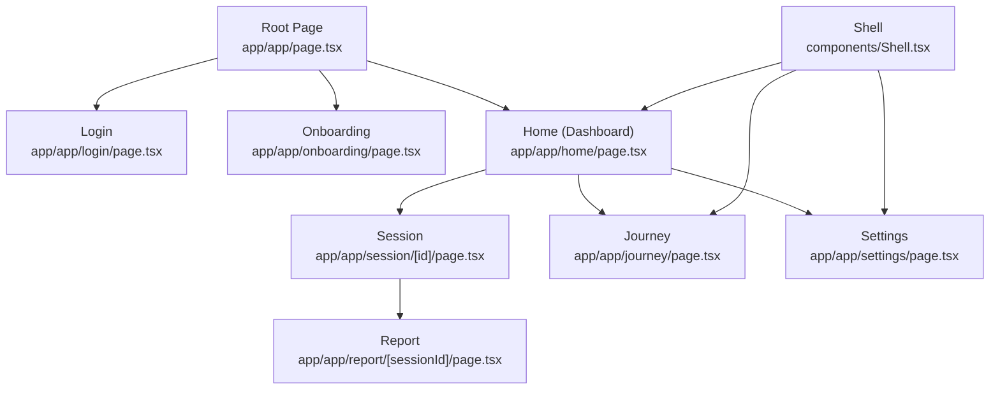
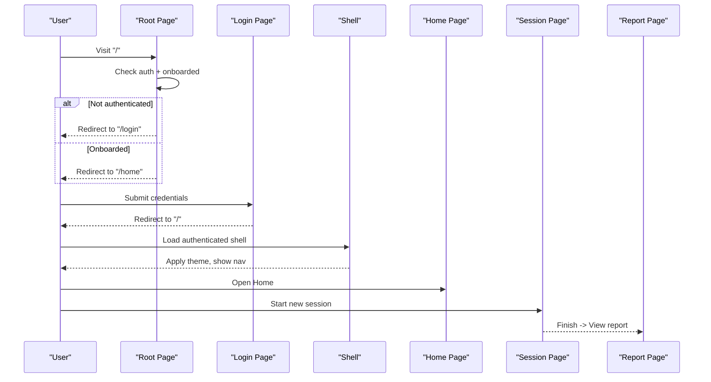
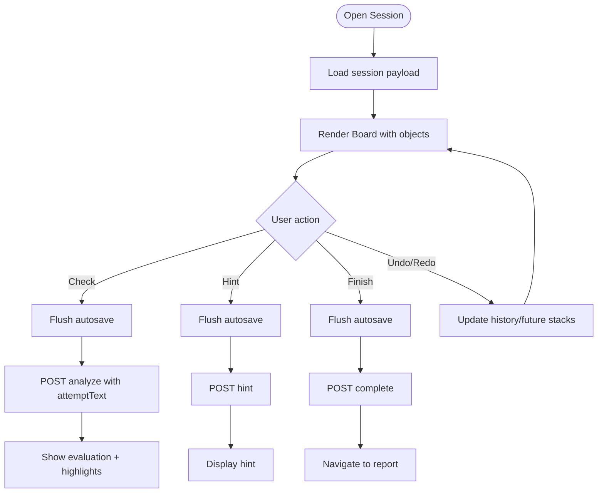
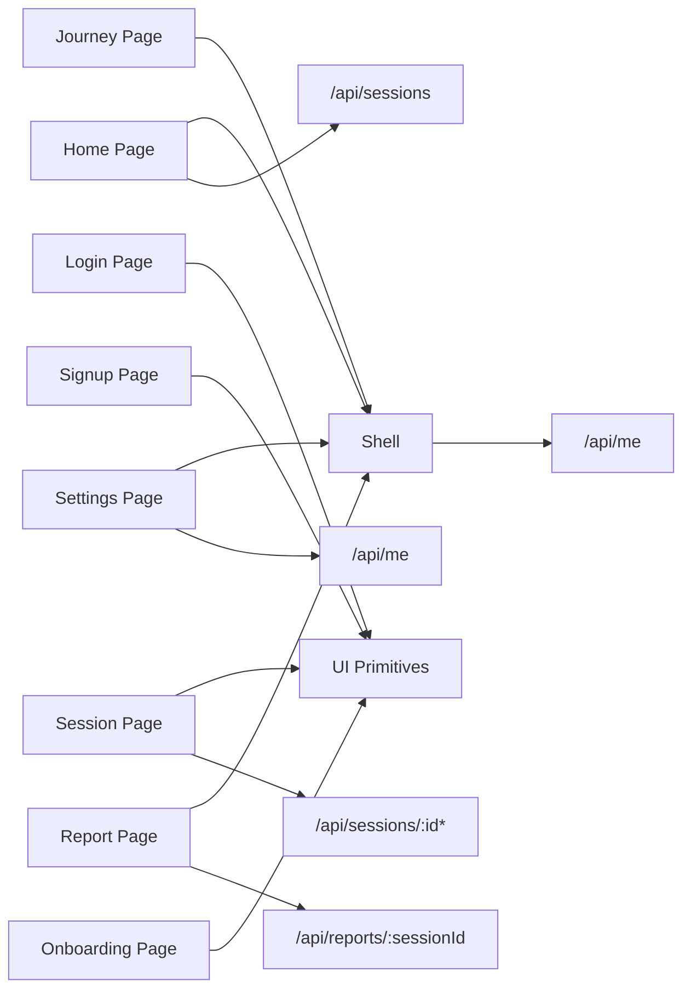

# User Interface Pages

<cite>
**Referenced Files in This Document**
- [page.tsx](file://stepwise ai/app/app/page.tsx)
- [layout.tsx](file://stepwise ai/app/app/layout.tsx)
- [home/page.tsx](file://stepwise ai/app/app/home/page.tsx)
- [login/page.tsx](file://stepwise ai/app/app/login/page.tsx)
- [signup/page.tsx](file://stepwise ai/app/app/signup/page.tsx)
- [onboarding/page.tsx](file://stepwise ai/app/app/onboarding/page.tsx)
- [session/[id]/page.tsx](file://stepwise ai/app/app/session/[id]/page.tsx)
- [report/[sessionId]/page.tsx](file://stepwise ai/app/app/report/[sessionId]/page.tsx)
- [journey/page.tsx](file://stepwise ai/app/app/journey/page.tsx)
- [settings/page.tsx](file://stepwise ai/app/app/settings/page.tsx)
- [Shell.tsx](file://stepwise ai/app/components/Shell.tsx)
- [ui.tsx](file://stepwise ai/app/components/ui.tsx)
</cite>

## Table of Contents
1. Introduction
2. Project Structure
3. Core Components
4. Architecture Overview
5. Detailed Component Analysis
6. Dependency Analysis
7. Performance Considerations
8. Troubleshooting Guide
9. Conclusion
10. Appendices

## Introduction
This document explains StepWise AI’s user interface pages and navigation flows built with the Next.js App Router. It covers the landing page, authentication (login, signup), onboarding, dashboard (home), active session interface, report views, learning journey, and settings. It also documents routing structure, navigation patterns, responsive design, accessibility, state management, API integration, loading and error handling, theming, localization support, and customization for different roles and preferences.

## Project Structure
StepWise uses a feature-based folder layout under app/app:
- Routing is defined by file paths (Next.js App Router).
- Shared UI primitives live in components/ui.tsx.
- Authenticated shell and navigation are provided by components/Shell.tsx.
- Pages implement client-side logic using React hooks and call server routes via /api/* endpoints.

**Diagram sources**
- [page.tsx:7-17](file://stepwise ai/app/app/page.tsx#L7-L17)
- [home/page.tsx:20-69](file://stepwise ai/app/app/home/page.tsx#L20-L69)
- [session/[id]/page.tsx:45-91](file://stepwise ai/app/app/session/[id]/page.tsx#L45-L91)
- [report/[sessionId]/page.tsx:19-50](file://stepwise ai/app/app/report/[sessionId]/page.tsx#L19-L50)
- [Shell.tsx:27-79](file://stepwise ai/app/components/Shell.tsx#L27-L79)

**Section sources**
- [layout.tsx:1-17](file://stepwise ai/app/app/layout.tsx#L1-L17)
- [page.tsx:1-18](file://stepwise ai/app/app/page.tsx#L1-L18)

## Core Components
- Shell: Provides authenticated navigation, theme application, demo banner, and logout. It enforces onboarding completion before allowing access to protected areas.
- UI Primitives: Button, Card, Input, Textarea, Select, Badge, Spinner, Alert, EmptyState, DemoBanner, and feedback metadata used across pages.

Key responsibilities:
- Shell validates session, applies theme and age-band classes, and renders main navigation.
- UI primitives standardize appearance and behavior, including accessibility attributes like aria-live and role="status".

**Section sources**
- [Shell.tsx:9-79](file://stepwise ai/app/components/Shell.tsx#L9-L79)
- [ui.tsx:10-218](file://stepwise ai/app/components/ui.tsx#L10-L218)

## Architecture Overview
The application follows a client-server model:
- Client pages use React state and effects to manage UI state and fetch data from server routes.
- Server routes handle authentication, sessions, reports, and profile updates.
- The root page routes users based on authentication and onboarding status.

**Diagram sources**
- [page.tsx:7-17](file://stepwise ai/app/app/page.tsx#L7-L17)
- [login/page.tsx:16-27](file://stepwise ai/app/app/login/page.tsx#L16-L27)
- [Shell.tsx:38-70](file://stepwise ai/app/components/Shell.tsx#L38-L70)
- [home/page.tsx:35-59](file://stepwise ai/app/app/home/page.tsx#L35-L59)
- [session/[id]/page.tsx:247-261](file://stepwise ai/app/app/session/[id]/page.tsx#L247-L261)
- [report/[sessionId]/page.tsx:24-50](file://stepwise ai/app/app/report/[sessionId]/page.tsx#L24-L50)

## Detailed Component Analysis

### Root Page and Routing Entry
- Behavior: Determines where to route based on authentication and onboarding status.
- Redirects unauthenticated users to login; redirects non-onboarded users to onboarding; otherwise to home.

**Section sources**
- [page.tsx:7-17](file://stepwise ai/app/app/page.tsx#L7-L17)

### Authentication Pages
- Login: Collects email/password, calls server, and replaces route to root after success. Displays errors inline.
- Signup: Validates password match, calls server, and navigates to onboarding. Shows validation and network errors.

Navigation pattern:
- Both pages use client-side form submission and router.replace for seamless transitions.

**Section sources**
- [login/page.tsx:9-76](file://stepwise ai/app/app/login/page.tsx#L9-L76)
- [signup/page.tsx:9-92](file://stepwise ai/app/app/signup/page.tsx#L9-L92)

### Onboarding
- Prefills existing profile fields if available; saves preferences and marks user as onboarded; then redirects to home.
- Uses spinner while fetching profile; shows alerts on errors.

**Section sources**
- [onboarding/page.tsx:10-67](file://stepwise ai/app/app/onboarding/page.tsx#L10-L67)
- [onboarding/page.tsx:38-59](file://stepwise ai/app/app/onboarding/page.tsx#L38-L59)

### Dashboard (Home)
- Loads user sessions, displays “Continue learning” and “Completed” sections.
- Starts a new session by posting a question; handles clarification requests and navigates to session.
- Uses Shell for authenticated navigation and consistent header.

**Section sources**
- [home/page.tsx:20-69](file://stepwise ai/app/app/home/page.tsx#L20-L69)
- [home/page.tsx:35-59](file://stepwise ai/app/app/home/page.tsx#L35-L59)
- [home/page.tsx:98-167](file://stepwise ai/app/app/home/page.tsx#L98-L167)

### Active Session Interface
- Loads full recovery payload for the session and initializes board state.
- Implements autosave with debounced optimistic snapshots and undo/redo history.
- Teaching loop: check work, request hints, finish session, and navigate to report.
- Provides tool selection (select, text, draw, erase, pan), step progress, and contextual guidance.

**Diagram sources**
- [session/[id]/page.tsx:76-91](file://stepwise ai/app/app/session/[id]/page.tsx#L76-L91)
- [session/[id]/page.tsx:99-130](file://stepwise ai/app/app/session/[id]/page.tsx#L99-L130)
- [session/[id]/page.tsx:132-158](file://stepwise ai/app/app/session/[id]/page.tsx#L132-L158)
- [session/[id]/page.tsx:190-227](file://stepwise ai/app/app/session/[id]/page.tsx#L190-L227)
- [session/[id]/page.tsx:229-261](file://stepwise ai/app/app/session/[id]/page.tsx#L229-L261)

**Section sources**
- [session/[id]/page.tsx:45-91](file://stepwise ai/app/app/session/[id]/page.tsx#L45-L91)
- [session/[id]/page.tsx:99-158](file://stepwise ai/app/app/session/[id]/page.tsx#L99-L158)
- [session/[id]/page.tsx:190-261](file://stepwise ai/app/app/session/[id]/page.tsx#L190-L261)

### Report Views
- Fetches final report for a session and displays metrics, understanding progression, mistakes, self-corrections, key takeaways, remaining gaps, and next learning recommendations.
- Provides links back to home and to the learning journey.

**Section sources**
- [report/[sessionId]/page.tsx:19-50](file://stepwise ai/app/app/report/[sessionId]/page.tsx#L19-L50)
- [report/[sessionId]/page.tsx:52-216](file://stepwise ai/app/app/report/[sessionId]/page.tsx#L52-L216)

### Learning Journey
- Loads concepts, misconceptions, reviews, recommendations, events, and stats.
- Visualizes mastery levels and upcoming reviews; encourages returning to home to continue learning.

**Section sources**
- [journey/page.tsx:19-68](file://stepwise ai/app/app/journey/page.tsx#L19-L68)
- [journey/page.tsx:80-235](file://stepwise ai/app/app/journey/page.tsx#L80-L235)

### Settings
- Loads current profile and preferences; allows updating display name, age band, education level, language, explanation depth, autonomy level, learning mode, and theme.
- Applies theme instantly by toggling dark class on the root element.

**Section sources**
- [settings/page.tsx:8-75](file://stepwise ai/app/app/settings/page.tsx#L8-L75)
- [settings/page.tsx:41-48](file://stepwise ai/app/app/settings/page.tsx#L41-L48)
- [settings/page.tsx:77-187](file://stepwise ai/app/app/settings/page.tsx#L77-L187)

### Shell and Navigation
- Enforces onboarding completion and redirects to onboarding if needed.
- Applies theme and age-band classes to the root element.
- Renders primary navigation (Home, My Journey, Settings) and user controls (logout).

**Section sources**
- [Shell.tsx:27-79](file://stepwise ai/app/components/Shell.tsx#L27-L79)
- [Shell.tsx:81-124](file://stepwise ai/app/components/Shell.tsx#L81-L124)

## Dependency Analysis
Pages depend on shared components and API helpers:
- All authenticated pages wrap content with Shell for navigation and theme.
- Pages call server routes through a centralized api helper.
- UI primitives provide consistent styling and accessibility.

**Diagram sources**
- [home/page.tsx:28-33](file://stepwise ai/app/app/home/page.tsx#L28-L33)
- [session/[id]/page.tsx:76-91](file://stepwise ai/app/app/session/[id]/page.tsx#L76-L91)
- [report/[sessionId]/page.tsx:24-28](file://stepwise ai/app/app/report/[sessionId]/page.tsx#L24-L28)
- [settings/page.tsx:23-39](file://stepwise ai/app/app/settings/page.tsx#L23-L39)
- [Shell.tsx:38-52](file://stepwise ai/app/components/Shell.tsx#L38-L52)

**Section sources**
- [ui.tsx:10-218](file://stepwise ai/app/components/ui.tsx#L10-L218)
- [Shell.tsx:9-79](file://stepwise ai/app/components/Shell.tsx#L9-L79)

## Performance Considerations
- Debounced autosave during sessions reduces server load and improves responsiveness.
- Optimistic UI updates with immediate state changes followed by background persistence.
- Conditional rendering and empty states minimize unnecessary computations.
- Use of lightweight primitives and Tailwind utilities keeps bundles small.

[No sources needed since this section provides general guidance]

## Troubleshooting Guide
Common issues and patterns:
- Network errors: Pages catch exceptions and display user-friendly alerts.
- Authentication failures: Shell redirects to login when /api/me fails.
- Onboarding enforcement: Root and Shell redirect to onboarding if not completed.
- Session load errors: Session page shows an alert and link back to home.
- Report not found: Report page shows an error and offers navigation back to home.

**Section sources**
- [login/page.tsx:16-27](file://stepwise ai/app/app/login/page.tsx#L16-L27)
- [signup/page.tsx:17-32](file://stepwise ai/app/app/signup/page.tsx#L17-L32)
- [Shell.tsx:38-52](file://stepwise ai/app/components/Shell.tsx#L38-L52)
- [session/[id]/page.tsx:264-282](file://stepwise ai/app/app/session/[id]/page.tsx#L264-L282)
- [report/[sessionId]/page.tsx:30-50](file://stepwise ai/app/app/report/[sessionId]/page.tsx#L30-L50)

## Conclusion
StepWise’s UI is organized around clear pages and shared components that enforce authentication, onboarding, and adaptive theming. The App Router defines intuitive navigation flows from authentication to learning sessions and reports. Robust error handling, loading states, and accessible UI primitives ensure a smooth experience across devices.

[No sources needed since this section summarizes without analyzing specific files]

## Appendices

### Responsive Design and Accessibility
- Responsive layouts: Grids and flexbox adapt to mobile and desktop; panels collapse or hide labels on smaller screens.
- Accessibility: Labels, aria attributes, keyboard shortcuts (Ctrl+Z/Ctrl+Y), and screen-reader-friendly status indicators.

**Section sources**
- [home/page.tsx:115-135](file://stepwise ai/app/app/home/page.tsx#L115-L135)
- [session/[id]/page.tsx:160-179](file://stepwise ai/app/app/session/[id]/page.tsx#L160-L179)
- [ui.tsx:150-157](file://stepwise ai/app/components/ui.tsx#L150-L157)

### Adding a New Page
Steps:
1. Create a new file under app/app/<route>/page.tsx.
2. Wrap content with Shell if it requires authentication and navigation.
3. Use ui.tsx primitives for consistent UI.
4. Call server routes via the api helper for data operations.
5. Handle loading and error states with Spinner and Alert.

Example references:
- See how Home loads sessions and starts a new one.
- See how Settings loads and saves profile preferences.

**Section sources**
- [home/page.tsx:28-59](file://stepwise ai/app/app/home/page.tsx#L28-L59)
- [settings/page.tsx:23-75](file://stepwise ai/app/app/settings/page.tsx#L23-L75)

### Implementing Page-Specific State Management
- Local state: useState for inputs, flags, and UI state.
- Side effects: useEffect for data fetching and theme application.
- Refs: useRef for timers and mutable references (e.g., autosave timer, object history).

Examples:
- Autosave timer and undo/redo stacks in session page.
- Theme toggle effect in settings page.

**Section sources**
- [session/[id]/page.tsx:99-130](file://stepwise ai/app/app/session/[id]/page.tsx#L99-L130)
- [session/[id]/page.tsx:132-158](file://stepwise ai/app/app/session/[id]/page.tsx#L132-L158)
- [settings/page.tsx:41-48](file://stepwise ai/app/app/settings/page.tsx#L41-L48)

### Integrating with API Endpoints
- POST /api/sessions to start a new session.
- GET /api/sessions to list sessions.
- GET /api/sessions/:id to load session payload.
- PUT /api/boards/:id to save board objects.
- POST /api/sessions/:id/analyze to evaluate attempts.
- POST /api/sessions/:id/hint to request hints.
- POST /api/sessions/:id/complete to finish a session.
- GET /api/reports/:sessionId to retrieve final report.
- GET/PATCH /api/me to read/update profile and preferences.
- POST /api/auth/login, /api/auth/signup, /api/auth/logout for authentication.

**Section sources**
- [home/page.tsx:28-59](file://stepwise ai/app/app/home/page.tsx#L28-L59)
- [session/[id]/page.tsx:99-130](file://stepwise ai/app/app/session/[id]/page.tsx#L99-L130)
- [session/[id]/page.tsx:190-261](file://stepwise ai/app/app/session/[id]/page.tsx#L190-L261)
- [report/[sessionId]/page.tsx:24-28](file://stepwise ai/app/app/report/[sessionId]/page.tsx#L24-L28)
- [settings/page.tsx:23-75](file://stepwise ai/app/app/settings/page.tsx#L23-L75)
- [Shell.tsx:64-70](file://stepwise ai/app/components/Shell.tsx#L64-L70)

### Theming System and Customization
- Theme preference stored in profile; applied by toggling dark class on root element.
- Age-band classes applied for adaptive visuals.
- Settings page allows switching between light, dark, and system themes.

**Section sources**
- [Shell.tsx:54-62](file://stepwise ai/app/components/Shell.tsx#L54-L62)
- [settings/page.tsx:41-48](file://stepwise ai/app/app/settings/page.tsx#L41-L48)
- [settings/page.tsx:164-174](file://stepwise ai/app/app/settings/page.tsx#L164-L174)

### Language Localization Support
- Preferred language field exists in profile and can be updated via settings.
- Current UI does not include dynamic locale switching; language preference is persisted for future localization features.

**Section sources**
- [settings/page.tsx:17-39](file://stepwise ai/app/app/settings/page.tsx#L17-L39)
- [settings/page.tsx:50-75](file://stepwise ai/app/app/settings/page.tsx#L50-L75)